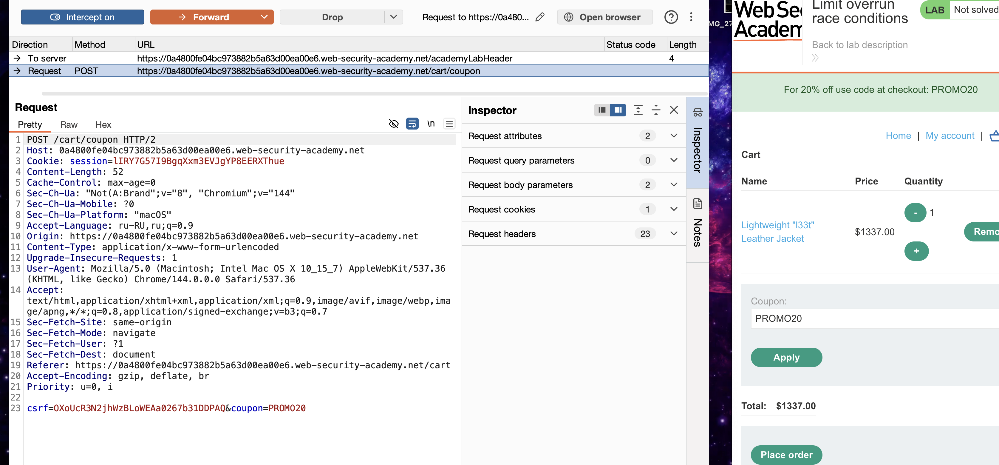
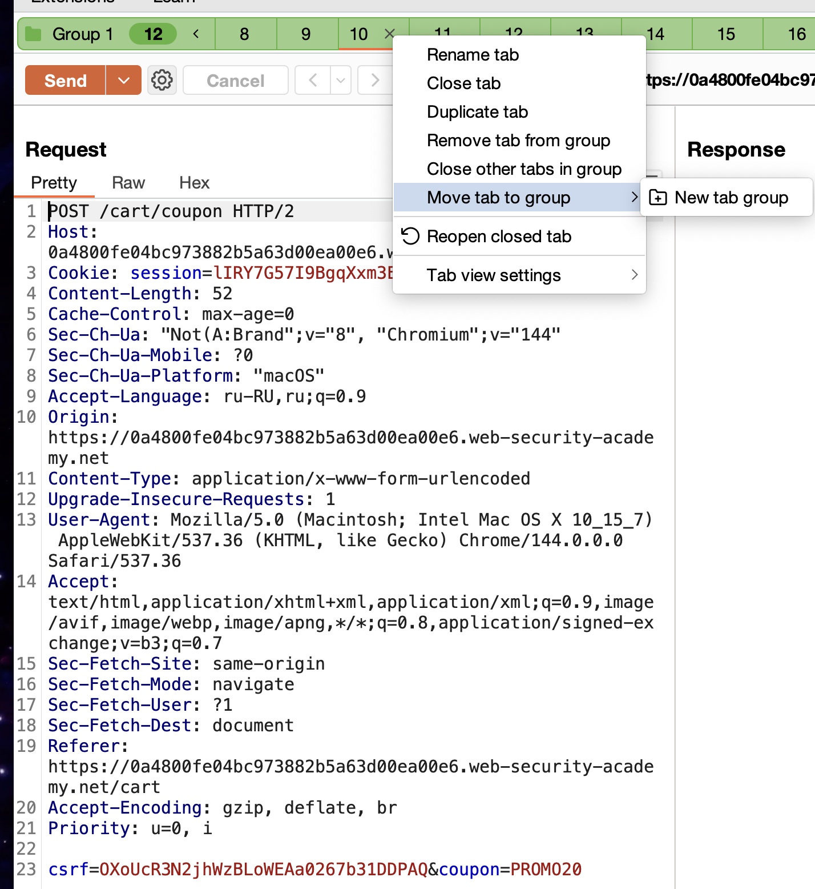
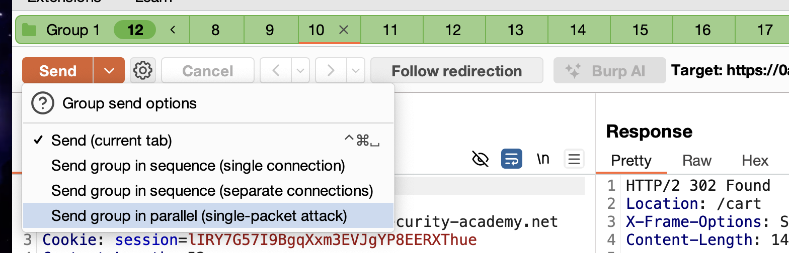
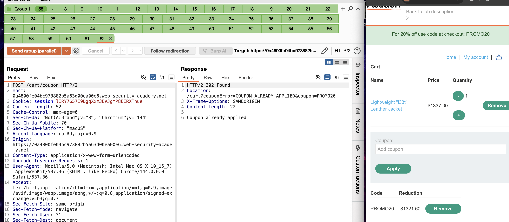
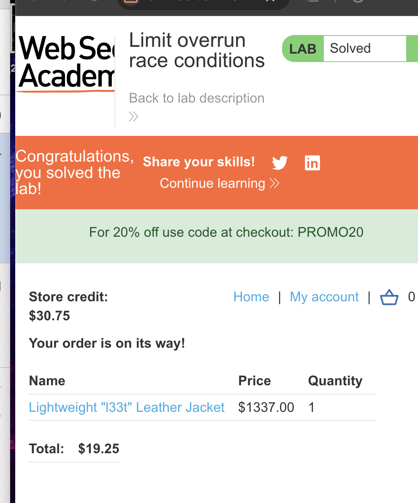

https://portswigger.net/web-security/race-conditions/lab-race-conditions-limit-overrun
## Limit overrun race conditions
есть уязвимость которая позволяет купить что-то в магазине не по его настоящей цене

задание: приобрести куртку по цене ниже текущей

есть купон на 20% скидку в магазине
нужно как-то применить скидку например много раз подряд и тогда куртка достанется бесплатно

----

это запрос на применение промокода




естественно, повторно использовать купон невозможно
 
создал в репитере несколько одинаковых паралельных запросов которые можно отправить одновременно!



 


отправить запросы параллельно




увеличивая число запросов - все больше и больше промокодов срабатывает

удалось многократно




лаба решена
заметил что в зависимости от числа запросов - результат разный, то есть необязательно, чтобы большое число сделок приведет к большому влиянию.




# защита

блокировать м ногократные запросы

защититься от этого возможно, если поменять логику внутри самого клиента 
(например, цена не может быть менее определенной)

использовать атомарные операции, до тех пор пока операция полностью не выполнена, не начинать новую

семафоры


мьютексы

Семафоры и мьютексы предотвращают гонку данных за счёт **синхронизации доступа** к общему ресурсу


- **Мьютекс (Mutual Exclusion, «взаимное исключение»)** — это **один ключ от комнаты**. Кто взял ключ — тот заходит и работает с данными. Все остальные ждут, пока ключ не вернут на место.
    
- **Семафор (Semaphore)** — это **пропускная система с несколькими пропусками**. Если у семафора 1 пропуск — он работает как мьютекс (один поток). Если пропусков больше (например, 5), то одновременно в «комнату» могут зайти несколько потоков, но не больше лимита.
---

пример 
```text
// БЕЗ синхронизации (есть гонка):
поток_1: прочитать баланс (100 руб.)
поток_2: прочитать баланс (100 руб.)
поток_1: снять 60 руб., записать новый баланс (40 руб.)
поток_2: снять 50 руб., записать новый баланс (50 руб.) // БАГ: должно быть -10!

// С мьютексом (гонки нет):
мьютекс.заблокировать()
    прочитать баланс (100 руб.)
    снять 60 руб.
    записать новый баланс (40 руб.)
мьютекс.разблокировать()
// Поток_2 ждёт, пока поток_1 не разблокирует мьютекс, и только потом начинает свою операцию с корректного баланса (40 руб.)
```

