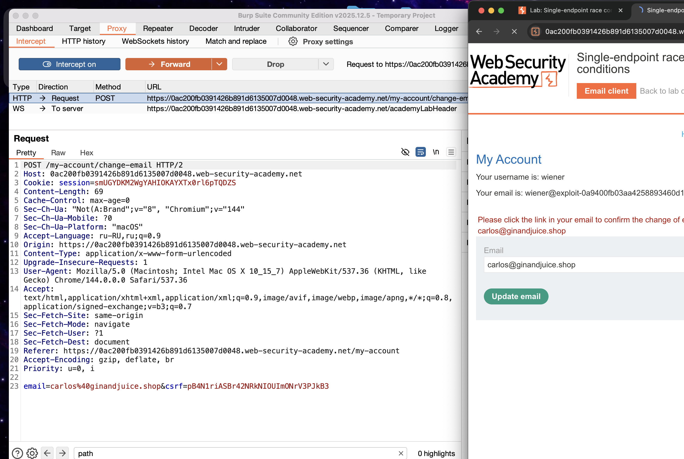
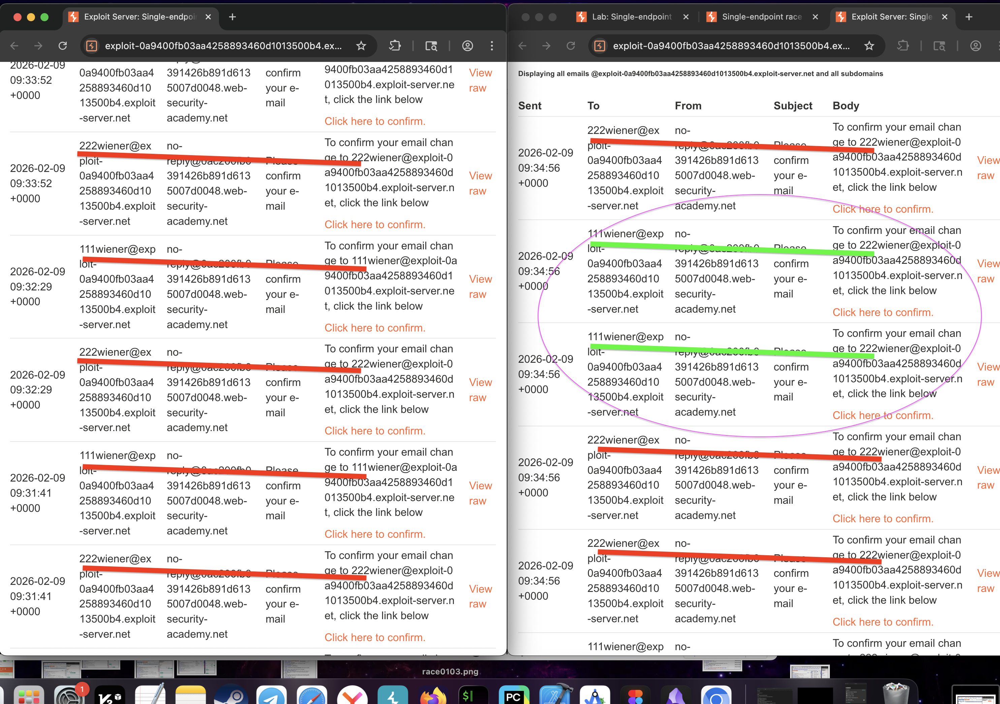
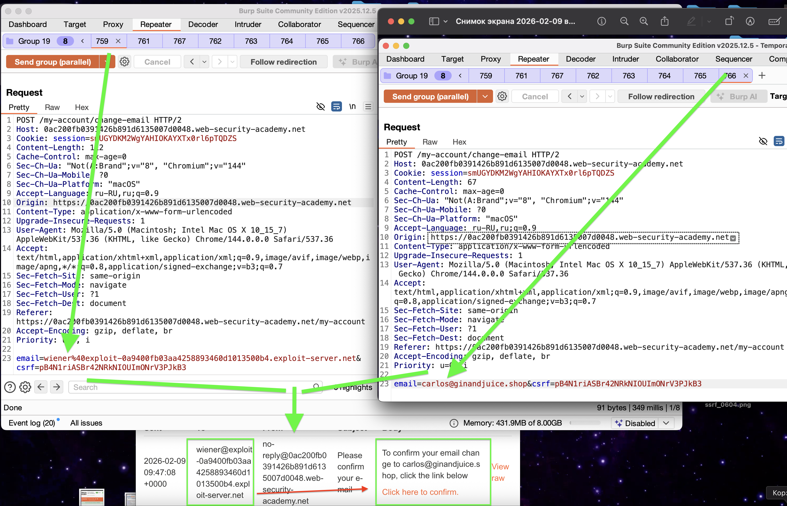

https://portswigger.net/web-security/race-conditions/lab-race-conditions-single-endpoint
# Single-endpoint race conditions

в лабе привязка чужого email к своему

задание:
необходимо привязать к себе email carlos@ginandjuice.shop
выполнить вход в carlos@ginandjuice.shop и удалить карлоса

внутри моего ак есть вазможность менять емайл, на указанный адресс приходить письмо с ссылкой для смены email 
значит нужно сделать так чтобы это письмо пришло на мою почту
нужно наверно совместить два запроса, один запрос на смену моего адресса и добавить запрос на смену чужого адресса так чтобы обе ссылки или одна ссылки пришла на мой адресс

не получается просто обо запроса отправлять одновременно, вернее - нет результата
все-равно только все мои ссылки на восстановление приходят на мою почту

но возможно стоить пробовать совместить два запроса:
1) сперва запросы пойдут на смену моего аакаунта
2) потом туда добавится запрос на смену аккаунта карлоса

заметил особенность!

если одновременно отправить множество запросов на смену email тогда происходит путаница!

слева - я отправлял пару запрсов одновременно - и нет ошибок никаких
справа - я отправил одновременно запросы на смену email разных и значения спутались между собой!

то есть подставлялись разные эмейлы и в формирующийся на севере запрос на отправку письма с подтверждением в почтовый ящик , и такой запрос (ссылка что приходит на почту для подтвержлдения) был спутан с другими адресами, и соответвенно - есть возможно отправить письмо с подтверждением чужого адресса почты самому себе 

попробую подставить чужой почт адресс

получилось!
создал группу запросов на изменение собственного email
и получилось так что запросы между собой путались!
и мне на мою почту пришла ссылка подтверждения смены пароля для чужого аакаунта!
перейдя по ней - привязал к себе чужую почту 

# как найти/ предотвератить ?
отправлять множество одинаковых запросов одновременно с разными значениями - и проверить - меняются ли ответы при таком подходе,  если да, значит нужно с точки хрения кода изменить систему так, чтобы была блокировка изменения данных , например , email юзера до окончания изменения текущей операции. (атомарныы операции), либо пред изменением данных сверять повторно на совпадение того кто чьи данные меняет

