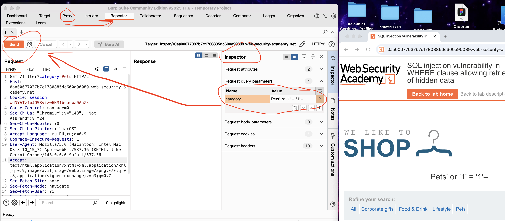

тип: SQLi лаба 01
дата: 02.01.2026
теги: 
**🟢Тип уязвимости:** [[SQLi]]  **Reflected (Отражённая) SQL-инъекция через параметр URL**
**🟢Уязвимость внедрения SQL в предложении WHERE, позволяющая извлекать скрытые данные**
**🟢SQL-инъекция через параметры URL (URL Parameter SQL Injection)**


=Дан сайт и подсказка что есть язвимость SQL-инъекции в фильтре категории продукта. 

вот оригинальный URL страницы 
https://0a96005103462f278413eb20003600a3.web-security-academy.net/filter?category=Gifts
```sql
// при запросе сайта выполняется запрос в базу данных 
SELECT * FROM products WHERE category = 'Gifts' AND released = 1 
```
---------------------------------------------------------------------------

🔵 **Принцип**: Сервер принимает пользовательский ввод (из параметра URL), **немедленно**использует его в SQL-запросе и результат этого запроса **немедленно** возвращает в ответе.

1) **Обнаружение уязвимости** при подставлении в URL кавычки ' или --, сайт реагирует изменением поведения в выдаче результата - знак что параметры в URL напрямую вставляются в SQL запрос на сервере 
2) **Эксплуатация (Proof-of-Concept)**  меняю запрос добавляя в конце ==' or '1' = '1'--== и сайт выдал мне все карточки всех товаров
```sql
//модифицированный запрос:
SELECT * FROM products 
WHERE category = '' or '1' = '1' --'  AND released = 1 
```

🟣 **Почему сработало?**  
WHERE category = ' ' либо пустая строка или 1 = 1, остальной код закоментирован 
часть AND released = 1 - игнориреутся


#### ⚙️ Принцип работы и анализ
*   **Тип уязвимости:** **Reflected (Отражённая) SQL-инъекция через параметр URL**. Пользовательский ввод напрямую подставляется в строку запроса без валидации или параметризации.
*   **Механика payload'а:**
    1.  Кавычка (`'`) закрывает строковый литерал.
    2.  Оператор `OR` добавляет альтернативное условие.
    3.  Выражение `'1'='1'` всегда истинно, что делает всё условие `WHERE` истинным для всех строк.
    4.  Комментарий (`--`) удаляет оставшуюся часть исходного запроса (`AND released = 1`), убирая фильтр по "релизнутым" товарам.

---

#### 📌 Ключевые выводы для практики
🔴🟩   **Распространённость:** Прямая конкатенация пользовательского ввода (особенно из query-параметров) в SQL-запрос — критическая и частая ошибка.
🔴🟩  **Защита:** Необходимо использовать **параметризованные запросы (Prepared Statements)**. В данном случае значение `category` должно передаваться как параметр, а не как часть строки запроса.
🔴🟩   **Тестирование:** Параметры в URL — приоритетная цель для тестирования на SQLi. Базовая проверка — подстановка `'` и `--`.


--------------------------------------------------------------------------


# 🔶ТЕСТ с BURP SUITE
скачиваю, настраиваю первый раз
скачал сертификат для барп сьют http://burp, потом скачал мозилу, так как у нее есть возможность добавлять сертификат только к ней, а не во всю операц систему

intercept - поставил в on , открыл сайт в мозилле по нужному url , данный url высветился в proxy intercept - burp перехватил запрос, в это время сайт ждет ответ от сервера, потом я могу или сразу отправить запрос на сервер или видоизменить его и потом отправить.

пкм на перехваченную ссылку и отправил ее в repeater - там в инспекторе я поменял запрос добавив к параметру Pets вот это ' or '1' = '1'--
тем самым я видоизменил запрос и отправил его на сервер, и сервер вернул на сайт уже все карточки сразу! 




📡 ссылка на оригинальную лабу
https://portswigger.net/web-security/sql-injection/lab-retrieve-hidden-data