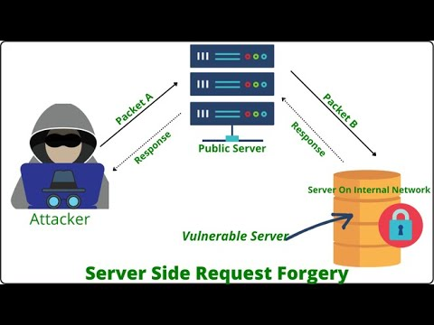
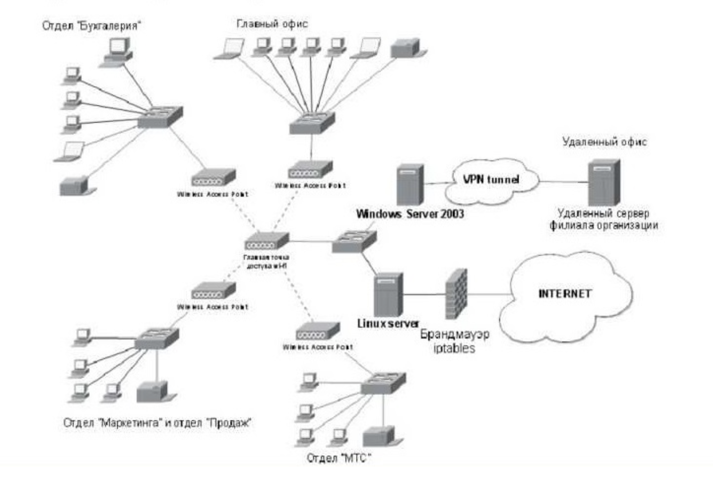

# Server-side request forgery
«Подделка запроса на стороне сервера»

# ==доп теория находится в каждой лабе==

база:
[[OSI_7]]
[[OSI]]
[[TCP]]
[[UPD]]
[[IP]]

библия ssrf
https://cheatsheetseries.owasp.org/assets/Server_Side_Request_Forgery_Prevention_Cheat_Sheet_SSRF_Bible.pdf

с переводом библия ssrf
https://docs.google.com/document/d/1v1TkWZtrhzRLy0bYXBcdLUedXGb9njTNIJXa3u9akHM/mobilebasic

==это уязвимость веб-безопасности, которая позволяет злоумышленнику заставить серверное приложение выполнять HTTP-запросы к произвольным, часто внутренним, адресам от своего имени==

****Атака возможна, когда приложение принимает от пользователя URL (например, для загрузки изображения, импорта данных, проверки наличия товара) и не проводит должную валидацию этого URL перед выполнением запроса*

- **Ключевая концепция==: SSRF нарушает отношения доверия. Внутренние системы (базы данных, административные панели, облачные метаданные) часто доверяют запросам, приходящим с самого сервера приложения (localhost) или из внутренней сети, и могут иметь ослабленную защиту. SSRF использует уязвимый сервер как прокси для обхода межсетевых экранов и контроля доступа.

#  **Классификация по видимости ответа**

1) **Классический (In-Band) SSRF**: Ответ от внутреннего сервиса напрямую возвращается злоумышленнику в интерфейсе приложения.
2) **Слепой (Blind/Out-of-Band) SSRF**: Приложение выполняет запрос, но не возвращает его результат пользователю. Для подтверждения уязвимости атакующий должен заставить сервер выполнить запрос на контролируемый им внешний сервер.


#  **Классификация по цели атаки**

1) **Атака на сам сервер приложения (Loopback SSRF)**: Цель — сервисы, работающие на том же хосте (127.0.0.1, localhost). Часто это административные интерфейсы, отладчики, базы данных вроде Redis
2) **Атака на внутреннюю сеть (Backend SSRF)**: Цель — другие системы во внутренней сети (например, `192.168.1.10`). Из-за ложного чувства безопасности эти системы часто имеют слабую аутентификацию
3) **Атака на облачные метаданные**: Цель — внутренние сервисы облачных провайдеров. Классический пример — endpoint AWS EC2: `http://169.254.169.254/latest/meta-data/`. Утечка временных ключей IAM-роли может привести к полному компрометированию облачного аккаунта


Все адреса в диапазоне `127.0.0.0/8` (от `127.0.0.1` до `127.255.255.254`) указывают на локальную машину, но `127.0.0.1` используется по умолчанию.

# **Смежные уязвимости и векторы атаки**

- **Протокол `file://`**: Позволяет читать локальные файлы (например, `file:///etc/passwd`)
    
- **XXE → SSRF**: Внедрение внешней XML-сущности (XXE) может быть использовано для выполнения SSRF-запроса.
    
- **Open Redirect → SSRF**: Если приложение имеет уязвимость открытого перенаправления, её можно скомбинировать с ограниченным SSRF для обхода вайтлистов


# Места поиска уязвимости!
1) **Параметры запроса**, принимающие URL для: загрузки аватаров, генерации PDF/скриншотов, импорта данных, парсинга RSS, webhook’ов, проверки доступности ссылок
2) **Заголовки HTTP**: Особенно `Referer`, `X-Forwarded-For`, `Host` (в некоторых конфигурациях).  Важность проверки заголовков велика, так как аналитические сервисы могут по ним «ходить»
3) **Частичные URL или пути**, которые сервер дополняет до полного адреса (напримере  Next.js , где путь `/image` требовал параметра `url`)
4) - **Сложные форматы данных**: XML (через XXE), SVG, DOCX, которые могут содержать ссылки на внешние ресурсы.

# Стратегия 

1) **Разведка (Reconnaissance)**: Детальный обход приложения с перехватом трафика. Цель — найти все параметры, которые так или иначе принимают URL.
2) **Тестирование на Blind SSRF**: Использование своего хоста (или аналогов вроде `interact.sh` или `burp coloborator`). Его домен подставляется во все найденные параметры для обнаружения исходящих запросов
3) **Анализ технологий**: Плагины вроде **Wappalyzer** помогают определить фреймворки (Next.js, Laravel). Зная особенности фреймворка можно проверить известные уязвимости
4) **Фаззинг и подбор**: Для классического SSRF используется **Intruder** с набором полезных нагрузок (пейлоадов): =Стандартные адреса (`127.0.0.1`, `localhost`, `169.254.169.254`).
   =Альтернативные форматы IP (см. ниже).
    =Порт-сканер для диапазона внутренних адресов (например, `192.168.0.[1-255]`.


-----
#  **Эксплуатация и обход защит**

1) - **Обход blacklist-фильтров (списков запрещённых значений)**: Фильтры, блокирующие `127.0.0.1` или `localhost`, легко обходятся[ссылка 1](https://pvs-studio.ru/ru/blog/terms/6576/)[ссылка 2](https://portswigger.net/web-security/ssrf)[ссылка 3](https://owasp.org/Top10/2021/A10_2021-Server-Side_Request_Forgery_%28SSRF%29/):
    
    - Альтернативная запись IP: `127.1`, `0177.0.0.1` (восьмеричная), `2130706433` (десятичная), `0x7f000001` (шестнадцатеричная).
        
    - Регистр: `LOCalHOST`, `LoCalhOSt`.
        
    - Кодирование URL: `%6c%6f%63%61%6c%68%6f%73%74`.
        
    - Собственный домен, ==резолвящийся== во внутренний IP.

*«Резолвиться» — это неологизм из IT-сленга. Слово образовано от английского **resolve**(«решать», «определять», «разрешать»), но в этом контексте означает следующее:

 *«Резолвиться»** — это когда имя домена (например, `example.com`) или хостнейм преобразуется в соответствующий **IP-адрес** (например, `93.184.216.34`).

*Эта техника один из способов обхода защиты. Когда уязвимое приложение пытается получить доступ к URL, оно сначала запрашивает у DNS-сервера реальный IP-адрес для указанного домена. Если атакующий регистрирует свой домен и настраивает его так, чтобы он «резолвился» (преобразовался) во внутренний IP-адрес (например, `127.0.0.1`), то уязвимое приложение может обойти фильтры и получить доступ к ресурсам, которые считаются внутренними.

-----

2) - **Обход whitelist (списка разрешённых доменов)**: Требует анализа парсера URL. Используются неоднозначности стандарта[ с1](https://portswigger.net/web-security/ssrf)[с2](https://www.vectra.ai/topics/server-side-request-forgery):
    
    - **Указание учетных данных в URL**: `https://expected.com@evil.com/` — парсер может извлечь `expected.com` как логин, а запрос уйдёт на `evil.com`.
        
    - **Использование фрагмента (`#`)**: `https://evil.com#expected.com` — `expected.com` может быть проигнорировано как якорь.
        
    - **Поддомен**: `https://expected.com.evil.com/`.
        
    - **Комбинации всего что выше + многократное кодирование**.

----

3)  **DNS Rebinding (TOCTOU)**: Полезная нагрузка — домен, который при первом DNS-запросе возвращает разрешённый внешний IP (проходит валидацию), а при втором (во время самого запроса) — внутренний IP[с1](https://owasp.org/Top10/2021/A10_2021-Server-Side_Request_Forgery_%28SSRF%29/)[с2](https://www.vectra.ai/topics/server-side-request-forgery).

-----

 4) **Использование других протоколов**: Если приложение их поддерживает.

- `file://` — чтение файлов.
    
- `dict://`, `gopher://` — могут использоваться для взаимодействия с внутренними сервисами (Redis, Memcached), иногда приводя к RCE

-----

**Эскалация SSRF до критичных уязвимостей**  
SSRF редко является конечной целью. Это **трамплин** для более серьёзных атак[](https://www.vectra.ai/topics/server-side-request-forgery):

1. **Кража облачных метаданных** → получение ключей доступа → компрометация облачной инфраструктуры[](https://f5.bakotech.com/ru/practical-defense-from-ssrf)[](https://www.vectra.ai/topics/server-side-request-forgery).
    
2. **Доступ к внутреннему API/админке** → выполнение привилегированных действий (удаление пользователей, как в лабораторных работах)[](https://portswigger.net/web-security/ssrf).
    
3. **Взаимодействие с уязвимыми внутренними сервисами** (например, неаутентифицированный Redis) → Remote Code Execution (RCE)[](https://www.imperva.com/learn/application-security/server-side-request-forgery-ssrf/).
    
4. **Порт-сканирование внутренней сети** (XSPA — Cross-Site Port Attack) для построения карты сети и поиска уязвимостей[](https://www.imperva.com/learn/application-security/server-side-request-forgery-ssrf/)[](https://rcngroup.ru/blog/poddelka-zaprosov-na-storone-servera-v-rejtinge-owasp/).
    
5. **Цепочка с другими уязвимостями**: Как в реальном кейсе из статьи, где SSRF сочетались с проблемами SSL, перенаправлением и XSS для захвата аккаунта[](https://darkt.medium.com/how-i-found-tricky-server-side-request-forgery-ssrf-96c5fb630acd).


-----


------
--------
### **Защита и профилактика**

**5.1. Защита на уровне приложения (код)**

- **Белые списки (Whitelist)**: Единственный надёжный способ. Разрешать запросы только к строго определённым схемам (только `https`), доменам, IP-адресам и портам[](https://pvs-studio.ru/ru/blog/terms/6576/)[](https://owasp.org/Top10/2021/A10_2021-Server-Side_Request_Forgery_%28SSRF%29/)[](https://www.imperva.com/learn/application-security/server-side-request-forgery-ssrf/).
    
- **Отказ от чёрных списков (Blacklist)**: Ненадёжны. OWASP прямо указывает: «Не пытайтесь защититься от SSRF с помощью запрещающего списка или регулярных выражений»[](https://owasp.org/Top10/2021/A10_2021-Server-Side_Request_Forgery_%28SSRF%29/).
    
- **Валидация и нормализация URL**: Используйте стандартные библиотеки для парсинга URL, извлекайте `hostname` после всех преобразований и проверяйте его по белому списку. Будьте внимательны к редиректам[](https://portswigger.net/web-security/ssrf)[](https://owasp.org/Top10/2021/A10_2021-Server-Side_Request_Forgery_%28SSRF%29/).
    
- **Не передавайте сырые ответы**: Приложение должно обрабатывать ответ от внешнего ресурса и возвращать пользователю только необходимые, безопасные данные[](https://owasp.org/Top10/2021/A10_2021-Server-Side_Request_Forgery_%28SSRF%29/)[](https://www.imperva.com/learn/application-security/server-side-request-forgery-ssrf/).
    

**5.2. Защита на уровне сети и архитектуры**

- **Сегментация сети**: Критически важные внутренние сервисы (базы данных, облачные метаданные, админки) должны находиться в изолированных сегментах сети, куда у веб-сервера **нет доступа** по умолчанию[](https://owasp.org/Top10/2021/A10_2021-Server-Side_Request_Forgery_%28SSRF%29/)[](https://rcngroup.ru/blog/poddelka-zaprosov-na-storone-servera-v-rejtinge-owasp/).
    
- **Политика «запрещено по умолчанию»** на межсетевых экранах и правилах сетевого контроля (NAC)[](https://owasp.org/Top10/2021/A10_2021-Server-Side_Request_Forgery_%28SSRF%29/).
    
- **Использование VPN для административного доступа**: Вместо выноса админ-интерфейсов в открытый сегмент[](https://rcngroup.ru/blog/poddelka-zaprosov-na-storone-servera-v-rejtinge-owasp/).
    

**5.3. Защита в облачных средах**

- **Использование последних версий метаданных сервисов**: Например, IMDSv2 в AWS, который требует специальных заголовков и усложняет автоматическую эксплуатацию.
    
- **Строгое следование принципу наименьших привилегий (Principle of Least Privilege)** для IAM-ролей, назначенных EC2-инстансам.
---------
### **С сетевого уровня**

- Сегментируйте функциональность удаленного доступа к ресурсам в отдельных сетях, чтобы уменьшить влияние SSRF
    
- Применять политики брандмауэра «отказа по умолчанию» или правила контроля доступа к сети, чтобы заблокировать весь трафик интрасети, кроме необходимого.  
    _Подсказки:_  
    ~ Установите право собственности и жизненный цикл для правил брандмауэра на основе приложений.  
    ~ Зарегистрируйте все принятые _и_ заблокированные сетевые потоки на брандмауэрах (см. [A09:2021-Сбои регистра и мониторинга безопасности](https://owasp.org/Top10/2021/A09_2021-Security_Logging_and_Monitoring_Failures/)).
    

### **Из прикладного уровня:**

- Очистка и проверка всех входных данных, поданные клиенту
    
- Применять схему URL, порт и пункт назначения с положительным списком разрешений
    
- Не отправляйте необработанные ответы клиентам
    
- Отключить HTTP-перенаправления
    
- Будьте в курсе согласованности URL-адресов, чтобы избежать атак, таких как перепряжка DNS и условия гонки «время проверки, время использования» (TOCTOU)
    

Не смягчайть SSRF с помощью списка запретов или регулярного выражения. Злоумышленники имеют списки полезной нагрузки, инструменты и навыки для обхода списков отказов.

### **Дополнительные меры, которые следует рассмотреть:**

- Не развертывайте другие службы безопасности на фронтовых системах (например, Открытый идентификатор). Контролируйте локальный трафик в этих системах (например, локальный хост)
    
- Для интерфейсов с выделенными и управляемыми группами пользователей используйте сетевое шифрование (например, VPN) на независимых системах для рассмотрения очень высоких потребностей в защите


---

`127.0.0.1` —  **Loopback-адрес** (или «адрес обратной петли»)
-такой IP-адрес, который всегда означает **«это устройство, на котором я сейчас нахожусь»**.
-IPv4-адрес, зарезервированный для **loopback-интерфейса**. Это виртуальный сетевой интерфейс, который есть у любой системы с поддержкой сетевого стека (Windows, Linux, macOS, серверы).

Когда программа отправляет данные на `127.0.0.1`, операционная система **не выпускает эти данные в физическую сеть** (через Wi-Fi или кабель). Вместо этого она **немедленно перенаправляет их обратно («закольцовывает»)** в сетевой стек того же самого компьютера. Это чисто внутренняя коммуникация.

1. **Для чего используется `127.0.0.1`  ?**
    
    - **Тестирование сетевых сервисов**: Разработчик может запустить веб-сервер (например, на порту `8080`) на своём ПК и открыть в браузере `http://127.0.0.1:8080`, чтобы проверить, как работает сайт, без выхода в интернет.
        
    - **Взаимодействие между программами на одной машине**: Одна программа (например, фронтенд) может общаться с другой (например, базой данных) через `127.0.0.1`.
        
    - **Изоляция и безопасность**: Сервисы, привязанные _только_ к `127.0.0.1`, **недоступны из внешней сети**, что является мерой безопасности (в SSRF, её можно обойти).

Многие административные панели (например, для баз данных), API и отладочные интерфейсы по умолчанию настроены слушать _только_ подключения с `127.0.0.1`. Разработчики предполагают, что раз доступ возможен только «с самой машины», то он безопасен.

- **Уязвимость SSRF нарушает это допущение**. ==Если веб-приложение имеет SSRF, атакующий может заставить его сделать запрос на `127.0.0.1` и получить доступ к этим «скрытым» и «безопасным» сервисам **с внешней стороны**, используя уязвимый сервер как прокси.==

`gopher://127.0.0.1:11211`  такой пейлоад — это попытка дотянуться до сервиса (Memcached), который, по мнению разработчиков, защищён просто потому, что «слушает» только локальные подключения.


---
----
---
# ПОИСК ТОЧЕК ВХОДА разведка""

==Главный принцип:== **SSRF возникает там, где приложение принимает от пользователя данные, которые потом использует для формирования и выполнения сетевого запроса от своего имени.**  Задача — найти все такие места. 

# открытые более очевидные

1) параметры в HTTP-запросах (особенно запросы выполняющие действия)
**`url`, `uri`, `path`**

2)  Загрузка медиа-контента
**`src`, `image`, `file`** 

3) **JSONP**-запросы (устаревшая, но встречающаяся техника). Сервер "оборачивает" ответ в вызов функции, имя которой передаёт пользователь.
**`callback`, `jsonp`**

4) Прокси-функционал, агрегаторы контента.
**`proxy`, `fetch`, `get`**

5) параметры котор могут использоваться для сборки URL на стороне сервера.
**`host`, `domain`, `ip`**

6)  REST API часто есть параметры для фильтрации, которые могут принимать внешние ресурсы.
GET /api/v1/users?avatar_url=...

# "скрытые"

1) **Заголовки HTTP (HTTP Headers)**

Многие системы (балансировщики, аналитика, WAF) читают заголовки и могут по ним что-то делать. топ:  
• `Referer` / `Referrer` – Откуда пришёл пользователь.  для аналитики.  
• `X-Forwarded-For`, `X-Real-IP`, `Client-IP` – Для установки IP. Могут проксироваться.  
• `Host:` – В некоторых нестандартных конфигурациях.  
• `X-Forwarded-Host`, `X-Original-URL` и другие кастомные заголовки.

2) **Функционал импорта данных**
Ключевая цель! Приложения, которые импортируют что-либо по URL:  

• **Импорт товаров** в интернет-магазин (CSV/XML файл по ссылке).  
• **Импорт контактов** из Google/Facebook (OAuth, но может быть и прямой URL).  
• **Агрегаторы RSS/Atom лент.**  
• **Импорт документов** (Word, Excel) для конвертации.

3) **Webhook'и и колбэки**

Приложение **позволяет вам указать URL, на который оно будет отправлять уведомления** о событиях (платёж прошёл, заказ создан). Идеальный кандидат для Blind SSRF.

4) **Обработка файлов**

Приложение что-то делает с загруженным файлом, и этот файл может содержать ссылки на внешние ресурсы:  

• **Генерация PDF** из HTML (встроит картинки по ссылкам).  
• **Обработка SVG** (тег `<image xlink:href="http://..."/>`).  
• **Парсинг Office-документов** (DOCX, XLSX — это ZIP-архивы с XML, там могут быть ссылки).  
• **Обработка XML (XXE)** – XXE часто ведёт к SSRF через внешние сущности.

5) **Функционал "Поделиться" или "Экспорт"**

Кнопка "Отправить статью на email" или 
"Экспорт данных в Google Sheets" может неявно делать запросы.

6) **Параметры в теле запроса в неочевидных форматах**

Не только `url=value`. 
Это может быть JSON, XML: `{"report_url": "http://attacker.com"}`или `<config><server>http://...`

7) **SSRF через другие уязвимости**

• **XXE** (XML External Entity): Прямой путь к SSRF и чтению файлов.  
• **XSS** (в редких случаях, если есть доступ к внутренним API из JS).  
• **Open Redirect**: Может использоваться для обхода белых списков в SSRF.

----

# **Анализ исходного кода (если возможно)**
- 
    PHP**: `file_get_contents()`, `curl_exec()`, `fsockopen()`, `fopen()`.
    
- **Python (requests)**: `requests.get()`, `urlopen()`.
    
- **Java**: `URLConnection`, `HttpClient`.
    
- **Node.js**: `http.get()`, `fetch()`.  
    Искать, откуда берётся аргумент для этих функций.

-----

# стратегия
? 1 проверять все потенциально уязвимые места, определить как это устроено
? 2 подбиратьй пейлоады и корректирвоать их
     использовать свой хост для приема слепых ответов (если будут)

==примеры пейлоадов:==

```http
нельзя сразу запускать 

# === 1. ДЕТЕКТОРЫ (Blind SSRF) ===
http://a0b1c2d3.oast.fun
https://a0b1c2d3.oast.fun

# === 2. БАЗОВЫЕ ВЕКТОРЫ (Basic SSRF) ===
http://127.0.0.1
http://localhost
http://0.0.0.0
http://[::]

# === 3. ОБХОД ЧЕРНЫХ СПИСКОВ (Bypass Blacklist) ===
# Десятичное представление 127.0.0.1
http://2130706433
# Альтернативные записи localhost
http://127.1
http://127.0.1
http://0
# С поддоменом (DNS-трюк)
http://127.0.0.1.a0b1c2d3.oast.fun

# === 4. СКАНИРОВАНИЕ ПОРТОВ (Port Scan) ===
http://127.0.0.1:80
http://127.0.0.1:443
http://127.0.0.1:22
http://127.0.0.1:3306
http://127.0.0.1:5432
http://127.0.0.1:6379
http://127.0.0.1:11211
http://127.0.0.1:27017
http://127.0.0.1:9200
http://192.168.1.1:80

# === 5. ОБЛАЧНЫЕ МЕТАДАННЫЕ (Cloud Metadata) ===
# AWS
http://169.254.169.254/latest/meta-data/
http://169.254.169.254/latest/user-data/
# Google Cloud
http://metadata.google.internal/computeMetadata/v1/
# Azure
http://169.254.169.254/metadata/instance?api-version=2021-02-01
# Kubernetes
http://10.96.0.1   это частный IP-адрес IPv4, который предназначен для использования только внутри локальных сетей и не доступен из внешнего интернета. 

Такие адреса не выделены конкретной организации и могут использоваться кем угодно без одобрения регионального интернет-регистра.
http://kubernetes.default.svc.cluster.local

# === 6. ДРУГИЕ ПРОТОКОЛЫ (Other Protocols) ===
# Опасные протоколы, если приложение их поддерживает
file:///etc/passwd
dict://127.0.0.1:11211/stats
gopher://127.0.0.1:6379/_INFO%0D%0A
ldap://127.0.0.1:389/
```

---
# отличия SSRF от хранимой XSS

**SSRF** — это **диверсия внутри крепости**. Вы обманом заставляете часового (веб-сервер) сходить на склад (внутреннюю сеть) и либо что-то украсть оттуда, либо подложить мину.

**Stored XSS** — это **отравленный колодец в крепости**. Вы подбрасываете яд (вредоносный скрипт) в общий источник воды (базу данных сайта). Потом каждый житель (обычный пользователь), который попьёт из этого колодца (откроет страницу), отравится у себя дома (в своём браузере).

---

# также возможны атаки на скрытые параметры 

например в запросе к серверу есть 2 параметра в json
но может быть такое что сервер может принять еще доп параметры там же
эти параметры можно пробовать найти в коде старницы в функциях этого запроса
также можно подбирать параметры путем бут форса
есть для будформа прога **==Param Miner==** или ==X8==

---


### Вот пример типичных  адрессов для админки (которые известны всем на свете конечно же...)

| Категория                      | Примеры путей (выборочно из списков SecLists)                                                                                                               |
| ------------------------------ | ----------------------------------------------------------------------------------------------------------------------------------------------------------- |
| **Стандартные англ.**          | `admin`, `administrator`, `panel`, `dashboard`, `control`, `manage`, `backend`, `backoffice`, `login`, `admin-login`, `system`, `console`, `user`, `secure` |
| **CMS WordPress**              | `wp-admin`, `wp-login.php`, `wp-content`, `wp-includes`, `login.php`, `admin.php`, `dashboard.php`                                                          |
| **CMS Joomla**                 | `administrator`, `joomla/administrator`, `admin/index.php`, `component/users`                                                                               |
| **CMS Drupal**                 | `user/login`, `user/register`, `admin/config`, `admin/dashboard`                                                                                            |
| **Другие CMS/Frameworks**      | `adminer`, `phpmyadmin`, `myadmin`, `database`, `manager/html`, `webdav`, `_admin`, `_panel`                                                                |
| **Пути с расширениями**        | `admin.cgi`, `admin.jsp`, `admin.aspx`, `admin.action`, `admin.do`, `admin.py`                                                                              |
| **Вариации регистра**          | `Admin`, `ADMIN`, `AdMiN`, `aDmIn`                                                                                                                          |
| **Защищённые/скрытые**         | `.admin`, `private`, `hidden`, `secret`, `restricted`, `internal`, `staff`, `sysadmin`, `root`                                                              |
| **API/Служебные**              | `api/admin`, `v1/admin`, `internal`, `debug`, `env`, `config`, `.env`, `.git`, `.svn`, `.htaccess`                                                          |
| **Актуальные тренды (2020-е)** | `admin123`, `adminarea`, `adminpanel`, `adminportal`, `admincenter`, `superadmin`, `sysadmin`, `platform-admin`, `platform/login`                           |

-----

>БЫВАЮТ частичные URL-адреса в запросах
это когда в параметры в запросе передаются не полным URL а частями только: например указывая только путь!
это сложнее так как у пентестера нет возможности полностью контролировать целиком весь URL

>### URL-адреса в форматах данных
>Некоторые приложения передают данные в форматах со спецификацией, которая позволяет включать URL-адреса, которые могут быть запрошены парсером данных для формата. Очевидным примером этого является формат данных XML, который широко используется в веб-приложениях для передачи структурированных данных от клиента к серверу. Когда приложение принимает данные в формате XML и разбрает их, оно может быть уязвимо для внедрения XXE. Он также может быть уязвим для SSRF через XXE. Мы рассмотрим это более подробно, когда рассмотрим уязвимости инъекций XXE.

> ### SSRF через заголовок Referer
> Некоторые приложения используют серверное аналитическое программное обеспечение для отслеживания посетителей. Это программное обеспечение часто регистрирует заголовок Referer в запросах, чтобы оно могло отслеживать входящие ссылки. Часто аналитическое программное обеспечение посещает любые сторонние URL-адреса, которые появляются в заголовке Referer. Обычно это делается для анализа содержимого ссылающихся сайтов, включая якорной текст, который используется во входящих ссылках. В результате заголовок Referer часто является полезной поверхностью атаки для уязвимостей SSRF.

