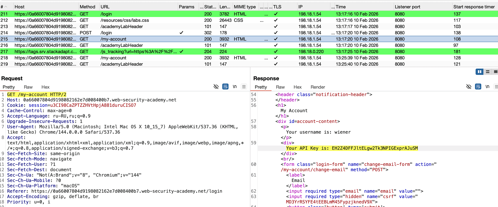
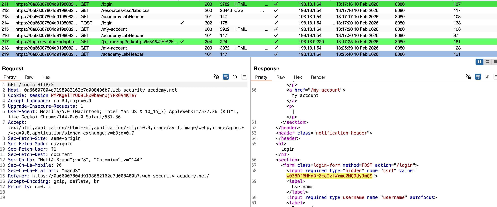
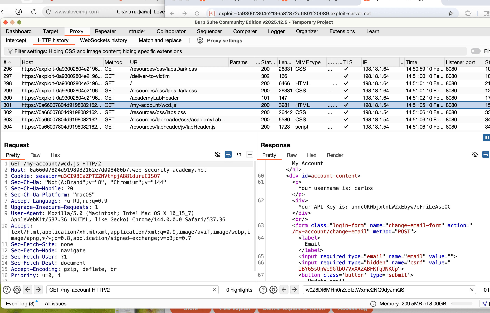

https://portswigger.net/web-security/web-cache-deception/lab-wcd-exploiting-path-mapping
# Exploiting path mapping for web cache deception
# Использование сопоставления путей для обмана веб-кэша

задание:
найти ключ API для пользователя carlos
моя учетка wiener:peter

нужно будет (возможно) отправить жертве вредонос ссылку

-------

первое что заметил - это то, что один из запросов возвращает нам API моего акаунта (этот апи мне и нужен - но карлоса)
и еще тут есть Referer который нужно проверить, вдруг можно редиректить на свой хост и тогда нужно будет просто жертве доставить вредоносную ссылку чтобы украсть API




также вот тут в логин запросе - в ответе приходит токен который потом используется при входе в аккаунт




----


пробую приписать путь к оригинальному


```http
GET /my-account HTTP/2         3932 байт
 
GET /my-account/cdccx HTTP/2   3932 байт ответ не отличается 

- :Это указывает на то, что исходный сервер абстрагирует путь URL к /my-account

- Это подтверждает гипотезу: бэкенд-сервер (приложение) игнорирует всё, что идёт после основного пути /my-account. 
  Он обрабатывает оба запроса одинаково и возвращает одну и ту же страницу личного кабинета. 
  Это основа для потенциальной уязвимости.

ДОБАВЛЯЮ РАСШИРЕНИЯ:------------------------------------

GET /my-account/cdccx.html HTTP/2   3982 байт  ответ больше на 50байт
GET /my-account/cdccx.jpeg HTTP/2   3982 байт  ответ больше на 50байт
GET /my-account/cdccx.js   HTTP/2   3982 байт  ответ больше на 50байт

- Размер ответа вырос на 50 байт. Это ключевой момент! :
- Сервер не игнорирует расширения. Вместо этого он, скорее всего, обрабатывает запрос иначе например: 
добавляет в ответ дополнительные заголовки, небольшой фрагмент HTML или меняет Content-Type: 
   
- Появились три новых заголовка кэширования. 
Это прямое доказательство, что при добавлении расширения запрос пошел по другому пути в инфраструктуре и попал под действие правил кэширования, значит данные попали в кеш вероятно!
 
 САМОЕ ВАЖНОЕ, ЧТО СЕРВЕР ВЕРНУЛ И ВСЕ ДАННЫЕ ЧТО И В ОРИГ ЗАПРОСЕ (api тут есть)
 а значит, что я заставил сервер кешировать ответ содержащий секрет данные!!!!!!
 
 теперь нужно понимать, как забрать эти данные.

```

ПОЛЯВИЛИСЬ ДОПОЛЬНИТЕЛЬНО 3 Cash заголовка
```http

Cache-Control: max-age=30  -  директива, разрешающая любому (браузеру, CDN, прокси) сохранять этот ответ на 30сек
Age: 0                     -  только что получен с сервера и еще не был в кеше
X-Cache: miss              -  запроса не было в кеш - поэтому отправился на сервер с запросом 


а при повторных запросах X-Cache: hit - значит данные уже берутся из кеша 

но если подождать 30 сек - то кеш этот очищается - и снова запрос идет на сервер прямиком (так как max-age=30)

```


-------
# САМОЕ ВАЖНОЕ ПОНИМАНИЕ РАБОТЫ
# что мы имеем на данный момент:

1) если поменять путь - ответ не меняется , так как сервер считывает только нужный ему путь. а пути продолжения-как опционал параметры например
то есть первое настророжение - что браузер пускает "любые" запросы
2) если добавлять расширение - тогда если в кеше есть правило которое кеширует расширения `.css`, `.js` и при этом как в первом пункте сайт пропускает запросы по разным директориям - тогда если добавить расширение к таким запросам -значит возможно кеш будет эти данные кешировать на какое-то время
3) тогда пока живет кеш - то эти данные уязвимы в это время так как лежат в кеше. Данные кэшируются **не в браузере жертвы**, а на **промежуточном сервере** (CDN, прокси-сервер, корпоративный шлюз), который стоит _между_ всеми пользователями и основным сервером. Этот кэш — **общий для многих пользователей**

таким образом

если создать ссылку с произвольным путем GET /my-account/xyxyxyxyx.png  (сервер игнорит конец пути)
и если этот запрос будет кешироваться в CDN - а сам запрос ведет в лич акаунт юзера
то если после перехода жертвы по этой ссылке я перейду тоже по ней, то мне вернется в ответе X-Cache: hit
то есть данные прийдут из кеша CDN ! и в них будут -вероятно- секреты, как например API в моем случае.

------

итого: вот мой запрос GET /my-account HTTP/2
который возвращает в ответе мой api ключ, и ответ не кешируется


если сделать так GET /my-account/cdcc HTTP/2 то ответ не меняется (уже интересно мне)

если GET /my-account/cdcc.png HTTP/2 тогда появились заголовки указывающие что запрос кешировался!
причем в странице до сих пор есть api ключ, значит и он тоже попадал в кеш!

если перевести запрос в ссылку
```http
https://0a66007804d9198082162e7d008400b7.web-security-academy.net/my-account/cdcc.png
```
и перейти по ней - то ответ от сервера вместе с ключом попадет в CDN кеш на 30 сек!

и если перейти по этой же ссылке еще раз в течении 30 сек - тогда вернется кешированная страница!

САМОЕ ВАЖНОЕ: если поэтой ссылке перейдет любой чел - то его секреты попадут в CDN кеш
и после чего если я перейдут в течении 30 сек по этой же ссылке - тогда я получу копию стр из CDN кеша вместе со всеми токенами, что там есть!

-----

для реализации этой уязвимости достаточно иметь собственный сайт, на котором разместить такой скрипт и отправить ссылку на сайт жертве:
скрипт который просто выполняет переход по ссылке! и данные уходят в кеш CDN
```html

<script>document.location="https://0a66007804d9198082162e7d008400b7.web-security-academy.net/my-account/wcd.js"</script>
```

в логах на сайте я вижу, что кто-то зашел на мой сайт, значит у меня есть 30 сек, чтобы перейти по этой же ссылке и получить копию данные того чела, что первым перешел по ссылке.


отправив ссылку жертве и перейдя по ней - я получил данные карлоса. лаба решена!




-------
# ### **Как предотвратить Web Cache Deception (WCD)**

Уязвимость сработала, потому что система нарушила базовый принцип: **"Если ответ зависит от авторизации пользователя (сессии, кук), его нельзя кэшировать для общего доступа (`public`)"**.
---


# **Что делать** чтобы избежать таких уяз ?
# 1
бекенд
сервер должен четко валидировать директории. и если путь не соответствует разрешенному - тогда **404 Not Found**
не игнорировать окончание путей и расширения
# 2=
бекенд
**Жёстко контролировать заголовки `Cache-Control`**
всегда отправлять:  Cache-Control: private, no-store, max-age=0`
Явно запрещает любым промежуточным кэшам (CDN) сохранять этот ответ!
# 3= 
со стороны **Администратор (CDN/Прокси)**
Запретить переопределять `private` и `no-store`.
Четко подчиняться  Cache-Control
# 4= 
со стороны **Администратор (CDN/Прокси)**
**Настроить кэширование по Content-Type ответа, а не по расширению в URL.**
Устраняет слепое доверие к пути в URL. Если сервер ошибочно отдал `text/html` по пути `.css`, такой ответ не будет закэширован
# 5= 
со стороны **Администратор (CDN/Прокси)**
**Использовать заголовок `Vary`.**Принудительно добавлять `Vary: Cookie, Authorization`для всех ответов от защищённых областей.
Гарантирует, что для каждого уникального значения Cookie будет создана отдельная кэш-запись.

-----
