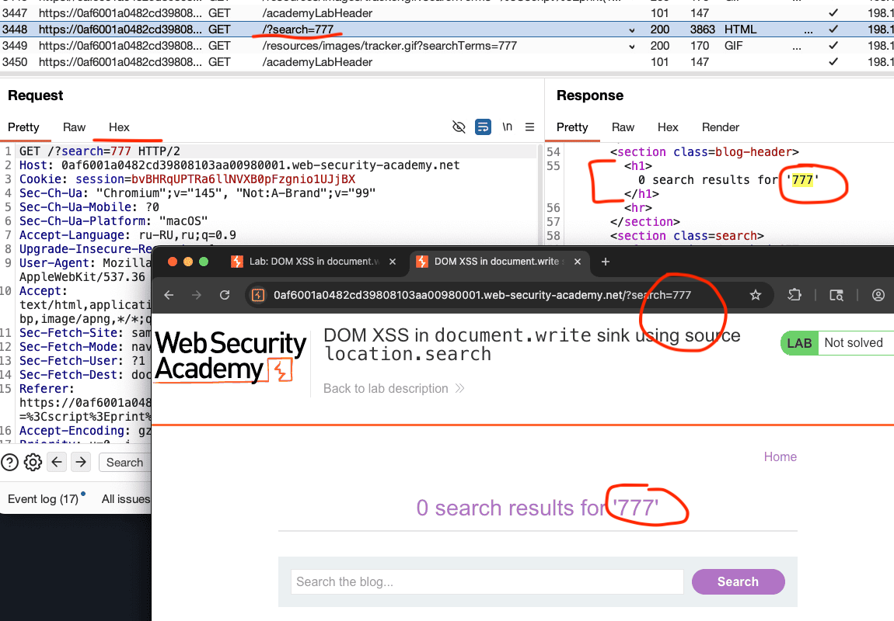
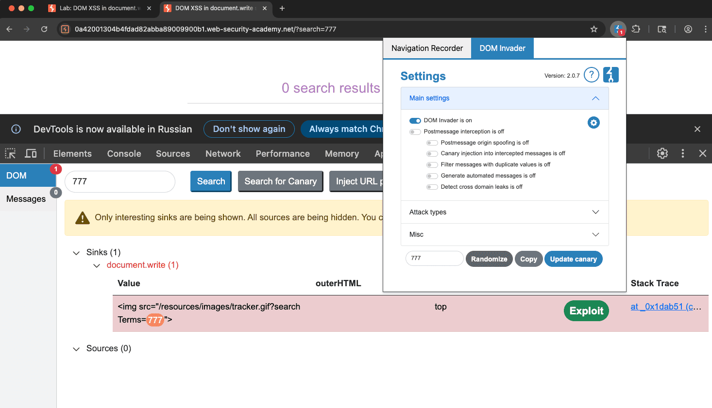
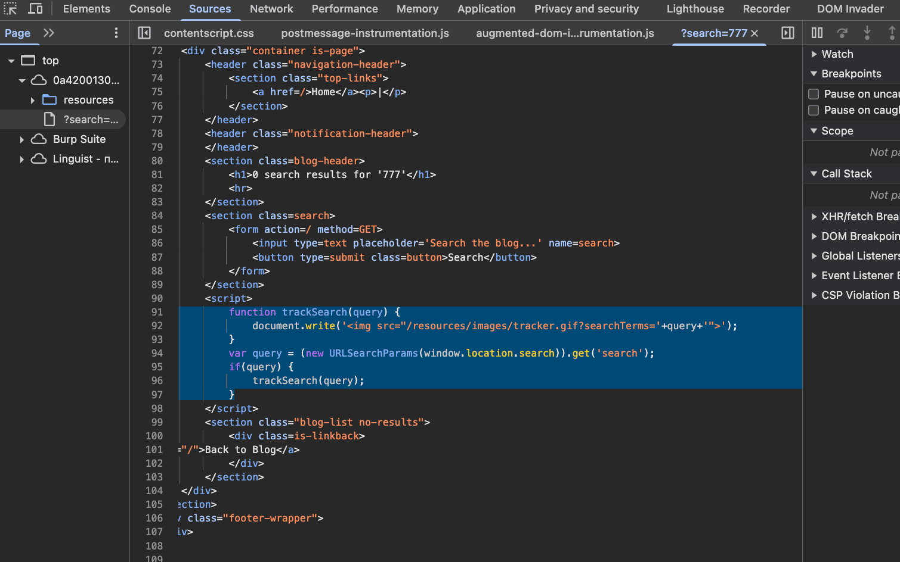

веб-сайт уязвим для межсайтовых сценариев на основе DOM, если существует исполняемый путь, по которому данные могут распространяться от источника к приемнику

лаба https://portswigger.net/web-security/cross-site-scripting/dom-based/lab-document-write-sink
задание: через уязвимость в поиске на сайте
Он использует JavaScript `document.write` Функция, которая записывает данные на страницу. The `document.write` функция вызывается с данными из `location.search`, Которым вы можете управлять с помощью URL сайта
нужно вызвать алерт

##### JavaScript document.write()   - это просто **метод**, который пишет текст прямо в код страницы (в DOM) 

 ##### location.search     Всё, что после знака `?` — это оно! location.search приносит инфу из URL

здесь подробнее [[theory]]
 
----

вбил в поиске на сайте 777 
777 отразились в строке URL и в строке над поиском!

```

https://0af6001a0482cd39808103aa00980001.web-security-academy.net/?search=777

 <h1>0 search results for '777'</h1>
```



взял обычный пейлоад ``
получил ответ
```html

 <h1>0 search results for '&lt;img src=x onerror=alert(&apos;XSS&apos;)&gt;'</h1>
```
ну типо все как обычно скажем так.. это обычная зеркальная XSS , тут сервер кодирует скобки... но лаба же про DOM!


-----------

осталось понять , как все это относиться к теме DOM xss (вск остальные виды лаб xss я уже прорешал)

 есть интересная штуковина в конце HTML

```js
<script>
  function trackSearch(query) {
    document.write('');
  }
  
  var query = (new URLSearchParams(window.location.search)).get('search');
                        if(query) {
                            trackSearch(query);
                        }
</script>
```

функция trackSearch берет запрос и выполняет document.write который грузит по пути 
/resources/images/tracker.gif?searchTerms='+query+' нужный файл 
то есть это выполнит уже сам браузер

потом создалась перемнная query 
которая  использует какую-то функ URLSearchParams. которая принимает window.location.search , и по ней примен свойство какоето .get('search')

потом условие if(query) , если тру - если не пусто там - тогда выполнится функция trackSearch(query)

-------

РАЗБОР

> (new URLSearchParams(window.location.search)).get('search')
Это **встроенная в браузер функция**, которая парсит строку запроса из URL

`new URLSearchParams()` берет эту строку и превращает ее в **объект**, с которым удобно работать:
```js
let params = new URLSearchWindow.location.search);
params.get('search') // вернет "777"
params.get('page')   // вернет "2"
```

##### `.get('search')`  Это метод объекта `URLSearchParams`, который **достает значение конкретного параметра**


##   document.write()  это метод, который пишет HTML прямо на страницу
 Эта строка **вставляется в DOM** (становится частью страницы)


-----

разбор уязвимости

```js
document.write('');


вижу как и куда подставляется  query

можно создать пейлоад который выйдет из этой строки

">') на это заканчивается 
 
тогда в пейлоад  подставлю ту хрень">')

">')


⭐️⭐️ все - лаба решена!
```

#### ГЛАВНЫЙ СМЫСЛ

# 1 
сервер ответил этим 
```js
function trackSearch(query) {
    document.write('');
  }
```
и здесь видно что тег  < img src=  тупо находится в кавычках , как текст, он заморожен!

и в него подставляется query - то есть мой запрос

# 2
после загрузки страницы  - этот замороженный"" тег < img src= вставиться в html и DOM  и становится частью кода

# 3
функция  trackSearch ВЫПОЛНЯЕТ document.write вместе с запросом query
document.write ПИХАЕТ ЭТО В DOM


----

#### источник (source):`location.search` - данные из URL
#### приемник (sink): `document.write()`  - опасная функция

 URL → в JS → в DOM

---------

#### вывод

то место куда приходил отраженный ответ от сервера - там все валидироввалось как нужно

но вот - та функция была не защищена от dom xss

document.write   пишет прямо в DOM строку которая потом парсится

нужно смотреть не только на готовый HTML который прислал сервер но и на то что добавляет JS после загрузки страницы
## как защититься от подобного

никогда не юзать document.write с данными от юзера, это просто рассадник XSS  

всегда использовать textContent вместо innerHTML, чтобы ввод не выполнился как код  

создавать элементы через createElement и добавлять через appendChild, так безопаснее  

если прям надо вставить html, пропускать всё через DOMPurify или другую библиотеку санитизации  

ставить Content Security Policy (CSP) чтобы заблокировать инлайн-скрипты 

валидировать всё что приходит от юзера, пропускать только по белому списку  

кодировать спецсимволы вроде < > и кавычек перед выводом


-------

## использую DOM-invader для обнаружения данной уязвимости!

открыл инвайдер, просто врубил его базого, ввел пейлоад 777 нажал reload
потом ввел 777 в поиске сайта и нажал поиск
открыл консоль разработчика , во вкладке DOM-invader
и там он мне вывсветил сразу обнаруженную уязвимость
нажал на эксплойт, и он автоматом подставил туда эксплойт 
"%27> котрый вызвал алерт
магия...

это был ручной режим этого инвайдера, а есть еще режим где автоматически будет использоваться , где инвайдер будет сам подставлять пейлоад в параметры и другие поинты..



 


также можно открыть открыть Stack Trace - он покажет мне точку внедрения




```js
function trackSearch(query) {
  document.write('');
 }
 
    var query = (new URLSearchParams(window.location.search)).get('search');
                        if(query) {
                            trackSearch(query);
                        }
```

здесь можно увидеть то как выглядит точка входа, и понять как можно было бы ее использовать


-------


