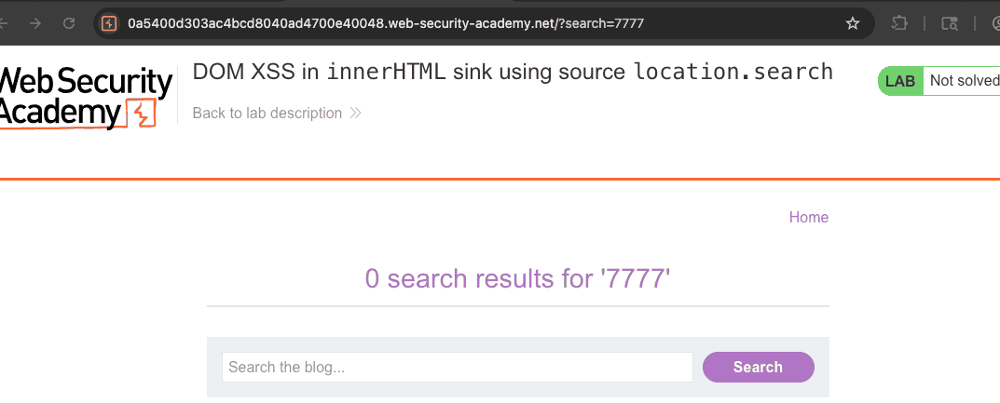
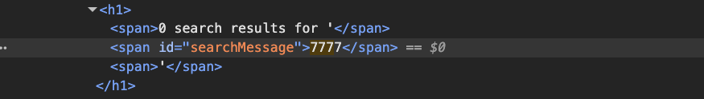
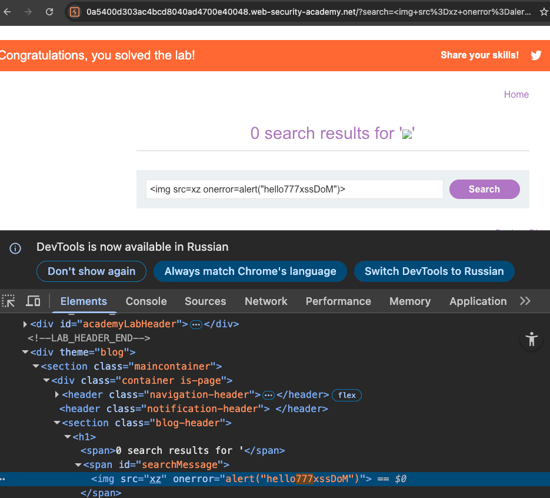

лаба https://portswigger.net/web-security/cross-site-scripting/dom-based/lab-innerhtml-sink
##### DOM XSS in `innerHTML` sink using source `location.search`
задание:
в поиске есть xss dom
нужно сделать алерт

-----

есть инпут поиска

выполнил поиск по пейлоаду 7777
вижу визуально два место куда подставился пейлоад 
в текст поле и в URL



 

но в ответе от сервера нет этих моих 7777
это означает что эти два место куда подставляются мои пейлоады -
то все происходит локально в браузере!
```html
HTTP/2 200 OK
Content-Type: text/html; charset=utf-8
X-Frame-Options: SAMEORIGIN
Content-Length: 3812

<!DOCTYPE html>
<html>
<!--LAB_HEAD_START-->
    <head>
        <link href=/resources/labheader/css/academyLabHeader.css rel=stylesheet>
        <link href=/resources/css/labsBlog.css rel=stylesheet>
        <title>DOM XSS in innerHTML sink using source location.search</title>
    </head>
<!--LAB_HEAD_END-->
    <body>
        <script src="/resources/labheader/js/labHeader.js"></script>
        <!--LAB_HEADER_START-->
        <div id="academyLabHeader">
            <section class='academyLabBanner'>
                <div class=container>
                    <div class=logo></div>
                        <div class=title-container>
                            <h2>DOM XSS in <code>innerHTML</code> sink using source <code>location.search</code></h2>
                            <a class=link-back href='https://portswigger.net/web-security/cross-site-scripting/dom-based/lab-innerhtml-sink'>
                                Back&nbsp;to&nbsp;lab&nbsp;description&nbsp;
                                <svg version=1.1 id=Layer_1 xmlns='http://www.w3.org/2000/svg' xmlns:xlink='http://www.w3.org/1999/xlink' x=0px y=0px viewBox='0 0 28 30' enable-background='new 0 0 28 30' xml:space=preserve title=back-arrow>
                                    <g>
                                        <polygon points='1.4,0 0,1.2 12.6,15 0,28.8 1.4,30 15.1,15'></polygon>
                                        <polygon points='14.3,0 12.9,1.2 25.6,15 12.9,28.8 14.3,30 28,15'></polygon>
                                    </g>
                                </svg>
                            </a>
                        </div>
                        <div class='widgetcontainer-lab-status is-notsolved'>
                            <span>LAB</span>
                            <p>Not solved</p>
                            <span class=lab-status-icon></span>
                        </div>
                    </div>
                </div>
            </section>
        </div>
        <!--LAB_HEADER_END-->
        <div theme="blog">
            <section class="maincontainer">
                <div class="container is-page">
                    <header class="navigation-header">
                        <section class="top-links">
                            <a href=/>Home</a><p>|</p>
                        </section>
                    </header>
                    <header class="notification-header">
                    </header>
                    <section class=blog-header>
                        <h1><span>0 search results for '</span><span id="searchMessage"></span><span>'</span></h1>
                        <script>
                            function doSearchQuery(query) {
                                document.getElementById('searchMessage').innerHTML = query;
                            }
                            var query = (new URLSearchParams(window.location.search)).get('search');
                            if(query) {
                                doSearchQuery(query);
                            }
                        </script>
                        <hr>
                    </section>
                    <section class=search>
                        <form action=/ method=GET>
                            <input type=text placeholder='Search the blog...' name=search>
                            <button type=submit class=button>Search</button>
                        </form>
                    </section>
                    <section class="blog-list no-results">
                        <div class=is-linkback>
        <a href="/">Back to Blog</a>
                        </div>
                    </section>
                </div>
            </section>
            <div class="footer-wrapper">
            </div>
        </div>
    </body>
</html>

```


и я вижу мой обьект интереса, виновник того, что мой запрос не отразился от сервера - а обработался браузером!

```js
<script>
    function doSearchQuery(query) {
      document.getElementById('searchMessage').innerHTML = query;
    }
    
     var query = (new URLSearchParams(window.location.search)).get('search');

    if(query) {
      doSearchQuery(query);
     }
</script>
```

---
query берется из location.search через URLSearchParams - это источник (source)  
innerHTML - это приёмник (sink)

---


вот эта 7777 шляпа отображается в коде страницы, хотя с сервера она не приходила! 
как выше уже было ясно - эта функц doSearchQuery через innerHTML подставляет query в код html
и он уже отображается на странице!




query  это свойство которому присваивается значение которое буретстся из URL методом URLSearchParams(window.location.search)!!!

далее выполняется запрос doSearchQuery(query)

doSearchQuery выполняет :
1 Ищет на странице элемент с id `searchMessage`
2 Берёт то, что ей передано в переменной `query`
3  Вставляет это **как HTML** внутрь найденного элемента через `innerHTML`

-----

остается лишь пихнуть в query простой пейлоад
так как query там подставляется без валидации вообще - то просто новый  тег и все: классика:
`` картинка не грузится onerror срабатывает




```js

```

------------

## как защититься от innerHTML XSS

никогда не вставлять пользовательские данные через innerHTML без санитизации

использовать textContent вместо innerHTML если нужен только текст

если надо вставить HTML - пропускать через DOMPurify или другую библиотеку санитизации

создавать элементы через createElement и устанавливать текст через textContent - так безопаснее

проверять и кодировать спецсимволы перед вставкой

использовать CSP с restrict-тоесть чтобы запретить инлайн-события типа onerror

валидировать входные данные по белому списку если возможно
