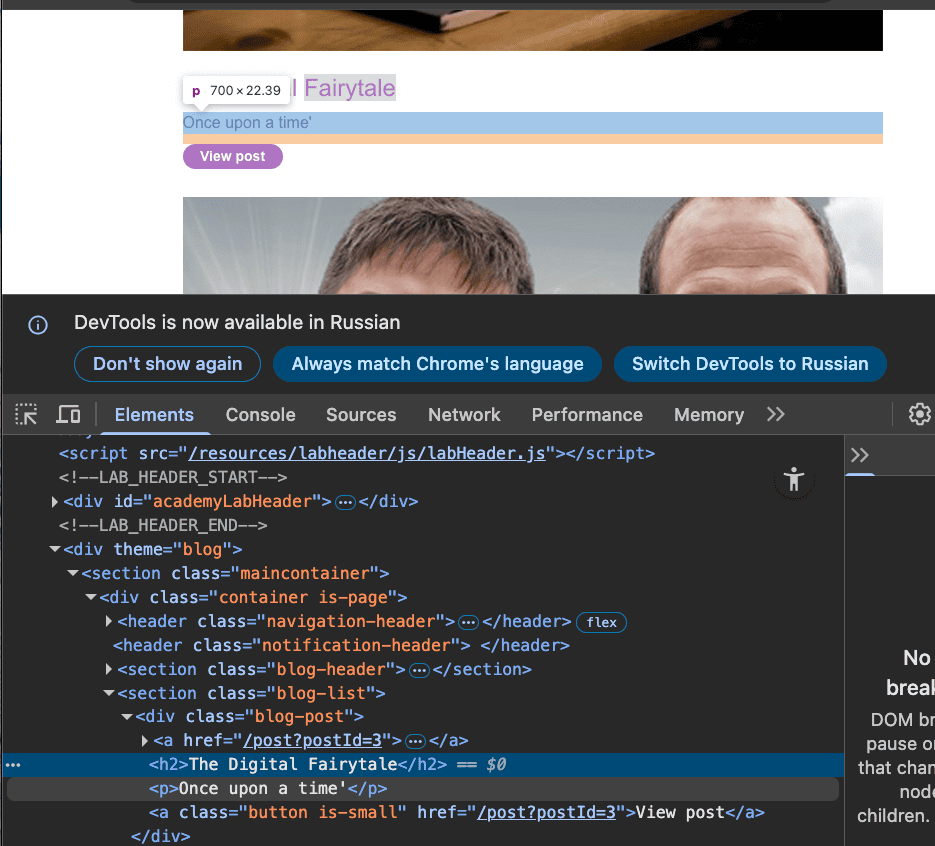
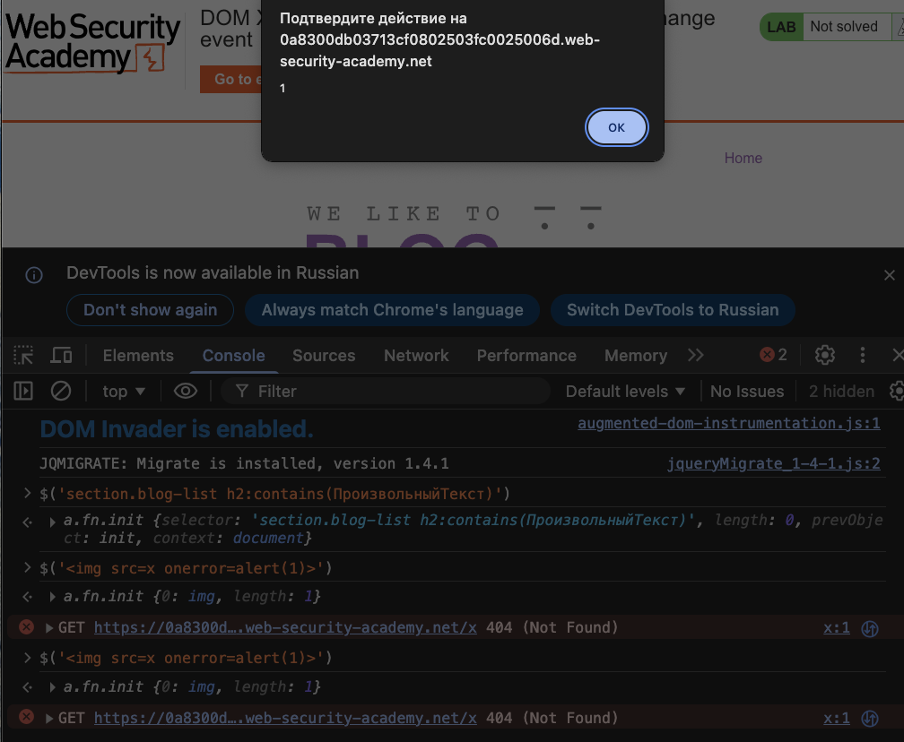
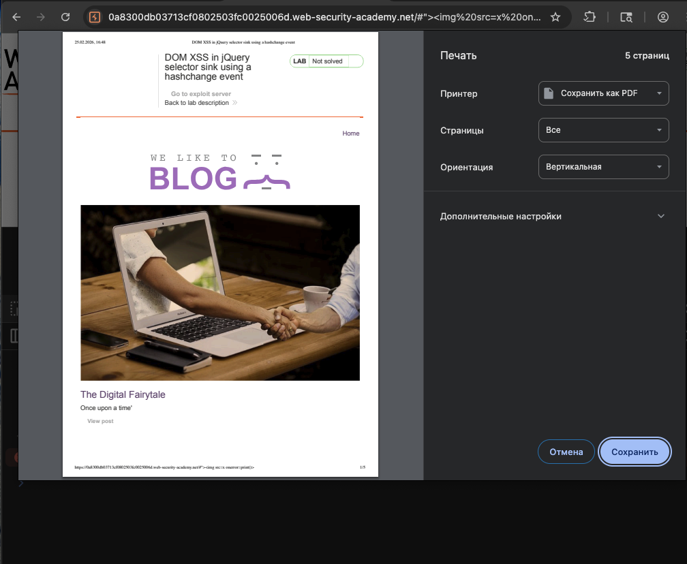

https://portswigger.net/web-security/cross-site-scripting/dom-based/lab-jquery-selector-hash-change-event лаба
#### DOM XSS in jQuery selector sink using a hashchange event

уязвимость  DOM_XSS на домашней странице
использует jQuery `$()` функция выбора для автоматической прокрутки к заданному сообщению  заголовок которого передается через `location.hash`

нужно сделать эксплойт который вызывает print() и передать ссылку с эксплойтом жертве 

---------


на главной странице лабы мое внимание привлек код в html
```html

<script>
    $(window).on('hashchange', function(){
    var post = $('section.blog-list h2:contains(' + decodeURIComponent(window.location.hash.slice(1)) + ')');
     if (post) post.get(0).scrollIntoView();
     });
</script>
```

 `$(window).on('hashchange', function(){ ... });` это jQuery-обработчик события `hashchange`. он срабатывает каждый раз, когда меняется часть URL после символа `#`
 
 `decodeURIComponent(window.location.hash.slice(1))` здесь:
- `window.location.hash` — берет всю строку после `#` включая саму решетку (например `"#hello"`
- `.slice(1)` — отрезает первый символ (решетку), остается `"hello"`
- `decodeURIComponent()` — декодирует специальные символы, например `%20`превращает в пробел

 `$('section.blog-list h2:contains(' + ... + ')')`  это   jQuery-селектор, который ищет:
- Внутри элемента `<section class="blog-list">`
- Все заголовки `<h2>`
- Которые **содержат текст** (метод `:contains`) равный тому, что мы получили из хэша

Найденный элемент (или список элементов) сохраняется в переменную `post`

`.scrollIntoView()` — прокручивает страницу так, чтобы этот элемент оказался в видимой области

------


эта функция делает вот че
когда я жамкаю на какой либо пост на странице - то функция как-то запоминает хеш текста который был на экране и при переходе обратно на страницу - показывает этоже место

но я не вижу как это можно использовать..

так как я не вижу никаких изменений в самом url и если меняю сам url не вижу чтобы эти параметры попадали кудато в код

-----

ясно одно  - 
`$('section.blog-list h2:contains(' + вот сюда должны попасть данные + ')')`


короче, в лабе никуя не сделана прокрутка эта
вот ориг ссылка
https://0a8300db03713cf0802503fc0025006d.web-security-academy.net

вот так меняю ее чтобы попасть к нужному посту
перешел по ссылке ниже 
https://0a8300db03713cf0802503fc0025006d.web-security-academy.net/#postId=3
но никуя не прокрутилось ничего к нужному посту


`$('section.blog-list h2:contains(' + вот сюда должны попасть данные + ')')`
тут ниписано - что она ждет заголовок H2

вот че тут h2 - название поста




переделываю ссылку
https://0a8300db03713cf0802503fc0025006d.web-security-academy.net/#The+Digital+Fairytale
нихуя ничего никуда не прокрутилось

переделываю ссылку еще 
https://0a8300db03713cf0802503fc0025006d.web-security-academy.net/#The%20Digital%20Fairytale
опять нихуя ничего никуда не прокрутилось


пошло все в пиду, сейчас пойду решение смотреть!
я никуя не понял , че со всем этим делать, скролл на странице не работает никуя!!!!!

----------

### ебушки воробушки!!! а не решение

в коде главной страницы

возвращаюсь к коду 

```js
                        $(window).on('hashchange', function(){
                            var post = $('section.blog-list h2:contains(' + decodeURIComponent(window.location.hash.slice(1)) + ')');
                            if (post) post.get(0).scrollIntoView();
                        });
                    
```
`hashchange` — событие срабатывает когда меняется часть после `#`
`location.hash.slice(1)` — берёт значение после решётки


# ввожу в консоли `$('')`
# и выпадает аллерт!
как мне нужно было догадаться до этого ? никак!! мать его никак!! меня бомбит!!!!




если выполнить в консоли браузера 
# `location.hash = '">';`



то срабатывает принт


Почему так????? 
Потому что `hashchange` срабатывает только когда хэш **меняется** после загрузки страницы, а не при загрузке с уже готовым хэшем


если такое открыть в браузере - то выполниться принт!

```js

<iframe src="https://0a8300db03713cf0802503fc0025006d.web-security-academy.net/#" onload="this.src+=''"></iframe>
```

⭐️ лаба решена!!!!!!!!!!!!!! 


-------
вот ниже обьяснение уже
## СМЫСЛ ВОТ В ЧЕМ!!! И КАК НАЙТИ ЭТУ УЯЗВИМОСТЬ! я врубился полностью
#### НИЖЕ - самая СУТЬ!!!

вот ориг ссылка главной страницы!
https://0a8300db03713cf0802503fc0025006d.web-security-academy.net

вот добавил через # название поста h2 как сказано в коде который там есть
https://0a8300db03713cf0802503fc0025006d.web-security-academy.net/#Swipe%20Left%20Please
и если просто перейти по ссылке - то прокрутки никакой и нет..

парадокс, казалось бы!
но нет, если в новой вкладке открывать то скролла нет
НО ЕСЛИ ПОВТОРНОЙ В ЭТОЙ ЖЕ ВКЛАДКЕ ПЕРЕХОД СДЕЛАТЬ ПО ЭТОЙ ЖЕ ССЫЛКЕ
ИЛИ В ЭТОМ ЖЕ ОКНЕ ГДЕ УЖЕ БЫЛА ЗАГРУЖЕНА СТРАНИЦА ВЫПОЛНИТЬ ССЫЛКУ с # 
ТОГДА , о ВНИМАНИЕ  --- ПРОИЗОЙДЕТ СКРОЛЛ К ЭЛЕМЕНТУ ---- ЧТО Я УКАЗАЛ ПОСЛЕ РЕШЕТКИ

ну и естественно - эта прокрутка работает чисто внутри браузера без взаимодействия с сервером = dom xss

#### ВЫШЕ - самая СУТЬ!!!

------------

и когда я отправляю жертве iframe и выполняется пейлоад ``" onload="this.src+=''"``
то этот пейлоад просто выходит из контекста  этой функции
и выполняет js код

```html

<script>
    $(window).on('hashchange', function(){
    var post = $('section.blog-list h2:contains(' + decodeURIComponent(window.location.hash.slice(1)) + ')');
     if (post) post.get(0).scrollIntoView();
     });
</script>
```

теперь все ясно..


## КАК БЫСТРО НАЙТИ ТАКУЮ УЯЗВИМОСТЬ ?

1   просмотреть код сайта и найти там подобную функциональность с scrollIntoView ()

2   пробовать выполнить скролл на странице так как указано в скрипте

3   если получилось - тогда посмотреть как выйти из контекста скрипта для выполнения кода
 например банальный ``

4  ну а дальше как угодно душе - эксплуатировать эту уязвимость 

например через свой сервер как в лабе
на своем же сайте создал iframe src который подгружает ссылку вредонос
скинул жертве сссылку на свой сайтё
жертва перешла
выполнился iframe src
выполнился скрпт - код выполнился - данные собрали чемоданы и уебали куда подальше к злоумышленнику!


-----

## как защититься от XSS через jQuery и hashchange

никогда не вставлять пользовательские данные напрямую в jQuery-селекторы

использовать `find()` и фильтрацию по `textContent` вместо `:contains` с данными от юзера

экранировать спецсимволы вроде `< > " '` перед тем как передавать в селектор

проверять что входные данные содержат только разрешённые символы (буквы, цифры, пробелы)

не использовать `$()` для создания элементов из непроверенных строк

применять Content Security Policy с ограничениями на инлайн-скрипты и опасные конструкции

использовать современные фреймворки которые автоматически экранируют вывод

обрабатывать `hashchange` события с валидацией данных перед использованием

никогда не доверять данным из `location.hash` `location.search``document.referrer`