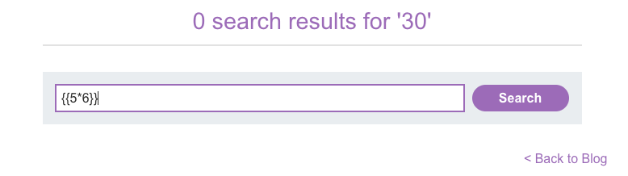

https://portswigger.net/web-security/cross-site-scripting/dom-based/lab-angularjs-expression
лаба
#### DOM XSS in AngularJS

если есть атрибут ng-app - то он обрабатывается AngularJS

задание:
в функции поиска есть уязвимость DOM в выражении AngularJS
нужно вызвать через ангуляр выражение аллерт в поискке

AngularJS - популярная библиотека JavaScript, которая сканирует содержимое HTML-узлов, содержащих `ng-app` атрибут (также известный как директива AngularJS)

В ТАКОМ СЛУЧАЕ МОЖНО выполнять выражения JavaScript в двойных фигурных скобках {  }


------------


вбил в поиск 777
отразился ответ  - но это зеркальная xss
```js
 <h1>0 search results for '777'</h1>
```
 а лаба про дом + ангуляр

-------

единственное че нашел это вот это, но мне кажется - это бесполезно, но намекает на ангуляр!
```html
<!--LAB_HEAD_END-->
    <body ng-app>
        <script src="/resources/labheader/js/labHeader.js"></script>
        <!--LAB_HEADER_START-->
```
##  < body ng-app>
< body ng-app>  Это означает, что AngularJS активирован на всей странице. 
Он сканирует HTML и ищет свои директивы и выражения.


``   не работает
{{img src=xz onerror=alert("hello777xssDoM")}}`   не работает

-----

выполняю простую проверку  на прослушку ангуляра:
`     {{5*6}}       `
ангуляр посчитал выражение и тут же его вернул!!
браво!!!!




------
# {{$on.constructor('alert(1)')()}} сработало!!! 


> 		   это способ выполнить произвольный JavaScript через AngularJS, когда обычные теги заблокированы

разбор 

1. `{{ }}` — сообщает AngularJS, что внутри есть выражение для выполнения
	
2.  `$on` — ссылка на объект, у которого есть конструктор
    
3. `$on.constructor` — ссылка на функцию-конструктор (которая в JS может создавать функции из строк)
    
4. `$on.constructor('alert(1)')` — создаёт новую функцию, которая вызывает `alert(1)`
    
5. `()` — сразу выполняет эту функцию


вот так выглядит отраженный ответ от сервера!!!

```html
<h1>
0 search results for 
'{{$on.constructor(&apos;alert(1)&apos;)()}}'
</h1>
```

получается, что ангуляр сам уже тут после загрузки страницы нашел его и выполнил код!!
и ничто не помешало ему это сделать!


### ключевой момент: это найти на странице < body ng-app> 

потом проверил работоспособность ангуляра `{{5*6}}` получил ответ на страницу 30 !
уяза подтверждена!

------

### как искать?

1 проверить наличие на странице  тега < body ng-app>

2  подставляем `{{5*6}}` и ищем ответ

3 эксплуатируем!


-----

## как защититься от XSS в AngularJS

не использовать AngularJS с пользовательским вводом — библиотека устаревшая и опасная

обновить Angular до современных версий (2+) где такие выражения не выполняются

экранировать фигурные скобки если нужно выводить данные от юзера

использовать Content Security Policy с ограничениями на инлайн-скрипты

не доверять данным из URL и полей ввода при вставке в шаблоны

применять безопасные методы вроде textContent вместо innerHTML

валидировать входные данные по белому списку разрешённых символов
