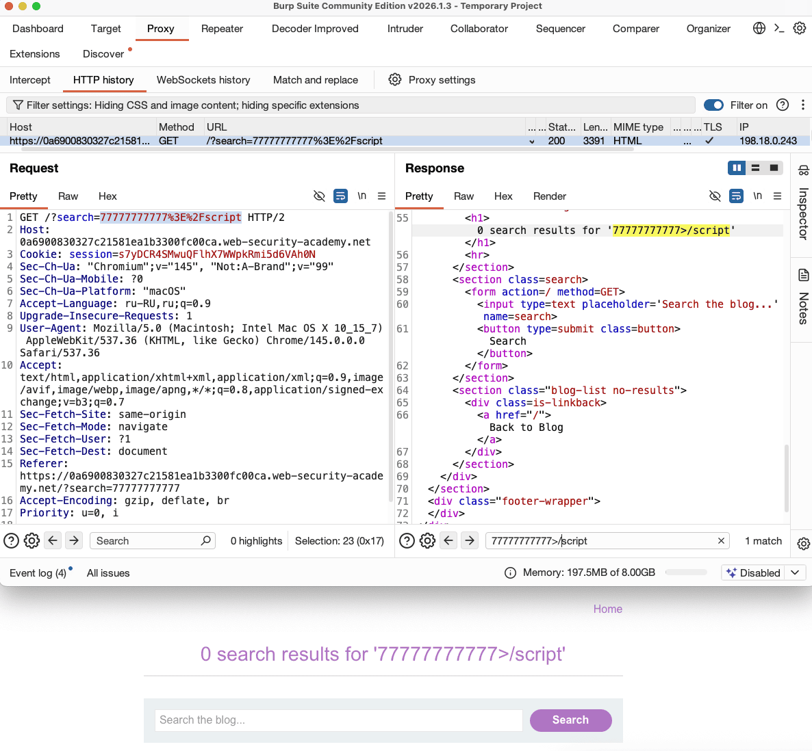
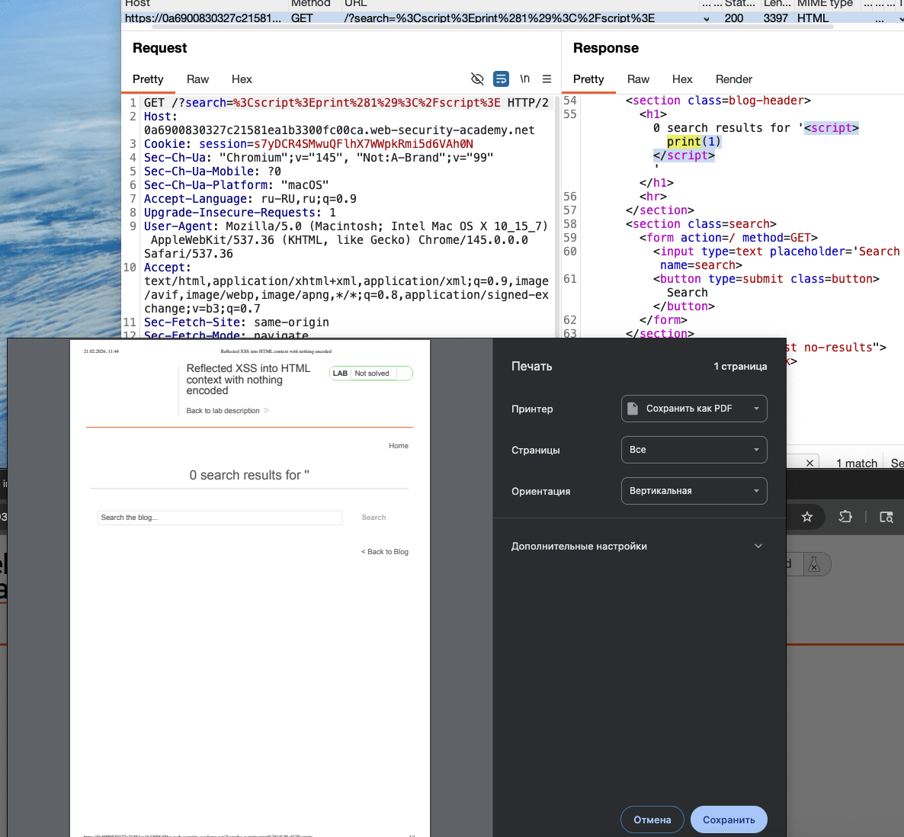

лаба https://portswigger.net/web-security/cross-site-scripting/reflected/lab-html-context-nothing-encoded
#### Reflected XSS into HTML context with nothing encoded
задача - вызвать аллерт через функциональность поиска товаров на сайте

#### ТИП  =  > отраженный XSS между HTML-тегами
Когда XSS-контекст — это текст между HTML-тегами, необходимо вводить новые HTML-теги, предназначенные для запуска выполнения JavaScript.

---------
сразу подставил символы и текст с семерками
сразу видно, что результат вернулся от сервера, находится внутри html
также видно - что простые символы > /  и script не валидировались




для интереса подставил пейлоад с принтом
`<script>print(1)</script>`
и вызвался принт



теперь тоже самое подставлю - но аллерт 
`<script>alert(777777)</script>`
появился - аллерт на экране - лаба решена

в коде страницы вот так теперь (не пойму, откуда взялись вокруг пейлоада одиноч скобки)
```html

|<section class=blog-header>|
|<h1>0 search results for '<script>alert(7777)</script>'</h1>
|<hr>|
|</section>

--------

сервер просто оборачивает ввод в одинарные кавычки, чтобы отделить его от остального текста эти кавычки — часть HTML, они не экранируют скрипт 
Браузер видит: текст, открывающий тег <script>, и скрипт, закрывающий тег </script>, остальной текст. И выполняет скрипт независимо от кавычек

```
## почему сработало и как недопустить?
так понимаю - что тут нет абслютно никакой защиты вооще
🟢символы не валидируются в инпуте
не проверяется содержимое в инпуте
плюс выполняется js код (это первая лаба моя по xss, поэтому  не могу сказать, норм ли решение и можно ли отключать js выполнение кода)
🟢Использовать Content Security Policy (CSP) — заголовок, который указывает браузеру, откуда можно загружать скрипты