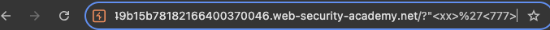
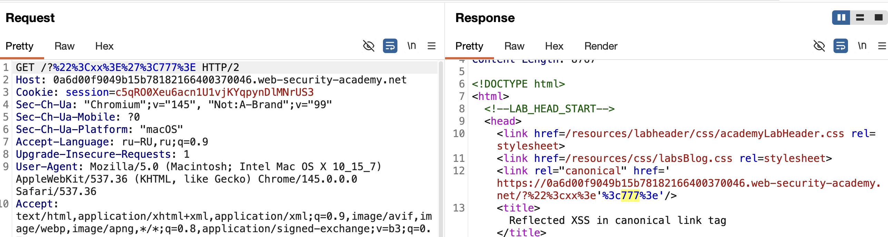

## xss без инпута

#### обход блокировки угловых скобок < >
#### через - команды
`ALT+SHIFT+X`      **Windows**
`CTRL+ALT+X`        **macOS**
`Alt+X`                  **Linux**
лаба https://portswigger.net/web-security/cross-site-scripting/contexts/lab-canonical-link-tag
###### Отражённый XSS в каноническом теге ссылки
задание: выполните атаку на кросс-сайтовые скрипты на главной странице через канонический тег, которая вводит атрибут, вызывающий `alert` при нажатии   `ALT+SHIFT+X`  `CTRL+ALT+X`  `Alt+X`

смысл в том, что нажатие клавиш вызывает выполнение кода

-------

 канонический тег `<link rel="canonical">` автоматически отражает текущий URL страницы
 это подсказка для поисковиков (Google, Яндекс)

при добавлении что-то в URL после 
`?`, это отражается в `href` атрибуте тега

 сервер экранирует угловые скобки, но не экранирует одинарные кавычки

-----

## 1
в конце ссылки нужно добавить ?свой текст

вот ориг ссылка
`https://0a6d00f9049b15b78182166400370046.web-security-academy.net`

вот ориг ответ:
```html
HTTP/2 200 OK
Content-Type: text/html; charset=utf-8
X-Frame-Options: SAMEORIGIN
Content-Length: 5703

<!DOCTYPE html>
<html>
<!--LAB_HEAD_START-->
    <head>
        <link href=/resources/labheader/css/academyLabHeader.css rel=stylesheet>
        <link href=/resources/css/labsBlog.css rel=stylesheet>
        <link rel="canonical" href='https://0a6d00f9049b15b78182166400370046.web-security-academy.net/'/>
        <title>Reflected XSS in canonical link tag</title>
```

вот измененная ссылка
`https://0a6d00f9049b15b78182166400370046.web-security-academy.net/?777`

вот измененная ответ:
```html
HTTP/2 200 OK
Content-Type: text/html; charset=utf-8
X-Frame-Options: SAMEORIGIN
Content-Length: 5707

<!DOCTYPE html>
<html>
<!--LAB_HEAD_START-->
    <head>
        <link href=/resources/labheader/css/academyLabHeader.css rel=stylesheet>
        <link href=/resources/css/labsBlog.css rel=stylesheet>
        <link rel="canonical" href='https://0a6d00f9049b15b78182166400370046.web-security-academy.net/?777'/>
        <title>Reflected XSS in canonical link tag</title>
```
видно - куда подставился пейлоад  777

то есть есть место, куда сервер подставляет мой текст!
значит туда же можно подставить и пейлоад!

## 2

пробую двойн и одинар кавычки


и вижу, что одинар кавы - помогли выйти из  href=' 'тут пейлоад уже

при этом угловые скобки кодируются в %3c html кодированием
поэтому новый элемент создать не получится



---
## 3

для выполнения команды нажатия на какой-либо элемент
нужно создать этот самый элемент, внедрить его прямо в  < link >


атрибут `accesskey='x'`  назначает клавишу быстрого доступа к элементу , в данном  случае - к элементу : < link rel="canonical"  

атрибут `onclick='alert(1)'`  выполнится при активации элемента, при нажатии кнопки X rкоторую я указал в accesskey

-----

## 4

собираю пейлоад
'  - чтобы выйти из href
accesskey='x' назначает кнопку для активации кода для этого элемента
onclick='alert(1)'   то что сработает при активации

итого:
`?'accesskey='x'onclick='alert(1)`
лаба решена

теперь при нажатии на комбинацию клавиш `CTRL+ALT+X`       
у меня macOS - происходит вызов аллерта

---

## 5 выводы и защита


1.   
   уязвимость возникла из-за того, что сервер вставлял пользовательский ввод напрямую в атрибут href тега link без проверки

2. сервер экранировал угловые скобки, но пропускал одинарные кавычки, что позволило выйти из атрибута и добавить свои

3. атака сработала не через внедрение нового тега, а через добавление атрибутов accesskey и onclick к существующему тегу

4. даже невидимые на стр элементы в head могут быть вектором атаки, если на них повесить обработчик событий

5. для успешной атаки использовалась комбинация клавиш, специфичная для браузера и ОС, что усложняет защиту, но и делает эксплуатацию менее надежной

#### Как предотвратить:

1. всегда экранировать не только угловые скобки, но и кавычки, особенно одинарные, в зависимости от контекста
2. вспользовать политику Content Security Policy (CSP) с директивой script-src, чтобы запретить инлайн-скрипты и нежелательные атрибуты
3. врименять правильное кодирование вывода: если данные вставляются в атрибут, кодировать их 
4. нне доверять пользовательскому вводу в URL параметрах и всегда проводить валидацию символов
5. вграничить использование accesskey на стороне сервера или вообще отказаться от динамической генерации таких атрибутов

