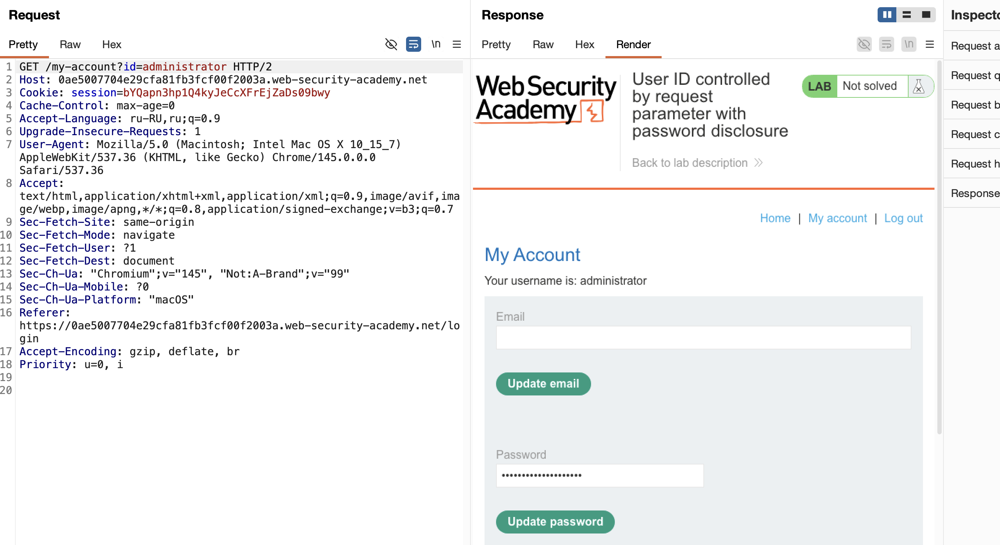
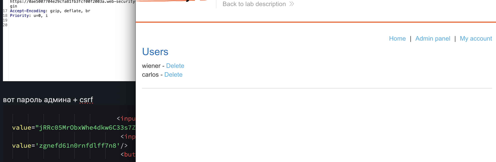

сперва гориз эскалация (захват аккаунта админа)
и через него уже вертикальная эскалация


лаба 
https://portswigger.net/web-security/access-control/lab-user-id-controlled-by-request-parameter-with-password-disclosure

задача:
захватить ак админа и удалить карлоса

----

зашел на свой акк - вижу что мой пароль отображется на моей странице

----

через адрессную строку `https://0ae5007704e29cfa81fb3fcf00f2003a.web-security-academy.net/my-account?id=wiener`  подменил wiener на administrator и увелиичв гориз эскалацию - получил доступ к акку админа!




вот пароль админа + csrf
```html
                           <input required type="hidden" name="csrf" 
value="jRRc05MrObxWhe4dkw6C33s7Zp0bQuq3">
                            <input required type=password name=password value='zgnefd61n0rnfdlff7n8'/>
                            <button class='button' type='submit'>
```


-----

далее вхожу в ак админа и выполняю целевое дествие 
карлос удален - лаба решена!




------

##  итоги

лаба показывает связку из двух уязвимостей: горизонтальная эскалация (IDOR) позволяет зайти в аккаунт администратора, а плохая практика хранения данных (отображение пароля в открытом виде на странице) даёт возможность его украсть


чтобы закрыть такие дыры, нужно работать в двух направлениях — и на логику доступа, и на обработку данных

**1. защита от горизонтальной эскалации (IDOR):**  
никогда не доверяй параметрам из URL или тела запроса при доступе к данным пользователя

сервер обязан проверять, принадлежит ли запрашиваемый ресурс (аккаунт, документ) тому, чья сессия используется

идентификатор пользователя должен браться из сессии, а не из параметра `id`


**2. защита от раскрытия паролей:**  

никогда не храни и не передавай пароли в открытом виде в HTML-коде страницы

даже если поле ввода маскирует символы, значение пароля всё равно присутствует в исходном коде и доступно любому, кто открыл страницу

пароли не должны предзаполняться в формах (уязвимо для xss)

для смены пароля используй отдельную форму, где поле пароля изначально пустое, а старый пароль вводится отдельно

все критичные данные (пароли, токены, API-ключи) должны передаваться и храниться только там, где это действительно необходимо, и быть защищены от просмотра даже авторизованными пользователями, кроме самого владельца

**3. защита от компрометации администратора:**  

аккаунты с высокими привилегиями требуют дополнительных мер защиты: многофакторная аутентификация, недоступность по прямым ссылкам, изоляция сессий

если злоумышленник получает доступ к странице администратора через IDOR, он не должен видеть там ничего критичного, тем более пароль
панели управления должны проверять права на самом высоком уровне
токены/сессии/апи/пароли/двухфакторка