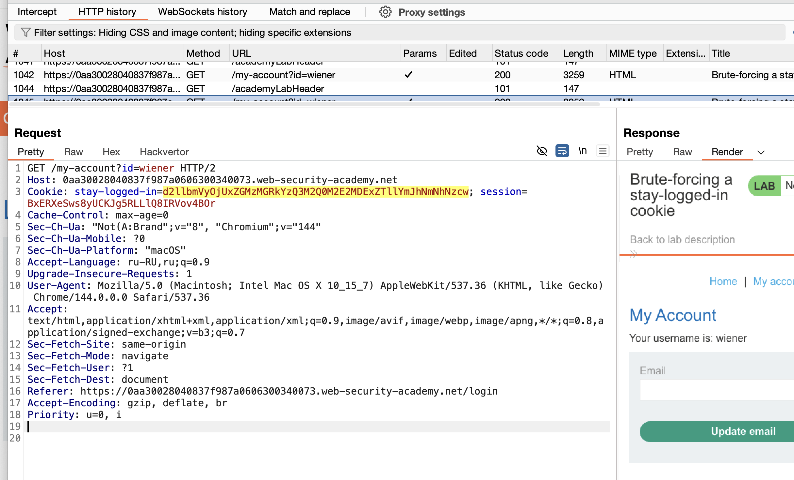
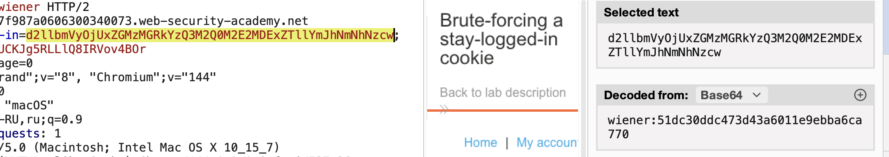
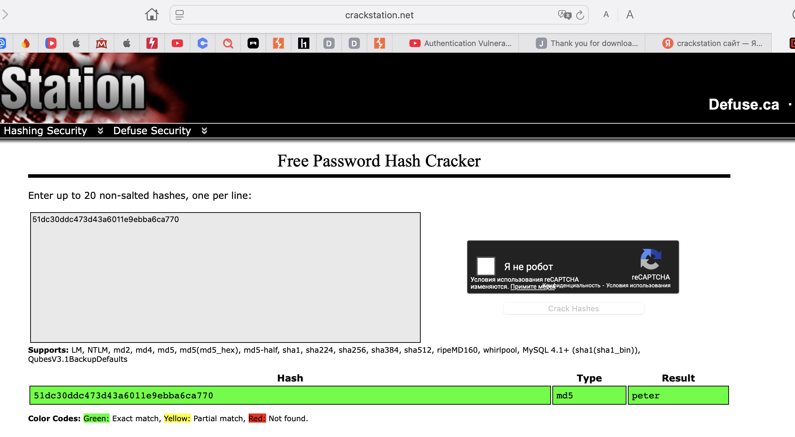
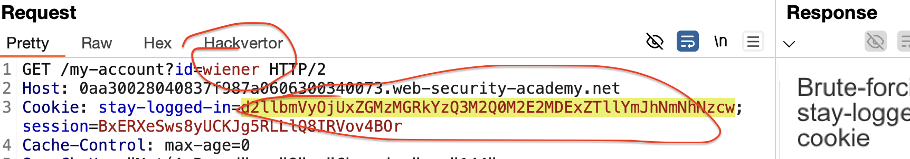
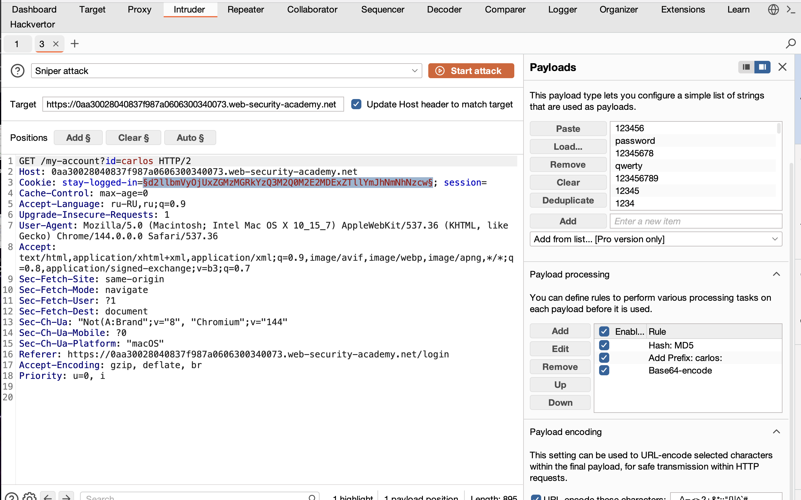
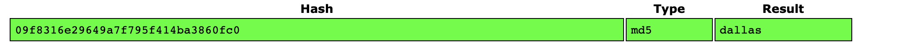

Задание:

есть наш лог+пароль
есть ник цели
нужно папасть в акк цели

подбор не подходит так как блокировка после каждого неудачного запроса!
замечаем что в куки хранится пароль зашифрованный!

----------------

уязвимости могут быть в СБРОСЕ ПАРОЛЕЙ/СМЕНЕ

функции запомнить пароль - могут быть уязвимы если это хранится в куки

эта лаба - была жесть.....

смысл такой:

когда входим в аккаунт свой, то нам в ответе приходит такой ответ

интересует эта  строка:
stay-logged-in=d2llbmVyOjUxZGMzMGRkYzQ3M2Q0M2E2MDExZTllYmJhNmNhNzcw

через инспектор - сразу ясно что тут логин:пароль

значит это логин в кодировке base64
а вот пароль неизвестно как закодирован (гпт сказад что это MD5 хеш пароля)

едем на сайт https://crackstation.net чтобы понять че за кодировка это 51dc30ddc473d43a6011e9ebba6ca770

так как с основной страницы сайт не дает нам бут-форсить пароли

то можно попробовать это сделать через эти параметры:

 вместо id = стамим ник жертвы
а там где 
stay-logged-in= логин(base64):пароль(md5)

можно и турбо интрудере сделать конечно через питон
но можно и... так через burp со скоростью 1 запрос в 1млн лет

отправляю запрос в интрудер

настраиваю параметры так: 
1) добавил пейлоад паролей
2) добавил base64
3) добавил префикс имяЖертвы:
4) HASH-MD5 для пароля

и магия.. запустил атаку,,, нашелся нужный пароль, теперь мы знаем пароль

наш пароль это dallas

# суть!
введя ник и пытаюсь подобрать пароль- был блок на число неудачных попыток ввода пароля, но (залогинившись) - можно было неограниченное число запросов слать!

ошибка в том что нельзя вот так тупо в куки хранить пароль! пусть даже он зашифрован!

xss я не учил еще , но ясно, что можно украсть куки другого юзера, и если там пароль, то это как подарок на блюдечке для злоумыш!