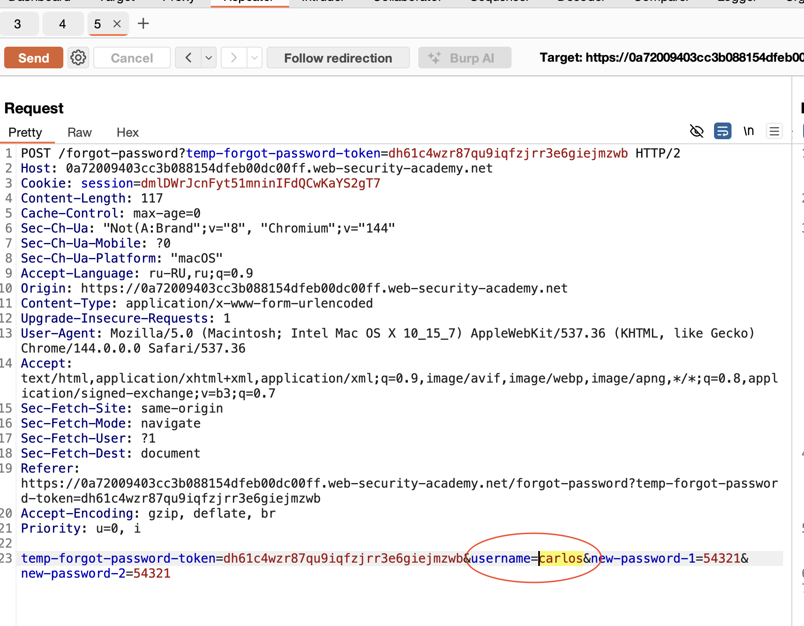

немного теории

бывает, можно взломать ак если воспользоваться системой сброса пароля!
при смене пароля код для смены бывает видов:

-- код на почту приходит

-- ссылка URL для смены (более безопасно если в ссылке не открыты данные для смены)
например тут 
http://vulnerable-website.com/reset-password?user=victim-user
четко видно какого юзера мы сменяем пароль, можно подставить других юзеров!

например такой адресс/ тут сложно понять что и где мы меняем пароль/безопасно
http://vulnerable-website.com/reset-password?token=a0ba0d1cb3b63d13822572fcff1a241895d893f659164d4cc550b421ebdd48a8

стоит избегать передачи кодов через небез каналы, но также стоит помнить что даже смена пароля через email не всегда безопасен, в том числе в случае если почтовый сервис связан и с другими сервисами то коды могут в них утечь.

--------
# Лабораторная работа: Сломанная логика сброса пароля

https://portswigger.net/web-security/authentication/other-mechanisms/lab-password-reset-broken-logic

- Ваши учетные данные:`wiener:peter /emai= wiener@exploit-0a8d00fe03233bc2818bde38019800b5.exploit-server.net`
- 
- Имя пользователя жертвы:`carlos`

нужно через использовать функционал сброса пароля для смены пароля другого юзера.

----

все очень банально до абсурда!

выше скрин запроса на сброс пароля.
используется мои собственные токены, и в запросе можно менять логин 
но ссылка на смену логина приходит на мой акк.

я просто поменял пароль для чужого акк в своем email.

-----
# суть 

банально и просто
это ошибка логики запроса на смену пароля

было достаточно подменить только лишь один параметр и все, уходил запрос на смену пароля другого юзера мне на почту.

