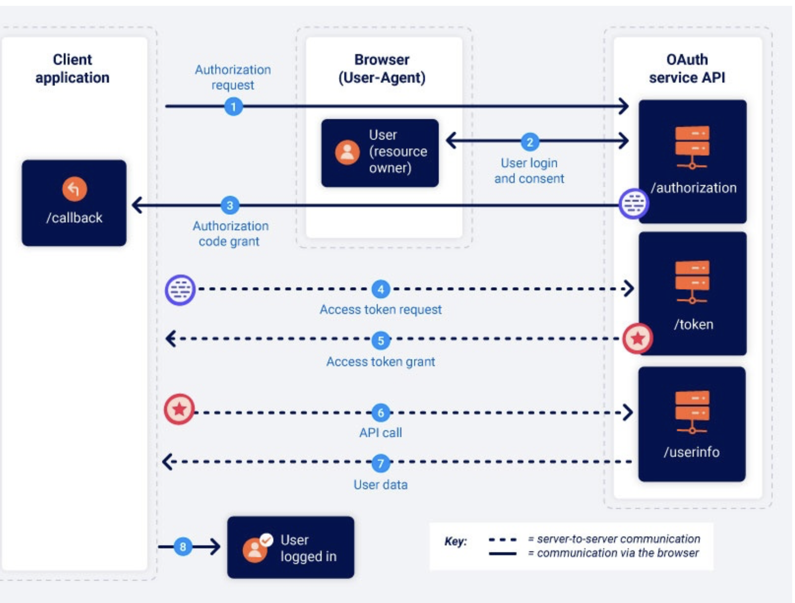
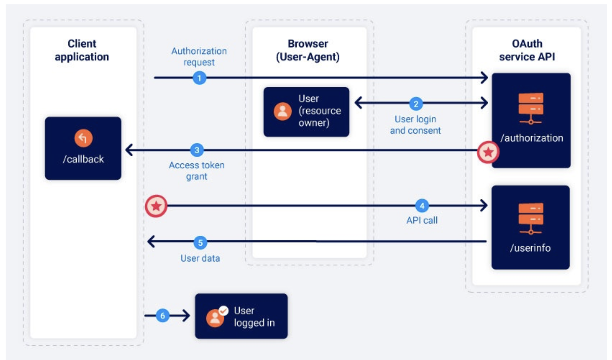
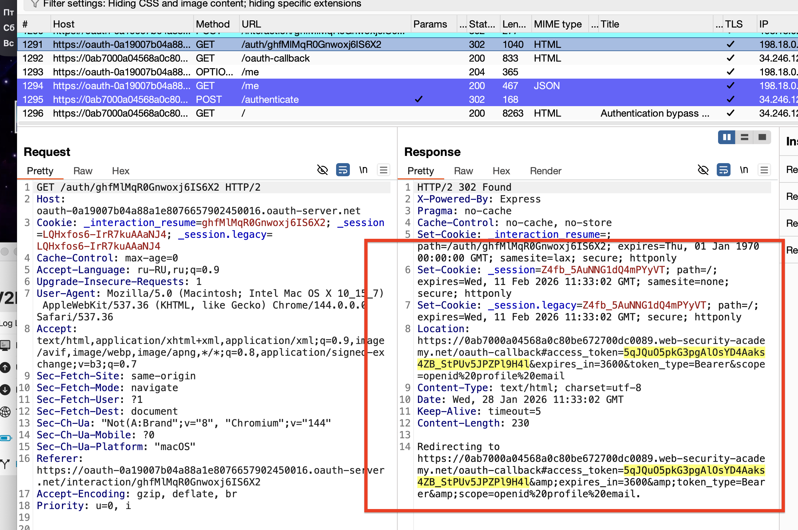
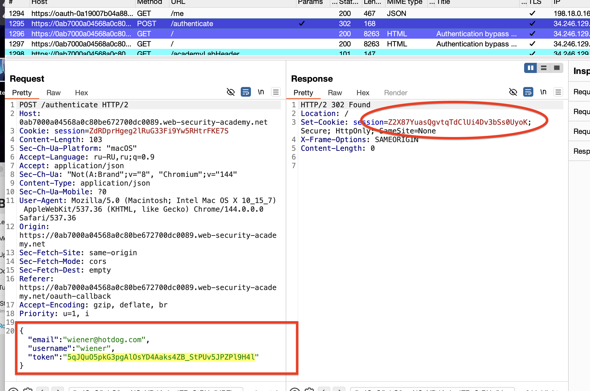
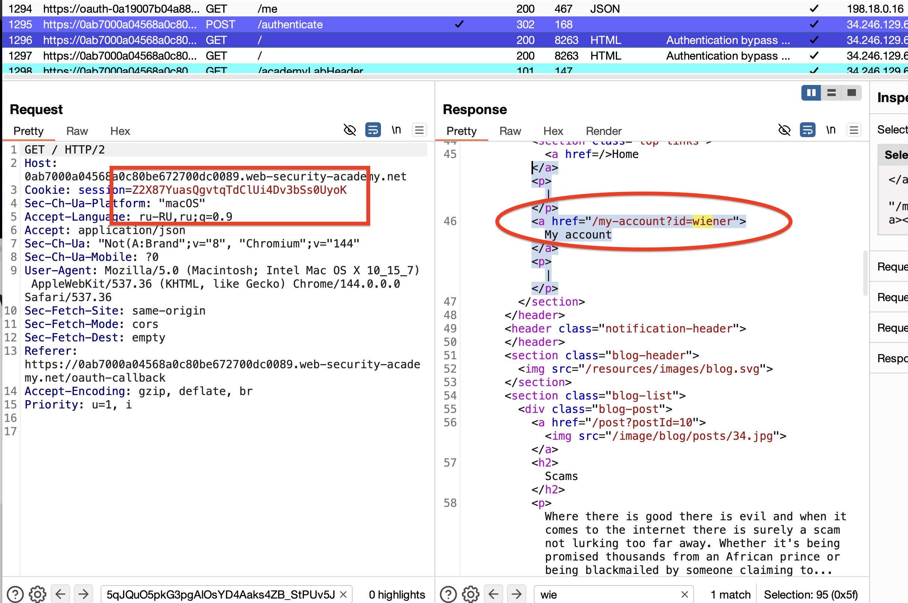
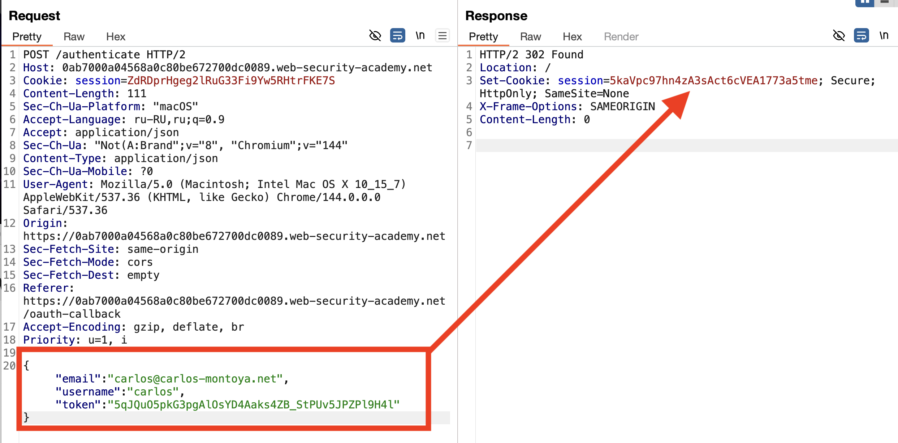
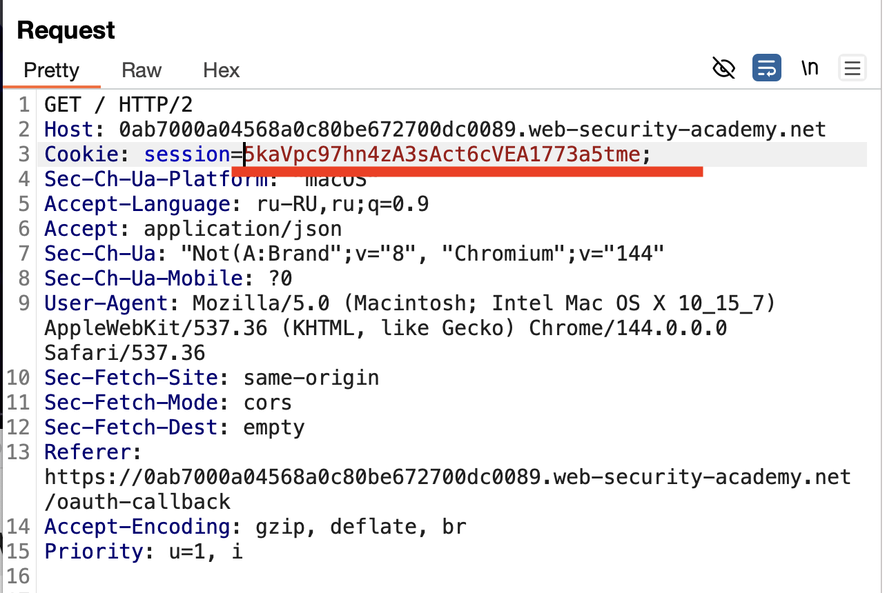

сама лаба примерно на 220 строке


**OAuth 2.0** - это **протокол авторизации**, который позволяет одному приложению (например, новому стартапу или игре) безопасно получить **ограниченный доступ** к данным пользователя в другом приложении (например, в Google или Facebook) без передачи пароля.

Проще говоря, OAuth 2.0 решает вопрос: **«Как я могу разрешить сайту "МузыкальныйСервис" получить доступ к моему списку друзей в "ВКонтакте", не сообщая ему мой пароль от "ВКонтакте"?»**

----
#### если в приложении есть регистрация через соц сети и сторонние сервисы - то есть вероятность, что в этой логике используется OAuth 2.0 (хотя OAuth 2.0 предназначен изначально для других целей), то есть вероятность, что в логике работы OAuth 2.0 есть ошибки, и например токен доступа к данным можно украсть!

--------
OAuth 2.0 является текущим стандартом, некоторые веб-сайты все еще используют устаревшую версию 1a.
---
==логика работы OAuth 2.0==

из своего приложения я хочу получить данные из вк например!

мое приложение делает запрос к вк на получение данных

происходит авторизация (вход ) в вк

затем вк спрашивает разрешение у меня в свеом интерфейсе (доверять и передать ли данные ) в это мое приложение

затем если я разрешил - то вк дает мне код, напрмиер, код авторизиции для получения токена,

далее в своем приложении - имея этот код, делаю запрос к вк 

и обратившись к вк с этим кодом - мне вк даст токен доступа к данным для этого внешнего приложения для моего аккаунта

и затем пока токен живет - я из своего приложения могу получать данные из вк используя тот токен

-------
🟣 БАЗОВЫЕ УЯЗВИМОСТИ В OAuth 2.0

**1. Подмена состояния (OAuth CSRF / State Parameter Injection)**  
Это критическая уязвимость, возникающая, когда клиентское приложение не использует или неправильно проверяет параметр `state`. Атакующий может перехватить процесс авторизации жертвы и подставить свой код авторизации, что приведёт к привязке аккаунта жертвы (например, её Google) к аккаунту злоумышленника в вашем приложении. Это позволяет атакующему войти в ваш сервис под учётной записью жертвы.

**2. Подмена URI перенаправления (Redirect URI Manipulation / Open Redirect)**  
Эта уязвимость возникает, если сервер авторизации (например, Google) недостаточно строго проверяет параметр `redirect_uri`. Атакующий может изменить этот параметр в начальном запросе, указав адрес своего контролируемого сервера. В результате одноразовый код авторизации, предназначенный вашему приложению, будет отправлен злоумышленнику, который затем обменяет его на токен доступа.

**3. Утечка кода авторизации (Authorization Code Leakage)**  
Одноразовый код авторизации может быть случайно раскрыт. Например, он может попасть в логи веб-сервера, в заголовки `Referer` других сайтов или быть виден в истории браузера. Если атакующий перехватит этот код, он сможет обменять его на токен доступа, получив полный контроль над сессией.

**4. Отсутствие или обход PKCE (Proof Key for Code Exchange)**  
PKCE — это обязательное расширение протокола для мобильных приложений и одностраничных приложений (SPA), не имеющих надёжного способа хранить секрет клиента. Без PKCE приложение уязвимо к атаке "подмены кода", где атакующий, укравший код авторизации, может легко обменять его на токен. Отсутствие PKCE — это прямая уязвимость для таких типов клиентов.

**5. Некорректная проверка scope (scope manipulation)**  
Атакующий может попытаться модифицировать параметр `scope` в запросе авторизации, запросив больше прав, чем предполагалось. Если сервер авторизации не проверяет запрашиваемые scope на соответствие предопределённому списку для данного клиента, пользователь может невольно предоставить приложению чрезмерные привилегии (например, права на удаление писем вместо простого чтения профиля).

**6. Уязвимости на стороне сервера авторизации (Issuer Misconfiguration)**  
Сама платформа OAuth (например, Google, Facebook) может быть сконфигурирована неправильно администратором вашего приложения. Например, могут быть разрешены устаревшие или небезопасные методы входа, регистрация приложений может быть слишком открытой, или могут использоваться слабые криптографические настройки. Это создаёт риски для всех пользователей, использующих эту интеграцию.

**7. Фишинг через поддельные экраны согласия (Consent Phishing)**  
Это социальная инженерия. Атакующий создаёт вредоносное приложение, которое имитирует интерфейс доверенного сервиса (например, выглядит как официальный "Google Docs"). Пользователь видит знакомый логотип и форму входа, вводит свои данные и предоставляет доступ, даже не подозревая, что авторизует злоумышленника. Успех такой атаки зависит от доверия пользователя и внешнего вида экрана согласия.

**8. Утечка токенов и небезопасное хранение (Token Leakage & Improper Storage)**  
Токены доступа и обновления должны храниться и передаваться с максимальной безопасностью. Распространённые ошибки: хранение токенов в небезопасном месте на клиенте (например, в `localStorage`, доступном для XSS), передача токенов по незашифрованным каналам (HTTP вместо HTTPS) или логирование токенов на сервере, что делает их доступными при компрометации логов.

**9. Недостаточная проверка токена на стороне клиента (Improper Token Validation)**  
После получения токена клиентское приложение (ресурс-сервер) должно правильно его проверять: проверять подпись (для JWT), срок действия, аудиторию (`aud` claim), издателя (`iss`claim) и цель (scope). Невыполнение этих проверок может позволить атакующему использовать поддельные, просроченные или токены, выданные для другого приложения, для получения несанкционированного доступа к API.

---------

🟣 OWASP 

Атаки на OAuth относятся к следующим категориям OWASP Top 10:2025[](https://owasp.org/Top10/2025/0x00_2025-Introduction/)

 **A01:2025 — Нарушения контроля доступа (Broken Access Control)**
    
 **A07:2025 — Сбои аутентификации (Authentication Failures)**

### 🛡️ В OWASP Top 10 (2021)

Уязвимости в реализации OAuth 2.0 чаще всего попадают под эти две категории из списка:

**A01:2021 – Broken Access Control (Нарушения контроля доступа)**  
Это самая прямая параллель. Неправильная реализация OAuth ведёт к нарушению контроля доступа. Примеры:

- **Подмена состояния (`state`)** позволяет атакующему **привязать ваш аккаунт в соцсети к своему аккаунту в приложении**, получив доступ от вашего имени.
    
- **Некорректная проверка токена** на стороне приложения (ресурс-сервера) может позволить использовать поддельные или чужие токены для доступа к данным других пользователей.
    

**A07:2021 – Identification and Authentication Failures (Ошибки идентификации и аутентификации)**  
OAuth — это протокол **авторизации**, но он тесно связан с аутентификацией. Ошибки в его реализации подрывают доверие к процессу входа.

- **Подмена URI перенаправления (`redirect_uri`)** и **фишинг через экраны согласия** напрямую относятся к сбоям в процессе аутентификации и получения пользовательского согласия.
    

OAuth - протокол является критически важной частью современных систем контроля доступа и аутентификации. Любая уязвимость в его реализации автоматически попадает под одну из двух главных категорий риска: **A01:2025** или **A07:2025**. Это делает проверку безопасности OAuth обязательной частью аудита веб-приложений.

-----
==OAuth работает посредством контактов между 3 сторонами:==

- **Клиентское приложение** - веб-сайт или веб-приложение, которое хочет получить доступ к данным пользователя.
- **Владелец ресурса** - пользователь, чьи данные клиентское приложение хочет получить доступ.
- **Поставщик услуг OAuth** - веб-сайт или приложение, которое контролирует данные пользователя и доступ к ним. Они поддерживают OAuth, предоставляя API для взаимодействия как с сервером авторизации, так и с сервером ресурсов.

----

#### «типы грантов» OAuth  или потоки  OAuth
==это способы реализации процессов OAuth 
это точная последовательность шагов во всей цепочке работы механизма OAuth!==
#### «код авторизации» и «неявные» гранты
это самые популярные типы грантов
оба этих типа грантов включают в себя следующие этапы:

1. Клиентское приложение запрашивает доступ к  данным пользователя, указывая, какой тип предоставления он хочет использовать и какой доступ он хочет.
2. Пользователю предлагается войти в службу OAuth и явно дать свое согласие на запрошенный доступ.
3. Клиентское приложение получает уникальный токен доступа, который доказывает, что у него есть разрешение от пользователя на доступ к запрошенным данным. То, как именно это происходит, значительно зависит от типа гранта.
4. Клиентское приложение использует этот токен доступа для выполнения вызовов API, извлекающих соответствующие данные с сервера ресурсов
------
🔶🔶🔶🔶🔶🔶🔶🔶🔶🔶🔶🔶🔶🔶🔶🔶🔶🔶🔶🔶🔶🔶🔶🔶🔶🔶🔶🔶🔶🔶🔶
## тип гранта КОД АВТОРИЗАЦИИ

логика работы типа гранта (код авторизации)

#### 1. Запрос авторизации
например 
```http
GET /authorization?client_id=12345&redirect_uri=https://client-app.com/callback&response_type=code&scope=openid%20profile&state=ae13d489bd00e3c24 HTTP/1.1 Host: oauth-authorization-server.com

client_id - создается при регистр клиента в OAuth
redirect_uri - url куда направл юзера после получ кода OAuth
response_type - тип котор ожидает клиент приложениие(code->OAuth)
scope - то какие данные хотим получить
state - токен для общения в процессе сеанса
```
#### 2. Вход и согласие пользователя
переход в интерфейс прилож с котор требуются данные
пользователь входит в приложение
 ++ соглашается на предост данных
#### 3. Предоставление кода авторизации
если юхер согласился то его браузер перенаправит на redirect_uri указанный ранее в запросе, и в запросе будет код авторизиации code с помощью которого потом будет произведен вход!

GET /callback?code=a1b2c3d4e5f6g7h8&state=ae13d489bd00e3c24 HTTP/1.1 Host: client-app.com
#### 4. Запрос на токен доступа
после послучения код авторизации нужно получить 
токен доступа к данным - для этого отправить POST запрос
```http
POST /token HTTP/1.1 Host: oauth-authorization-server.com … client_id=12345&client_secret=SECRET&redirect_uri=https://client-app.com/callback&grant_type=authorization_code&code=a1b2c3d4e5f6g7h8

client_secret - ключ которы был выдан при регистрации в OAuth
grant_type - тип который ждет клиент прил
```

#### 5. Предоставление токена доступа
если все ок то слуба OAuth выдаст токен доступа к данным
```Json
{ "access_token": "z0y9x8w7v6u5", "token_type": "Bearer", "expires_in": 3600, "scope": "openid profile", … }
```
#### 6. Вызов API
это уже запрос на получение данных из клиента к тем у кого просим
```http
GET /userinfo HTTP/1.1 Host: oauth-resource-server.com Authorization: Bearer z0y9x8w7v6u5
```
#### 7. Ресурсный грант
получаем запрашиваемые данные
```json
{ "username":"carlos", "email":"carlos@carlos-montoya.net", … }
```
🔶🔶🔶🔶🔶🔶🔶🔶🔶🔶🔶🔶🔶🔶🔶🔶🔶🔶🔶🔶🔶🔶🔶🔶


# тип гранта "НЕЯВНЫЙ ТИП"
Неявный тип гранта намного проще. 
Вместо того, чтобы сначала получить код авторизации, а затем обменять его на токен доступа, 
-==клиентское приложение получает токен доступа сразу после того, как пользователь дает свое согласие==

❌ Но этот неявный тип  гораздо менее безопасен ❌



#### 1. Запрос авторизации
```http
GET /authorization?client_id=12345&redirect_uri=https://client-app.com/callback&response_type=token&scope=openid%20profile&state=ae13d489bd00e3c24 HTTP/1.1 Host: oauth-authorization-server.com
```
#### 2. Вход и согласие пользователя
#### 3. Предоставление токена доступа
если есть согласие - то Служба OAuth перенаправит браузер пользователя на ==redirect_uri==, указанный в запросе авторизации. Однако вместо отправки параметра запроса, содержащего код авторизации, он отправит СРАЗУ токен доступа и другие данные, специфичные для токена, в виде фрагмента URL-адреса.
```http
GET /callback#access_token=z0y9x8w7v6u5&token_type=Bearer&expires_in=5000&scope=openid%20profile&state=ae13d489bd00e3c24 HTTP/1.1 Host: client-app.com
```
и приложение должно извлечь токен этот из url!
#### 4. Вызов API
имея токен доступа можно запрашивать данные
В отличие от потока кода авторизации, это также происходит через браузер:
```http
GET /userinfo HTTP/1.1 Host: oauth-resource-server.com Authorization: Bearer z0y9x8w7v6u5
```
#### 5. Получить данные
```json
{ "username":"carlos", "email":"carlos@carlos-montoya.net" }
```

----

*Отличия в двух ключевых моментах: где происходит обмен кода на токен и что именно уязвимо.

**1. Грант "Код авторизации" (Authorization Code Flow):**

- **Логика:** Браузер получает от сервера авторизации (например, Google) только **одноразовый код**. Сам **токен доступа** приложение получает напрямую, своим сервером, отправляя этот код вместе со своим секретным ключом.
    
- **Безопасность:** **Высокая**. Главное преимущество — токен доступа **никогда не попадает в браузер пользователя**, его не видно в адресной строке, истории, логах. Секретный ключ остаётся на защищённом сервере. Этот метод **обязательно** должен использоваться с расширением **PKCE** для мобильных и одностраничных приложений.
    

**2. Неявный грант (Implicit Flow):**

- **Логика:** Упрощённая. Сервер авторизации **сразу возвращает токен доступа в браузер**(обычно в фрагменте URL после `#`). Приложение (JavaScript) извлекает токен прямо из адресной строки.
    
- **Безопасность:** **Низкая и устаревшая**. Токен доступа **уязвим для перехвата** — он может остаться в истории браузера, попасть в логи веб-серверов через заголовок `Referer`. Секретный ключ клиента нельзя безопасно использовать в браузере, поэтому его нет, что упрощает атаки. **OWASP и современные стандарты считают этот поток устаревшим и небезопасным.** Его использование не рекомендуется.
    

*Ключевой вывод:
Всегда используйте 
**Authorization Code Flow с PKCE**. 
**Implicit Flow**использовать не следует из-за критических уязвимостей, связанных с утечкой токена через браузер.


----
в моем учебном приложении одна из авторизаций построена на основе Oauth, при авторизации/регистрации клиент (сперва авторизация  с моим сервером) потом обращается в yandex-id (идет обмен токенами) и потом получает id user + токен доступа от yandex и уже используя этот id происходит авторизация доступа к аккаунту в моем приложении!

---

⭐️⭐️⭐️⭐️⭐️⭐️⭐️⭐️⭐️⭐️⭐️⭐️⭐️⭐️⭐️⭐️⭐️⭐️
# Лаборатория: обход аутентификации через неявный поток OAuth
https://portswigger.net/web-security/oauth/lab-oauth-authentication-bypass-via-oauth-implicit-flow

моя учетка  `wiener:peter`.
нужно попасть в ак с почтой `carlos@carlos-montoya.net
в этой лабе сломана логика авторизации, которая позволяет войти в чужие аккаунты не зная их пароли.

---
процесс решения:

анализ регистрации:
при входе в акк - происходит перенаправление на сторонний ресурс где нужно авторизоваться в стороннем ресурсе
после успешного входа получаем токен - и попадаем на наш основной сайт и авторизация происходит автоматически  по токену

1) после регистрации аккаунта в стороннем сервисе нам приходит токен



2) затем мы делаем POST запрос запрос на получение токена сессии



3) получив токен сесии - делаем запрос на вход в аккаунт и происходит вход! 



------
эту цепочку получилось сломать легко:

4) я подменил данные на жертву  и получил токен сессии



5) подставил токен в запрос на вход в аккаунт


И СИСТЕМА ПРОИЗВЕЛА ВХОД В АККАУНТ ЖЕРТВЫ и предоставила мне его данные аккаунта!


# вывод
как обнаружил уязвимость:
проследил и понял как работает цепочка регистрации,
увидел ключевые шаги в цепочке где можно было подменить данные
на этапе перехода после авторизации на мой сайт,
подменил данные - произвел взлом.

система позволила мне с произвольным но валидным токеном получить доступ к чужому аккаунту!
то есть нужно обязательно делать привязку токенов к аккаунту.
система доверяла слепо одному лишь токену сесии не проверяя для какого аккаунта он был создан!

