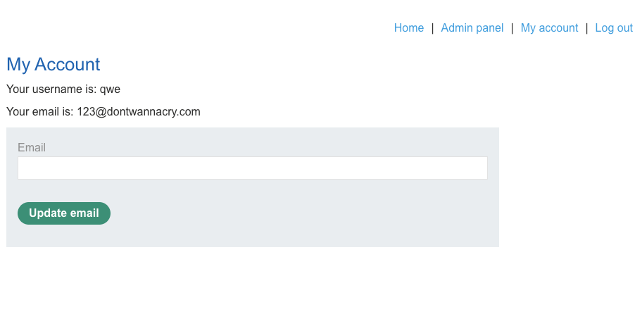

лаба https://portswigger.net/web-security/logic-flaws/examples/lab-logic-flaws-inconsistent-security-controls

в данной лабе можно как-то попасть в админку из своего же аккаунта
нужно это сделать стереть карлоса

-----

при регистрации аккаунта  написано 
@dontwannacry.com
я так понимаю - это уже служебные акаунты с расширенным функционалом


вот запрос к моей странице


```http
GET /my-account?id=qwe HTTP/2
Host: 0a3a0026038bfd218b62bc81000700ea.web-security-academy.net
Cookie: session=jBpWyurQJSO2Fo8Iodt9KbxxssCbxVzd
Cache-Control: max-age=0
```


пробую сразу админку
```http
GET /admin HTTP/2
Host: 0a3a0026038bfd218b62bc81000700ea.web-security-academy.net
Cookie: session=jBpWyurQJSO2Fo8Iodt9KbxxssCbxVzd
Cache-Control: max-age=0
Accept-Language: ru-RU,ru;q=0.9
```


ответ 
```html
</header>
Admin interface only available if logged in as a DontWannaCry user
</div>
```


-----

нужно как-то получить возможности аккаунта как у @dontwannacry.com

-------

есть функционал смены емайл

пробую туда подставить
@dontwannacry.com

а мой адрес подконтрольный
`attacker@exploit-0a9100a30392fdc28bfbbba8015d0097.exploit-server.net`

может так ?
пробую сменить почту на:
`dontwannacry.com.attacker@exploit-0a9100a30392fdc28bfbbba8015d0097.exploit-server.net`

------

поменял - теперь 
Your email is: dontwannacry.com.attacker@exploit-0a9100a30392fdc28bfbbba8015d0097.exploit-server.net

пробую просто

`123@dontwannacry.com`

получилось!
доступна админка




-----

##  это сработало так:

сайт давал админскую функциональность только корпоротивным адресам типа
@dontwannacry.com
это прямо написано при регистрации.

я зарегал обычный аккаунт

и смог поменять свой email на `123@dontwannacry.com`
с корпоративным префиксом

и сайт мне дал доступ к админке

лаба решена

---

нужно делать так, чтобы было невозможно создавать корпоративные адреса налево и направо
нужно чтобы эти адреса создавались системно и выдавались поштучно сотрудникам
и все.

также нельзя допускать тогда уже, чтобы роль можно было сменить после регистрации, а то зарегался и сменил потом сам себе роль -детский сад


то есть в системе должен быть белый список корпортивных адресов 


--------